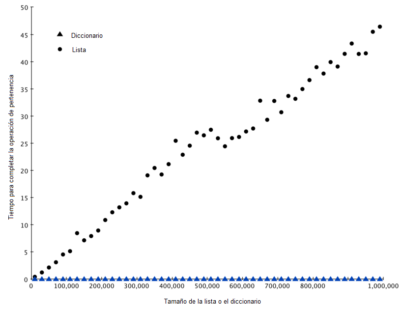

..  Copyright (C)  Brad Miller, David Ranum
    This work is licensed under the Creative Commons Attribution-NonCommercial-ShareAlike 4.0 International License. To view a copy of this license, visit http://creativecommons.org/licenses/by-nc-sa/4.0/.

Diccionarios
~~~~~~~~~~~~

La segunda estructura de datos principal de Python es el diccionario. Como usted probablemente recordará, los diccionarios difieren de las listas en que usted puede acceder a los ítems de un diccionario mediante una clave en lugar de una posición. Más adelante en este libro verá que hay muchas maneras de implementar un diccionario. Lo que es más importante notar ahora mismo es que las operaciones para obtener y asignar ítems en un diccionario son :math:`O(1)`. Otra operación importante de los diccionarios es la operación de pertenencia. Comprobar si una clave está o no en el diccionario es también :math:`O(1)`. La eficiencia de todas las operaciones con diccionarios se resume en la :ref:`Tabla 3 <tbl_dictbigo>`. Una acotación importante sobre el desempeño de los diccionarios es que las eficiencias que se presentan en la tabla son para un desempeño promedio. En algunos casos raros, las operaciones de pertenencia, obtención y asignación de ítems pueden degenerar en desempeños :math:`O(n)`, pero vamos a adentrarnos en eso en un capítulo posterior cuando hablemos de las diferentes maneras en que podría implementarse un diccionario.

.. The second major Python data structure is the dictionary. As you probably recall, dictionaries differ from lists in that you can access items in a dictionary by a key rather than a position. Later in this book you will see that there are many ways to implement a dictionary. The thing that is most important to notice right now is that the get item and set item operations on a dictionary are :math:`O(1)`. Another important dictionary operation is the contains operation. Checking to see whether a key is in the dictionary or not is also :math:`O(1)`. The efficiency of all dictionary operations is summarized in :ref:`Table 3 <tbl_dictbigo>`. One important side note on dictionary performance is that the efficiencies we provide in the table are for average performance. In some rare cases the contains, get item, and set item operations can degenerate into :math:`O(n)` performance but we will get into that in a later chapter when we talk about the different ways that a dictionary could be implemented.

.. _tbl_dictbigo:

.. table:: **Tabla 3: Eficiencia O-grande de las operaciones de diccionarios en Python**

    ================== ===================
             operación Eficiencia O-grande
    ================== ===================
                copiar                O(n)
          obtener ítem                O(1)
          asignar ítem                O(1)
         eliminar ítem                O(1)
      pertenencia (in)                O(1)
             iteración                O(n)
    ================== ===================

Para nuestro último experimento de desempeños, compararemos el desempeño de la operación de pertenencia entre listas y diccionarios. En el proceso confirmaremos que el operador de pertenencia para las listas es :math:`O(n)` y que el operador de pertenencia para los diccionarios es :math:`O(1)`. El experimento que vamos a utilizar para comparar los dos casos es simple. Haremos una lista con un rango de números en ella. Luego seleccionaremos números al azar y veremos si los números están o no en la lista. Si nuestras tablas de desempeño son correctas, entre más grande sea la lista, mayor debería ser el tiempo que toma determinar si cierto número está contenido en ella.

.. For our last performance experiment we will compare the performance of the contains operation between lists and dictionaries. In the process we will confirm that the contains operator for lists is :math:`O(n)` and the contains operator for dictionaries is :math:`O(1)`. The experiment we will use to compare the two is simple. We’ll make a list with a range of numbers in it. Then we will pick numbers at random and check to see if the numbers are in the list. If our performance tables are correct the bigger the list the longer it should take to determine if any one number is contained in the list.

Repetiremos el mismo experimento para un diccionario que contiene números como claves. En este experimento deberíamos notar que la determinación de si un número está en el diccionario no sólo es mucho más rápida, sino que el tiempo que se tarda la comprobación debería permanecer constante a medida que el diccionario se hace más grande.

.. We will repeat the same experiment for a dictionary that contains numbers as the keys. In this experiment we should see that determining whether or not a number is in the dictionary is not only much faster, but the time it takes to check should remain constant even as the dictionary grows larger.

El :ref:`Programa 6 <lst_listvdict>` implementa esta comparación. Observe que estamos realizando exactamente la misma operación, ``número in contenedor``. La diferencia es que en la línea 7 ``x`` es una lista, y en la línea 9 ``x`` es un diccionario.

.. :ref:`Listing 6 <lst_listvdict>` implements this comparison. Notice that we are performing exactly the same operation, ``number in container``. The difference is that on line 7 ``x`` is a list, and on line 9 ``x`` is a dictionary.

.. _lst_listvdict:

**Programa 6**

.. sourcecode:: python
    :linenos:

    import timeit
    import random

    for i in range(10000,1000001,20000):
        t = timeit.Timer("random.randrange(%d) in x"%i,
                         "from __main__ import random,x")
        x = list(range(i))
        tiempo_lista = t.timeit(number=1000)
        x = {j:None for j in range(i)}
        tiempo_diccionario = t.timeit(number=1000)
        print("%d,%10.3f,%10.3f" % (i, tiempo_lista, tiempo_diccionario))
        
La :ref:`Figura 4 <fig_listvdict>` resume los resultados de la ejecución del :ref:`Programa 6 <lst_listvdict>`. Usted puede ver que el diccionario es consistentemente más rápido. Para el tamaño de lista más pequeño (de 10,000 elementos), un diccionario es 89.4 veces más rápido que una lista. ¡Para el tamaño de la lista más grande (de 990,000 elementos) el diccionario es 11,603 veces más rápido! Usted también puede ver que el tiempo que tarda el operador de pertencia en el caso de la lista crece linealmente con el tamaño de la misma. Esto verifica la afirmación de que el operador de pertencia en una lista es :math:`O(n)`. También puede verse que el tiempo para el operador de pertenencia en un diccionario es constante, incluso a medida que crece el tamaño del diccionario. De hecho, para un diccionario de tamaño 10,000 la operación de pertenencia tomó 0.004 milisegundos y para el diccionario de tamaño 990,000 también tomó 0.004 milisegundos.
        
.. :ref:`Figure 4 <fig_listvdict>` summarizes the results of running :ref:`Listing 6 <lst_listvdict>`. You can see that the dictionary is consistently faster. For the smallest list size of 10,000 elements a dictionary is 89.4 times faster than a list. For the largest list size of 990,000 elements the dictionary is 11,603 times faster! You can also see that the time it takes for the contains operator on the list grows linearly with the size of the list. This verifies the assertion that the contains operator on a list is :math:`O(n)`. It can also be seen that the time for the contains operator on a dictionary is constant even as the dictionary size grows. In fact for a dictionary size of 10,000 the contains operation took 0.004 milliseconds and for the dictionary size of 990,000 it also took 0.004 milliseconds.

.. _fig_listvdict:

   Figura 4: Comparación del operador ``in`` para listas y diccionarios en Python
    
   Figura 4: Comparación del operador ``in`` para listas y diccionarios en Python

Dado que Python es un lenguaje en evolución, siempre hay cambios que suceden entre bastidores. La información más reciente sobre el rendimiento de las estructuras de datos de Python se puede encontrar en el sitio web de Python. Desde que se escribió este texto, la wiki de Python tiene una agradable página de complejidades de tiempo que se puede consultar en la página titulada `Time Complexity Wiki <http://wiki.python.org/moin/TimeComplexity>`_.

.. Since Python is an evolving language, there are always changes going on behind the scenes. The latest information on the performance of Python data structures can be found on the Python website. As of this writing the Python wiki has a nice time complexity page that can be found at the `Time Complexity Wiki <http://wiki.python.org/moin/TimeComplexity>`_.

.. admonition:: Autoevaluación

    .. mchoice:: mcpyperform
       :answer_a: lista.pop(0)
       :answer_b: lista.pop()
       :answer_c: lista.append()
       :answer_d: lista[10]
       :answer_e: todas las anteriores son O(1)
       :correct: a
       :feedback_a: Cuando usted quita el primer elemento de una lista, todos los demás elementos de la lista deben desplazarse hacia adelante.
       :feedback_b: Eliminar un elemento del final de la lista es una operación constante.
       :feedback_c: Añadir al final de la lista es una operación constante
       :feedback_d: Indizar una lista es una operación constante
       :feedback_e: Hay una operación que requiere que todos los demás elementos de lista se muevan.

       ¿Cuál de las operaciones sobre listas que se muestran a continuación no es O(1)?

    .. mchoice:: mcpydictperf
      :answer_a: 'x' in miDiccionario
      :answer_b: del miDiccionario['x']
      :answer_c: miDiccionario['x'] == 10
      :answer_d: miDiccionario['x'] = miDiccionario['x'] + 1
      :answer_e: todas las anteriores son O(1)
      :correct: e
      :feedback_a: ``in`` es una operación constante para un diccionario porque no tiene que iterar pero hay una respuesta mejor.
      :feedback_b: Borrar un elemento de un diccionario es una operación constante, pero hay una respuesta mejor.
      :feedback_c: La asignación a una clave de diccionario es constante pero hay una respuesta mejor.
      :feedback_d: La reasignación a una clave de diccionario es constante pero hay una respuesta mejor.
      :feedback_e: Las únicas operaciones de diccionario que no son O(1) son aquéllas que requieren iteración.

      ¿Cuál de las operaciones sobre diccionarios que se muestran a continuación es O(1)?

