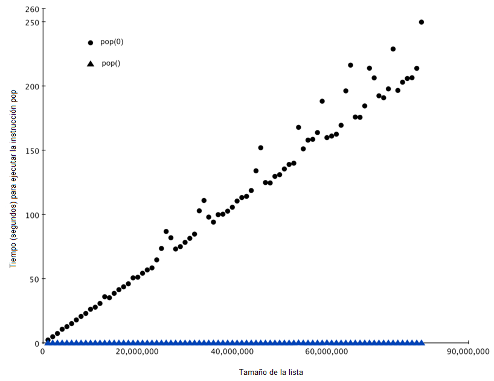

..  Copyright (C)  Brad Miller, David Ranum
    This work is licensed under the Creative Commons Attribution-NonCommercial-ShareAlike 4.0 International License. To view a copy of this license, visit http://creativecommons.org/licenses/by-nc-sa/4.0/.

Listas
~~~~~~

Los diseñadores de Python tuvieron que elegir entre muchas opciones cuando implementaron la estructura de datos lista. Cada una de estas opciones podría tener un impacto en la velocidad de las operaciones con listas. Para ayudarse en la toma de la decisión correcta, examinaron las maneras en que la gente usaría más comúnmente la estructura de datos lista y optimizaron su implementación de una lista de modo que las operaciones más comunes fueran muy rápidas. Por supuesto, también trataron de hacer rápidas las operaciones menos comunes, pero cuando había que encontrar un punto medio, a menudo fue sacrificado el desempeño de una operación menos común en favor de la operación más común.

.. The designers of Python had many choices to make when they implemented the list data structure. Each of these choices could have an impact on how fast list operations perform. To help them make the right choices they looked at the ways that people would most commonly use the list data structure and they optimized their implementation of a list so that the most common operations were very fast. Of course they also tried to make the less common operations fast, but when a tradeoff had to be made the performance of a less common operation was often sacrificed in favor of the more common operation.

Dos operaciones comunes son la indización y la asignación a una posición indizada. Ambas operaciones toman la misma cantidad de tiempo sin importar cuán grande sea la lista. Cuando una operación como ésta es independiente del tamaño de la lista, se dice que es :math:`O(1)`.

.. Two common operations are indexing and assigning to an index position. Both of these operations take the same amount of time no matter how large the list becomes. When an operation like this is independent of the size of the list they are :math:`O(1)`.

Otra tarea de programación muy común es hacer crecer una lista. Hay dos maneras de crear una lista más larga. usted puede utilizar el método ``append`` o el operador de concatenación. El método ``append`` es :math:`O(1)`. Sin embargo, el operador de concatenación es :math:`O(k)` donde :math:`k` es el tamaño de la lista que está siendo concatenada. Es importante que usted sepa esto porque puede ayudarle a hacer sus propios programas más eficientes eligiendo la herramienta de trabajo adecuada.

.. Another very common programming task is to grow a list. There are two ways to create a longer list.  You can use the append method or the concatenation operator. The append method is :math:`O(1)`. However, the concatenation operator is :math:`O(k)` where :math:`k` is the size of the list that is being concatenated. This is important for you to know because it can help you make your own programs more efficient by choosing the right tool for the job.

Veamos cuatro maneras diferentes de generar una lista de ``n`` números comenzando con 0. Primero probaremos un ciclo ``for`` y crearemos la lista por concatenación, luego usaremos ``append`` en lugar de la concatenación . A continuación, trataremos de crear la lista utilizando comprensión de listas y finalmente, y tal vez de la forma más obvia, utilizando la función ``range`` envuelta por una llamada al constructor de la lista. El :ref:`Programa 3 <lst_mklist>` muestra el código para hacer nuestra lista de cuatro maneras diferentes.

.. Let's look at four different ways we might generate a list of ``n`` numbers starting with 0. First we’ll try a ``for`` loop and create the list by concatenation, then we’ll use append rather than concatenation. Next, we’ll try creating the list using list comprehension and finally, and perhaps the most obvious way, using the range function wrapped by a call to the list constructor. :ref:`Listing 3 <lst_mklist>` shows the code for making our list four different ways.

.. _lst_mklist:

**Programa 3**

::

    def prueba1():
        l = []
        for i in range(1000):
            l = l + [i]

    def prueba2():
        l = []
        for i in range(1000):
            l.append(i)

    def prueba3():
        l = [i for i in range(1000)]

    def prueba4():
        l = list(range(1000))

Para capturar el tiempo que tarda cada una de nuestras funciones en ejecutarse, utilizaremos el módulo ``timeit`` de Python. El módulo ``timeit`` está diseñado para permitir a los desarrolladores de Python realizar mediciones de tiempos entre plataformas ejecutando funciones en un entorno consistente y utilizando mecanismos de temporización que sean lo más similares posibles entre sistemas operativos.

.. To capture the time it takes for each of our functions to execute we will use Python’s ``timeit`` module. The ``timeit`` module is designed to allow Python developers to make cross-platform timing measurements by running functions in a consistent environment and using timing mechanisms that are as similar as possible across operating systems.

Para usar ``timeit``, usted crea un objeto ``Timer`` cuyos parámetros son dos instrucciones de Python. El primer parámetro es una instrucción de Python a la que usted desea medir el tiempo; el segundo parámetro es una instrucción que se ejecutará una sola vez para configurar la prueba. El módulo ``timeit`` calculará entonces cuánto tiempo tarda en ejecutarse la instrucción cierto número veces. Por defecto ``timeit`` intentará ejecutar la instrucción un millón de veces. Cuando lo haya hecho, devuelve el tiempo como un valor de punto flotante que representa el número total de segundos. No obstante, dado que la instrucción se ejecuta un millón de veces, el resultado se puede leer como el número de microsegundos que toma ejecutar la prueba una sola vez. Usted también puede pasar a ``timeit`` un parámetro llamado ``number`` que le permite especificar cuántas veces ejecutar la instrucción de prueba. La siguiente sesión muestra cuánto tiempo tarda en ejecutarse 1000 veces cada una de nuestras funciones de prueba.

.. To use ``timeit`` you create a ``Timer`` object whose parameters are two Python statements. The first parameter is a Python statement that you want to time; the second parameter is a statement that will run once to set up the test. The ``timeit`` module will then time how long it takes to execute the statement some number of times. By default ``timeit`` will try to run the statement one million times. When its done it returns the time as a floating point value representing the total number of seconds. However, since it executes the statement a million times you can read the result as the number of microseconds to execute the test one time. You can also pass ``timeit`` a named parameter called ``number`` that allows you to specify how many times the test statement is executed. The following session shows how long it takes to run each of our test functions 1000 times.

::

    t1 = Timer("prueba1()", "from __main__ import prueba1")
    print("concatenación ",t1.timeit(number=1000), "milisegundos")
    t2 = Timer("prueba2()", "from __main__ import prueba2")
    print("append ",t2.timeit(number=1000), "milisegundos")
    t3 = Timer("prueba3()", "from __main__ import prueba3")
    print("comprensión ",t3.timeit(number=1000), "milisegundos")
    t4 = Timer("prueba4()", "from __main__ import prueba4")
    print("método range ",t4.timeit(number=1000), "milisegundos")

    concatenación  6.54352807999 milisegundos
    append  0.306292057037 milisegundos
    comprensión  0.147661924362 milisegundos
    método range  0.0655000209808 milisegundos

La instrucción a la que le estamos midiendo el tiempo en el experimento anterior es el llamado a ``prueba1()``, ``prueba2()``, y así sucesivamente. La instrucción de configuración puede parecer muy extraña para usted, así que vamos a considerarla con más detalle. Probablemente usted esté muy familiarizado con la instrucción ``from``, ``import``, pero usualmente se usa al principio de un archivo de programa de Python. En este caso la instrucción ``from __main__ import prueba1`` importa la función ``prueba1`` desde el espacio de nombres ``__main__`` hacia el espacio de nombres que ``timeit`` establece para el experimento de medición de tiempos. El módulo ``timeit`` hace esto porque desea ejecutar las pruebas de medición de tiempo en un entorno que esté despejado de cualquier variable parásita que usted haya creado, que podría interferir con el desempeño de su función de alguna manera imprevista.

.. In the experiment above the statement that we are timing is the function call to ``prueba1()``, ``prueba2()``, and so on. The setup statement may look very strange to you, so let’s consider it in more detail. You are probably very familiar with the ``from``, ``import`` statement, but this is usually used at the beginning of a Python program file. In this case the statement ``from __main__ import prueba1`` imports the function ``prueba1`` from the ``__main__`` namespace into the namespace that ``timeit`` sets up for the timing experiment. The ``timeit`` module does this because it wants to run the timing tests in an environment that is uncluttered by any stray variables you may have created, that may interfere with your function’s performance in some unforeseen way.

Del experimento anterior es claro que la operación ``append`` que tarda 0,30 milisegundos es mucho más rápida que la concatenación que tarda 6,54 milisegundos. En el experimento anterior también mostramos los tiempos de dos métodos adicionales para crear una lista: usar el constructor de lista con una llamada a ``range`` y una comprensión de listas. Es interesante observar que la comprensión de listas es dos veces más rápida que un ciclo ``for`` con una operación ``append``.

.. From the experiment above it is clear that the append operation at 0.30 milliseconds is much faster than concatenation at 6.54 milliseconds. In the above experiment we also show the times for two additional methods for creating a list; using the list constructor with a call to ``range`` and a list comprehension. It is interesting to note that the list comprehension is twice as fast as a ``for`` loop with an ``append`` operation.

Una última observación acerca de este pequeño experimento es que en todas las ocasiones que usted ve arriba se incluyó alguna sobrecarga para llamar realmente a la función de prueba, pero podemos suponer que la sobrecarga de la llamada a la función es idéntica en los cuatro casos, así que aún tenemos una comparación válida de las operaciones. Por lo tanto, no sería exacto decir que la operación de concatenación toma 6.54 milisegundos, sino que deberíamos decir que la función de prueba de la concatenación tarda 6.54 milisegundos. Como ejercicio, usted podría medir el tiempo que toma llamar a una función vacía y restarlo de los números anteriores.

.. One final observation about this little experiment is that all of the times that you see above include some overhead for actually calling the test function, but we can assume that the function call overhead is identical in all four cases so we still get a meaningful comparison of the operations. So it would not be accurate to say that the concatenation operation takes 6.54 milliseconds but rather the concatenation test function takes 6.54 milliseconds. As an exercise you could test the time it takes to call an empty function and subtract that from the numbers above.

Ahora que hemos visto cómo se puede medir el desempeño de forma concreta, fíjese en la :ref:`Tabla 2 <tbl_listbigo>` para ver la eficiencia O-grande de todas las operaciones básicas con listas. Después de examinar cuidadosamente la :ref:`Tabla 2 <tbl_listbigo>`, es posible que usted se esté preguntando acerca de los dos tiempos diferentes para ``pop``. Cuando ``pop`` es llamado sobre el final de la lista se tarda :math:`O(1)` pero cuando pop es llamado sobre el primer elemento de la lista o en cualquier punto intermedio es :math:`O(n)`. La razón de esto radica en cómo Python elige implementar las listas. Cuando un elemento se toma del frente de la lista, en la implementación de Python, todos los demás elementos de la lista se desplazan una posición más cerca del inicio. Esto puede parecer tonto ahora, pero si nos fijamos en la :ref:`Tabla 2 <tbl_listbigo>` veremos que esta implementación también permite que la operación de indización sea :math:`O(1)`. Éste es un sacrificio mutuo que los implementadores de Python pensaron que era bueno.

.. Now that we have seen how performance can be measured concretely you can look at :ref:`Table 2 <tbl_listbigo>` to see the Big-O efficiency of all the basic list operations. After thinking carefully about :ref:`Table 2 <tbl_listbigo>`, you may be wondering about the two different times for ``pop``. When ``pop`` is called on the end of the list it takes :math:`O(1)` but when pop is called on the first element in the list or anywhere in the middle it is :math:`O(n)`. The reason for this lies in how Python chooses to implement lists. When an item is taken from the front of the list, in Python’s implementation, all the other elements in the list are shifted one position closer to the beginning. This may seem silly to you now, but if you look at :ref:`Table 2 <tbl_listbigo>` you will see that this implementation also allows the index operation to be :math:`O(1)`. This is a tradeoff that the Python implementors thought was a good one.

.. _tbl_listbigo:

.. table:: **Tabla 2: Eficiencia O-grande de los operadores de listas en Python**

    ======================= ===================
                  Operación Eficiencia O-grande
    ======================= ===================
              indización []                O(1)
        asignación indizada                O(1)
                     append                O(1)
                      pop()                O(1)
                     pop(i)                O(n)
             insert(i,item)                O(n)
               operador del                O(n)
                  iteración                O(n)
           pertenencia (in)                O(n)
    sacar una porción [x:y]                O(k)
       eliminar una porción                O(n)
        asignar una porción              O(n+k)
                    reverse                O(n)
                 concatenar                O(k)
                    ordenar          O(n log n)
                multiplicar               O(nk)
    ======================= ===================

Como una forma de demostrar esta diferencia en el desempeño vamos a hacer otro experimento usando el módulo ``timeit``. Nuestro objetivo es poder verificar el desempeño de la operación ``pop`` en una lista de un tamaño conocido cuando el programa extrae del final de la lista, y de nuevo cuando el programa extrae del inicio de la lista. También queremos medir este tiempo para listas de diferentes tamaños. Lo que esperamos ver es que el tiempo requerido para extraer del final de la lista se mantendrá constante incluso cuando el tamaño de la lista crezca, mientras que el tiempo para extraer del inicio de la lista seguirá aumentando a medida que la lista crece.

.. As a way of demonstrating this difference in performance let’s do another experiment using the ``timeit`` module. Our goal is to be able to verify the performance of the ``pop`` operation on a list of a known size when the program pops from the end of the list, and again when the program pops from the beginning of the list. We will also want to measure this time for lists of different sizes. What we would expect to see is that the time required to pop from the end of the list will stay constant even as the list grows in size, while the time to pop from the beginning of the list will continue to increase as the list grows.

el :ref:`Programa 4 <lst_popmeas>` muestra un intento de medir la diferencia entre los dos usos de ``pop``. Como se puede ver en este primer ejemplo, extraer del final toma 0.0003 milisegundos, mientras que extraer del inicio toma 4.82 milisegundos. Para una lista de dos millones de elementos esto es un factor de 16,000.

.. :ref:`Listing 4 <lst_popmeas>` shows one attempt to measure the difference between the two uses of pop. As you can see from this first example, popping from the end takes 0.0003 milliseconds, whereas popping from the beginning takes 4.82 milliseconds. For a list of two million elements this is a factor of 16,000.

Hay un par de cosas para notar en el :ref:`Programa 4 <lst_popmeas>`. La primera es la instrucción ``from __main__ import x``. Aunque no definimos una función, sí queremos poder usar el objeto lista x en nuestra prueba. Este enfoque nos permite medir el tiempo de la instrucción ``pop`` sola y obtener la medida más precisa del tiempo para esa única operación. Debido a que el temporizador se repite 1000 veces, también es importante señalar que la lista está disminuyendo su tamaño en 1 cada vez a lo largo del ciclo. Pero ya que la lista inicial tiene un tamaño de dos millones de elementos, sólo reducimos el tamaño total en un :math:`0.05 \%`

.. There are a couple of things to notice about :ref:`Listing 4 <lst_popmeas>`. The first is the statement ``from __main__ import x``. Although we did not define a function we do want to be able to use the list object x in our test. This approach allows us to time just the single ``pop`` statement and get the most accurate measure of the time for that single operation. Because the timer repeats 1000 times it is also important to point out that the list is decreasing in size by 1 each time through the loop. But since the initial list is two million elements in size we only reduce the overall size by :math:`0.05\%`

.. _lst_popmeas:

**Programa 4**

::

    extraerInicio = timeit.Timer("x.pop(0)",
                           "from __main__ import x")
    extraerFinal = timeit.Timer("x.pop()",
                          "from __main__ import x")

    x = list(range(2000000))
    extraerInicio.timeit(number=1000)
    4.8213560581207275

    x = list(range(2000000))
    extraerFinal.timeit(number=1000)
    0.0003161430358886719

Si bien nuestra primera prueba muestra que ``pop(0)`` es más lento que ``pop()``, este resultado no valida la afirmación de que ``pop(0)`` es :math:`O(n)` mientras que ``pop()`` es :math:`O(1)`. Para validar esa afirmación necesitamos ver el desempeño de ambas llamadas en un rango de tamaños de listas. El :ref:`Programa 5 <lst_poplists>` implementa esta prueba.

.. While our first test does show that ``pop(0)`` is indeed slower than ``pop()``, it does not validate the claim that ``pop(0)`` is :math:`O(n)` while ``pop()`` is :math:`O(1)`. To validate that claim we need to look at the performance of both calls over a range of list sizes. :ref:`Listing 5 <lst_poplists>` implements this test.

.. _lst_poplists:

**Programa 5**

::

    extraerInicio = Timer("x.pop(0)",
                    "from __main__ import x")
    extraerFinal = Timer("x.pop()",
                   "from __main__ import x")
    print("pop(0)   pop()")
    for i in range(1000000,100000001,1000000):
        x = list(range(i))
        pt = extraerFinal.timeit(number=1000)
        x = list(range(i))
        pz = extraerInicio.timeit(number=1000)
        print("%15.5f, %15.5f" %(pz,pt))

La :ref:`Figura 3 <fig_poptest>` muestra los resultados de nuestro experimento. Se puede ver que a medida que la lista se alarga, el tiempo que tarda ``pop(0)`` también aumenta mientras que el tiempo para ``pop`` se mantiene muy estable. Esto es exactamente lo que esperábamos ver para algoritmos :math:`O(n)` y :math:`O(1)`, respectivamente.

.. :ref:`Figure 3 <fig_poptest>` shows the results of our experiment. You can see that as the list gets longer and longer the time it takes to ``pop(0)`` also increases while the time for ``pop`` stays very flat. This is exactly what we would expect to see for a :math:`O(n)` and :math:`O(1)` algorithm.

Algunas fuentes de error en nuestro pequeño experimento incluyen el hecho de que hay otros procesos que se ejecutan en el equipo a medida que hacemos las mediciones y que pueden ralentizar nuestro código, así que a pesar de que tratemos de minimizar otras cosas que suceden en la computadora, es posible que haya alguna variación en el tiempo. Es por eso que el ciclo ejecuta la prueba mil veces con el fin de reunir información estadísticamente suficiente y hacer fiable la medición.

.. Some sources of error in our little experiment include the fact that there are other processes running on the computer as we measure that may slow down our code, so even though we try to minimize other things happening on the computer there is bound to be some variation in time. That is why the loop runs the test one thousand times in the first place to statistically gather enough information to make the measurement reliable.

.. _fig_poptest:

   Figura 3: Comparación de los desempeños de ``pop`` y ``pop(0)``
   
   Figura 3: Comparación de los desempeños de ``pop`` y ``pop(0)``
