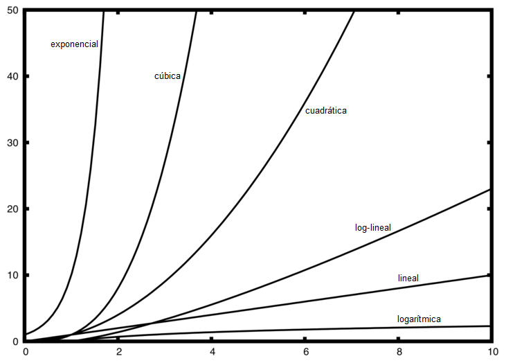
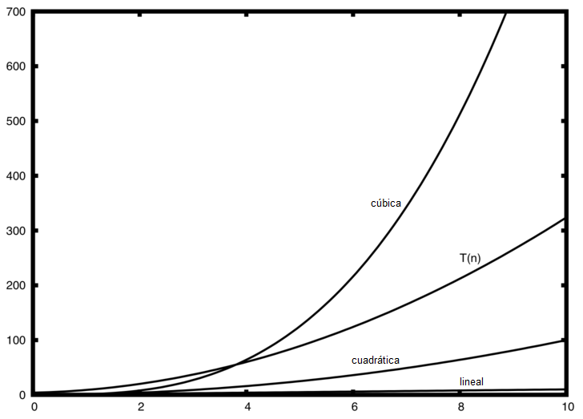

..  Copyright (C)  Brad Miller, David Ranum
    This work is licensed under the Creative Commons Attribution-NonCommercial-ShareAlike 4.0 International License. To view a copy of this license, visit http://creativecommons.org/licenses/by-nc-sa/4.0/.

Notación O-grande
~~~~~~~~~~~~~~~~~

Al tratar de caracterizar la eficiencia de un algoritmo en términos del tiempo de ejecución, independientemente de cualquier programa o computadora en particular, es importante cuantificar el número de operaciones o pasos que el algoritmo requerirá. Si se considera que cada uno de estos pasos es una unidad básica de cálculo, entonces el tiempo de ejecución de un algoritmo puede expresarse como el número de pasos necesarios para resolver el problema. Decidir sobre una unidad básica de cálculo apropiada puede ser un problema complicado y dependerá de cómo se implemente el algoritmo.

.. When trying to characterize an algorithm’s efficiency in terms of execution time, independent of any particular program or computer, it is important to quantify the number of operations or steps that the algorithm will require. If each of these steps is considered to be a basic unit of computation, then the execution time for an algorithm can be expressed as the number of steps required to solve the problem. Deciding on an appropriate basic unit of computation can be a complicated problem and will depend on how the algorithm is implemented.

Una buena unidad básica de cálculo para comparar los algoritmos de sumatoria mostrados anteriormente podría ser contar el número de instrucciones de asignación realizadas para calcular la suma. En la función ``sumaDeN``, el número de instrucciones de asignación es 1 (:math:`laSuma = 0`) más el valor de *n* (el número de veces que ejecutamos :math:`laSuma=laSuma+i`). Podemos denotar esto por una función, digamos *T*, donde :math:`T(n)=1 + n`. El parámetro *n* a menudo se denomina el “tamaño del problema”, y podemos interpretar la función como “*T(n)* es el tiempo que se necesita para resolver un problema de tamaño *n*, a saber, *1+n* pasos".

.. A good basic unit of computation for comparing the summation algorithms shown earlier might be to count the number of assignment statements performed to compute the sum. In the function ``sumaDeN``, the number of assignment statements is 1 (:math:`theSum = 0`) plus the value of *n* (the number of times we perform :math:`theSum=theSum+i`). We can denote this by a function, call it *T*, where :math:`T(n)=1 + n`. The parameter *n* is often referred to as the “size of the problem,” and we can read this as “T(n) is the time it takes to solve a problem of size n, namely 1+n steps.”

En las funciones de sumatoria mencionadas anteriormente, tiene sentido utilizar el número de términos en la sumatoria para indicar el tamaño del problema. Podemos decir entonces que la suma de los primeros 100,000 enteros es un caso más grande del problema de la suma que la suma de los primeros 1,000. Debido a esto, podría parecer razonable que el tiempo requerido para resolver el caso más grande fuera mayor que para el caso más pequeño. Nuestro objetivo entonces es mostrar cómo cambia el tiempo de ejecución del algoritmo con respecto al tamaño del problema.

.. In the summation functions given above, it makes sense to use the number of terms in the summation to denote the size of the problem. We can then say that the sum of the first 100,000 integers is a bigger instance of the summation problem than the sum of the first 1,000. Because of this, it might seem reasonable that the time required to solve the larger case would be greater than for the smaller case. Our goal then is to show how the algorithm’s execution time changes with respect to the size of the problem.

Los científicos de la computación prefieren llevar esta técnica de análisis un poco más allá. Resulta que el número exacto de operaciones no es tan importante como determinar la parte más dominante de la función :math:`T(n)`. En otras palabras, a medida que el problema se hace más grande, una parte de la función :math:`T(n)` tiende a dominar la parte restante. Este término dominante es lo que, al final, se utiliza para la comparación. La función **orden de magnitud** describe la parte de :math:`T(n)` que más rápido crece a medida que aumenta el valor de *n*. El orden de magnitud es a menudo llamado notación **O-grande** (por “orden”) y se escribe como :math:`O(f(n))`. Esta notación proporciona una aproximación útil al número real de pasos en el cálculo. La función :math:`f(n)` brinda una representación sencilla de la parte dominante de la función :math:`T(n)` original.

.. Computer scientists prefer to take this analysis technique one step further. It turns out that the exact number of operations is not as important as determining the most dominant part of the :math:`T(n)` function. In other words, as the problem gets larger, some portion of the :math:`T(n)` function tends to overpower the rest. This dominant term is what, in the end, is used for comparison. The **order of magnitude** function describes the part of :math:`T(n)` that increases the fastest as the value of *n* increases. Order of magnitude is often called **Big-O** notation (for “order”) and written as :math:`O(f(n))`. It provides a useful approximation to the actual number of steps in the computation. The function :math:`f(n)` provides a simple representation of the dominant part of the original :math:`T(n)`.

En el ejemplo anterior, :math:`T(n)=1+n`. A medida que *n* se hace grande, la constante 1 será cada vez menos significativa para el resultado final. Si estamos buscando una aproximación para :math:`T(n)`, entonces podemos despreciar el 1 y simplemente decir que el tiempo de ejecución es :math:`O(n)`. Es importante notar que el 1 es ciertamente significativo para :math:`T(n)`. No obstante, a medida que *n* se hace grande, nuestra aproximación será igualmente exacta sin él.

.. In the above example, :math:`T(n)=1+n`. As *n* gets large, the constant 1 will become less and less significant to the final result. If we are looking for an approximation for :math:`T(n)`, then we can drop the 1 and simply say that the running time is :math:`O(n)`. It is important to note that the 1 is certainly significant for :math:`T(n)`. However, as *n* gets large, our approximation will be just as accurate without it.

Como ejemplo alternativo, supongamos que para algún algoritmo, el número exacto de pasos es :math:`T(n)=5n^{2}+27n+1005`. Cuando *n* es pequeño, digamos 1 ó 2, la constante 1005 parece ser la parte dominante de la función. Sin embargo, a medida que *n* se hace más grande, el término :math:`n^{2}` se convierte en el más importante. De hecho, cuando *n* es realmente grande, los otros dos términos se vuelven insignificantes en el papel que desempeñan para la determinación del resultado final. Una vez más, para aproximar :math:`T(n)` a medida que *n* se hace grande, podemos ignorar los otros términos y concentrarnos en :math:`5n^{2}`. Además, el coeficiente :math:`5` se vuelve insignificante cuando *n* se hace grande. Podemos decir entonces que la función :math:`T(n)` tiene un orden de magnitud :math:`f(n)=n^{2}`, o simplemente que es :math:`O(n^{2})`.

.. As another example, suppose that for some algorithm, the exact number of steps is :math:`T(n)=5n^{2}+27n+1005`. When *n* is small, say 1 or 2, the constant 1005 seems to be the dominant part of the function. However, as *n* gets larger, the :math:`n^{2}` term becomes the most important. In fact, when *n* is really large, the other two terms become insignificant in the role that they play in determining the final result. Again, to approximate :math:`T(n)` as *n* gets large, we can ignore the other terms and focus on :math:`5n^{2}`. In addition, the coefficient :math:`5` becomes insignificant as *n* gets large. We would say then that the function :math:`T(n)` has an order of magnitude :math:`f(n)=n^{2}`, or simply that it is :math:`O(n^{2})`.

Aunque no vemos esto en el ejemplo de la suma, a veces el rendimiento de un algoritmo depende de los valores exactos de los datos en lugar de simplemente el tamaño del problema. Para este tipo de algoritmos necesitamos caracterizar su desempeño en términos del **mejor caso**, el **peor caso**, o el **caso promedio**. El peor caso de rendimiento se refiere a un conjunto de datos en particular, donde el algoritmo se comporta especialmente mal. Mientras que un conjunto de datos diferente para el mismo algoritmo podría tener un rendimiento extraordinariamente bueno. Sin embargo, en la mayoría de los casos, el algoritmo se comporta de algún modo entre estos dos extremos (caso promedio). Es importante que un científico de la computación entienda estas distinciones para que no resulten engañosas en un caso particular.

.. Although we do not see this in the summation example, sometimes the performance of an algorithm depends on the exact values of the data rather than simply the size of the problem. For these kinds of algorithms we need to characterize their performance in terms of best case, **worst case**, or **average case** performance. The worst case performance refers to a particular data set where the algorithm performs especially poorly. Whereas a different data set for the exact same algorithm might have extraordinarily good performance. However, in most cases the algorithm performs somewhere in between these two extremes (average case). It is important for a computer scientist to understand these distinctions so they are not misled by one particular case.

Una serie de funciones de orden de magnitud muy comunes aparecerán una y otra vez a medida que usted estudia algoritmos. Éstas se muestran en la :ref:`Tabla 1 <tbl_fntable>`. Para decidir cuál de estas funciones es la parte dominante de cualquier función :math:`T(n)`, debemos compararlas entre sí a medida que *n* se hace grande.

.. A number of very common order of magnitude functions will come up over and over as you study algorithms. These are shown in :ref:`Table 1 <tbl_fntable>`. In order to decide which of these functions is the dominant part of any :math:`T(n)` function, we must see how they compare with one another as *n* gets large.

.. _tbl_fntable: 

.. table:: **Tabla 1: Funciones comunes para la notación O-grande**

    ================= ===============
             **f(n)**      **Nombre**
    ================= ===============
          :math:`1`         Constante
     :math:`\log n`       Logarítmica
          :math:`n`            Lineal
    :math:`n\log n`        Log-lineal
      :math:`n^{2}`        Cuadrática
      :math:`n^{3}`            Cúbica
      :math:`2^{n}`       Exponencial
    ================= ===============

La :ref:`Figura 1 <fig_graphfigure>` muestra las gráficas de las funciones comunes de la :ref:`Tabla 1 <tbl_fntable>`. Note que cuando *n* es pequeño, las funciones no están muy bien definidas una con respecto a otra. Es difícil saber cuál es la dominante. Sin embargo, a medida que *n* crece, existe una relación definida y es fácil compararlas entre sí.

.. :ref:`Figure 1 <fig_graphfigure>` shows graphs of the common functions from :ref:`Table 1 <tbl_fntable>`. Notice that when *n* is small, the functions are not very well defined with respect to one another. It is hard to tell which is dominant. However, as *n* grows, there is a definite relationship and it is easy to see how they compare with one another.

.. _fig_graphfigure:

   Figura 1: Gráficas de las funciones comunes para la notación O-grande
   
   Figura 1: Gráficas de las funciones comunes para la notación O-grande

Como ejemplo final, supongamos que tenemos el fragmento de código en Python que se muestra en el :ref:`Programa 2 <lst_dummycode>`. Aunque este programa realmente no hace nada, es instructivo ver cómo podemos considerar el código real y analizar su rendimiento.

.. As a final example, suppose that we have the fragment of Python code shown in :ref:`Listing 2 <lst_dummycode>`. Although this program does not really do anything, it is instructive to see how we can take actual code and analyze performance.

.. _lst_dummycode:

**Programa 2**

::

    a=5
    b=6
    c=10
    for i in range(n):
       for j in range(n):
          x = i * i
          y = j * j
          z = i * j
    for k in range(n):
       w = a*k + 45
       v = b*b
    d = 33

El número de operaciones de asignación es la suma de cuatro términos. El primer término es la constante 3, que representa las tres instrucciones de asignación al inicio del fragmento de código. El segundo término es :math:`3n^ {2}`, ya que hay tres declaraciones que se realizan :math:`n^{2}` veces debido a la iteración anidada. El tercer término es :math:`2n`, dos instrucciones que se repiten *n* veces. Finalmente, el cuarto término es la constante 1, que representa la instrucción de asignación final. Esto nos da :math:`T(n)=3+3n^{2}+2n+1=3n^{2}+2n+4`. Observando los exponentes, podemos notar fácilmente que el término :math:`n^{2}` será dominante y por lo tanto este fragmento de código es :math:`O(n^{2})`. Tenga en cuenta que todos los otros términos, así como el coeficiente en el término dominante, se pueden ignorar a medida que *n* crece más.

.. The number of assignment operations is the sum of four terms. The first term is the constant 3, representing the three assignment statements at the start of the fragment. The second term is :math:`3n^{2}`, since there are three statements that are performed :math:`n^{2}` times due to the nested iteration. The third term is :math:`2n`, two statements iterated *n* times. Finally, the fourth term is the constant 1, representing the final assignment statement. This gives us :math:`T(n)=3+3n^{2}+2n+1=3n^{2}+2n+4`. By looking at the exponents, we can easily see that the :math:`n^{2}` term will be dominant and therefore this fragment of code is :math:`O(n^{2})`. Note that all of the other terms as well as the coefficient on the dominant term can be ignored as *n* grows larger.

.. _fig_graphfigure2:

   Figura 2: Comparación de :math:`T(n)` con funciones comunes para la notación O-grande
   
   Figura 2: Comparación de :math:`T(n)` con funciones comunes para la notación O-grande

La :ref:`Figura 2 <fig_graphfigure2>` muestra algunas de las funciones comunes para la notación O-grande comparadas con la función :math:`T (n)` discutida anteriormente. Tenga en cuenta que :math:`T(n)` es inicialmente mayor que la función cúbica. Sin embargo, a medida que *n* crece, la función cúbica rápidamente supera :math:`T(n)`. Es fácil ver que :math:`T(n)` sigue entonces a la función cuadrática a medida que :math:`n` continúa creciendo.

.. :ref:`Figure 2 <fig_graphfigure2>` shows a few of the common Big-O functions as they compare with the :math:`T(n)` function discussed above. Note that :math:`T(n)` is initially larger than the cubic function. However, as n grows, the cubic function quickly overtakes :math:`T(n)`. It is easy to see that :math:`T(n)` then follows the quadratic function as :math:`n` continues to grow.

.. admonition:: Autoevaluación

   Escriba dos funciones en Python para encontrar el número mínimo en una lista. La primera función debe comparar cada número de una lista con todos los demás de la lista. :math:`O(n^2)`. La segunda función debe ser lineal :math:`O(n)`.
