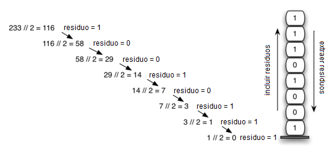

..  Copyright (C)  Brad Miller, David Ranum
    This work is licensed under the Creative Commons Attribution-NonCommercial-ShareAlike 4.0 International License. To view a copy of this license, visit http://creativecommons.org/licenses/by-nc-sa/4.0/.

Conversión de números decimales a números binarios
~~~~~~~~~~~~~~~~~~~~~~~~~~~~~~~~~~~~~~~~~~~~~~~~~~

En su estudio de las ciencias de la computación, usted probablemente ha estado expuesto de una manera u otra a la idea de un número binario. La representación binaria es importante en ciencias de la computación puesto que todos los valores almacenados en la computadora son cadenas de dígitos binarios, es decir, cadenas de unos y ceros. Sin la capacidad de convertir entre representaciones comunes y números binarios, necesitaríamos interactuar con las computadoras de maneras muy incómodas.

.. In your study of computer science, you have probably been exposed in one way or another to the idea of a binary number. Binary representation is important in computer science since all values stored within a computer exist as a string of binary digits, a string of 0s and 1s. Without the ability to convert back and forth between common representations and binary numbers, we would need to interact with computers in very awkward ways.

Los valores enteros son ítems de datos comunes. Se utilizan todo el tiempo en programas informáticos y en la computación. Aprendemos sobre ellos en la clase de matemáticas y por supuesto los representamos usando el sistema numérico decimal, o la base 10. El número decimal :math:`233_{10}` y su equivalente binario correspondiente :math:`11101001_{2}` son interpretados respectivamente como

.. Integer values are common data items. They are used in computer programs and computation all the time. We learn about them in math class and of course represent them using the decimal number system, or base 10. The decimal number :math:`233_{10}` and its corresponding binary equivalent :math:`11101001_{2}` are interpreted respectively as

:math:`2\times10^{2} + 3\times10^{1} + 3\times10^{0}`

y

:math:`1\times2^{7} + 1\times2^{6} + 1\times2^{5} + 0\times2^{4} + 1\times2^{3} + 0\times2^{2} + 0\times2^{1} + 1\times2^{0}`

Pero, ¿cómo podemos convertir fácilmente valores enteros en números binarios? La respuesta es un algoritmo llamado “Dividir by 2” que utiliza una pila para realizar un seguimiento de los dígitos del resultado binario.

.. But how can we easily convert integer values into binary numbers? The answer is an algorithm called “Divide by 2” that uses a stack to keep track of the digits for the binary result.

El algoritmo de dividir por 2 supone que comenzamos con un entero mayor que 0. Una simple iteración divide continuamente el número decimal por 2 y mantiene un seguimiento del residuo. La primera división por 2 indica si el valor es par o impar. Un valor par tendrá un residuo 0. Él tendrá el dígito 0 en la posición de las unidades. Un valor impar tendrá un residuo 1 y tendrá el dígito 1 en la posición de las unidades. Pensamos construir nuestro número binario como una secuencia de dígitos; el primer residuo que calcularemos será el último dígito de la secuencia. Como se muestra en la :ref:`Figura 5 <fig_decbin>`, volvemos a ver la propiedad de inversión que indica que una pila es probablemente la estructura de datos adecuada para resolver el problema.

.. The Divide by 2 algorithm assumes that we start with an integer greater than 0. A simple iteration then continually divides the decimal number by 2 and keeps track of the remainder. The first division by 2 gives information as to whether the value is even or odd. An even value will have a remainder of 0. It will have the digit 0 in the ones place. An odd value will have a remainder of 1 and will have the digit 1 in the ones place. We think about building our binary number as a sequence of digits; the first remainder we compute will actually be the last digit in the sequence. As shown in :ref:`Figure 5 <fig_decbin>`, we again see the reversal property that signals that a stack is likely to be the appropriate data structure for solving the problem.

.. _fig_decbin:

   Figura 5: Conversión de decimal a binario

   Figura 5: Conversión de decimal a binario

El código de Python en el :ref:`ActiveCode 1 <lst_binconverter>` implementa el algoritmo Dividir por 2. La función ``dividirPor2`` toma un argumento que es un número decimal y lo divide repetidamente entre 2. La línea 7 utiliza el operador módulo incorporado, %, para extraer el residuo y la línea 8 lo incluye luego en la pila. Después de que el proceso de división llegue a 0, se construirá una cadena binaria en las líneas 11-13. La línea 11 crea una cadena vacía. Los dígitos binarios se extraen de la pila uno a la vez y se añaden al extremo derecho de la cadena. Finalmente, se devuelve la cadena binaria.

.. The Python code in :ref:`ActiveCode 1 <lst_binconverter>` implements the Divide by 2 algorithm. The function ``divideBy2`` takes an argument that is a decimal number and repeatedly divides it by 2. Line 7 uses the built-in modulo operator, %, to extract the remainder and line 8 then pushes it on the stack. After the division process reaches 0, a binary string is constructed in lines 11-13. Line 11 creates an empty string. The binary digits are popped from the stack one at a time and appended to the right-hand end of the string. The binary string is then returned.

.. _lst_binconverter:

.. activecode:: divby2
   :caption: Conversión de decimal a binario
   :nocodelens:

   from pythoned.basicas.pila import Pila
   
   def dividirPor2(numeroDecimal):
       pilaResiduo = Pila()

       while numeroDecimal > 0:
           residuo = numeroDecimal % 2
           pilaResiduo.incluir(residuo)
           numeroDecimal = numeroDecimal // 2

       cadenaBinaria = ""
       while not pilaResiduo.estaVacia():
           cadenaBinaria = cadenaBinaria + str(pilaResiduo.extraer())

       return cadenaBinaria

   print(dividirPor2(42))

El algoritmo para la conversión binaria se puede ampliar fácilmente para realizar la conversión a cualquier base. En ciencias de la computación es común utilizar una serie de codificaciones diferentes. Las más comunes son la binaria, la octal (base 8) y la hexadecimal (base 16).

.. The algorithm for binary conversion can easily be extended to perform the conversion for any base. In computer science it is common to use a number of different encodings. The most common of these are binary, octal (base 8), and hexadecimal (base 16).

El número decimal :math:`233` y sus correspondencias equivalentes en octal y hexadecimal :math:`351_ {8}` y :math:`E9_ {16}` se interpretan como

.. The decimal number :math:`233` and its corresponding octal and hexadecimal equivalents :math:`351_{8}` and :math:`E9_{16}` are interpreted as

:math:`3\times8^{2} + 5\times8^{1} + 1\times8^{0}`

y

:math:`14\times16^{1} + 9\times16^{0}`

La función ``dividirPor2`` puede modificarse para aceptar no sólo un valor decimal sino también una base para la conversión deseada. Una nueva función llamada ``convertirBase``, que se muestra en el :ref:`ActiveCode 2 <lst_baseconverter>`, toma como parámetros un número decimal y cualquier base entre 2 y 16. Los residuos se envían a la pila hasta que el valor que esté siendo convertido se vuelva 0. Se puede usar la misma técnica de construcción de cadena de izquierda a derecha con un ligero cambio. Los números de base 2 a base 10 necesitan un máximo de 10 dígitos, así que los caracteres típicos para los dígitos 0, 1, 2, 3, 4, 5, 6, 7, 8 y 9 funcionan bien. El problema surge cuando vamos más allá de la base 10. Ya no podemos simplemente usar los residuos, ya que ellos mismos están representados como números decimales de dos dígitos. En su lugar, necesitamos crear un conjunto de dígitos que se puedan utilizar para representar los residuos superiores a 9.

.. The function ``divideBy2`` can be modified to accept not only a decimal value but also a base for the intended conversion. The “Divide by 2” idea is simply replaced with a more general “Divide by base.” A new function called ``baseConverter``, shown in :ref:`ActiveCode 2 <lst_baseconverter>`, takes a decimal number and any base between 2 and 16 as parameters. The remainders are still pushed onto the stack until the value being converted becomes 0. The same left-to-right string construction technique can be used with one slight change. Base 2 through base 10 numbers need a maximum of 10 digits, so the typical digit characters 0, 1, 2, 3, 4, 5, 6, 7, 8, and 9 work fine. The problem comes when we go beyond base 10. We can no longer simply use the remainders, as they are themselves represented as two-digit decimal numbers. Instead we need to create a set of digits that can be used to represent those remainders beyond 9.

.. _lst_baseconverter:

.. activecode:: baseconvert
    :caption: Conversión de decimal a cualquier base
    :nocodelens:

    from pythoned.basicas.pila import Pila
    
    def convertirBase(numeroDecimal,base):
        digitos = "0123456789ABCDEF"

        pilaResiduo = Pila()

        while numeroDecimal > 0:
            residuo = numeroDecimal % base
            pilaResiduo.incluir(residuo)
            numeroDecimal = numeroDecimal // base

        nuevaCadena = ""
        while not pilaResiduo.estaVacia():
            nuevaCadena = nuevaCadena + digitos[pilaResiduo.extraer()]

        return nuevaCadena

    print(convertirBase(25,2))
    print(convertirBase(25,16))

Una solución a este problema es extender el conjunto de dígitos para incluir algunos caracteres del alfabeto. Por ejemplo, en hexadecimal se usan los diez dígitos decimales junto con los seis primeros caracteres del alfabeto para los 16 dígitos. Para implementar esto, se crea una cadena de dígitos (línea 4 en el :ref:`ActiveCode 2 <lst_baseconverter>`) que almacena los dígitos en sus posiciones correspondientes. 0 está en la posición 0, 1 está en la posición 1, A está en la posición 10, B está en la posición 11, y así sucesivamente. Cuando se elimina un residuo de la pila, éste se puede utilizar para indizar en la cadena de dígitos y el dígito resultante correcto puede añadirse a la respuesta. Por ejemplo, si el residuo 13 se elimina de la pila, el dígito D se añade a la cadena resultante.

.. A solution to this problem is to extend the digit set to include some alphabet characters. For example, hexadecimal uses the ten decimal digits along with the first six alphabet characters for the 16 digits. To implement this, a digit string is created (line 4 in :ref:`Listing 6 <lst_baseconverter>`) that stores the digits in their corresponding positions. 0 is at position 0, 1 is at position 1, A is at position 10, B is at position 11, and so on. When a remainder is removed from the stack, it can be used to index into the digit string and the correct resulting digit can be appended to the answer. For example, if the remainder 13 is removed from the stack, the digit D is appended to the resulting string.

.. admonition:: Autoevaluación

   .. fillintheblank:: baseconvert1

      .. blank:: bcblank1
         :correct: \\b31\\b
         :feedback1: (".*", "Incorrecto")

         ¿Cuál es el valor de 25 expresado como un número octal?

   .. fillintheblank:: baseconvert2

      .. blank:: bcblank2
         :correct: \\b100\\b

         ¿Cuál es el valor de 256 expresado como un número hexadecimal?

   .. fillintheblank:: baseconvert3

      .. blank:: bcblank3
         :correct: \\b10\\b
         :feedback1: ('.*', 'Tal vez usted deba modificar la funci&oacute;n convertirBase, or simplemente encontrar un patr&oacute;n en la conversi&oacute;n de bases.')

         ¿Cuál es el valor de 26 expresado en base 26?

