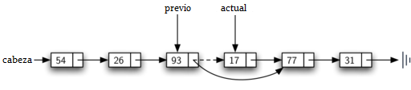

..  Copyright (C)  Brad Miller, David Ranum
    This work is licensed under the Creative Commons Attribution-NonCommercial-ShareAlike 4.0 International License. To view a copy of this license, visit http://creativecommons.org/licenses/by-nc-sa/4.0/.

Implementación de una lista no ordenada: Listas enlazadas
~~~~~~~~~~~~~~~~~~~~~~~~~~~~~~~~~~~~~~~~~~~~~~~~~~~~~~~~~

Con el fin de implementar una lista no ordenada, vamos a construir lo que comúnmente se conoce como una **lista enlazada (encadenada o ligada)**. Recordemos que tenemos que estar seguros de que podemos mantener el posicionamiento relativo de los ítems. Sin embargo, no existe ningún requisito que mantenga ese posicionamiento en memoria contigua. Por ejemplo, considere la colección de elementos mostrados en la :ref:`Figura 1 <fig_idea>`. Parece que estos valores se han colocado al azar. Si podemos mantener alguna información explícita en cada ítem, es decir, la ubicación del ítem siguiente (véase la :ref:`Figura 2 <fig_idea2>`), entonces la posición relativa de cada ítem puede expresarse simplemente siguiendo el enlace de un ítem al siguiente.

.. In order to implement an unordered list, we will construct what is commonly known as a **linked list**. Recall that we need to be sure that we can maintain the relative positioning of the items. However, there is no requirement that we maintain that positioning in contiguous memory. For example, consider the collection of items shown in :ref:`Figure 1 <fig_idea>`. It appears that these values have been placed randomly. If we can maintain some explicit information in each item, namely the location of the next item (see :ref:`Figure 2 <fig_idea2>`), then the relative position of each item can be expressed by simply following the link from one item to the next.

.. _fig_idea:

.. figure:: Figures/idea.png
   :align: center

   Figura 1: Ítems no restringidos en su ubicación física

   Figura 1: Ítems no restringidos en su ubicación física

.. _fig_idea2:

   Figura 2: Posiciones relativas mantenidas por enlaces explícitos

   Figura 2: Posiciones relativas mantenidas por enlaces explícitos

Es importante tener en cuenta que la ubicación del primer ítem de la lista debe especificarse explícitamente. Una vez que sepamos dónde está el primer ítem, éste puede decirnos dónde está el segundo, y así sucesivamente. La referencia externa se conoce a menudo como la **cabeza** de la lista. Del mismo modo, el último ítem necesita saber que no hay ningún ítem siguiente.

.. It is important to note that the location of the first item of the list must be explicitly specified. Once we know where the first item is, the first item can tell us where the second is, and so on. The external reference is often referred to as the **head** of the list. Similarly, the last item needs to know that there is no next item.

La clase ``Nodo``
^^^^^^^^^^^^^^^^^

El bloque constructivo básico para la implementación de la lista enlazada es el **nodo**. Cada objeto nodo debe contener al menos dos piezas de información. En primer lugar, el nodo debe contener el ítem de lista en sí mismo. Esto lo llamaremos el **campo de dato** del nodo. Además, cada nodo debe contener una referencia al siguiente nodo. El :ref:`Programa 1 <lst_nodeclass>` muestra la implementación en Python. Para construir un nodo, usted debe proporcionar el valor inicial del dato del nodo. La evaluación de la instrucción de asignación que aparece más abajo producirá un objeto nodo que contiene el valor 93 (véase la :ref:`Figura 3 <fig_node>`). Tenga en cuenta que típicamente representaremos un objeto nodo como se muestra en la :ref:`Figura 4 <fig_node2>`. La clase ``Nodo`` también incluye los métodos habituales para acceder y modificar el dato y la siguiente referencia.

.. The basic building block for the linked list implementation is the **node**. Each node object must hold at least two pieces of information. First, the node must contain the list item itself. We will call this the **data field** of the node. In addition, each node must hold a reference to the next node. :ref:`Listing 1 <lst_nodeclass>` shows the Python implementation. To construct a node, you need to supply the initial data value for the node. Evaluating the assignment statement below will yield a node object containing the value 93 (see :ref:`Figure 3 <fig_node>`). You should note that we will typically represent a node object as shown in :ref:`Figure 4 <fig_node2>`. The ``Node`` class also includes the usual methods to access and modify the data and the next reference.

.. _lst_nodeclass:

**Programa 1**

.. sourcecode:: python

   class Nodo:
       def __init__(self,datoInicial):
           self.dato = datoInicial
           self.siguiente = None

       def obtenerDato(self):
           return self.dato

       def obtenerSiguiente(self):
           return self.siguiente

       def asignarDato(self,nuevodato):
           self.dato = nuevodato

       def asignarSiguiente(self,nuevosiguiente):
           self.siguiente = nuevosiguiente

Creamos objetos ``Nodo`` de la manera habitual.
           
.. We create ``Node`` objects in the usual way.

::

        >>> temp = Nodo(93)
        >>> temp.obtenerDato()
        93

El valor de referencia especial de Python ``None`` desempeñará un papel importante en la clase ``Nodo`` y más tarde en la propia lista enlazada. Una referencia a ``None`` indicará el hecho de que no hay nodo siguiente. Fíjese en el constructor que un nodo se crea inicialmente con ``siguiente`` asignado a ``None``. Puesto que esto a veces se denomina “puesta a tierra del nodo”, usaremos el símbolo estándar de tierra para designar una referencia que se refiere a ``None``. Siempre es una buena idea asignar explícitamente ``None`` a los valores de referencia iniciales siguientes.

.. The special Python reference value ``None`` will play an important role in the ``Node`` class and later in the linked list itself. A reference to ``None`` will denote the fact that there is no next node. Note in the constructor that a node is initially created with ``siguiente`` set to ``None``. Since this is sometimes referred to as “grounding the node,” we will use the standard ground symbol to denote a reference that is referring to ``None``. It is always a good idea to explicitly assign ``None`` to your initial next reference values.

.. _fig_node:

.. figure:: Figures/node.png
   :align: center

   Figura 3: Un objeto de nodo contiene el ítem y una referencia al siguiente nodo

   Figura 3: Un objeto de nodo contiene el ítem y una referencia al siguiente nodo

.. _fig_node2:

.. figure:: Figures/node2.png
   :align: center

   Figura 4: Representación típica para un nodo

   Figura 4: Representación típica para un nodo

La clase ``ListaNoOrdenada``
^^^^^^^^^^^^^^^^^^^^^^^^^^^^

Como sugerimos anteriormente, la lista no ordenada se construirá a partir de una colección de nodos, cada uno vinculado al siguiente mediante referencias explícitas. Siempre y cuando sepamos dónde encontrar el primer nodo (que contiene el primer ítem), cada ítem posterior se puede encontrar sucesivamente siguiendo los enlaces subsiguientes. Con esto en mente, la clase ``ListaNoOrdenada`` debe mantener una referencia al primer nodo. El :ref:`Programa 2 <lst_listclass>` muestra el constructor. Tenga en cuenta que cada objeto de la lista mantendrá una sola referencia a la cabeza de la lista.

.. As we suggested above, the unordered list will be built from a collection of nodes, each linked to the next by explicit references. As long as we know where to find the first node (containing the first item), each item after that can be found by successively following the next links. With this in mind, the ``ListaNoOrdenada`` class must maintain a reference to the first node. :ref:`Listing 2 <lst_listclass>` shows the constructor. Note that each list object will maintain a single reference to the head of the list.

.. _lst_listclass:

**Programa 2**

.. sourcecode:: python

    class ListaNoOrdenada:
    
        def __init__(self):
            self.cabeza = None

Inicialmente, cuando construimos una lista, no hay ítems. La instrucción de asignación

.. Initially when we construct a list, there are no items. The assignment statement

::

    >>> milista = ListaNoOrdenada()

crea la representación de lista enlazada que se muestra en la :ref:`Figura 5 <fig_initlinkedlist>`. Como hemos comentado en el apartado sobre la clase ``Nodo``, la referencia especial ``None`` será utilizada nuevamente para indicar que la cabeza de la lista no se refiere a nada. Eventualmente, la lista de ejemplo dada anteriormente será representada por una lista enlazada como se muestra en la :ref:`Figura 6 <fig_linkedlist>`. La cabeza de la lista se refiere al primer nodo que contiene el primer ítem de la lista. A su vez, ese nodo contiene una referencia al siguiente nodo (el siguiente ítem) y así sucesivamente. Es muy importante tener en cuenta que la clase lista en sí misma no contiene ningún objeto nodo. Contiene, en cambio, una sola referencia únicamente al primer nodo de la estructura enlazada.

.. creates the linked list representation shown in :ref:`Figure 5 <fig_initlinkedlist>`. As we discussed in the ``Node`` class, the special reference ``None`` will again be used to state that the head of the list does not refer to anything. Eventually, the example list given earlier will be represented by a linked list as shown in :ref:`Figure 6 <fig_linkedlist>`. The head of the list refers to the first node which contains the first item of the list. In turn, that node holds a reference to the next node (the next item) and so on. It is very important to note that the list class itself does not contain any node objects. Instead it contains a single reference to only the first node in the linked structure.

.. _fig_initlinkedlist:

.. figure:: Figures/initlinkedlist.png
   :align: center

   Figura 5: Una lista vacía

   Figura 5: Una lista vacía

.. _fig_linkedlist:

   Figura 6: Una lista enlazada de enteros

   Figura 6: Una lista enlazada de enteros

El método ``estaVacia``, que se muestra en el :ref:`Programa 3 <lst_isempty>`, simplemente comprueba si la cabeza de la lista es una referencia a ``None``. El resultado de la expresión booleana ``self.cabeza == None`` sólo será verdadero si no hay nodos en la lista enlazada. Dado que una lista nueva está vacía, el constructor y la comprobación de estar vacía deben ser coherentes entre sí. Esto muestra la ventaja de usar la referencia ``None`` para denotar el “final” de la estructura enlazada. En Python, ``None`` puede compararse con cualquier referencia. Dos referencias son iguales si ambas se refieren al mismo objeto. Usaremos esto con frecuencia en nuestros métodos restantes.

.. The ``estaVacia`` method, shown in :ref:`Listing 3 <lst_isempty>`, simply checks to see if the head of the list is a reference to ``None``. The result of the boolean expression ``self.cabeza==None`` will only be true if there are no nodes in the linked list. Since a new list is empty, the constructor and the check for empty must be consistent with one another. This shows the advantage to using the reference ``None`` to denote the “end” of the linked structure. In Python, ``None`` can be compared to any reference. Two references are equal if they both refer to the same object. We will use this often in our remaining methods.

.. _lst_isempty:

**Programa 3**

::

    def estaVacia(self):
        return self.cabeza == None

Entonces, ¿cómo incluiremos ítems en nuestra lista? Tenemos que implementar el método ``agregar``. Sin embargo, antes de que podamos hacer eso, necesitamos enfrentar la importante cuestión de dónde ubicar el nuevo ítem en la lista enlazada. Dado que esta lista no está ordenada, no es importante la ubicación específica del nuevo ítem con respecto a los otros elementos que ya están en la lista. El nuevo ítem puede ubicarse en cualquier parte. Con esto en mente, tiene sentido poner el nuevo ítem en la ubicación más fácil posible.

.. So, how do we get items into our list? We need to implement the ``agregar`` method. However, before we can do that, we need to address the important question of where in the linked list to place the new item. Since this list is unordered, the specific location of the new item with respect to the other items already in the list is not important. The new item can go anywhere. With that in mind, it makes sense to place the new item in the easiest location possible.

Recuerde que la estructura de lista enlazada nos proporciona sólo un punto de entrada, la cabeza de la lista. Todos los demás nodos sólo pueden ser alcanzados accediendo al primer nodo y luego siguiendo los enlaces subsiguientes. Esto significa que el lugar más fácil para agregar el nuevo nodo está justo en la cabeza, o al principio, de la lista. En otras palabras, haremos que el nuevo ítem sea el primer ítem de la lista y los elementos existentes tendrán que enlazarse a este nuevo primer ítem de modo que estarán a continuación de él.

.. Recall that the linked list structure provides us with only one entry point, the head of the list. All of the other nodes can only be reached by accessing the first node and then following ``siguiente`` links. This means that the easiest place to add the new node is right at the head, or beginning, of the list. In other words, we will make the new item the first item of the list and the existing items will need to be linked to this new first item so that they follow.

La lista enlazada mostrada en la :ref:`Figura 6 <fig_linkedlist>` fue construida llamando al método ``agregar`` varias veces.

.. The linked list shown in :ref:`Figure 6 <fig_linkedlist>` was built by calling the ``agregar`` method a number of times.

::

    >>> milista.agregar(31)
    >>> milista.agregar(77)
    >>> milista.agregar(17)
    >>> milista.agregar(93)
    >>> milista.agregar(26)
    >>> milista.agregar(54)

Note que, como 31 es el primer ítem agregado a la lista, eventualmente será el último nodo en la lista enlazada ya que cada uno de los otros ítems es agregado adelante de él. Además, puesto que 54 es el último ítem añadido, se convertirá en el dato del primer nodo de la lista enlazada.

.. Note that since 31 is the first item added to the list, it will eventually be the last node on the linked list as every other item is added ahead of it. Also, since 54 is the last item added, it will become the data value in the first node of the linked list.

El método ``agregar`` se muestra en el :ref:`Programa 4 <lst_add>`. Cada ítem de la lista debe residir en un objeto nodo. La línea 2 crea un nuevo nodo y hace que el ítem sea su dato. Ahora debemos completar el proceso uniendo el nuevo nodo a la estructura existente. Esto requiere dos pasos como se muestra en la :ref:`Figura 7 <fig_addtohead>`. El paso 1 (línea 3) cambia la referencia ``siguiente`` del nuevo nodo para que se refiera al primer nodo antiguo de la lista. Ahora que el resto de la lista ha sido correctamente adjuntado al nuevo nodo, podemos modificar la cabeza de la lista para hacer referencia al nuevo nodo. La instrucción de asignación en la línea 4 asigna la cabeza de la lista.

.. The ``agregar`` method is shown in :ref:`Listing 4 <lst_add>`. Each item of the list must reside in a node object. Line 2 creates a new node and places the item as its data. Now we must complete the process by linking the new node into the existing structure. This requires two steps as shown in :ref:`Figure 7 <fig_addtohead>`. Step 1 (line 3) changes the ``siguiente`` reference of the new node to refer to the old first node of the list. Now that the rest of the list has been properly attached to the new node, we can modify the head of the list to refer to the new node. The assignment statement in line 4 sets the head of the list.

El orden de los dos pasos descritos anteriormente es muy importante. ¿Qué sucede si se invierte el orden de las líneas 3 y 4? Si la modificación de la cabeza de la lista ocurre primero, el resultado se puede ver en la :ref:`Figura 8 <fig_wrongorder>`. Dado que la cabeza era la única referencia externa a los nodos de lista, todos los nodos originales se pierden y ya no se puede acceder.

.. The order of the two steps described above is very important. What happens if the order of line 3 and line 4 is reversed? If the modification of the head of the list happens first, the result can be seen in :ref:`Figure 8 <fig_wrongorder>`. Since the head was the only external reference to the list nodes, all of the original nodes are lost and can no longer be accessed.

.. _lst_add:

**Programa 4**

::

    def agregar(self,item):
        temp = Nodo(item)
        temp.asignarSiguiente(self.cabeza)
        self.cabeza = temp

.. _fig_addtohead:

   Figura 7: Agregar un nuevo nodo es un proceso de dos pasos

   Figura 7: Agregar un nuevo nodo es un proceso de dos pasos

.. _fig_wrongorder:

   Figura 8: Resultado de invertir el orden de los dos pasos

   Figura 8: Resultado de invertir el orden de los dos pasos

Los siguientes métodos que implementaremos–``tamano``, ``buscar`` y ``remover``–están basados en una técnica conocida como **recorrido de listas enlazadas**. Recorrido se refiere al proceso de visitar sistemáticamente cada nodo. Para ello utilizamos una referencia externa que comienza en el primer nodo de la lista. A medida que visitamos cada nodo, movemos la referencia al siguiente nodo “recorriendo” la siguiente referencia.

.. The next methods that we will implement–``size``, ``buscar``, and ``remover``–are all based on a technique known as **linked list traversal**. Traversal refers to the process of systematically visiting each node. To do this we use an external reference that starts at the first node in the list. As we visit each node, we move the reference to the next node by “traversing” the next reference.

Para implementar el método ``tamano``, necesitamos recorrer la lista enlazada y mantener un recuento del número de nodos que aparecieron. El :ref:`Programa 5 <lst_length>` muestra el código en Python para contar el número de nodos en la lista. La referencia externa se llama ``actual`` y se inicializa en la cabeza de la lista en la línea 2. Al comienzo del proceso no hemos visto ningún nodo, por lo que la cuenta se fija en :math:`0`. Las líneas 4-6 implementan realmente el recorrido. Mientras la referencia actual no haya visto el final de la lista (``None``), nos trasladaremos a través del siguiente nodo por medio de la instrucción de asignación en la línea 6. De nuevo, es muy útil la capacidad de comparar una referencia con ``None``. Cada vez que ``actual`` se mueve a un nuevo nodo, agregamos :math:`1` a ``contador``. Finalmente, ``contador`` es devuelto cuando termina la iteración. La :ref:`Figura 9 <fig_traversal>` muestra este proceso a medida que avanza en la lista.

.. To implement the ``tamano`` method, we need to traverse the linked list and keep a count of the number of nodes that occurred. :ref:`Listing 5 <lst_length>` shows the Python code for counting the number of nodes in the list. The external reference is called ``actual`` and is initialized to the head of the list in line 2. At the start of the process we have not seen any nodes so the count is set to :math:`0`. Lines 4–6 actually implement the traversal. As long as the current reference has not seen the end of the list (``None``), we move current along to the next node via the assignment statement in line 6. Again, the ability to compare a reference to ``None`` is very useful. Every time current moves to a new node, we add :math:`1` to ``contador``. Finally, ``contador`` gets returned after the iteration stops. :ref:`Figure 9 <fig_traversal>` shows this process as it proceeds down the list.

.. _lst_length:

**Programa 5**

.. highlight:: python
  :linenothreshold: 5

::

    def tamano(self):
        actual = self.cabeza
        contador = 0
        while actual != None:
            contador = contador + 1
            actual = actual.obtenerSiguiente()

        return contador
        

.. _fig_traversal:

.. figure:: Figures/traversal.png
   :align: center

   Figura 9: Recorrido de una la lista enlazada desde la cabeza hasta el final

   Figura 9: Recorrido de una la lista enlazada desde la cabeza hasta el final

La búsqueda de un valor en una implementación de lista enlazada de una lista no ordenada también utiliza la técnica de recorrido. A medida que visitamos cada nodo en la lista enlazada nos preguntaremos si los datos almacenados allí coinciden con el elemento que estamos buscando. En este caso, sin embargo, es posible que no tengamos que recorrer todo el camino hasta el final de la lista. De hecho, si llegamos al final de la lista, eso significa que el ítem que estamos buscando no debería estar presente. También, si encontramos el ítem, no hay necesidad de continuar.

.. Searching for a value in a linked list implementation of an unordered list also uses the traversal technique. As we visit each node in the linked list we will ask whether the data stored there matches the item we are looking for. In this case, however, we may not have to traverse all the way to the end of the list. In fact, if we do get to the end of the list, that means that the item we are looking for must not be present. Also, if we do find the item, there is no need to continue.

El :ref:`Programa 6 <lst_search>` muestra la implementación del método ``buscar``. Como en el método ``tamano``, el recorrido se inicializa para comenzar en la cabeza de la lista (línea 2). También usamos una variable booleana que se llama ``encontrado`` para recordar si hemos localizado el ítem que estamos buscando. Puesto que no hemos encontrado el ítem al principio del recorrido, ``encontrado`` puede ser inicializado en ``False`` (línea 3). La iteración en la línea 4 tiene en cuenta ambas condiciones discutidas anteriormente. Mientras haya más nodos por visitar y no hayamos encontrado el ítem que estamos buscando, seguiremos comprobando el siguiente nodo. La pregunta de la línea 5 averigua si el ítem de datos está presente en el nodo actual. En caso afirmativo, ``encontrado`` puede ser puesto en ``True``.

.. :ref:`Listing 6 <lst_search>` shows the implementation for the ``buscar`` method. As in the ``tamano`` method, the traversal is initialized to start at the head of the list (line 2). We also use a boolean variable called ``encontrado`` to remember whether we have located the item we are searching for. Since we have not found the item at the start of the traversal, ``encontrado`` can be set to ``False`` (line 3). The iteration in line 4 takes into account both conditions discussed above. As long as there are more nodes to visit and we have not found the item we are looking for, we continue to check the next node. The question in line 5 asks whether the data item is present in the current node. If so, ``encontrado`` can be set to ``True``.

.. _lst_search:

**Programa 6**

::

    def buscar(self,item):
        actual = self.cabeza
        encontrado = False
        while actual != None and not encontrado:
            if actual.obtenerDato() == item:
                encontrado = True
            else:
                actual = actual.obtenerSiguiente()

        return encontrado

Por ejemplo, considere la invocación al método ``buscar`` averiguando por el ítem 17.

.. As an example, consider invoking the ``buscar`` method looking for the item 17.

::

    >>> milista.buscar(17)
    True

Dado que 17 está en la lista, el proceso de recorrido necesita moverse solamente al nodo que contiene el 17. En ese punto, la variable ``encontrado`` es cambiada a ``True`` y la condición del ``while`` fallará, llevando al valor devuelto indicado arriba. Este proceso se puede ver en la :ref:`Figura 10 <fig_searchpic>`.

.. Since 17 is in the list, the traversal process needs to move only to the node containing 17. At that point, the variable ``encontrado`` is set to ``True`` and the ``while`` condition will fail, leading to the return value seen above. This process can be seen in :ref:`Figure 10 <fig_searchpic>`.

.. _fig_searchpic:

.. figure:: Figures/search.png
   :align: center

   Figura 10: Búsqueda exitosa del valor 17

   Figura 10: Búsqueda exitosa del valor 17

El método ``remover`` requiere dos pasos lógicos. En primer lugar, necesitamos recorrer la lista buscando el ítem que queremos eliminar. Una vez que encontramos el ítem (recuerde que asumimos que está presente), debemos eliminarlo. El primer paso es muy similar a ``buscar``. Comenzando con una referencia externa puesta en la cabeza de la lista, recorremos los enlaces hasta que descubrimos el ítem que buscamos. Dado que suponemos que el ítem está presente, sabemos que la iteración se detendrá antes de que ``actual`` obtenga el valor ``None``. Esto significa que en la condición podemos usar simplemente la variable booleana ``encontrado``.

.. The ``remover`` method requires two logical steps. First, we need to traverse the list looking for the item we want to remove. Once we find the item (recall that we assume it is present), we must remove it. The first step is very similar to ``buscar``. Starting with an external reference set to the head of the list, we traverse the links until we discover the item we are looking for. Since we assume that item is present, we know that the iteration will stop before ``actual`` gets to ``None``. This means that we can simply use the boolean ``encontrado`` in the condition.

Cuando ``encontrado`` toma el valor ``True``, ``actual`` será una referencia al nodo que contiene el ítem a ser removido. Pero, ¿cómo lo eliminamos? Una posibilidad sería reemplazar el valor del ítem con algún marcador que sugiera que el ítem ya no está presente. El problema con este enfoque es que el número de nodos ya no coincidirá con el número de ítems. Sería mucho mejor remover el ítem mediante la eliminación completa del nodo.

.. When ``encontrado`` becomes ``True``, ``actual`` will be a reference to the node containing the item to be removed. But how do we remove it? One possibility would be to replace the value of the item with some marker that suggests that the item is no longer present. The problem with this approach is the number of nodes will no longer match the number of items. It would be much better to remove the item by removing the entire node.

Para remover el nodo que contiene el ítem, necesitamos modificar el enlace en el nodo anterior para que se refiera al nodo que sigue después de ``actual``. Desafortunadamente, no hay manera de retroceder en la lista enlazada. Dado que ``actual`` se refiere al nodo delante de aquél donde queremos hacer el cambio, es demasiado tarde para hacer la modificación necesaria.

.. In order to remove the node containing the item, we need to modify the link in the previous node so that it refers to the node that comes after ``actual``. Unfortunately, there is no way to go backward in the linked list. Since ``actual`` refers to the node ahead of the node where we would like to make the change, it is too late to make the necessary modification.

La solución a este dilema es usar dos referencias externas a medida que recorremos la lista enlazada. ``actual`` se comportará igual que antes, marcando la ubicación actual del recorrido. La nueva referencia, que llamaremos ``previo``, siempre estará un nodo detrás de ``actual``. De esta forma, cuando ``actual`` se detenga en el nodo que se va a eliminar, ``previo`` se referirá al lugar adecuado en la lista enlazada para la modificación.

.. The solution to this dilemma is to use two external references as we traverse down the linked list. ``actual`` will behave just as it did before, marking the current location of the traverse. The new reference, which we will call ``previo``, will always travel one node behind ``actual``. That way, when ``actual`` stops at the node to be removed, ``previo`` will be referring to the proper place in the linked list for the modification.

El :ref:`Programa 7 <lst_remove>` muestra el método ``remover`` completo. Las líneas 2-3 asignan valores iniciales a las dos referencias. Observe que ``actual`` comienza en la cabeza de la lista como en los otros ejemplos de recorrido. ``previo``, sin embargo, se supone que va siempre un nodo detrás de ``actual``. Por esta razón, ``previo`` comienza con un valor de ``None`` ya que no hay ningún nodo antes de la cabeza (ver la :ref:`Figura 11 <fig_removeinit>`). La variable booleana ``encontrado`` se volverá a utilizar para controlar la iteración.

.. :ref:`Listing 7 <lst_remove>` shows the complete ``remover`` method. Lines 2–3 assign initial values to the two references. Note that ``actual`` starts out at the list head as in the other traversal examples. ``previo``, however, is assumed to always travel one node behind current. For this reason, ``previo`` starts out with a value of ``None`` since there is no node before the head (see :ref:`Figure 11 <fig_removeinit>`). The boolean variable ``encontrado`` will again be used to control the iteration.

En las líneas 6-7 preguntamos si el ítem almacenado en el nodo actual es el ítem que queremos remover. En caso afirmativo, ``encontrado`` puede ser puesto en ``True``. Si no encontramos el ítem, ``previo`` y ``actual`` deben moverse un nodo hacia adelante. Una vez más, el orden de estas dos instrucciones es crucial. ``previo`` debe moverse primero un nodo hacia adelante a la ubicación de ``actual``. En ese momento, ``actual`` se puede mover. Este proceso se conoce a menudo como “avance de oruga” ya que ``previo`` debe alcanzar a ``actual`` antes que ``actual`` se pueda mover hacia adelante. La :ref:`Figura 12 <fig_prevcurr>` muestra el movimiento de ``previo`` y ``actual`` a medida que avanzan en la lista buscando el nodo que contiene el valor 17.

.. In lines 6–7 we ask whether the item stored in the current node is the item we wish to remove. If so, ``encontrado`` can be set to ``True``. If we do not find the item, ``previo`` and ``actual`` must both be moved one node ahead. Again, the order of these two statements is crucial. ``previo`` must first be moved one node ahead to the location of ``actual``. At that point, ``actual`` can be moved. This process is often referred to as “inch-worming” as ``previo`` must catch up to ``actual`` before ``actual`` moves ahead. :ref:`Figure 12 <fig_prevcurr>` shows the movement of ``previo`` and ``actual`` as they progress down the list looking for the node containing the value 17.

.. _lst_remove:

**Programa 7**

::

    def remover(self,item):
        actual = self.cabeza
        previo = None
        encontrado = False
        while not encontrado:
            if actual.obtenerDato() == item:
                encontrado = True
            else:
                previo = actual
                actual = actual.obtenerSiguiente()

        if previo == None:
            self.cabeza = actual.obtenerSiguiente()
        else:
            previo.asignarSiguiente(actual.obtenerSiguiente())

.. _fig_removeinit:

.. figure:: Figures/removeinit.png
   :align: center

   Figura 11: Valores iniciales para las referencias ``previo`` y ``actual``

   Figura 11: Valores iniciales para las referencias ``previo`` y ``actual``

.. _fig_prevcurr:

.. figure:: Figures/prevcurr.png
   :align: center

   Figura 12: ``previo`` y ``actual`` se mueven por la lista

   Figura 12: ``previo`` y ``actual`` se mueven por la lista

Una vez que se ha completado el paso de búsqueda de ``remover``, necesitamos eliminar el nodo de la lista enlazada. La :ref:`Figura 13 <fig_removepic1>` muestra el enlace que debe modificarse. Sin embargo, hay un caso especial que necesita ser abordado. Si resulta que el ítem a ser eliminado es el primer ítem de la lista, entonces ``actual`` hará referencia al primer nodo de la lista enlazada. Esto también significa que ``previo`` será ``None``. Hemos dicho anteriormente que ``previo`` se referiría al nodo cuya próxima referencia necesita ser modificada para completar la eliminación. En este caso, no es ``previo``, sino la cabeza de la lista la que necesita ser cambiada (ver la :ref:`Figura 14 <fig_removehead>`).

.. Once the searching step of the ``remover`` has been completed, we need to remove the node from the linked list. :ref:`Figure 13 <fig_removepic1>` shows the link that must be modified. However, there is a special case that needs to be addressed. If the item to be removed happens to be the first item in the list, then ``actual`` will reference the first node in the linked list. This also means that ``previo`` will be ``None``. We said earlier that ``previo`` would be referring to the node whose next reference needs to be modified in order to complete the remove. In this case, it is not ``previo`` but rather the head of the list that needs to be changed  (see :ref:`Figure 14 <fig_removehead>`).

.. _fig_removepic1:

   Figura 13: Eliminación de un ítem intermedio de la lista

   Figura 13: Eliminación de un ítem intermedio de la lista

.. _fig_removehead:

   Figura 14: Remoción del primer nodo de la lista

   Figura 14: Remoción del primer nodo de la lista

La línea 12 nos permite comprobar si estamos tratando con el caso especial descrito anteriormente. Si ``previo`` no se movió, seguirá teniendo el valor ``None`` cuando la variable booleana ``encontrado`` se vuelva ``True``. En ese caso (línea 13), la cabeza de la lista se modifica para referirse al nodo después del nodo actual, eliminando en efecto el primer nodo de la lista enlazada. Sin embargo, si ``previo`` no es ``None``, el nodo que se va a quitar está en algún lugar de la estructura de la lista enlazada. En este caso la referencia ``previo`` nos proporciona el nodo cuya próxima referencia debe ser cambiada. La línea 15 utiliza el método ``asignarSiguiente`` de ``previo`` para realizar la eliminación. Note que en ambos casos el destino del cambio de referencia es ``actual.obtenerSiguiente()``. Una pregunta que surge a menudo es si los dos casos mostrados aquí también considerarán la situación en la que el elemento que se va a eliminar está en el último nodo de la lista enlazada. Dejamos ese caso para que usted lo considere.

.. Line 12 allows us to check whether we are dealing with the special case described above. If ``previo`` did not move, it will still have the value ``None`` when the boolean ``encontrado`` becomes ``True``. In that case (line 13) the head of the list is modified to refer to the node after the current node, in effect removing the first node from the linked list. However, if previous is not ``None``, the node to be removed is somewhere down the linked list structure. In this case the previous reference is providing us with the node whose next reference must be changed. Line 15 uses the ``asignarSiguiente`` method from ``previo`` to accomplish the removal. Note that in both cases the destination of the reference change is ``actual.obtenerSiguiente()``. One question that often arises is whether the two cases shown here will also handle the situation where the item to be removed is in the last node of the linked list. We leave that for you to consider.

Pruebe la clase ``ListaNoOrdenada`` en el ActiveCode 1.

.. You can try out the ``ListaNoOrdenada`` class in ActiveCode 1.  

.. activecode:: unorderedlistcomplete
   :caption: La clase ListaNoOrdenada completa
   :hidecode:
   :nocodelens:
   
   class Nodo:
       def __init__(self,datoInicial):
           self.dato = datoInicial
           self.siguiente = None

       def obtenerDato(self):
           return self.dato

       def obtenerSiguiente(self):
           return self.siguiente

       def asignarDato(self,nuevodato):
           self.dato = nuevodato

       def asignarSiguiente(self,nuevosiguiente):
           self.siguiente = nuevosiguiente

   class ListaNoOrdenada:

       def __init__(self):
           self.cabeza = None

       def estaVacia(self):
           return self.cabeza == None

       def agregar(self,item):
           temp = Nodo(item)
           temp.asignarSiguiente(self.cabeza)
           self.cabeza = temp

       def tamano(self):
           actual = self.cabeza
           contador = 0
           while actual != None:
               contador = contador + 1
               actual = actual.obtenerSiguiente()

           return contador

       def buscar(self,item):
           actual = self.cabeza
           encontrado = False
           while actual != None and not encontrado:
               if actual.obtenerDato() == item:
                   encontrado = True
               else:
                   actual = actual.obtenerSiguiente()

           return encontrado

       def remover(self,item):
           actual = self.cabeza
           previo = None
           encontrado = False
           while not encontrado:
               if actual.obtenerDato() == item:
                   encontrado = True
               else:
                   previo = actual
                   actual = actual.obtenerSiguiente()

           if previo == None:
               self.cabeza = actual.obtenerSiguiente()
           else:
               previo.asignarSiguiente(actual.obtenerSiguiente())

   milista = ListaNoOrdenada()

   milista.agregar(31)
   milista.agregar(77)
   milista.agregar(17)
   milista.agregar(93)
   milista.agregar(26)
   milista.agregar(54)

   print(milista.tamano())
   print(milista.buscar(93))
   print(milista.buscar(100))

   milista.agregar(100)
   print(milista.buscar(100))
   print(milista.tamano())

   milista.remover(54)
   print(milista.tamano())
   milista.remover(93)
   print(milista.tamano())
   milista.remover(31)
   print(milista.tamano())
   print(milista.buscar(93))

Los métodos restantes ``anexar``, ``insertar``, ``indice`` y ``extraer`` se dejan como ejercicios. Recuerde que cada uno de estos debe tener en cuenta si el cambio se lleva a cabo en la cabeza de la lista o en algún otro lugar. Además, ``insertar``, ``indice`` y ``extraer`` requieren que nombremos las posiciones de la lista. Asumiremos que los nombres de las posiciones son números enteros que comienzan con 0.

.. The remaining methods ``append``, ``insert``, ``index``, and ``pop`` are left as exercises. Remember that each of these must take into account whether the change is taking place at the head of the list or someplace else. Also, ``insert``, ``index``, and ``pop`` require that we name the positions of the list. We will assume that position names are integers starting with 0.

.. admonition:: Autoevaluación

   Parte I: Implementar el método ``anexar`` para ListaNoOrdenada. ¿Cuál es la complejidad de tiempo del método que usted creó?

   .. actex:: self_check_list1
       :nocodelens:
   
       class Nodo:
           def __init__(self,datoInicial):
               self.dato = datoInicial
               self.siguiente = None

           def obtenerDato(self):
               return self.dato

           def obtenerSiguiente(self):
               return self.siguiente

           def asignarDato(self,nuevodato):
               self.dato = nuevodato

           def asignarSiguiente(self,nuevosiguiente):
               self.siguiente = nuevosiguiente

       class ListaNoOrdenada:

           def __init__(self):
               self.cabeza = None

           def estaVacia(self):
               return self.cabeza == None

           def agregar(self,item):
               temp = Nodo(item)
               temp.asignarSiguiente(self.cabeza)
               self.cabeza = temp

           def tamano(self):
               actual = self.cabeza
               contador = 0
               while actual != None:
                   contador = contador + 1
                   actual = actual.obtenerSiguiente()

               return contador

           def buscar(self,item):
               actual = self.cabeza
               encontrado = False
               while actual != None and not encontrado:
                   if actual.obtenerDato() == item:
                       encontrado = True
                   else:
                       actual = actual.obtenerSiguiente()

               return encontrado

           def remover(self,item):
               actual = self.cabeza
               previo = None
               encontrado = False
               while not encontrado:
                   if actual.obtenerDato() == item:
                       encontrado = True
                   else:
                       previo = actual
                       actual = actual.obtenerSiguiente()

               if previo == None:
                   self.cabeza = actual.obtenerSiguiente()
               else:
                   previo.asignarSiguiente(actual.obtenerSiguiente())

       milista = ListaNoOrdenada()
   

   Parte II: En el problema anterior, usted probablemente creó un método ``anexar`` que era :math:`O(n)`. Si usted agrega una instancia a la clase ListaNoOrdenada puede crear un método ``anexar`` que sea :math:`O(1)`. Modifique su método ``anexar`` para que sea :math:`O(1)` ¡Sea cuidadoso! Para realmente hacer esto correctamente tendrá que considerar un par de casos especiales que pueden requerir que usted realice también una modificación al método ``agregar``.   

   .. actex:: self_check_list2
       :nocodelens:
   
       class Nodo:
           def __init__(self,datoInicial):
               self.dato = datoInicial
               self.siguiente = None

           def obtenerDato(self):
               return self.dato

           def obtenerSiguiente(self):
               return self.siguiente

           def asignarDato(self,nuevodato):
               self.dato = nuevodato

           def asignarSiguiente(self,nuevosiguiente):
               self.siguiente = nuevosiguiente

       class ListaNoOrdenada:

           def __init__(self):
               self.cabeza = None

           def estaVacia(self):
               return self.cabeza == None

           def agregar(self,item):
               temp = Nodo(item)
               temp.asignarSiguiente(self.cabeza)
               self.cabeza = temp

           def tamano(self):
               actual = self.cabeza
               contador = 0
               while actual != None:
                   contador = contador + 1
                   actual = actual.obtenerSiguiente()

               return contador

           def buscar(self,item):
               actual = self.cabeza
               encontrado = False
               while actual != None and not encontrado:
                   if actual.obtenerDato() == item:
                       encontrado = True
                   else:
                       actual = actual.obtenerSiguiente()

               return encontrado

           def remover(self,item):
               actual = self.cabeza
               previo = None
               encontrado = False
               while not encontrado:
                   if actual.obtenerDato() == item:
                       encontrado = True
                   else:
                       previo = actual
                       actual = actual.obtenerSiguiente()

               if previo == None:
                   self.cabeza = actual.obtenerSiguiente()
               else:
                   previo.asignarSiguiente(actual.obtenerSiguiente())

       milista = ListaNoOrdenada()
   

