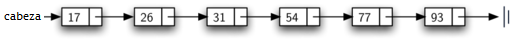
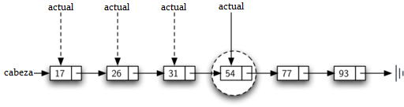
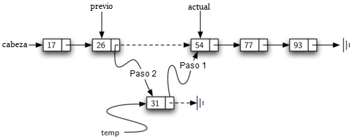

..  Copyright (C)  Brad Miller, David Ranum
    This work is licensed under the Creative Commons Attribution-NonCommercial-ShareAlike 4.0 International License. To view a copy of this license, visit http://creativecommons.org/licenses/by-nc-sa/4.0/.

Implementación de una lista ordenada
~~~~~~~~~~~~~~~~~~~~~~~~~~~~~~~~~~~~

Para implementar la lista ordenada, debemos recordar que las posiciones relativas de los ítems se basan en alguna característica subyacente. La lista ordenada de números enteros dada anteriormente (17, 26, 31, 54, 77 y 93) puede ser representada por una estructura enlazada como se muestra en la :ref:`Figura 15 <fig_orderlinked>`. De nuevo, la estructura de nodo y enlace es ideal para representar el posicionamiento relativo de los ítems.

.. In order to implement the ordered list, we must remember that the relative positions of the items are based on some underlying characteristic. The ordered list of integers given above (17, 26, 31, 54, 77, and 93) can be represented by a linked structure as shown in :ref:`Figure 15 <fig_orderlinked>`. Again, the node and link structure is ideal for representing the relative positioning of the items.

.. _fig_orderlinked:

   Figura 15: Una lista enlazada ordenada

   Figura 15: Una lista enlazada ordenada

Para implementar la clase ``ListaOrdenada``, usaremos la misma técnica que se vio anteriormente con las listas no ordenadas. Una vez más, una lista vacía será denotada por una referencia ``cabeza`` a ``None`` (ver el :ref:`Programa 8 <lst_orderlist>`).

.. To implement the ``ListaOrdenada`` class, we will use the same technique as seen previously with unordered lists. Once again, an empty list will be denoted by a ``cabeza`` reference to ``None`` (see :ref:`Listing 8 <lst_orderlist>`).

.. _lst_orderlist:

**Programa 8**

::

    class ListaOrdenada:
        def __init__(self):
            self.cabeza = None

A medida que consideramos las operaciones de la lista ordenada, debemos tener en cuenta que los métodos ``estaVacia`` y ``tamano`` se pueden implementar de la misma manera que con las listas no ordenadas ya que sólo tratan con el número de nodos de la lista sin considerar los valores reales del ítem. Del mismo modo, el método ``remover`` funcionará bien, ya que todavía necesitamos encontrar el ítem y luego enlazar alrededor del nodo para eliminarlo. Los dos métodos restantes, ``buscar`` y ``agregar``, requerirán alguna modificación.

.. As we consider the operations for the ordered list, we should note that the ``estaVacia`` and ``size`` methods can be implemented the same as with unordered lists since they deal only with the number of nodes in the list without regard to the actual item values. Likewise, the ``remove`` method will work just fine since we still need to find the item and then link around the node to remove it. The two remaining methods, ``buscar`` and ``agregar``, will require some modification.

La búsqueda en una lista enlazada no ordenada requería que recorriéramos los nodos de uno en uno hasta encontrar el ítem que buscábamos o quedarnos sin nodos (``None``). Resulta que el mismo enfoque realmente funciona con la lista ordenada y de hecho, en el caso en que encontramos el ítem, es exactamente lo que necesitamos. Sin embargo, en el caso en que el ítem no esté en la lista, podemos aprovechar el ordenamiento para detener la búsqueda tan pronto como sea posible.

.. The search of an unordered linked list required that we traverse the nodes one at a time until we either find the item we are looking for or run out of nodes (``None``). It turns out that the same approach would actually work with the ordered list and in fact in the case where we find the item it is exactly what we need. However, in the case where the item is not in the list, we can take advantage of the ordering to stop the search as soon as possible.

Por ejemplo, la :ref:`Figura 16 <fig_stopearly>` muestra la lista enlazada ordenada a medida que se busca el valor 45. A medida que avanzamos, comenzando en la cabeza de la lista, primero comparamos contra 17. Dado que 17 no es el ítem que estamos buscando, nos movemos al siguiente nodo, en este caso 26. De nuevo, éste valor no es el que queremos, así que pasamos a 31 y luego a 54. Ahora, en este punto, algo es diferente. Puesto que 54 no es el ítem que buscamos, nuestra estrategia anterior sería seguir adelante. Sin embargo, debido al hecho de que se trata de una lista ordenada, continuar ya no será necesario. Una vez que el valor en el nodo sea mayor que el ítem que estamos buscando, la búsqueda puede detenerse y devolver ``False``. No hay manera de que el ítem pueda existir más adelante en la lista enlazada.

.. For example, :ref:`Figure 16 <fig_stopearly>` shows the ordered linked list as a search is looking for the value 45. As we traverse, starting at the head of the list, we first compare against 17. Since 17 is not the item we are looking for, we move to the next node, in this case 26. Again, this is not what we want, so we move on to 31 and then on to 54. Now, at this point, something is different. Since 54 is not the item we are looking for, our former strategy would be to move forward. However, due to the fact that this is an ordered list, that will not be necessary. Once the value in the node becomes greater than the item we are searching for, the search can stop and return ``False``. There is no way the item could exist further out in the linked list.

.. _fig_stopearly:

   Figura 16: Búsqueda en una lista enlazada ordenada
   
   Figura 16: Búsqueda en una lista enlazada ordenada

El :ref:`Programa 9 <lst_ordersearch>` muestra el método ``buscar`` completo. Es fácil incorporar la nueva condición descrita anteriormente añadiendo otra variable booleana, ``detenerse``, e inicializándola en ``False`` (línea 4). Mientras ``detenerse`` sea ``False`` (no ``detenerse``) podemos seguir buscando hacia adelante en la lista (línea 5). Si se descubre algún nodo que contenga datos mayores que el elemento que estamos buscando, cambiaremos el valor de ``detenerse`` a ``True`` (líneas 9-10). Las líneas restantes son idénticas a la búsqueda en listas no ordenadas.

.. :ref:`Listing 9 <lst_ordersearch>` shows the complete ``buscar`` method. It is easy to incorporate the new condition discussed above by adding another boolean variable, ``detenerse``, and initializing it to ``False`` (line 4). While ``detenerse`` is ``False`` (not ``detenerse``) we can continue to look forward in the list (line 5). If any node is ever discovered that contains data greater than the item we are looking for, we will set ``detenerse`` to ``True`` (lines 9–10). The remaining lines are identical to the unordered list search.

.. _lst_ordersearch:

**Programa 9**

::

    def buscar(self,item):
        actual = self.cabeza
        encontrado = False
        detenerse = False
        while actual != None and not encontrado and not detenerse:
            if actual.obtenerDato() == item:
                encontrado = True
            else:
                if actual.obtenerDato() > item:
                    detenerse = True
                else:
                    actual = actual.obtenerSiguiente()

        return encontrado

La modificación más significativa de un método tendrá lugar en ``agregar``. Recuerde que para las listas no ordenadas, el método ``agregar`` podía simplemente ubicar un nuevo nodo al principio de la lista. Era el punto de acceso más fácil. Desafortunadamente, esto ya no funcionará con listas ordenadas. Ahora es necesario que descubramos el lugar específico donde pertenece un nuevo ítem en la lista ordenada existente.

.. The most significant method modification will take place in ``agregar``. Recall that for unordered lists, the ``agregar`` method could simply place a new node at the head of the list. It was the easiest point of access. Unfortunately, this will no longer work with ordered lists. It is now necessary that we discover the specific place where a new item belongs in the existing ordered list.

Supongamos que tenemos la lista ordenada compuesta por los números 17, 26, 54, 77 y 93 y que queremos agregar el valor 31. El método ``agregar`` debe decidir que el nuevo ítem debe estar entre 26 y 54. La :ref:`Figura 17 <fig_orderinsert>` muestra la configuración que necesitamos. Como explicamos anteriormente, necesitamos recorrer la lista enlazada buscando el lugar donde se agregará el nuevo nodo. Sabemos que hemos encontrado ese lugar cuando nos quedamos sin nodos (``actual`` se convierte en ``None``) o el valor del nodo actual llega a ser mayor que el ítem que deseamos agregar. En nuestro ejemplo, ver el valor 54 nos detendrá.

.. Assume we have the ordered list consisting of 17, 26, 54, 77, and 93 and we want to add the value 31. The ``agregar`` method must decide that the new item belongs between 26 and 54. :ref:`Figure 17 <fig_orderinsert>` shows the setup that we need. As we explained earlier, we need to traverse the linked list looking for the place where the new node will be added. We know we have found that place when either we run out of nodes (``current`` becomes ``None``) or the value of the current node becomes greater than the item we wish to add. In our example, seeing the value 54 causes us to stop.

.. _fig_orderinsert:

   Figura 17: Agregar un ítem a una lista enlazada ordenada
   
   Figura 17: Agregar un ítem a una lista enlazada ordenada

Como vimos con las listas no ordenadas, es necesario tener una referencia adicional, nuevamente llamada ``previo``, ya que ``actual`` no proporcionará acceso al nodo que se debe modificar. El :ref:`Programa 10 <lst_orderadd>` muestra el método ``agregar`` completo. Las líneas 2-3 establecen las dos referencias externas y las líneas 9-10 de nuevo permiten que ``previo`` siga un nodo detrás de ``actual`` cada vez a través de las iteraciones. La condición (línea 5) permite que la iteración continúe mientras haya más nodos y el valor en el nodo actual no sea mayor que el ítem. En cualquier caso, cuando la iteración falla, hemos encontrado la ubicación para el nuevo nodo.

.. As we saw with unordered lists, it is necessary to have an additional reference, again called ``previous``, since ``current`` will not provide access to the node that must be modified. :ref:`Listing 10 <lst_orderadd>` shows the complete ``agregar`` method. Lines 2–3 set up the two external references and lines 9–10 again allow ``previous`` to follow one node behind ``current`` every time through the iteration. The condition (line 5) allows the iteration to continue as long as there are more nodes and the value in the current node is not larger than the item. In either case, when the iteration fails, we have found the location for the new node.

La parte restante del método completa el proceso de dos pasos que se muestra en la :ref:`Figura 17 <fig_orderinsert>`. Una vez que se ha creado un nuevo nodo para el ítem, la única pregunta restante es si el nuevo nodo se agregará al principio de la lista enlazada o en algún lugar intermedio. De nuevo, ``previo == None`` (línea 13) puede utilizarse para proporcionar la respuesta.

.. The remainder of the method completes the two-step process shown in :ref:`Figure 17 <fig_orderinsert>`. Once a new node has been created for the item, the only remaining question is whether the new node will be added at the beginning of the linked list or some place in the middle. Again, ``previo == None`` (line 13) can be used to provide the answer.

.. _lst_orderadd:

**Programa 10**

::

    def agregar(self,item):
        actual = self.cabeza
        previo = None
        detenerse = False
        while actual != None and not detenerse:
            if actual.obtenerDato() > item:
                detenerse = True
            else:
                previo = actual
                actual = actual.obtenerSiguiente()

        temp = Nodo(item)
        if previo == None:
            temp.asignarSiguiente(self.cabeza)
            self.cabeza = temp
        else:
            temp.asignarSiguiente(actual)
            previo.asignarSiguiente(temp)
   
La clase ``ListaOrdenada`` con los métodos discutidos hasta ahora están en el ActiveCode 1. Dejamos los métodos restantes como ejercicios. Usted debe considerar cuidadosamente si las implementaciones no ordenadas funcionarán dado que la lista ahora está ordenada.
         
.. The ``ListaOrdenada`` class with methods discussed thus far can be found in ActiveCode 1. We leave the remaining methods as exercises. You should carefully consider whether the unordered implementations will work given that the list is now ordered.

.. activecode:: orderedlistclass
   :caption: Clase ListaOrdenada hasta ahora
   :hidecode:
   :nocodelens:
   
   class Nodo:
       def __init__(self,datoInicial):
           self.dato = datoInicial
           self.siguiente = None

       def obtenerDato(self):
           return self.dato

       def obtenerSiguiente(self):
           return self.siguiente

       def asignarDato(self,nuevodato):
           self.dato = nuevodato

       def asignarSiguiente(self,nuevosiguiente):
           self.siguiente = nuevosiguiente

   class ListaOrdenada:
       def __init__(self):
           self.cabeza = None

       def buscar(self,item):
           actual = self.cabeza
           encontrado = False
           detenerse = False
           while actual != None and not encontrado and not detenerse:
               if actual.obtenerDato() == item:
                   encontrado = True
               else:
                   if actual.obtenerDato() > item:
                       detenerse = True
                   else:
                       actual = actual.obtenerSiguiente()

           return encontrado

       def agregar(self,item):
           actual = self.cabeza
           previo = None
           detenerse = False
           while actual != None and not detenerse:
               if actual.obtenerDato() > item:
                   detenerse = True
               else:
                   previo = actual
                   actual = actual.obtenerSiguiente()

           temp = Nodo(item)
           if previo == None:
               temp.asignarSiguiente(self.cabeza)
               self.cabeza = temp
           else:
               temp.asignarSiguiente(actual)
               previo.asignarSiguiente(temp)       

       def estaVacia(self):
           return self.cabeza == None

       def tamano(self):
           actual = self.cabeza
           contador = 0
           while actual != None:
               contador = contador + 1
               actual = actual.obtenerSiguiente()

           return contador

   milista = ListaOrdenada()
   milista.agregar(31)
   milista.agregar(77)
   milista.agregar(17)
   milista.agregar(93)
   milista.agregar(26)
   milista.agregar(54)

   print(milista.tamano())
   print(milista.buscar(93))
   print(milista.buscar(100))
   
   

Análisis de las listas enlazadas
^^^^^^^^^^^^^^^^^^^^^^^^^^^^^^^^

Para analizar la complejidad de las operaciones de lista enlazadas, necesitamos considerar si se requiere recorrerlas. Considere una lista enlazada que tiene *n* nodos. El método ``estaVacia`` es :math:`O(1)` ya que requiere un paso para comprobar si la referencia de la cabeza es ``None``. ``tamano``, por otro lado, siempre requerirá *n* pasos ya que no hay forma de saber cuántos nodos hay en la lista enlazada sin recorrerla desde la cabeza hasta el final. Por lo tanto, ``tamano`` es :math:`O(n)`. Agregar un ítem a una lista no ordenada siempre será :math:`O(1)` ya que simplemente colocamos el nuevo nodo en la cabeza de la lista enlazada. Sin embargo, ``buscar`` y ``remover``, así como ``agregar`` para una lista ordenada, requieren el proceso de recorrido. Aunque en promedio pueden necesitar recorrer sólo la mitad de los nodos, estos métodos son todos :math:`O(n)` ya que en el peor de los casos procesarán cada nodo de la lista.

.. To analyze the complexity of the linked list operations, we need to consider whether they require traversal. Consider a linked list that has *n* nodes. The ``estaVacia`` method is :math:`O(1)` since it requires one step to check the head reference for ``None``. ``size``, on the other hand, will always require *n* steps since there is no way to know how many nodes are in the linked list without traversing from head to end. Therefore, ``length`` is :math:`O(n)`. Adding an item to an unordered list will always be O(1) since we simply place the new node at the head of the linked list. However, ``buscar`` and ``remove``, as well as ``agregar`` for an ordered list, all require the traversal process. Although on average they may need to traverse only half of the nodes, these methods are all :math:`O(n)` since in the worst case each will process every node in the list.

Quizás usted también haya notado que el desempeño de esta implementación difiere del desempeño real dado anteriormente para las listas de Python. Esto sugiere que las listas enlazadas no son la forma en que se implementan las listas de Python. La implementación real de una lista de Python se basa en la noción de una matriz. Discutiremos esto con más detalle en el Capítulo 8.

.. You may also have noticed that the performance of this implementation differs from the actual performance given earlier for Python lists. This suggests that linked lists are not the way Python lists are implemented. The actual implementation of a Python list is based on the notion of an array.  We discuss this in more detail in Chapter 8.
