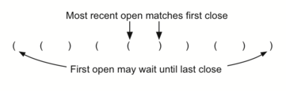

..  Copyright (C)  Brad Miller, David Ranum
    This work is licensed under the Creative Commons Attribution-NonCommercial-ShareAlike 4.0 International License. To view a copy of this license, visit http://creativecommons.org/licenses/by-nc-sa/4.0/.

Paréntesis balanceados
~~~~~~~~~~~~~~~~~~~~~~

Ahora dirigimos nuestra atención a usar pilas para resolver problemas reales de ciencias de la computación. Usted no tiene duda alguna respecto a expresiones aritméticas escritas tales como

.. We now turn our attention to using stacks to solve real computer science problems. You have no doubt written arithmetic expressions such as

:math:`(5+6)*(7+8)/(4+3)`

donde se utilizan paréntesis para ordenar la aplicación de las operaciones. También puede tener alguna experiencia de programación en un lenguaje como Lisp con instrucciones como

.. where parentheses are used to order the performance of operations. You may also have some experience programming in a language such as Lisp with constructs like

::

    (defun cuadrado(n)
         (* n n))

Esto define una función llamada ``cuadrado`` que devolverá el cuadrado de su argumento ``n``. Lisp es notorio por usar muchísimos paréntesis.

.. This defines a function called ``cuadrado`` that will return the square of its argument ``n``. Lisp is notorious for using lots and lots of parentheses.

En ambos ejemplos, los paréntesis deben aparecer de forma balanceada. Que los paréntesis estén balanceados significa que cada símbolo de apertura tiene un símbolo de cierre correspondiente y que los paréntesis están apropiadamente anidados. Considere las siguientes cadenas de paréntesis correctamente balanceados:

.. In both of these examples, parentheses must appear in a balanced fashion. **Balanced parentheses** means that each opening symbol has a corresponding closing symbol and the pairs of parentheses are properly nested. Consider the following correctly balanced strings of parentheses:

::

    (()()()())

    (((())))

    (()((())()))

Compare aquéllas con las siguientes, que no están balanceadas:

.. Compare those with the following, which are not balanced:

::

    ((((((())

    ()))

    (()()(()

La capacidad de diferenciar entre paréntesis que están correctamente balanceados y aquellos que están desbalanceados es una parte importante del reconocimiento de muchas estructuras de lenguajes de programación.

.. The ability to differentiate between parentheses that are correctly balanced and those that are unbalanced is an important part of recognizing many programming language structures.

El reto entonces es escribir un algoritmo que lea una cadena de paréntesis de izquierda a derecha y que decida si los símbolos están balanceados. Para resolver este problema necesitamos hacer una observación importante. A medida que usted procesa los símbolos de izquierda a derecha, el paréntesis de apertura más reciente debe coincidir con el siguiente símbolo de cierre (ver la :ref:`Figura 4 <fig_parmatch>`). Además, el primer símbolo de apertura procesado podría tener que esperar hasta que aparezca el último símbolo de cierre. Los símbolos de cierre coinciden con los símbolos de apertura en el orden inverso de su aparición; ellos coinciden de adentro hacia afuera. Ésta es una pista de que las pilas se pueden usar para resolver el problema.

.. The challenge then is to write an algorithm that will read a string of parentheses from left to right and decide whether the symbols are balanced. To solve this problem we need to make an important observation. As you process symbols from left to right, the most recent opening parenthesis must match the next closing symbol (see :ref:`Figure 4 <fig_parmatch>`). Also, the first opening symbol processed may have to wait until the very last symbol for its match. Closing symbols match opening symbols in the reverse order of their appearance; they match from the inside out. This is a clue that stacks can be used to solve the problem.

.. _fig_parmatch:

   Figura 4: Coincidencia de paréntesis

   Figura 4: Coincidencia de paréntesis

Una vez que usted acepta que una pila es la estructura de datos apropiada para almacenar los paréntesis, la declaración del algoritmo es sencilla. Comenzando con una pila vacía, se procesan las cadenas de paréntesis de izquierda a derecha. Si el símbolo es un paréntesis de apertura, incluirlo en la pila como señal de que el correspondiente paréntesis de cierre debe aparecer posteriormente. Si, por otro lado, un símbolo es un paréntesis de cierre, hacer una extracción de la pila. Los paréntesis continúan balanceados mientras sea posible extraer de la pila para emparejar cada símbolo de cierre. Si en cualquier momento no hay símbolo de apertura en la pila para emparejar un símbolo de cierre, la cadena no está balanceada apropiadamente. Al final de la cadena, cuando todos los símbolos hayan sido procesados, la pila debería estar vacía. El código en Python para implementar este algoritmo se muestra en el :ref:`ActiveCode 1 <lst_parcheck1>`.

.. Once you agree that a stack is the appropriate data structure for keeping the parentheses, the statement of the algorithm is straightforward. Starting with an empty stack, process the parenthesis strings from left to right. If a symbol is an opening parenthesis, push it on the stack as a signal that a corresponding closing symbol needs to appear later. If, on the other hand, a symbol is a closing parenthesis, pop the stack. As long as it is possible to pop the stack to match every closing symbol, the parentheses remain balanced. If at any time there is no opening symbol on the stack to match a closing symbol, the string is not balanced properly. At the end of the string, when all symbols have been processed, the stack should be empty. The Python code to implement this algorithm is shown in :ref:`ActiveCode 1 <lst_parcheck1>`.

.. _lst_parcheck1:

.. activecode:: parcheck1
    :caption: Solución del problema de los paréntesis balanceados
    :nocodelens:

    from pythoned.basicas.pila import Pila

    def verificarParentesis(cadenaSimbolos):
        p = Pila()
        balanceados = True
        indice = 0
        while indice < len(cadenaSimbolos) and balanceados:
            simbolo = cadenaSimbolos[indice]
            if simbolo == "(":
                p.incluir(simbolo)
            else:
                if p.estaVacia():
                    balanceados = False
                else:
                    p.extraer()

            indice = indice + 1

        if balanceados and p.estaVacia():
            return True
        else:
            return False

    print(verificarParentesis('((()))'))
    print(verificarParentesis('(()'))

Esta función, ``verificarParentesis``, asume que una clase ``Pila`` está disponible y devuelve un resultado booleano en cuanto a si la cadena de paréntesis está balanceada. Tenga en cuenta que la variable booleana ``balanceados`` se inicializa en ``True``, ya que al principio no hay razón para suponer lo contrario. Si el símbolo actual es ``(``, entonces éste se incluye en la pila (líneas 9-10) .Note también en la línea 15 que ``extraer`` simplemente elimina un símbolo de la pila. El valor devuelto no se utiliza ya que sabemos que debe ser un símbolo de apertura visto anteriormente. Al final (líneas 19-22), siempre y cuando la expresión esté balanceada y la pila haya sido vaciada completamente, la cadena representa una secuencia de paréntesis correctamente balanceada.

.. This function, ``parChecker``, assumes that a ``Stack`` class is available and returns a boolean result as to whether the string of parentheses is balanced. Note that the boolean variable ``balanced`` is initialized to ``True`` as there is no reason to assume otherwise at the start. If the current symbol is ``(``, then it is pushed on the stack (lines 9–10). Note also in line 15 that ``pop`` simply removes a symbol from the stack. The returned value is not used since we know it must be an opening symbol seen earlier. At the end (lines 19–22), as long as the expression is balanced and the stack has been completely cleaned off, the string represents a correctly balanced sequence of parentheses.
