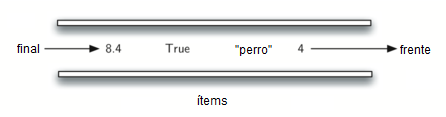

..  Copyright (C)  Brad Miller, David Ranum
    This work is licensed under the Creative Commons Attribution-NonCommercial-ShareAlike 4.0 International License. To view a copy of this license, visit http://creativecommons.org/licenses/by-nc-sa/4.0/.

¿Qué es una cola?
~~~~~~~~~~~~~~~~~

Una cola es una colección ordenada de ítems donde la adición de nuevos ítems tiene lugar en uno de los extremos, denominado “final”, y la remoción de ítems existentes ocurre en el otro extremo, comúnmente llamado “frente”. Un elemento ingresa a la cola por el final y espera hasta el momento que un ítem sea eliminado para avanzar hacia el frente.

.. A queue is an ordered collection of items where the addition of new items happens at one end, called the “rear,” and the removal of existing items occurs at the other end, commonly called the “front.” As an element enters the queue it starts at the rear and makes its way toward the front, waiting until that time when it is the next element to be removed.

El ítem más recientemente agregado en la cola debe esperar al final de la colección. El ítem que que ha permanecido más tiempo en la colección está en el frente. Este principio de ordenamiento a veces se denomina **FIFO** (**first-in first-out**), también conocido como el primero en llegar es el primero en ser atendido.

.. The most recently added item in the queue must wait at the end of the collection. The item that has been in the collection the longest is at the front. This ordering principle is sometimes called **FIFO**, **first-in first-out**. It is also known as “first-come first-served.”

El ejemplo más simple de una cola es la fila típica en la que todos participamos de vez en cuando. Esperamos en una fila para una película, esperamos en la fila de pago en una tienda de comestibles, y esperamos en la fila de la cafetería (para que podamos extraer de la pila de bandejas). Las filas de buen comportamiento, o colas, son muy restrictivas en el sentido de que sólo tienen un modo de ingresar a ella y una sola salida. No hay saltos en el medio y no es posible salir antes de que se haya esperado la cantidad necesaria de tiempo para llegar al frente. La :ref:`Figura 1 <fig_qubasicqueue>` muestra una cola simple de objetos de datos de Python.

.. The simplest example of a queue is the typical line that we all participate in from time to time. We wait in a line for a movie, we wait in the check-out line at a grocery store, and we wait in the cafeteria line (so that we can pop the tray stack). Well-behaved lines, or queues, are very restrictive in that they have only one way in and only one way out. There is no jumping in the middle and no leaving before you have waited the necessary amount of time to get to the front. :ref:`Figure 1 <fig_qubasicqueue>` shows a simple queue of Python data objects.

.. _fig_qubasicqueue:

   Figura 1: Una cola de objetos de datos de Python

   Figura 1: Una cola de objetos de datos de Python

Las ciencias de la computación también tienen ejemplos comunes de colas. Nuestro laboratorio de computadoras tiene 30 computadoras conectadas en red con una sola impresora. Cuando los estudiantes quieren imprimir, sus tareas de impresión “hacen fila” con todas las otras tareas de impresión que están esperando. La primera tarea es la próxima en ser completada. Si usted es el último en la fila, deberá esperar a que todas las otras tareas se impriman por delante de la suya. Vamos a explorar este interesante ejemplo con más detalle más adelante.

.. Computer science also has common examples of queues. Our computer laboratory has 30 computers networked with a single printer. When students want to print, their print tasks “get in line” with all the other printing tasks that are waiting. The first task in is the next to be completed. If you are last in line, you must wait for all the other tasks to print ahead of you. We will explore this interesting example in more detail later.

Además de las colas de impresión, los sistemas operativos utilizan varias colas diferentes para controlar los procesos dentro de una computadora. La programación de los procesos que se harán a continuación se basa normalmente en un algoritmo de colas que intenta ejecutar programas lo más rápidamente posible y servir a tantos usuarios como pueda. Además, a medida que tecleamos, a veces las pulsaciones de las teclas se adelantan a los caracteres que aparecen en la pantalla. Esto se debe a que la computadora está haciendo otro trabajo en ese momento. Las pulsaciones de teclas se ubican en un búfer de tipo cola para que eventualmente se muestren en la pantalla en el orden correcto.

.. In addition to printing queues, operating systems use a number of different queues to control processes within a computer. The scheduling of what gets done next is typically based on a queuing algorithm that tries to execute programs as quickly as possible and serve as many users as it can. Also, as we type, sometimes keystrokes get ahead of the characters that appear on the screen. This is due to the computer doing other work at that moment. The keystrokes are being placed in a queue-like buffer so that they can eventually be displayed on the screen in the proper order.
