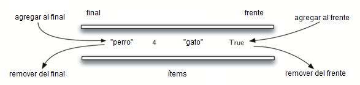

..  Copyright (C)  Brad Miller, David Ranum
    This work is licensed under the Creative Commons Attribution-NonCommercial-ShareAlike 4.0 International License. To view a copy of this license, visit http://creativecommons.org/licenses/by-nc-sa/4.0/.

¿Qué es una cola doble?
~~~~~~~~~~~~~~~~~~~~~~~

Una **cola doble**, también conocida como cola de doble extremo, es una colección ordenada de ítems similar a la cola. Tiene dos extremos, frente y final, y los ítems permanecen posicionados en la colección. Lo que hace a una cola doble diferente es la naturaleza no restringida de las operaciones de agregar y remover ítems. Los ítems nuevos se pueden agregar en el frente o en el final. Del mismo modo, los ítems existentes se pueden eliminar de cualquier extremo. En cierto sentido, esta estructura lineal híbrida proporciona todas las capacidades de las pilas y las colas en una única estructura de datos. La :ref:`Figura 1 <fig_basicdeque>` muestra una cola doble de objetos de datos en Python.

.. A **deque**, also known as a double-ended queue, is an ordered collection of items similar to the queue. It has two ends, a front and a rear, and the items remain positioned in the collection. What makes a deque different is the unrestrictive nature of adding and removing items. New items can be added at either the front or the rear. Likewise, existing items can be removed from either end. In a sense, this hybrid linear structure provides all the capabilities of stacks and queues in a single data structure. :ref:`Figure 1 <fig_basicdeque>` shows a deque of Python data objects.

Es importante tener en cuenta que a pesar que las colas dobles pueden asumir muchas de las características de las pilas y de las colas, ellas no requieren los ordenamientos LIFO y FIFO que son respetados por esas estructuras de datos. Depende de usted hacer un uso consistente de las operaciones agregar y remover.

.. It is important to note that even though the deque can assume many of the characteristics of stacks and queues, it does not require the LIFO and FIFO orderings that are enforced by those data structures. It is up to you to make consistent use of the addition and removal operations.

.. _fig_basicdeque:

   Figura 1: Una cola doble de objetos de datos de Python

   Figura 1: Una cola doble de objetos de datos de Python

