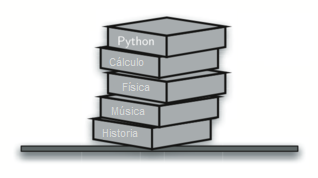
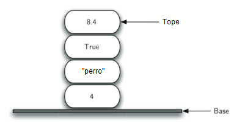

..  Copyright (C)  Brad Miller, David Ranum
    This work is licensed under the Creative Commons Attribution-NonCommercial-ShareAlike 4.0 International License. To view a copy of this license, visit http://creativecommons.org/licenses/by-nc-sa/4.0/.

¿Qué es una pila?
~~~~~~~~~~~~~~~~~

Una **pila** (a veces llamada una “pila *push-down*”) es una colección ordenada de ítems donde la adición de nuevos ítems y la eliminación de ítems existentes siempre tienen lugar en el mismo extremo. Tal extremo se denomina el “tope”. El extremo opuesto se denomina la “base”.

.. A **stack** (sometimes called a “push-down stack”) is an ordered collection of items where the addition of new items and the removal of existing items always takes place at the same end. This end is commonly referred to as the “top.” The end opposite the top is known as the “base.”

La base de la pila es significativa ya que los ítems almacenados en la pila que están más cerca de la base representan aquellos que han permanecido más tiempo en la pila. El ítem más recientemente agregado es el que está en la posición que será eliminada primero. Este principio de ordenamiento a veces se denomina **LIFO**: **último en entrar, primero en salir** (*last-in, first-out*). Éste brinda un ordenamiento basado en el tiempo de permanencia en la colección. Los ítems más nuevos están cerca al tope y los más viejos están más cerca de la base.

.. The base of the stack is significant since items stored in the stack that are closer to the base represent those that have been in the stack the longest. The most recently added item is the one that is in position to be removed first. This ordering principle is sometimes called **LIFO**, **last-in first-out**. It provides an ordering based on length of time in the collection. Newer items are near the top, while older items are near the base.

Muchos ejemplos de pilas se producen en situaciones cotidianas. Casi cualquier cafetería tiene una pila de bandejas o platos donde usted toma la o él que esté en el tope, descubriendo una nueva bandeja o plato para el próximo cliente en la línea. Imagine una pila de libros sobre un escritorio (:ref:`Figura 1 <fig_bookstack>`). El único libro cuya cubierta es visible es el de arriba. Para acceder a otros en la pila, necesitamos eliminar los que están puestos encima de ellos. La :ref:`Figura 2 <fig_objectstack>` muestra otra pila. Ésta contiene una serie de objetos de datos primitivos de Python.

.. Many examples of stacks occur in everyday situations. Almost any cafeteria has a stack of trays or plates where you take the one at the top, uncovering a new tray or plate for the next customer in line. Imagine a stack of books on a desk (:ref:`Figure 1 <fig_bookstack>`). The only book whose cover is visible is the one on top. To access others in the stack, we need to remove the ones that are sitting on top of them. :ref:`Figure 2 <fig_objectstack>` shows another stack. This one contains a number of primitive Python data objects.

.. _fig_bookstack:

   Figura 1: Una pila de libros

   Figura 1: Una pila de libros

.. _fig_objectstack:

   Figura 2: Pila de de objetos primitivos de Python

   Figura 2: Pila de de objetos primitivos de Python

Una de las ideas más útiles relacionadas con las pilas proviene de la simple observación de los ítems a medida que se agregan y se eliminan. Suponga que usted comienza con un escritorio limpio. Ahora coloque los libros, uno a la vez, encima de otro. Usted está construyendo una pila. Considere lo que sucede cuando comienza a quitar libros. El orden en que se eliminan es exactamente el orden inverso en que fueron colocados. Las pilas tienen una importancia fundamental puesto que pueden usarse para invertir el orden de los ítems. El orden de inserción es el inverso del orden de eliminación. La :ref:`Figura 3 <fig_reversal>` muestra el objeto pila tal como fue creado y luego, de nuevo, a medida que los ítems son eliminados. Observe el orden de los objetos.

.. One of the most useful ideas related to stacks comes from the simple observation of items as they are added and then removed. Assume you start out with a clean desktop. Now place books one at a time on top of each other. You are constructing a stack. Consider what happens when you begin removing books. The order that they are removed is exactly the reverse of the order that they were placed. Stacks are fundamentally important, as they can be used to reverse the order of items. The order of insertion is the reverse of the order of removal. :ref:`Figure 3 <fig_reversal>` shows the Python data object stack as it was created and then again as items are removed. Note the order of the objects.

.. _fig_reversal:

.. figure:: Figures/simplereversal.png
   :align: center

   Figura 3: Propiedad de orden inverso en las pilas

   Figura 3: Propiedad de orden inverso en las pilas

Considerando esta propiedad de orden inverso, tal vez usted pueda pensar en ejemplos de pilas que se producen cuando utiliza su computadora. Por ejemplo, todo navegador web tiene un botón Atrás. A medida que usted navega de una página web a otra, esas páginas se ubican en una pila (en realidad, son las URL las que van en la pila). La página que usted está viendo actualmente está en el tope y la primera página que usted miró está en la base. Si usted hace clic en el botón Atrás, comienza a moverse en orden inverso a través de las páginas.

.. Considering this reversal property, you can perhaps think of examples of stacks that occur as you use your computer. For example, every web browser has a Back button. As you navigate from web page to web page, those pages are placed on a stack (actually it is the URLs that are going on the stack). The current page that you are viewing is on the top and the first page you looked at is at the base. If you click on the Back button, you begin to move in reverse order through the pages.
