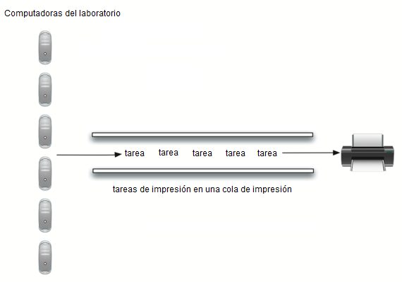

..  Copyright (C)  Brad Miller, David Ranum
    This work is licensed under the Creative Commons Attribution-NonCommercial-ShareAlike 4.0 International License. To view a copy of this license, visit http://creativecommons.org/licenses/by-nc-sa/4.0/.

Simulación: Tareas de impresión
~~~~~~~~~~~~~~~~~~~~~~~~~~~~~~~

Una simulación más interesante nos permite estudiar el comportamiento de la cola de impresión descrita anteriormente en esta sección. Recuerde que a medida que los estudiantes envían tareas de impresión a la impresora compartida, las tareas se ubican en una cola para que se procesen por orden de llegada. Muchas preguntas surgen con esta configuración. La más importante de éstas puede ser si la impresora es capaz de manejar una cierta cantidad de trabajo. Si no puede, los estudiantes estarán esperando demasiado tiempo para imprimir y pueden perder la próxima clase.

.. A more interesting simulation allows us to study the behavior of the printing queue described earlier in this section. Recall that as students send printing tasks to the shared printer, the tasks are placed in a queue to be processed in a first-come first-served manner. Many questions arise with this configuration. The most important of these might be whether the printer is capable of handling a certain amount of work. If it cannot, students will be waiting too long for printing and may miss their next class.

Considere la siguiente situación en un laboratorio de computación. En cualquier día promedio, alrededor de 10 estudiantes están trabajando en el laboratorio a cualquier hora. Estos estudiantes suelen imprimir hasta dos veces durante ese tiempo, y la extensión de estas tareas oscila entre 1 y 20 páginas. La impresora en el laboratorio es vieja, es capaz de procesar 10 páginas por minuto en calidad de borrador. La impresora se puede ajustar para dar una mejor calidad, pero entonces se producen sólo cinco páginas por minuto. La velocidad de impresión más lenta puede hacer que los estudiantes esperen demasiado. ¿Qué tasa de páginas debe utilizarse?

.. Consider the following situation in a computer science laboratory. On any average day about 10 students are working in the lab at any given hour. These students typically print up to twice during that time, and the length of these tasks ranges from 1 to 20 pages. The printer in the lab is older, capable of processing 10 pages per minute of draft quality. The printer could be switched to give better quality, but then it would produce only five pages per minute. The slower printing speed could make students wait too long. What page rate should be used?

Podríamos tomar una decisión al respecto mediante la construcción de una simulación que modele el laboratorio. Necesitaremos construir representaciones para los estudiantes, las tareas de impresión, y la impresora (ver :ref:`Figura 4 <fig_qulabsim>`). A medida que los estudiantes presenten tareas de impresión, las agregamos a una lista de espera, una cola de tareas de impresión conectadas a la impresora. Cuando la impresora completa una tarea, examinará la cola para ver si hay otras tareas pendientes de procesar. Es de interés para nosotros la cantidad promedio de tiempo que los estudiantes esperarán a que sus trabajos sean impresos. Ésta es igual al promedio de tiempo que una tarea espera en la cola.

.. We could decide by building a simulation that models the laboratory. We will need to construct representations for students, printing tasks, and the printer (:ref:`Figure 4 <fig_qulabsim>`). As students submit printing tasks, we will add them to a waiting list, a queue of print tasks attached to the printer. When the printer completes a task, it will look at the queue to see if there are any remaining tasks to process. Of interest for us is the average amount of time students will wait for their papers to be printed. This is equal to the average amount of time a task waits in the queue.

.. _fig_qulabsim:

   Figura 4: Cola de impresión en un laboratorio de ciencias de la computación

   Figura 4: Cola de impresión en un laboratorio de ciencias de la computación

Para modelar esta situación necesitamos usar algunas probabilidades. Por ejemplo, los estudiantes pueden imprimir un trabajo que tenga de 1 a 20 páginas de longitud. Si cada longitud de 1 a 20 es igualmente probable, la longitud real para una tarea de impresión se puede simular utilizando un número aleatorio entre 1 y 20 inclusive. Esto significa que hay igual probabilidad de que aparezca cualquier longitud de 1 a 20.

.. To model this situation we need to use some probabilities. For example, students may print a paper from 1 to 20 pages in length. If each length from 1 to 20 is equally likely, the actual length for a print task can be simulated by using a random number between 1 and 20 inclusive. This means that there is equal chance of any length from 1 to 20 appearing.

Si hay 10 estudiantes en el laboratorio y cada uno imprime dos veces, entonces en promedio hay 20 tareas de impresión por hora. ¿Cuál es la probabilidad de que, en un segundo determinado, se vaya a crear una tarea de impresión? El modo para responder a esto es considerar la proporción entre tareas y tiempo. Veinte tareas por hora significa que en promedio habrá una tarea cada 180 segundos:

.. If there are 10 students in the lab and each prints twice, then there are 20 print tasks per hour on average. What is the chance that at any given second, a print task is going to be created? The way to answer this is to consider the ratio of tasks to time. Twenty tasks per hour means that on average there will be one task every 180 seconds:

:math:`\frac {20\ tareas}{1\ hora} \times \frac {1\ hora}  {60\ minutos} \times \frac {1\ minuto} {60\ segundos}=\frac {1\ tarea} {180\ segundos}`

Por cada segundo podemos simular la posibilidad de que se produzca una tarea de impresión generando un número aleatorio entre 1 y 180 inclusive. Si el número es 180, decimos que se ha creado una tarea. Tenga en cuenta que es posible que muchas tareas se creen una tras otra o quizás debamos esperar un buen rato para que aparezca una tarea. Ésa es la naturaleza de la simulación. Usted desea simular la situación real de la manera más cercana posible dado que conoce los parámetros generales.

.. For every second we can simulate the chance that a print task occurs by generating a random number between 1 and 180 inclusive. If the number is 180, we say a task has been created. Note that it is possible that many tasks could be created in a row or we may wait quite a while for a task to appear. That is the nature of simulation. You want to simulate the real situation as closely as possible given that you know general parameters.

Pasos principales de la simulación
^^^^^^^^^^^^^^^^^^^^^^^^^^^^^^^^^^

Aquí está la simulación principal.

.. Here is the main simulation.

#. Crear una cola de tareas de impresión. A cada tarea se le dará una marca de tiempo (``marcaTiempo``) a su llegada. La cola está vacía al comenzar.

#. Para cada segundo (``segundoActual``):

   -  ¿Se creó una nueva tarea de impresión? Si es así, agregarla a la cola con ``segundoActual`` como la marca de tiempo.

   -  Si la impresora no está ocupada y si una tarea está esperando,

      -  Extraer la siguiente tarea de la cola de impresión y asignarla a la impresora.

      -  Restar ``marcaTiempo`` de ``segundoActual`` para calcular el tiempo de espera para esa tarea.

      -  Añadir el tiempo de espera para esa tarea a una lista para su procesamiento posterior.

      -  Con base en el número de páginas en la tarea de impresión, averigüe cuánto tiempo se requerirá.

   -  La impresora ejecuta un segundo de impresión si es necesario. También resta un segundo del tiempo requerido para esa tarea.

   -  Si la tarea se ha completado, en otras palabras, el tiempo requerido ha llegado a cero, la impresora ya no está ocupada.

#. Una vez completada la simulación, calcule el tiempo de espera promedio usando la lista de tiempos de espera generados.

Implementación en Python
^^^^^^^^^^^^^^^^^^^^^^^^

Para diseñar esta simulación crearemos clases para los tres objetos del mundo real descritos anteriormente: ``Impresora``, ``Tarea`` y ``colaImpresion``.

.. To design this simulation we will create classes for the three real-world objects described above: ``Printer``, ``Task``, and ``PrintQueue``.

La clase ``Impresora`` (ver el :ref:`Programa 2 <lst_printer>`) tendrá que verificar si tiene una tarea actual. Si así es, entonces está ocupada (líneas 13-17) y la cantidad de tiempo necesario se puede calcular a partir del número de páginas de la tarea. El constructor también permitirá que se inicialice la característica de número de páginas por minuto. El método ``tictac`` disminuye el temporizador interno y pone la impresora en disponible (línea 11) si la tarea se ha completado.

.. The ``Printer`` class (:ref:`Listing 2 <lst_printer>`) will need to track whether it has a current task. If it does, then it is busy (lines 13–17) and the amount of time needed can be computed from the number of pages in the task. The constructor will also allow the pages-per-minute setting to be initialized. The ``tick`` method decrements the internal timer and sets the printer to idle (line 11) if the task is completed.

.. _lst_printer:

**Programa 2**

.. highlight:: python
    :linenothreshold: 5

::

   class Impresora:
       def __init__(self, paginas):
           self.tasaPaginas = paginas
           self.tareaActual = None
           self.tiempoRestante = 0

       def tictac(self):
           if self.tareaActual != None:
               self.tiempoRestante = self.tiempoRestante - 1
               if self.tiempoRestante == 0:
                   self.tareaActual = None

       def ocupada(self):
           if self.tareaActual != None:
               return True
           else:
               return False

       def iniciarNueva(self,nuevaTarea):
           self.tareaActual = nuevaTarea
           self.tiempoRestante = nuevaTarea.obtenerPaginas() \
           * 60/self.tasaPaginas

                                
.. highlight:: python
    :linenothreshold: 500

La clase Tarea (ver el :ref:`Programa 3 <lst_task>`) representará una sola tarea de impresión. Cuando se crea la tarea, un generador de números aleatorios proporcionará un número entre 1 y 20 que corresponderá al número de páginas del trabajo. Hemos elegido utilizar la función ``randrange`` del módulo ``random``.

.. The Task class (:ref:`Listing 3 <lst_task>`) will represent a single printing task. When the task is created, a random number generator will provide a length from 1 to 20 pages. We have chosen to use the ``randrange`` function from the ``random`` module.

::

    >>> import random
    >>> random.randrange(1,21)
    18
    >>> random.randrange(1,21)
    8
    >>> 

Cada tarea también tendrá que mantener una marca de tiempo que se utilizará para calcular el tiempo de espera. Esta marca de tiempo representará la hora en que se creó la tarea y se colocó en la cola de impresión. El método ``tiempoEspera`` puede utilizarse para obtener la cantidad de tiempo que la tarea pasó en la cola antes de que comience su impresión.

.. Each task will also need to keep a timestamp to be used for computing waiting time. This timestamp will represent the time that the task was created and placed in the printer queue. The ``waitTime`` method can then be used to retrieve the amount of time spent in the queue before printing begins.

.. _lst_task:

**Programa 3**

.. sourcecode:: python

   import random

   class Tarea:
       def __init__(self,tiempo):
           self.marcaTiempo = tiempo
           self.paginas = random.randrange(1,21)

       def obtenerMarca(self):
           return self.marcaTiempo

       def obtenerPaginas(self):
           return self.paginas

       def tiempoEspera(self, tiempoActual):
           return tiempoActual - self.marcaTiempo

La simulación principal (ver el :ref:`Programa 4 <lst_qumainsim>`) implementa el algoritmo descrito anteriormente. El objeto ``colaImpresion`` es una instancia de nuestro TAD Cola existente. Una función auxiliar booleana, ``nuevaTareaImpresion``, decide si se ha creado una nueva tarea de impresión. De nuevo, hemos elegido utilizar la función ``randrange`` del módulo ``random`` para devolver un número entero aleatorio entre 1 y 180. Las tareas de impresión aparecen una vez cada 180 segundos. Podemos simular este evento aleatorio eligiendo arbitrariamente 180 de entre el rango de enteros aleatorios (línea 32). La función de simulación nos permite ajustar el tiempo total y la tasa de páginas por minuto de la impresora.

.. The main simulation (:ref:`Listing 4 <lst_qumainsim>`) implements the algorithm described above. The ``printQueue`` object is an instance of our existing queue ADT. A boolean helper function, ``newPrintTask``, decides whether a new printing task has been created. We have again chosen to use the ``randrange`` function from the ``random`` module to return a random integer between 1 and 180. Print tasks arrive once every 180 seconds. By arbitrarily choosing 180 from the range of random integers (line 32), we can simulate this random event. The simulation function allows us to set the total time and the pages per minute for the printer.

.. highlight:: python
    :linenothreshold: 5

.. _lst_qumainsim:

**Programa 4**

.. code-block:: python

   import random

   from pythoned.basicas.cola import Cola

   def simulacion(numeroSegundos, paginasPorMinuto):

       impresoraLaboratorio = Impresora(paginasPorMinuto)
       colaImpresion = Cola()
       tiemposEspera = []

       for segundoActual in range(numeroSegundos):

         if nuevaTareaImpresion():
            tarea = Tarea(segundoActual)
            colaImpresion.agregar(tarea)

         if (not impresoraLaboratorio.ocupada()) and \
                   (not colaImpresion.estaVacia()):
           tareaSiguiente = colaImpresion.avanzar()
           tiemposEspera.append(tareaSiguiente.tiempoEspera(segundoActual))
           impresoraLaboratorio.iniciarNueva(tareaSiguiente)

         impresoraLaboratorio.tictac()

       esperaPromedio=sum(tiemposEspera)/float(len(tiemposEspera))
       print("Tiempo de espera promedio%6.2f segundos %3d tareas restantes."%(esperaPromedio, colaImpresion.tamano()))

   def nuevaTareaImpresion():
       numero = random.randrange(1,181)
       if numero == 180:
           return True
       else:
           return False

   for i in range(10):
       simulacion(3600,5)
       
.. highlight:: python
   :linenothreshold: 500

Cuando ejecutamos la simulación, no debemos preocuparnos de que los resultados sean diferentes cada vez. Esto se debe a la naturaleza probabilística de los números aleatorios. Estamos interesados en las tendencias que pueden estar ocurriendo a medida que se ajustan los parámetros de la simulación. Estos son algunos resultados.

.. When we run the simulation, we should not be concerned that the results are different each time. This is due to the probabilistic nature of the random numbers. We are interested in the trends that may be occurring as the parameters to the simulation are adjusted. Here are some results.

En primer lugar, ejecutaremos la simulación durante un período de 60 minutos (3.600 segundos) utilizando una tasa de páginas de cinco páginas por minuto. Además, ejecutaremos 10 ejecuciones independientes. Recuerde que debido a que la simulación funciona con números aleatorios, cada ejecución retornará resultados diferentes.

.. First, we will run the simulation for a period of 60 minutes (3,600 seconds) using a page rate of five pages per minute. In addition, we will run 10 independent trials. Remember that because the simulation works with random numbers each run will return different results.

::

    >>>for i in range(10):
          simulacion(3600,5)

    Tiempo de espera promedio 165.38 segundos 2 tareas restantes.
    Tiempo de espera promedio  95.07 segundos 1 tareas restantes.
    Tiempo de espera promedio  65.05 segundos 2 tareas restantes.
    Tiempo de espera promedio  99.74 segundos 1 tareas restantes.
    Tiempo de espera promedio  17.27 segundos 0 tareas restantes.
    Tiempo de espera promedio 239.61 segundos 5 tareas restantes.
    Tiempo de espera promedio  75.11 segundos 1 tareas restantes.
    Tiempo de espera promedio  48.33 segundos 0 tareas restantes.
    Tiempo de espera promedio  39.31 segundos 3 tareas restantes.
    Tiempo de espera promedio 376.05 segundos 1 tareas restantes.

Después de ejecutar nuestros 10 ensayos podemos ver que la media de tiempos de espera promedio es 122.09 segundos. Usted también puede ver que hay una gran variación en el tiempo de espera promedio con un promedio mínimo de 17,27 segundos y un máximo de 376,05 segundos. También puede observar que en sólo dos de los casos todas las tareas fueron completadas.

.. After running our 10 trials we can see that the mean average wait time is 122.09 seconds. You can also see that there is a large variation in the average weight time with a minimum average of 17.27 seconds and a maximum of 376.05 seconds. You may also notice that in only two of the cases were all the tasks completed.

Ahora, vamos a ajustar la tasa de páginas a 10 páginas por minuto, y ejecutaremos de nuevo los 10 ensayos, con una tasa de páginas más rápida nuestra esperanza es que más tareas se completarán en el espacio de una hora.

.. Now, we will adjust the page rate to 10 pages per minute, and run the 10 trials again, with a faster page rate our hope would be that more tasks would be completed in the one hour time frame.

::

    >>>for i in range(10):
          simulacion(3600,10)

    Tiempo de espera promedio   1.29 segundos 0 tareas restantes.
    Tiempo de espera promedio   7.00 segundos 0 tareas restantes.
    Tiempo de espera promedio  28.96 segundos 1 tareas restantes.
    Tiempo de espera promedio  13.55 segundos 0 tareas restantes.
    Tiempo de espera promedio  12.67 segundos 0 tareas restantes.
    Tiempo de espera promedio   6.46 segundos 0 tareas restantes.
    Tiempo de espera promedio  22.33 segundos 0 tareas restantes.
    Tiempo de espera promedio  12.39 segundos 0 tareas restantes.
    Tiempo de espera promedio   7.27 segundos 0 tareas restantes.
    Tiempo de espera promedio  18.17 segundos 0 tareas restantes.
    

Usted puede ejecutar la simulación por sí mismo en el ActiveCode 2.
    
.. You can run the simulation for yourself in ActiveCode 2.

.. activecode:: qumainsim
   :caption: Simulación de la cola de una impresora
   :nocodelens:

   from pythoned.basicas.cola import Cola

   import random
   
   class Impresora:
       def __init__(self, paginas):
           self.tasaPaginas = paginas
           self.tareaActual = None
           self.tiempoRestante = 0

       def tictac(self):
           if self.tareaActual != None:
               self.tiempoRestante = self.tiempoRestante - 1
               if self.tiempoRestante == 0:
                   self.tareaActual = None

       def ocupada(self):
           if self.tareaActual != None:
               return True
           else:
               return False

       def iniciarNueva(self,nuevaTarea):
           self.tareaActual = nuevaTarea
           self.tiempoRestante = nuevaTarea.obtenerPaginas() \
           * 60/self.tasaPaginas

   class Tarea:
       def __init__(self,tiempo):
           self.marcaTiempo = tiempo
           self.paginas = random.randrange(1,21)

       def obtenerMarca(self):
           return self.marcaTiempo

       def obtenerPaginas(self):
           return self.paginas

       def tiempoEspera(self, tiempoActual):
           return tiempoActual - self.marcaTiempo

   def simulacion(numeroSegundos, paginasPorMinuto):

       impresoraLaboratorio = Impresora(paginasPorMinuto)
       colaImpresion = Cola()
       tiemposEspera = []

       for segundoActual in range(numeroSegundos):

         if nuevaTareaImpresion():
            tarea = Tarea(segundoActual)
            colaImpresion.agregar(tarea)

         if (not impresoraLaboratorio.ocupada()) and \
                   (not colaImpresion.estaVacia()):
           tareaSiguiente = colaImpresion.avanzar()
           tiemposEspera.append(tareaSiguiente.tiempoEspera(segundoActual))
           impresoraLaboratorio.iniciarNueva(tareaSiguiente)

         impresoraLaboratorio.tictac()

       esperaPromedio=sum(tiemposEspera)/float(len(tiemposEspera))
       print("Tiempo de espera promedio%6.2f segundos %3d tareas restantes."%(esperaPromedio, colaImpresion.tamano()))

   def nuevaTareaImpresion():
       numero = random.randrange(1,181)
       if numero == 180:
           return True
       else:
           return False

   for i in range(10):
       simulacion(3600,5)

Discusión
^^^^^^^^^
Estábamos tratando de responder a una pregunta acerca de si la impresora actual podría manejar la carga de tareas si fuera ajustada para imprimir con una mejor calidad, pero con una tasa de página más lenta. El enfoque que tomamos fue escribir una simulación que modeló las tareas de impresión como eventos aleatorios de varias longitudes y tiempos de llegada.

.. We were trying to answer a question about whether the current printer could handle the task load if it were set to print with a better quality but slower page rate. The approach we took was to write a simulation that modeled the printing tasks as random events of various lengths and arrival times.

La salida anterior muestra que con una impresión de 5 páginas por minuto, el tiempo de espera promedio varió de un mínimo de 17 segundos a un máximo de 376 segundos (aproximadamente 6 minutos). Con una velocidad de impresión más rápida, el valor bajo fue de 1 segundo, con un máximo de sólo 28. Además, en 8 de cada 10 ejecuciones a 5 páginas por minuto había tareas de impresión que todavía esperaban en la cola al final de la hora.

.. The output above shows that with 5 pages per minute printing, the average waiting time varied from a low of 17 seconds to a high of 376 seconds (about 6 minutes). With a faster printing rate, the low value was 1 second with a high of only 28. In addition, in 8 out of 10 runs at 5 pages per minute there were print tasks still waiting in the queue at the end of the hour.

Por lo tanto, tal vez estamos convencidos de que la desaceleración de la impresora para obtener una mejor calidad no es una buena idea. Los estudiantes no pueden darse el lujo de esperar tanto por sus trabajos, especialmente cuando tienen que estar pasando a su próxima clase. Una espera de seis minutos sería simplemente demasiado larga.

.. Therefore, we are perhaps persuaded that slowing the printer down to get better quality may not be a good idea. Students cannot afford to wait that long for their papers, especially when they need to be getting on to their next class. A six-minute wait would simply be too long.

Este tipo de análisis de simulación nos permite responder a muchas preguntas, conocidas comúnmente como preguntas de “qué pasaría si”. Todo lo que necesitamos hacer es variar los parámetros utilizados por la simulación y podremos simular cualquier número de comportamientos interesantes. Por ejemplo,

.. This type of simulation analysis allows us to answer many questions, commonly known as “what if” questions. All we need to do is vary the parameters used by the simulation and we can simulate any number of interesting behaviors. For example,

-  ¿Qué pasaría si la matrícula aumenta y el número promedio de estudiantes aumenta en 20?

-  ¿Qué pasa si es sábado y los estudiantes no necesitan ir a clase? ¿Pueden darse el lujo de esperar?

-  ¿Qué pasaría si el tamaño de la tarea de impresión promedio disminuye ya que Python es un lenguaje tan potente que los programas tienden a ser mucho más cortos?

Estas preguntas podrían ser respondidas modificando la simulación anterior. Sin embargo, es importante recordar que la simulación es tan buena como las suposiciones que se usan para construirla. Los datos reales sobre el número de tareas de impresión por hora y el número de estudiantes por hora serán necesarios para construir una simulación robusta.

.. admonition:: Autoevaluación
   
   ¿Cómo modificaría la simulación de la impresora para reflejar un mayor número de estudiantes? Supongamos que el número de estudiantes se duplicó. Usted tendría que hacer algunas suposiciones razonables sobre cómo se compuso esta simulación pero ¿qué cambiaría? Modifique el código. Suponga también que la longitud de la tarea de impresión promedio se redujo a la mitad. Cambie el código para reflejar ese cambio. Por último ¿Cómo parametrizar el número de estudiantes?, en lugar de cambiar el código nos gustaría que el número de estudiantes sea un parámetro de la simulación.

   .. actex:: print_sim_selfcheck
         :nocodelens:

         class Cola:
             def __init__(self):
                 self.items = []

             def estaVacia(self):
                 return self.items == []

             def agregar(self, item):
                 self.items.insert(0,item)

             def avanzar(self):
                 return self.items.pop()

             def tamano(self):
                 return len(self.items)

         import random
   
         class Impresora:
             def __init__(self, paginas):
                 self.tasaPaginas = paginas
                 self.tareaActual = None
                 self.tiempoRestante = 0

             def tictac(self):
                 if self.tareaActual != None:
                     self.tiempoRestante = self.tiempoRestante - 1
                     if self.tiempoRestante == 0:
                         self.tareaActual = None

             def ocupada(self):
                 if self.tareaActual != None:
                     return True
                 else:
                     return False

             def iniciarNueva(self,nuevaTarea):
                 self.tareaActual = nuevaTarea
                 self.tiempoRestante = nuevaTarea.obtenerPaginas() \
                 * 60/self.tasaPaginas

         class Tarea:
             def __init__(self,tiempo):
                 self.marcaTiempo = tiempo
                 self.paginas = random.randrange(1,21)

             def obtenerMarca(self):
                 return self.marcaTiempo

             def obtenerPaginas(self):
                 return self.paginas

             def tiempoEspera(self, tiempoActual):
                 return tiempoActual - self.marcaTiempo

         def simulacion(numeroSegundos, paginasPorMinuto):

             impresoraLaboratorio = Impresora(paginasPorMinuto)
             colaImpresion = Cola()
             tiemposEspera = []

             for segundoActual in range(numeroSegundos):

               if nuevaTareaImpresion():
                  tarea = Tarea(segundoActual)
                  colaImpresion.agregar(tarea)

               if (not impresoraLaboratorio.ocupada()) and \
                         (not colaImpresion.estaVacia()):
                 tareaSiguiente = colaImpresion.avanzar()
                 tiemposEspera.append(tareaSiguiente.tiempoEspera(segundoActual))
                 impresoraLaboratorio.iniciarNueva(tareaSiguiente)

               impresoraLaboratorio.tictac()

             esperaPromedio=sum(tiemposEspera)/float(len(tiemposEspera))
             print("Tiempo de espera promedio%6.2f segundos %3d tareas restantes."%(esperaPromedio, colaImpresion.tamano()))

         def nuevaTareaImpresion():
             numero = random.randrange(1,181)
             if numero == 180:
                 return True
             else:
                 return False

         for i in range(10):
             simulacion(3600,5)
