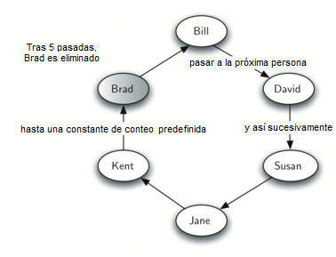
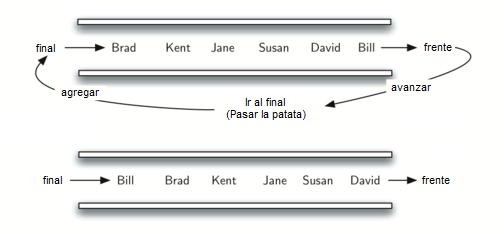

..  Copyright (C)  Brad Miller, David Ranum
    This work is licensed under the Creative Commons Attribution-NonCommercial-ShareAlike 4.0 International License. To view a copy of this license, visit http://creativecommons.org/licenses/by-nc-sa/4.0/.

Simulación: la patata caliente
~~~~~~~~~~~~~~~~~~~~~~~~~~~~~~

Una de las aplicaciones típicas para mostrar una cola en acción es simular una situación real que requiere que los datos se gestionen de una manera FIFO. Para empezar, vamos a considerar el juego infantil de la patata caliente. En este juego los niños se alinean en un círculo y pasan un ítem de vecino a vecino lo más rápido que pueden. En un cierto punto del juego, la acción se detiene y el niño que tiene el ítem (la patata) es retirado del círculo. El juego continúa hasta que solo queda un niño.

.. One of the typical applications for showing a queue in action is to simulate a real situation that requires data to be managed in a FIFO manner. To begin, let’s consider the children’s game Hot Potato. In this game (see :ref:`Figure 2 <fig_quhotpotato>`) children line up in a circle and pass an item from neighbor to neighbor as fast as they can. At a certain point in the game, the action is stopped and the child who has the item (the potato) is removed from the circle. Play continues until only one child is left.

.. _fig_quhotpotato:

   Figura 2: Un juego de la patata caliente de seis personas

   Figura 2: Un juego de la patata caliente de seis personas

Este juego es un equivalente moderno del famoso problema de Josefo. Con base en una leyenda sobre el famoso historiador del primer siglo Flavio Josefo, se cuenta que en la revuelta judía contra Roma, Josefo y 39 de sus camaradas se mantuvieron en contra de los romanos en una cueva. Con la derrota inminente, decidieron que preferirían morir antes que ser esclavos de los romanos. Se organizaron en un círculo. Un hombre fue designado como número uno, y procediendo en el sentido de las agujas del reloj mataron a cada séptimo hombre. Josefo, según la leyenda, era entre otras cosas un consumado matemático. Al instante descubrió dónde debía sentarse para ser el último en ser eliminado. Cuando llegó el momento, en lugar de suicidarse, se unió a los romanos. Usted puede encontrar muchas versiones diferentes de esta historia. Algunos cuentan cada tercer hombre y algunos permiten que el último hombre escape en un caballo. En cualquier caso, la idea es la misma.

.. This game is a modern-day equivalent of the famous Josephus problem. Based on a legend about the famous first-century historian Flavius Josephus, the story is told that in the Jewish revolt against Rome, Josephus and 39 of his comrades held out against the Romans in a cave. With defeat imminent, they decided that they would rather die than be slaves to the Romans. They arranged themselves in a circle. One man was designated as number one, and proceeding clockwise they killed every seventh man. Josephus, according to the legend, was among other things an accomplished mathematician. He instantly figured out where he ought to sit in order to be the last to go. When the time came, instead of killing himself, he joined the Roman side. You can find many different versions of this story. Some count every third man and some allow the last man to escape on a horse. In any case, the idea is the same.

Implementaremos una **simulación general** de la patata caliente. A nuestro programa se ingresará una lista de nombres y una constante, digamos “N”, que se usará para contar. El programa devolverá el nombre de la última persona que queda después del conteo repetitivo por ``N``. Lo que suceda en ese momento depende de usted.

.. We will implement a general **simulation** of Hot Potato. Our program will input a list of names and a constant, call it “num,” to be used for counting. It will return the name of the last person remaining after repetitive counting by ``num``. What happens at that point is up to you.

Para simular el círculo, usaremos una cola (ver la :ref:`Figura 3 <fig_qupotatoqueue>`). Suponga que el niño que sostiene la papata estará en el frente de la cola. Al pasar la patata, la simulación simplemente invocará el método ``avanzar`` y luego inmediatamente agregará a ese niño, poniéndolo al final de la cola. A continuación, esperará hasta que todos los demás hayan estado en el frente antes de que sea su turno nuevamente. Después de las ``N`` operaciones avanzar/agregar, el niño en el frente se quitará permanentemente y comenzará otro ciclo. Este proceso continuará hasta que sólo quede un nombre (hasta que el tamaño de la cola sea 1).

.. To simulate the circle, we will use a queue (see :ref:`Figure 3 <fig_qupotatoqueue>`). Assume that the child holding the potato will be at the front of the queue. Upon passing the potato, the simulation will simply dequeue and then immediately enqueue that child, putting her at the end of the line. She will then wait until all the others have been at the front before it will be her turn again. After ``num`` dequeue/enqueue operations, the child at the front will be removed permanently and another cycle will begin. This process will continue until only one name remains (the size of the queue is 1).

.. _fig_qupotatoqueue:

   Figura 3: Implementación del juego de la patata caliente usando una cola

   Figura 3: Implementación del juego de la patata caliente usando una cola

El programa se muestra en el :ref:`ActiveCode 1 <lst_josephussim>`. Una llamada a la función ``papaCaliente`` usando 7 como la constante de conteo devuelve ``Susan``.

.. The program is shown in :ref:`ActiveCode 1 <lst_josephussim>`. A call to the ``hotPotato`` function using 7 as the counting constant returns ``Susan``.

.. _lst_josephussim:

.. activecode:: qujosephussim
   :caption: Simulación de la patata caliente
   :nocodelens:

   from pythoned.basicas.cola import Cola

   def papaCaliente(listaNombres, N):
       colaSimulacion = Cola()
       for nombre in listaNombres:
           colaSimulacion.agregar(nombre)

       while colaSimulacion.tamano() > 1:
           for i in range(N):
               colaSimulacion.agregar(colaSimulacion.avanzar())

           colaSimulacion.avanzar()

       return colaSimulacion.avanzar()

   print(papaCaliente(["Bill","David","Susan","Jane","Kent","Brad"],7))

Note que en este ejemplo el valor de la constante de conteo es mayor que el número de nombres de la lista. Esto no es un problema ya que la cola actúa como un círculo y el conteo continúa de nuevo al principio hasta que se alcanza el valor. Además, observe que la lista se carga en la cola de manera que el primer nombre de la lista esté en el frente de la cola. ``Bill`` en este caso es el primer ítem de la lista y por lo tanto se mueve al frente de la cola. Una variación de esta implementación, descrita en los ejercicios, permite tener un conteo aleatorio.

.. Note that in this example the value of the counting constant is greater than the number of names in the list. This is not a problem since the queue acts like a circle and counting continues back at the beginning until the value is reached. Also, notice that the list is loaded into the queue such that the first name on the list will be at the front of the queue. ``Bill`` in this case is the first item in the list and therefore moves to the front of the queue. A variation of this implementation, described in the exercises, allows for a random counter.
