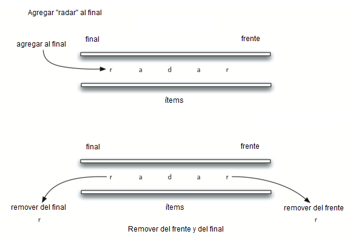

..  Copyright (C)  Brad Miller, David Ranum
    This work is licensed under the Creative Commons Attribution-NonCommercial-ShareAlike 4.0 International License. To view a copy of this license, visit http://creativecommons.org/licenses/by-nc-sa/4.0/.

Verificador de palíndromos
~~~~~~~~~~~~~~~~~~~~~~~~~~

Un problema interesante que se puede resolver fácilmente usando la estructura de datos Cola Doble es el clásico problema de los palíndromos. Un **palíndromo** es una cadena que se lee igual hacia adelante y hacia atrás, por ejemplo, *radar*, *oso* y *madam*. Nos gustaría construir un algoritmo al cual se le introduzca una cadena de caracteres y compruebe si es un palíndromo.

.. An interesting problem that can be easily solved using the deque data structure is the classic palindrome problem. A **palindrome** is a string that reads the same forward and backward, for example, *radar*, *toot*, and *madam*. We would like to construct an algorithm to input a string of characters and check whether it is a palindrome.

La solución a este problema utilizará un cola doble para almacenar los caracteres de la cadena. Vamos a procesar la cadena de izquierda a derecha y a agregar cada carácter al final de la cola doble. En este punto, la cola doble estará actuando de forma muy parecida a una cola ordinaria. Sin embargo, ahora podemos hacer uso de la doble funcionalidad de la cola doble. El frente de la cola doble tendrá el primer carácter de la cadena y el final de la cola doble tendrá el último carácter (ver la :ref:`Figura 2 <fig_palindrome>`).

.. The solution to this problem will use a deque to store the characters of the string. We will process the string from left to right and add each character to the rear of the deque. At this point, the deque will be acting very much like an ordinary queue. However, we can now make use of the dual functionality of the deque. The front of the deque will hold the first character of the string and the rear of the deque will hold the last character (see :ref:`Figure 2 <fig_palindrome>`).

.. _fig_palindrome:

   Figura 2: Una cola doble

   Figura 2: Una cola doble

Ya que podemos eliminar ambos directamente, podemos compararlos y continuar solo si coinciden. Si podemos mantener la coincidencia de los ítems primero y último, eventualmente o nos quedaremos sin caracteres o nos quedará una cola doble de tamaño 1 dependiendo de si la longitud de la cadena original era par o impar. En ambos casos, la cadena debe ser un palíndromo. La función completa para la verificación de palíndromos se muestra en el :ref:`ActiveCode 1 <lst_palchecker>`.

.. Since we can remove both of them directly, we can compare them and continue only if they match. If we can keep matching first and the last items, we will eventually either run out of characters or be left with a deque of size 1 depending on whether the length of the original string was even or odd. In either case, the string must be a palindrome. The complete function for palindrome-checking appears in :ref:`ActiveCode 1 <lst_palchecker>`.

.. _lst_palchecker:

.. activecode:: palchecker
   :caption: Un verificador de palíndromos usando una cola doble
   :nocodelens:

   from pythoned.basicas.coladoble import ColaDoble
   
   def verificarPalindromo(cadena):
    
       colaDobleCaracteres = ColaDoble()
       for  caracter in cadena:
           colaDobleCaracteres.agregarFinal(caracter)
    
       aunIguales = True
    
       while colaDobleCaracteres.tamano() > 1 and aunIguales:
           primero = colaDobleCaracteres.removerFrente()
           ultimo = colaDobleCaracteres.removerFinal()
           if primero != ultimo:
               aunIguales = False

       return aunIguales

   print(verificarPalindromo("lsdkjfskf"))
   print(verificarPalindromo("radar"))
