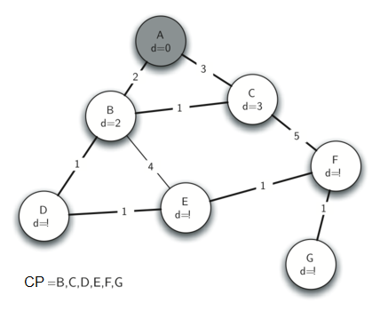

..  Copyright (C)  Brad Miller, David Ranum
    This work is licensed under the Creative Commons Attribution-NonCommercial-ShareAlike 4.0 International License. To view a copy of this license, visit http://creativecommons.org/licenses/by-nc-sa/4.0/.

Algoritmo de Prim del árbol de expansión
~~~~~~~~~~~~~~~~~~~~~~~~~~~~~~~~~~~~~~~~

Para nuestro último algoritmo de grafos vamos a considerar un problema al que se enfrentan los diseñadores de juegos en línea y los proveedores de radio por Internet. El problema es que quieren transferir eficientemente una pieza de información a todos y cada uno de los que puedan estar escuchando. Esto es importante en los juegos para que todos los jugadores conozcan la posición más reciente de cada uno de los otros jugadores. Es importante también en la radio por Internet para que todos los oyentes que estén sintonizados estén recibiendo todos los datos que necesitan para reconstruir la canción que estén escuchando. La :ref:`Figura 9 <fig_bcast1>` ilustra el problema de la radiodifusión.

.. For our last graph algorithm let’s consider a problem that online game designers and Internet radio providers face. The problem is that they want to efficiently transfer a piece of information to anyone and everyone who may be listening. This is important in gaming so that all the players know the very latest position of every other player. This is important for Internet radio so that all the listeners that are tuned in are getting all the data they need to reconstruct the song they are listening to. :ref:`Figure 9 <fig_bcast1>` illustrates the broadcast problem.

.. _fig_bcast1:

   Figura 9: El problema de la radiodifusión

   Figura 9: El problema de la radiodifusión

Hay algunas soluciones de fuerza bruta a este problema, así que mirémoslas primero para ayudar a entender mejor el problema de la radiodifusión. Esto también le ayudará a apreciar la solución que vamos a proponer cuando hayamos terminado. Para comenzar, el emisor de la radiodifusión tiene cierta información que todos los oyentes necesitan recibir. La solución más simple es que el emisor de la radiodifusión mantenga una lista de todos los oyentes y envíe mensajes individuales a cada uno. En la :ref:`Figura 9 <fig_bcast1>` mostramos una pequeña red con un radiodifusor y algunos oyentes. Utilizando este primer enfoque, se enviarían cuatro copias de cada mensaje. Suponiendo que se utilice la ruta de menor costo, veamos cuántas veces cada enrutador manejaría el mismo mensaje.

.. There are some brute force solutions to this problem, so let’s look at them first to help understand the broadcast problem better. This will also help you appreciate the solution that we will propose when we are done. To begin, the broadcast host has some information that the listeners all need to receive. The simplest solution is for the broadcasting host to keep a list of all of the listeners and send individual messages to each. In :ref:`Figure 9 <fig_bcast1>` we show a small network with a broadcaster and some listeners. Using this first approach, four copies of every message would be sent. Assuming that the least cost path is used, let’s see how many times each router would handle the same message.

Todos los mensajes de la emisora pasan por el enrutador A, por lo que A ve las cuatro copias de cada mensaje. El enrutador C sólo ve una copia de cada mensaje para su oyente. Sin embargo, los enrutadores B y D verían tres copias de cada mensaje ya que los enrutadores B y D están en la ruta menos costosa para los oyentes 1, 2 y 3. Esto es un montón de tráfico extra si consideramos que el emisor de la radiodifusión debe enviar cientos de mensajes por segundo para una emisión de radio.

.. All messages from the broadcaster go through router A, so A sees all four copies of every message. Router C sees only one copy of each message for its listener. However, routers B and D would see three copies of every message since routers B and D are on the cheapest path for listeners 1, 2, and 3. When you consider that the broadcast host must send hundreds of messages each second for a radio broadcast, that is a lot of extra traffic.

Una solución de fuerza bruta es que el emisor de la radiodifusión envíe una sola copia del mensaje de radiodifusión y deje que los enrutadores resuelvan las cosas. En este caso, la solución más sencilla es una estrategia llamada **inundación no controlada**. La estrategia de inundación funciona de la siguiente manera. Cada mensaje comienza con un valor de tiempo de vida (``tdv``) inicializado en un número mayor o igual al número de aristas entre el emisor de radiodifusión y su oyente más distante. Cada enrutador obtiene una copia del mensaje y pasa el mensaje a *todos* sus enrutadores vecinos. Cuando se transmite el mensaje, el ``tdv`` disminuye. Cada enrutador continúa enviando copias del mensaje a todos sus vecinos hasta que el valor ``tdv`` llegue a 0. Es fácil convencerse de que la inundación no controlada genera muchos más mensajes innecesarios que nuestra primera estrategia.

.. A brute force solution is for the broadcast host to send a single copy of the broadcast message and let the routers sort things out. In this case, the easiest solution is a strategy called **uncontrolled flooding**. The flooding strategy works as follows. Each message starts with a time to live (``tdv``) value set to some number greater than or equal to the number of edges between the broadcast host and its most distant listener. Each router gets a copy of the message and passes the message on to *all* of its neighboring routers. When the message is passed on the ``tdv`` is decreased. Each router continues to send copies of the message to all its neighbors until the ``tdv`` value reaches 0. It is easy to convince yourself that uncontrolled flooding generates many more unnecessary messages than our first strategy.

La solución a este problema radica en la construcción de un **árbol de expansión** de ponderación mínima. Formalmente definimos el árbol de expansión mínimo :math:`T` para un grafo :math:`G = (V,E)` como sigue. :math:`T` es un subconjunto acíclico de :math:`E` que conecta todos los vértices de :math:`V`. Se minimiza la suma de las ponderaciones de las aristas de :math:`T`.

.. The solution to this problem lies in the construction of a minimum weight **spanning tree**. Formally we define the minimum spanning tree :math:`T` for a graph :math:`G = (V,E)` as follows. :math:`T` is an acyclic subset of :math:`E` that connects all the vertices in :math:`V`. The sum of the weights of the edges in T is minimized.

En la :ref:`Figura 10 <fig_mst1>` se muestra una versión simplificada del grafo de radiodifusión, resaltando las aristas que forman un árbol de expansión mínimo para el grafo. Ahora para solucionar nuestro problema de radiodifusión, el emisor de la radiodifusión simplemente envía a la red una sola copia del mensaje de radiodifusión. Cada enrutador envía el mensaje a cualquier vecino que forme parte del árbol de expansión, excluyendo al vecino que acaba de enviarle el mensaje. En este ejemplo A reenvía el mensaje a B. B reenvía el mensaje a D y C. D reenvía el mensaje a E, el cual lo reenvía a F, y este último lo reenvía a G. Ningún enrutador ve más de una copia de cualquier mensaje, y todos los oyentes interesados ven una copia del mensaje.

.. :ref:`Figure 10 <fig_mst1>` shows a simplified version of the broadcast graph and highlights the edges that form a minimum spanning tree for the graph. Now to solve our broadcast problem, the broadcast host simply sends a single copy of the broadcast message into the network. Each router forwards the message to any neighbor that is part of the spanning tree, excluding the neighbor that just sent it the message. In this example A forwards the message to B. B forwards the message to D and C. D forwards the message to E, which forwards it to F, which forwards it to G. No router sees more than one copy of any message, and all the listeners that are interested see a copy of the message.

.. _fig_mst1:

.. figure:: Figures/mst1.png
   :align: center

   Figura 10: Árbol de expansión mínimo para el grafo de difusión

   Figura 10: Árbol de expansión mínimo para el grafo de difusión

El algoritmo que usaremos para resolver este problema se llama el algoritmo de Prim. El algoritmo de Prim pertenece a una familia de algoritmos llamados “algoritmos codiciosos” porque en cada paso elegiremos el siguiente paso más barato. En este caso, el siguiente paso más barato es seguir la arista que tenga la ponderación más baja. Nuestro último paso es desarrollar el algoritmo de Prim.

.. The algorithm we will use to solve this problem is called Prim’s algorithm. Prim’s algorithm belongs to a family of algorithms called the “greedy algorithms” because at each step we will choose the cheapest next step. In this case the cheapest next step is to follow the edge with the lowest weight. Our last step is to develop Prim’s algorithm.

La idea básica en la construcción de un árbol de expansión es la siguiente:

.. The basic idea in constructing a spanning tree is as follows:

::

   Mientras que T no sea aún un árbol de expansión
      Encontrar una arista que sea segura para agregarla al árbol
      Agregar la nueva arista a T

El truco está en el paso que nos lleva a “encontrar una arista que sea segura”. Una arista segura se define como cualquier arista que conecta un vértice que está en el árbol de expansión con un vértice que no está en el árbol de expansión. Esto asegura que el árbol seguirá siendo siempre un árbol y que, por lo tanto, no tendrá ciclos.

.. The trick is in the step that directs us to “find an edge that is safe.” We define a safe edge as any edge that connects a vertex that is in the spanning tree to a vertex that is not in the spanning tree. This ensures that the tree will always remain a tree and therefore have no cycles.

El código en Python para implementar el algoritmo de Prim se muestra en el :ref:`Programa 2 <lst_prims>`. El algoritmo de Prim es similar al algoritmo de Dijkstra  porque ambos usan una cola de prioridad para seleccionar el siguiente vértice que se agregará al grafo en crecimiento.

.. The Python code to implement Prim’s algorithm is shown in :ref:`Listing 2 <lst_prims>`. Prim’s algorithm is similar to Dijkstra’s algorithm in that they both use a priority queue to select the next vertex to add to the growing graph.

**Programa 2**

.. _lst_prims:

::

    from pythoned.grafos import ColaPrioridad, Grafo, Vertice

    def prim(G,inicio):
        cp = ColaPrioridad()
        for v in G:
            v.asignarDistancia(sys.maxsize)
            v.asignarPredecesor(None)
        inicio.asignarDistancia(0)
        cp.construirMonticulo([(v.obtenerDistancia(),v) for v in G])
        while not cp.estaVacia():
            verticeActual = cp.eliminarMin()
            for verticeSiguiente in verticeActual.obtenerConexiones():
              nuevoCosto = verticeActual.obtenerPonderacion(verticeSiguiente)
              if verticeSiguiente in cp and nuevoCosto<verticeSiguiente.obtenerDistancia():
                  verticeSiguiente.asignarPredecesor(verticeActual)
                  verticeSiguiente.asignarDistancia(nuevoCosto)
                  cp.decrementarClave(verticeSiguiente,nuevoCosto)

La siguiente secuencia de figuras (:ref:`Figura 11 <fig_mst1>` a :ref:`Figura 17 <fig_mst1>`) muestra el algoritmo en funcionamiento sobre nuestro árbol de ejemplo. Comenzamos con A como vértice inicial. Las distancias a todos los otros vértices se inicializan en infinito. Observando a los vecinos de A podemos actualizar las distancias a dos de los vértices adicionales B y C porque las distancias a B y C, a través de A, son menores que infinito. Esto mueve a B y C al frente de la cola de prioridad. Actualizamos los enlaces a los predecesores para B y C haciendo que apunten a A. Es importante tener en cuenta que todavía no hemos añadido formalmente a B ni a C al árbol de expansión. Un nodo sólo se considera parte del árbol de expansión cuando es eliminado de la cola de prioridad.

.. The following sequence of figures (:ref:`Figure 11 <fig_mst1>` through :ref:`Figure 17 <fig_mst1>`) shows the algorithm in operation on our sample tree. We begin with the starting vertex as A. The distances to all the other vertices are initialized to infinity. Looking at the neighbors of A we can update distances to two of the additional vertices B and C because the distances to B and C through A are less than infinite. This moves B and C to the front of the priority queue. Update the predecessor links for B and C by setting them to point to A. It is important to note that we have not formally added B or C to the spanning tree yet. A node is not considered to be part of the spanning tree until it is removed from the priority queue.

Puesto que B tiene la menor distancia, examinamos después a B. Examinando a los vecinos de B vemos que D y E pueden ser actualizados. Tanto D como E obtienen nuevos valores de distancia y se actualizan sus enlaces a los predecesores. Pasando al siguiente nodo en la cola de prioridad encontramos a C. El único nodo al que C es adyacente está todavía en la cola de prioridad, es F, por lo tanto podemos actualizar la distancia a F y ajustar la posición de F en la cola de prioridad.

.. Since B has the smallest distance we look at B next. Examining B’s neighbors we see that D and E can be updated. Both D and E get new distance values and their predecessor links are updated. Moving on to the next node in the priority queue we find C. The only node C is adjacent to that is still in the priority queue is F, thus we can update the distance to F and adjust F’s position in the priority queue.

Ahora examinemos los vértices adyacentes al nodo D. Encontramos que podemos actualizar E y reducir la distancia a E de 6 a 4. Cuando hacemos esto cambiamos el enlace al predecesor en E para que apunte a D, preparándolo así para ser injertado en el árbol de expansión, pero en un lugar diferente. El resto del algoritmo continúa como se esperaría, agregando cada nuevo nodo al árbol.

.. Now we examine the vertices adjacent to node D. We find that we can update E and reduce the distance to E from 6 to 4. When we do this we change the predecessor link on E to point back to D, thus preparing it to be grafted into the spanning tree but in a different location. The rest of the algorithm proceeds as you would expect, adding each new node to the tree.
    
.. _fig_prima:

   
   Figura 11: Seguimiento al algoritmo de Prim

   Figura 11: Seguimiento al algoritmo de Prim

.. _fig_primb:

   Figura 12: Seguimiento al algoritmo de Prim

   Figura 12: Seguimiento al algoritmo de Prim

.. _fig_primc:

   Figura 13: Seguimiento al algoritmo de Prim

   Figura 13: Seguimiento al algoritmo de Prim
   
.. _fig_primd:

   Figura 14: Seguimiento al algoritmo de Prim

   Figura 14: Seguimiento al algoritmo de Prim
   
.. _fig_prime:

   Figura 15: Seguimiento al algoritmo de Prim

   Figura 15: Seguimiento al algoritmo de Prim
   
.. _fig_primf:

   
   Figura 16: Seguimiento al algoritmo de Prim

   Figura 16: Seguimiento al algoritmo de Prim
    
.. _fig_primg:

   Figura 17: Seguimiento al algoritmo de Prim

   Figura 17: Seguimiento al algoritmo de Prim
