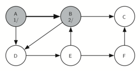

..  Copyright (C)  Brad Miller, David Ranum
    This work is licensed under the Creative Commons Attribution-NonCommercial-ShareAlike 4.0 International License. To view a copy of this license, visit http://creativecommons.org/licenses/by-nc-sa/4.0/.

Búsqueda en profundidad general
~~~~~~~~~~~~~~~~~~~~~~~~~~~~~~~

La gira del caballo es un caso especial de una búsqueda en profundidad donde el objetivo es crear el árbol de búsqueda en profundidad más profundo, sin ramas. La búsqueda en profundidad más general es realmente más fácil. Su objetivo es buscar lo más profundamente posible, conectando tantos nodos en el grafo como sea posible y ramificando donde sea necesario.

.. The knight’s tour is a special case of a depth first search where the goal is to create the deepest depth first tree, without any branches. The more general depth first search is actually easier. Its goal is to search as deeply as possible, connecting as many nodes in the graph as possible and branching where necessary.

Incluso es posible que una búsqueda en profundidad cree más de un árbol. Cuando el algoritmo de búsqueda en profundidad crea un grupo de árboles llamamos a esto un **bosque de profundidad**. Al igual que con la búsqueda en anchura, nuestra búsqueda en profundidad hace uso de los enlaces a los predecesores para construir el árbol. Además, la búsqueda en profundidad hará uso de dos variables de instancia adicionales en la clase ``Vertice``. Las nuevas variables de instancia son los tiempos de descubrimiento y de finalización. El tiempo de descubrimiento rastrea el número de pasos en el algoritmo antes de que un vértice sea encontrado por primera vez. El tiempo de finalización es el número de pasos en el algoritmo antes de que un vértice se pinte de negro. Como veremos después de examinar el algoritmo, los tiempos de descubrimiento y de finalización de los nodos proporcionan algunas propiedades interesantes que podemos usar en algoritmos posteriores.

.. It is even possible that a depth first search will create more than one tree. When the depth first search algorithm creates a group of trees we call this a **depth first forest**. As with the breadth first search our depth first search makes use of predecessor links to construct the tree. In addition, the depth first search will make use of two additional instance variables in the ``Vertex`` class. The new instance variables are the discovery and finish times. The discovery time tracks the number of steps in the algorithm before a vertex is first encountered. The finish time is the number of steps in the algorithm before a vertex is colored black. As we will see after looking at the algorithm, the discovery and finish times of the nodes provide some interesting properties we can use in later algorithms.

El código para nuestra búsqueda en profundidad se muestra en el :ref:`Programa 5 <lst_dfsgeneral>`. Puesto que las dos funciones ``bep`` y su auxiliar ``visitabep`` usan una variable para realizar un seguimiento del tiempo entre llamadas a ``visitabep``, hemos elegido implementar el código como métodos de una clase que hereda de la clase ``Grafo``. Esta implementación extiende la clase Grafo agregando una variable de instancia ``tiempo`` y los dos métodos ``bep`` y ``visitabep``. Mirando la línea 11, usted notará que el método ``bep`` itera sobre todos los vértices del grafo llamando a ``visitabep`` sobre los nodos que sean blancos. La razón por la que iteramos sobre todos los nodos, en lugar de simplemente buscar desde un nodo de partida elegido, es asegurarnos de que se consideren todos los nodos en el grafo y que no haya vértices que se queden fuera del bosque de profundidad. Puede parecer inusual ver la instrucción ``for unVertice in self``, pero recuerde que en este caso ``self`` es una instancia de la clase ``grafoBEP``, y que iterar sobre todos los vértices en una instancia de un grafo es algo natural que hacer.

.. The code for our depth first search is shown in :ref:`Listing 5 <lst_dfsgeneral>`. Since the two functions ``bep`` and its helper ``visitabep`` use a variable to keep track of the time across calls to ``visitabep`` we chose to implement the code as methods of a class that inherits from the ``Graph`` class. This implementation extends the graph class by adding a ``time`` instance variable and the two methods ``bep`` and ``visitabep``. Looking at line 11 you will notice that the ``bep`` method iterates over all of the vertices in the graph calling ``visitabep`` on the nodes that are white. The reason we iterate over all the nodes, rather than simply searching from a chosen starting node, is to make sure that all nodes in the graph are considered and that no vertices are left out of the depth first forest. It may look unusual to see the statement ``for unVertice in self``, but remember that in this case ``self`` is an instance of the ``grafoBEP`` class, and iterating over all the vertices in an instance of a graph is a natural thing to do.

.. highlight:: python
    :linenothreshold: 5

.. _lst_dfsgeneral:

**Programa 5**

::

    from pythonds.graphs import Grafo
    class grafoBEP(Grafo):
        def __init__(self):
            super().__init__()
            self.tiempo = 0

        def bep(self):
            for unVertice in self:
                unVertice.asignarColor('blanco')
                unVertice.asignarPredecesor(-1)
            for unVertice in self:
                if unVertice.obtenerColor() == 'blanco':
                    self.visitabep(unVertice)

        def visitabep(self,verticeInicio):
            verticeInicio.asignarColor('gris')
            self.tiempo += 1
            verticeInicio.asignarDescubrimiento(self.tiempo)
            for siguienteVertice in verticeInicio.obtenerConexiones():
                if siguienteVertice.obtenerColor() == 'blanco':
                    siguienteVertice.asignarPredecesor(verticeInicio)
                    self.visitabep(siguienteVertice)
            verticeInicio.asignarColor('negro')
            self.tiempo += 1
            verticeInicio.asignarFinalizacion(self.tiempo)

.. highlight:: python
    :linenothreshold: 500

Aunque nuestra implementación de ``bea`` sólo estaba interesada en considerar nodos para los que había una ruta que llevaba de regreso al inicio, es posible crear un bosque de anchura que represente la ruta más corta entre todas las parejas de nodos en el grafo. Dejamos esto como ejercicio. En nuestros próximos dos algoritmos vamos a ver por qué es importante el seguimiento del árbol de profundidad.

.. Although our implementation of ``bea`` was only interested in considering nodes for which there was a path leading back to the start, it is possible to create a breadth first forest that represents the shortest path between all pairs of nodes in the graph. We leave this as an exercise. In our next two algorithms we will see why keeping track of the depth first forest is important.

El método ``visitabep`` comienza con un solo vértice llamado ``verticeInicio`` y explora todos los vértices blancos vecinos lo más profundamente posible. Si usted examina atentamente el código de ``visitabep`` y lo compara con la búsqueda en anchura, lo que debería notar es que el algoritmo ``visitabep`` es casi idéntico a ``bea``, excepto que en la última línea del ciclo ``for`` interno, ``visitabep`` se llama a sí misma recursivamente para continuar la búsqueda a un nivel más profundo, mientras que ``bea`` añade el nodo a una cola para su exploración posterior. Es interesante observar que donde ``bea`` usa una cola, ``visitabep`` usa una pila. Usted no verá una pila en el código, pero está implícita en la llamada recursiva a ``visitabep``.

.. The ``visitabep`` method starts with a single vertex called ``verticeInicio`` and explores all of the neighboring white vertices as deeply as possible. If you look carefully at the code for ``visitabep`` and compare it to breadth first search, what you should notice is that the ``visitabep`` algorithm is almost identical to ``bea`` except that on the last line of the inner ``for`` loop, ``visitabep`` calls itself recursively to continue the search at a deeper level, whereas ``bea`` adds the node to a queue for later exploration. It is interesting to note that where ``bea`` uses a queue, ``visitabep`` uses a stack. You don’t see a stack in the code, but it is implicit in the recursive call to ``visitabep``.

La siguiente secuencia de figuras ilustra en acción el algoritmo de búsqueda en profundidad para un grafo pequeño. En estas figuras, las líneas punteadas indican aristas que están comprobadas, aunque el nodo en el otro extremo de la arista ya se ha añadido al árbol de profundidad. En el código esta prueba se realiza comprobando que el color del otro nodo no sea blanco.

.. The following sequence of figures illustrates the depth first search algorithm in action for a small graph. In these figures, the dotted lines indicate edges that are checked, but the node at the other end of the edge has already been added to the depth first tree. In the code this test is done by checking that the color of the other node is non-white.

La búsqueda comienza en el vértice A del grafo (:ref:`Figura 14 <fig_gdfsa>`). Puesto que todos los vértices son blancos al comienzo de la búsqueda, el algoritmo visita el vértice A. El primer paso al visitar un vértice es pintarlo de gris, lo que indica que se está explorando el vértice y al tiempo de descubrimiento se le asigna 1. Dado que el vértice A tiene dos vértices adyacentes (B, D), cada uno de ellos requiere ser visitado también. Tomaremos la decisión arbitraria de que visitaremos los vértices adyacentes en orden alfabético.

.. The search begins at vertex A of the graph (:ref:`Figure 14 <fig_gdfsa>`). Since all of the vertices are white at the beginning of the search the algorithm visits vertex A. The first step in visiting a vertex is to set the color to gray, which indicates that the vertex is being explored and the discovery time is set to 1. Since vertex A has two adjacent vertices (B, D) each of those need to be visited as well. We’ll make the arbitrary decision that we will visit the adjacent vertices in alphabetical order.

El vértice B se visita a continuación (:ref:`Figura 15 <fig_gdfsb>`), por lo que se pinta de gris y se asigna 2 a su tiempo de descubrimiento. El vértice B también es adyacente a otros dos nodos (C, D), así que seguiremos en orden alfabético y visitaremos a continuación el nodo C.

.. Vertex B is visited next (:ref:`Figure 15 <fig_gdfsb>`), so its color is set to gray and its discovery time is set to 2. Vertex B is also adjacent to two other nodes (C, D) so we will follow the alphabetical order and visit node C next.

Visitar el vértice C (:ref:`Figura 16 <fig_gdfsc>`) nos lleva al final de una rama del árbol. Después de pintar el nodo de gris y asignarle 3 a su tiempo de descubrimiento, el algoritmo también determina que no hay vértices adyacentes a C. Esto significa que hemos terminado de explorar el nodo C y por lo tanto podemos pintar el vértice de negro y asignarle 4 al tiempo final. Usted puede ver el estado de nuestra búsqueda en este punto en la :ref:`Figura 17 <fig_gdfsd>`.

.. Visiting vertex C (:ref:`Figure 16 <fig_gdfsc>`) brings us to the end of one branch of the tree. After coloring the node gray and setting its discovery time to 3, the algorithm also determines that there are no adjacent vertices to C. This means that we are done exploring node C and so we can color the vertex black, and set the finish time to 4. You can see the state of our search at this point in :ref:`Figure 17 <fig_gdfsd>`.

Dado que el vértice C era el final de una rama, ahora regresamos al vértice B y seguimos explorando los nodos adyacentes a B. El único vértice adicional que se debe explorar desde B es D, por lo que ahora podemos visitar D (:ref:`Figura 18 <fig_gdfse>`) y continuar nuestra búsqueda desde el vértice D. El vértice D nos conduce rápidamente al vértice E (:ref:`Figura 19 <fig_gdfsf>`). El vértice E tiene dos vértices adyacentes, B y F. Normalmente exploraríamos estos vértices adyacentes en orden alfabético, pero como B ya está pintado de gris, el algoritmo reconoce que no debería visitar B, ya que hacerlo pondría al algoritmo en un ciclo. Así, la exploración continúa con el siguiente vértice de la lista, a saber F (:ref:`Figura 20 <fig_gdfsg>`).

.. Since vertex C was the end of one branch we now return to vertex B and continue exploring the nodes adjacent to B. The only additional vertex to explore from B is D, so we can now visit D (:ref:`Figure 18 <fig_gdfse>`) and continue our search from vertex D. Vertex D quickly leads us to vertex E (:ref:`Figure 19 <fig_gdfsf>`). Vertex E has two adjacent vertices, B and F. Normally we would explore these adjacent vertices alphabetically, but since B is already colored gray the algorithm recognizes that it should not visit B since doing so would put the algorithm in a loop! So exploration continues with the next vertex in the list, namely F (:ref:`Figure 20 <fig_gdfsg>`).

El vértice F tiene sólo un vértice adyacente, C, pero como C está pintado de negro, no hay nada más que explorar, y el algoritmo ha llegado al final de otra rama. De aquí en adelante, verá usted desde la :ref:`Figura 21 <fig_gdfsh>` hasta la :ref:`Figura 25 <fig_gdfsl>` que el algoritmo regresa al primer nodo, asignando los tiempos de finalización y pintando los vértices de color negro.

.. Vertex F has only one adjacent vertex, C, but since C is colored black there is nothing else to explore, and the algorithm has reached the end of another branch. From here on, you will see in :ref:`Figure 21 <fig_gdfsh>` through :ref:`Figure 25 <fig_gdfsl>`  that the algorithm works its way back to the first node, setting finish times and coloring vertices black.
     
.. _fig_gdfsa:

.. figure:: Figures/gendfsa.png
   :align: center

   Figura 14: Construcción del árbol de búsqueda en profundidad-10

   Figura 14: Construcción del árbol de búsqueda en profundidad-10
   
.. _fig_gdfsb:

   
   Figura 15: Construcción del árbol de búsqueda en profundidad-11

   Figura 15: Construcción del árbol de búsqueda en profundidad-11
          
.. _fig_gdfsc:

.. figure:: Figures/gendfsc.png
   :align: center

   Figura 16: Construcción del árbol de búsqueda en profundidad-12

   Figura 16: Construcción del árbol de búsqueda en profundidad-12
   
.. _fig_gdfsd:

.. figure:: Figures/gendfsd.png
   :align: center

   Figura 17: Construcción del árbol de búsqueda en profundidad-13

   Figura 17: Construcción del árbol de búsqueda en profundidad-13
   
.. _fig_gdfse:

.. figure:: Figures/gendfse.png
   :align: center

   Figura 18: Construcción del árbol de búsqueda en profundidad-14

   Figura 18: Construcción del árbol de búsqueda en profundidad-14
   
.. _fig_gdfsf:

.. figure:: Figures/gendfsf.png
   :align: center

   Figura 19: Construcción del árbol de búsqueda en profundidad-15

   Figura 19: Construcción del árbol de búsqueda en profundidad-15

.. _fig_gdfsg:

.. figure:: Figures/gendfsg.png
   :align: center

   Figura 20: Construcción del árbol de búsqueda en profundidad-16

   Figura 20: Construcción del árbol de búsqueda en profundidad-16
   
.. _fig_gdfsh:

.. figure:: Figures/gendfsh.png
   :align: center

   Figura 21: Construcción del árbol de búsqueda en profundidad-17

   Figura 21: Construcción del árbol de búsqueda en profundidad-17
   
.. _fig_gdfsi:

.. figure:: Figures/gendfsi.png
   :align: center

   Figura 22: Construcción del árbol de búsqueda en profundidad-18

   Figura 22: Construcción del árbol de búsqueda en profundidad-18
   
.. _fig_gdfsj:

.. figure:: Figures/gendfsj.png
   :align: center

   Figura 23: Construcción del árbol de búsqueda en profundidad-19

   Figura 23: Construcción del árbol de búsqueda en profundidad-19
   
.. _fig_gdfsk:

.. figure:: Figures/gendfsk.png
   :align: center

   Figura 24: Construcción del árbol de búsqueda en profundidad-20

   Figura 24: Construcción del árbol de búsqueda en profundidad-20
   
.. _fig_gdfsl:

.. figure:: Figures/gendfsl.png
   :align: center

   Figura 25: Construcción del árbol de búsqueda en profundidad-21

   Figura 25: Construcción del árbol de búsqueda en profundidad-21

Los tiempos de inicio y finalización de cada nodo muestran una propiedad denominada **propiedad de paréntesis**. Esta propiedad significa que todos los hijos de un nodo en particular en el árbol de profundidad tienen un tiempo de descubrimiento posterior y un tiempo de finalización anterior que aquellos de su padre. La :ref:`Figura 26 <fig_dfstree>` muestra el árbol construido por el algoritmo de búsqueda en profundidad.

.. The starting and finishing times for each node display a property called the **parenthesis property**. This property means that all the children of a particular node in the depth first tree have a later discovery time and an earlier finish time than their parent. :ref:`Figure 26 <fig_dfstree>` shows the tree constructed by the depth first search algorithm.

.. _fig_dfstree:

.. figure:: Figures/dfstree.png
   :align: center
   
   Figura 26: TEl árbol resultante de la búsqueda en profundidad

   Figura 26: TEl árbol resultante de la búsqueda en profundidad
