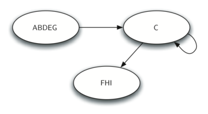
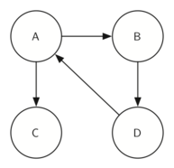

..  Copyright (C)  Brad Miller, David Ranum
    This work is licensed under the Creative Commons Attribution-NonCommercial-ShareAlike 4.0 International License. To view a copy of this license, visit http://creativecommons.org/licenses/by-nc-sa/4.0/.

Componentes fuertemente conectados
----------------------------------

En lo restante este capítulo nos centraremos en algunos grafos extremadamente grandes. Los grafos que usaremos para estudiar algunos algoritmos adicionales son los grafos producidos por las conexiones entre servidores en Internet y los enlaces entre páginas web. Comenzaremos con las páginas web.

.. For the remainder of this chapter we will turn our attention to some extremely large graphs. The graphs we will use to study some additional algorithms are the graphs produced by the connections between hosts on the Internet and the links between web pages. We will begin with web pages.

Los motores de búsqueda como Google y Bing explotan el hecho de que las páginas en la web forman un grafo dirigido muy grande. Para transformar la *World Wide Web* en un grafo, trataremos una página como un vértice y los hipervínculos de la página como aristas que conectan un vértice con otro. La :ref:`Figura 30 <fig_cshome>` muestra una pequeña parte del grafo que se produce al seguir los enlaces de una página a la siguiente, comenzando en la página principal de Ciencias de la Computación del Luther College. Por supuesto, este grafo podría ser enorme, por lo que lo hemos limitado a sitios web que no están a más de 10 enlaces de la página principal.

.. Search engines like Google and Bing exploit the fact that the pages on the web form a very large directed graph. To transform the World Wide Web into a graph, we will treat a page as a vertex, and the hyperlinks on the page as edges connecting one vertex to another. :ref:`Figure 30 <fig_cshome>` shows a very small part of the graph produced by following the links from one page to the next, beginning at Luther College’s Computer Science home page. Of course, this graph could be huge, so we have limited it to web sites that are no more than 10 links away from the CS home page.

.. _fig_cshome:

.. figure:: Figures/cshome.png
   :align: center

   Figura 30: El grafo producido por los enlaces de la página principal de Ciencias de la Computación del Luther College

Figura 30: El grafo producido por los enlaces de la página principal de Ciencias de la Computación del Luther College  

Usted podría hacer algunas observaciones interesantes si estudia el grafo de la :ref:`Figura 30 <fig_cshome>`. En primer lugar, note que muchos de los otros sitios web en el grafo son otros sitios web del Luther College. En segundo lugar, usted podrá notar que hay varios enlaces a otras universidades en Iowa. En tercer lugar, notará que hay varios enlaces a otras universidades de artes liberales. Usted puede concluir de esto que hay alguna estructura subyacente a la web que agrupa sitios web que son similares en cierto nivel.

.. If you study the graph in :ref:`Figure 30 <fig_cshome>` you might make some interesting observations. First you might notice that many of the other web sites on the graph are other Luther College web sites. Second, you might notice that there are several links to other colleges in Iowa. Third, you might notice that there are several links to other liberal arts colleges. You might conclude from this that there is some underlying structure to the web that clusters together web sites that are similar on some level.

Un algoritmo de grafos que puede ayudar a encontrar grupos de vértices altamente interconectados en un grafo se llama el algoritmo de componentes fuertemente conectados (**CFC**). Definimos formalmente un **componente fuertemente conectado**, :math:`C`, de un grafo :math:`G`, como el mayor subconjunto de vértices :math:`C \subset V` tal que para cada pareja de vértices :math:`v, w \in C` tenemos una ruta desde :math:`v` hasta :math:`w` y una ruta desde :math:`w` hasta :math:`v`. La :ref:`Figura 31 <fig_scc1>` muestra un grafo sencillo con tres componentes fuertemente conectados. Los componentes fuertemente conectados se identifican con áreas de sombreados diferentes.

.. One graph algorithm that can help find clusters of highly interconnected vertices in a graph is called the strongly connected components algorithm (**SCC**). We formally define a **strongly connected component**, :math:`C`, of a graph :math:`G`, as the largest subset of vertices :math:`C \subset V` such that for every pair of vertices :math:`v, w \in C` we have a path from :math:`v` to :math:`w` and a path from :math:`w` to :math:`v`. :ref:`Figure 27 <fig_scc1>` shows a simple graph with three strongly connected components. The strongly connected components are identified by the different shaded areas.

.. _fig_scc1:
        
.. figure:: Figures/scc1.png
   :align: center

   Figura 31: Un grafo dirigido con tres componentes fuertemente conectados

   Figura 31: Un grafo dirigido con tres componentes fuertemente conectados

.. Once the strongly connected components have been identified we can show a simplified view of the graph by combining all the vertices in one strongly connected component into a single larger vertex. The simplified version of the graph in :ref:`Figure 31 <fig_scc1>` is shown in :ref:`Figure 32 <fig_scc2>`.

.. _fig_scc2:

   Figura 32: El grafo reducido

   Figura 32: El grafo reducido

Una vez más veremos que podemos crear un algoritmo muy potente y eficiente haciendo uso de una búsqueda en profundidad. Debemos introducir otra definición antes de enfrentarnos al algoritmo principal de CFC. La transposición de un grafo :math:`G` se define como el grafo :math:`G^T` donde se han invertido todos los aristas del grafo. Es decir, si hay una arista dirigida desde el nodo A hasta el nodo B en el grafo original, entonces :math:`G^T` contendrá una arista desde el nodo B hasta el nodo A. La :ref:`Figura 33 <fig_tpa>` y la :ref:`Figura 34 <fig_tpb>` muestran un grafo sencillo y su transposición.

.. Once again we will see that we can create a very powerful and efficient algorithm by making use of a depth first search. Before we tackle the main SCC algorithm we must look at one other definition. The transposition of a graph :math:`G` is defined as the graph :math:`G^T` where all the edges in the graph have been reversed. That is, if there is a directed edge from node A to node B in the original graph then :math:`G^T` will contain and edge from node B to node A. :ref:`Figure 33 <fig_tpa>` and :ref:`Figure 34 <fig_tpb>` show a simple graph and its transposition.

    
.. _fig_tpa:

   Figura 33: Un grafo :math:`G`

   Figura 33: Un grafo :math:`G`
          
.. _fig_tpb:

.. figure:: Figures/transpose2.png
   :align: center

   Figura 34: Su transpuesto :math:`G^T`

   Figura 34: Su transpuesto :math:`G^T`

Mira las figuras otra vez. Note que el grafo de la :ref:`Figura 33 <fig_tpa>` tiene dos componentes fuertemente conectados. Ahora mire la :ref:`Figura 34 <fig_tpb>`. Observe que tiene los mismos dos componentes fuertemente conectados.

.. Look at the figures again. Notice that the graph in :ref:`Figure 33 <fig_tpa>` has two strongly connected components. Now look at :ref:`Figure 34 <fig_tpb>`. Notice that it has the same two strongly connected components.

Ahora podemos describir el algoritmo para calcular los componentes fuertemente conectados de un grafo.

.. We can now describe the algorithm to compute the strongly connected components for a graph.

#. Llamar a ``bep`` para el grafo :math:`G` con el fin de calcular los tiempos de finalización de cada vértice.

#. Calcular :math:`G^T`.

#. Llamar a ``bep`` para el grafo :math:`G^T` pero, en el ciclo principal de BEP, explorar cada vértice en orden decreciente de tiempo de finalización.

#. Cada árbol en el bosque, calculado en el paso 3, es un componente fuertemente conectado. Imprimir los identificadores (ids) de vértice para cada vértice en cada árbol del bosque con el fin de identificar el componente.

Vamos a hacer un seguimiento del funcionamiento de los pasos que acabamos de describir aplicados al grafo de ejemplo mostrado en la :ref:`Figura 31 <fig_scc1>`. La :ref:`Figura 35 <fig_sccalga>` muestra los tiempos de inicio y finalización calculados por el algoritmo BEP para el grafo original. La :ref:`Figura 36 <fig_sccalgb>` muestra los tiempos de inicio y finalización calculados mediante la ejecución de BEP para el grafo transpuesto.

.. Let's trace the operation of the steps described above on the example graph in :ref:`Figure 31 <fig_scc1>`. :ref:`Figure 35 <fig_sccalga>` shows the starting and finishing times computed for the original graph by the DFS algorithm. :ref:`Figure 36 <fig_sccalgb>` shows the starting and finishing times computed by running DFS on the transposed graph.

 
.. _fig_sccalga:

.. figure:: Figures/scc1a.png
   :align: center
   
   Figura 35: Tiempos de finalización para el grafo original :math:`G`     

   Figura 35: Tiempos de finalización para el grafo original :math:`G`

     
.. _fig_sccalgb:

.. figure:: Figures/scc1b.png
   :align: center
   
   Figura 36: Tiempos de finalización para :math:`G^T`

   Figura 36: Tiempos de finalización para :math:`G^T`

    
Finalmente, la :ref:`Figura 37 <fig_sccforest>` muestra el bosque de tres árboles producido en el paso 3 del algoritmo de componentes fuertemente conectados. Usted verá que no le proporcionamos el código en Python para el algoritmo de CFC, dejamos la escritura de este programa como un ejercicio.

.. Finally, :ref:`Figure 37 <fig_sccforest>` shows the forest of three trees produced in step 3 of the strongly connected component algorithm. You will notice that we do not provide you with the Python code for the SCC algorithm, we leave writing this program as an exercise.
          
.. _fig_sccforest:

.. figure:: Figures/sccforest.png
   :align: center
   
   Figura 37: Componentes fuertemente conectados

   Figura 37: Componentes fuertemente conectados
