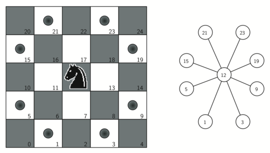

..  Copyright (C)  Brad Miller, David Ranum
    This work is licensed under the Creative Commons Attribution-NonCommercial-ShareAlike 4.0 International License. To view a copy of this license, visit http://creativecommons.org/licenses/by-nc-sa/4.0/.

Construcción del grafo de la gira del caballo
~~~~~~~~~~~~~~~~~~~~~~~~~~~~~~~~~~~~~~~~~~~~~

Para representar como un grafo el problema de la gira del caballo usaremos las dos ideas siguientes: Cada cuadrado en el tablero de ajedrez puede representarse como un nodo del grafo. Cada movimiento legal del caballo puede representarse como una arista del grafo. La :ref:`Figura 1 <fig_knightmoves>` ilustra, en un grafo, los movimientos legales de un caballo y las aristas correspondientes.

.. To represent the knight’s tour problem as a graph we will use the following two ideas: Each square on the chessboard can be represented as a node in the graph. Each legal move by the knight can be represented as an edge in the graph. :ref:`Figure 1 <fig_knightmoves>` illustrates the legal moves by a knight and the corresponding edges in a graph.
 
.. _fig_knightmoves:

   Figura 1: Movimientos legales para un caballo ubicado en el cuadrado 12, y el grafo correspondiente

   Figura 1: Movimientos legales para un caballo ubicado en el cuadrado 12, y el grafo correspondiente

Podemos usar la función en Python mostrada en el :ref:`Programa 1 <lst_knighttour1>` para construir el grafo completo de un tablero n-por-n, . La función ``grafoDelCaballo`` da una pasada por el tablero completo. En cada cuadrado del tablero la función ``grafoDelCaballo`` llama a una función auxiliar, ``generarMovLegales``, para crear una lista de movimientos legales para esa posición en el tablero. Todos los movimientos legales se convierten en aristas del grafo. Otra función auxiliar ``pos_A_Id_Nodo`` convierte una posición en el tablero, dada originalmente en términos de una fila y una columna, en un número de vértice lineal similar a los números de vértice mostrados en la :ref:`Figura 1 <fig_knightmoves>`.

.. To build the full graph for an n-by-n board we can use the Python function shown in :ref:`Listing 1 <lst_knighttour1>`. The ``grafoDelCaballo`` function makes one pass over the entire board. At each square on the board the ``grafoDelCaballo`` function calls a helper, ``generarMovLegales``, to create a list of legal moves for that position on the board. All legal moves are then converted into edges in the graph. Another helper function ``pos_A_Id_Nodo`` converts a location on the board in terms of a row and a column into a linear vertex number similar to the vertex numbers shown in :ref:`Figure 1 <fig_knightmoves>`.

.. _lst_knighttour1:

**Programa 1**

::

    from pythoned.grafos import Grafo
    
    def grafoDelCaballo(tamanoTablero):
        grafoCbllo = Grafo()
        for fil in range(tamanoTablero):
           for col in range(tamanoTablero):
               idNodo = pos_A_Id_Nodo(fil,col,tamanoTablero)
               posicionesNuevas = generarMovLegales(fil,col,tamanoTablero)
               for e in posicionesNuevas:
                   nid = pos_A_Id_Nodo(e[0],e[1],tamanoTablero)
                   grafoCbllo.agregarArista(idNodo,nid)
        return grafoCbllo

    def pos_A_Id_Nodo(fila, columna, tamano_del_tablero):
        return (fila * tamano_del_tablero) + columna

La función ``generarMovLegales`` (:ref:`Programa 2 <lst_knighttour2>`) toma la posición del caballo en el tablero y genera cada uno de los ocho movimientos posibles. La función auxiliar ``coordLegal`` (:ref:`Programa 2 <lst_knighttour2>`) asegura que un movimiento particular que se genere todavía esté aún dentro del tablero.

.. The ``generarMovLegales`` function (:ref:`Listing 2 <lst_knighttour2>`) takes the position of the knight on the board and generates each of the eight possible moves. The ``coordLegal`` helper function (:ref:`Listing 2 <lst_knighttour2>`) makes sure that a particular move that is generated is still on the board.

.. _lst_knighttour2:

**Programa 2**

::

    def generarMovLegales(x,y,tamanoTablero):
        nuevosMovimientos = []
        desplazamientosEnL = [(-1,-2),(-1,2),(-2,-1),(-2,1),
                       ( 1,-2),( 1,2),( 2,-1),( 2,1)]
        for i in desplazamientosEnL:
            nuevoX = x + i[0]
            nuevoY = y + i[1]
            if coordLegal(nuevoX,tamanoTablero) and \
                            coordLegal(nuevoY,tamanoTablero):
                nuevosMovimientos.append((nuevoX,nuevoY))
        return nuevosMovimientos

    def coordLegal(x,tamanoTablero):
        if x >= 0 and x < tamanoTablero:
            return True
        else:
            return False

La :ref:`Figura 2 <fig_bigknight>` muestra el grafo completo de los posibles movimientos en una tablero de ocho por ocho. Hay exactamente 336 aristas en el grafo. Note que los vértices correspondientes a las aristas del tablero tienen menos conexiones (movimientos legales) que los vértices del centro del tablero. Una vez más podemos ver cuán ralo es el grafo. Si el grafo estuviera completamente conectado, habría 4,096 aristas. Dado que sólo hay 336 aristas, la matriz de adyacencia estaría llena sólo en un 8.2 por ciento.

.. :ref:`Figure 2 <fig_bigknight>` shows the complete graph of possible moves on an eight-by-eight board. There are exactly 336 edges in the graph. Notice that the vertices corresponding to the edges of the board have fewer connections (legal moves) than the vertices in the middle of the board. Once again we can see how sparse the graph is. If the graph was fully connected there would be 4,096 edges. Since there are only 336 edges, the adjacency matrix would be only 8.2 percent full.

.. _fig_bigknight:

.. figure:: Figures/bigknight.png
   :align: center

   Figura 2: Todos los movimientos legales para un caballo en un tablero de ajedrez de :math:`8 \times 8`

   Figura 2: Todos los movimientos legales para un caballo en un tablero de ajedrez de :math:`8 \times 8`
