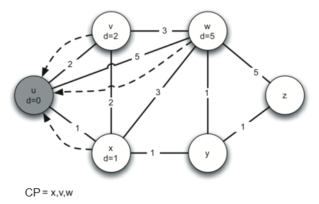
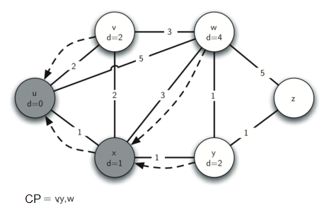
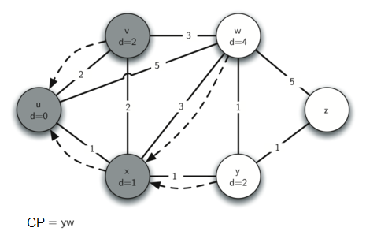
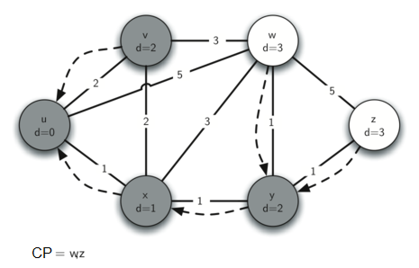
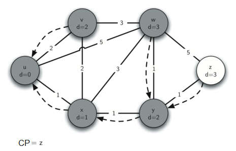
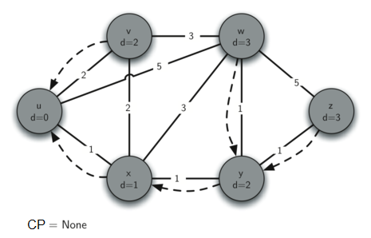

..  Copyright (C)  Brad Miller, David Ranum
    This work is licensed under the Creative Commons Attribution-NonCommercial-ShareAlike 4.0 International License. To view a copy of this license, visit http://creativecommons.org/licenses/by-nc-sa/4.0/.

El algoritmo de Dijkstra
~~~~~~~~~~~~~~~~~~~~~~~~

El algoritmo que vamos a utilizar para determinar la ruta más corta se llama el “algoritmo de Dijkstra”. El algoritmo de Dijkstra es un algoritmo iterativo que nos proporciona la ruta más corta desde un nodo inicial particular a todos los otros nodos en el grafo. De nuevo, esto es similar a los resultados de una búsqueda en anchura.

.. The algorithm we are going to use to determine the shortest path is called “Dijkstra’s algorithm.” Dijkstra’s algorithm is an iterative algorithm that provides us with the shortest path from one particular starting node to all other nodes in the graph. Again this is similar to the results of a breadth first search.

Para llevar un seguimiento del costo total desde el nodo inicial a cada destino, utilizaremos la variable de instancia ``dist`` en la clase ``Vertice``. La variable de instancia ``dist`` contendrá la ponderación total actual de la trayectoria de menor ponderación desde el inicio hasta el vértice en cuestión. El algoritmo itera una vez por cada vértice del grafo; sin embargo, el orden en que iteramos sobre los vértices es controlado por una cola de prioridad. ``dist`` es el valor que se usa para determinar el orden de los objetos en la cola de prioridad. Cuando se crea un vértice, a ``dist`` se le asigna un número muy grande. Teóricamente, a ``dist`` se le asignaría infinito, pero en la práctica simplemente asignamos un número que sea mayor que cualquier distancia real que pudiéramos tener en el problema que estamos tratando de resolver.

.. To keep track of the total cost from the start node to each destination we will make use of the ``dist`` instance variable in the Vertex class. The ``dist`` instance variable will contain the current total weight of the smallest weight path from the start to the vertex in question. The algorithm iterates once for every vertex in the graph; however, the order that we iterate over the vertices is controlled by a priority queue. The value that is used to determine the order of the objects in the priority queue is ``dist``. When a vertex is first created ``dist`` is set to a very large number. Theoretically you would set ``dist`` to infinity, but in practice we just set it to a number that is larger than any real distance we would have in the problem we are trying to solve.

El código para el algoritmo de Dijkstra se muestra en el :ref:`Programa 1 <lst_shortpath>`. Cuando el algoritmo termine, las distancias estarán asignadas correctamente así como lo estarán los enlaces a los predecesores para cada vértice en el grafo.

.. The code for Dijkstra’s algorithm is shown in :ref:`Listing 1 <lst_shortpath>`. When the algorithm finishes the distances are set correctly as are the predecessor links for each vertex in the graph.

.. _lst_shortpath:

**Programa 1**

::

    from pythoned.grafos import ColaPrioridad, Grafo, Vertice
    def dijkstra(unGrafo,inicio):
        cp = ColaPrioridad()
        inicio.asignarDistancia(0)
        cp.construirMonticulo([(v.obtenerDistancia(),v) for v in unGrafo])        
        while not cp.estaVacia():
            verticeActual = cp.eliminarMin()
            for verticeSiguiente in verticeActual.obtenerConexiones():
                nuevaDistancia = verticeActual.obtenerDistancia() \
                        + verticeActual.obtenerPonderacion(verticeSiguiente)
                if nuevaDistancia < verticeSiguiente.obtenerDistancia():
                    verticeSiguiente.asignarDistancia( nuevaDistancia )
                    verticeSiguiente.asignarPredecesor(verticeActual)
                    cp.decrementarClave(verticeSiguiente,nuevaDistancia)

El algoritmo de Dijkstra utiliza una cola de prioridad. Quizás usted recuerda que una cola de prioridad está basada en el montículo que implementamos en el capítulo sobre árboles. Hay un par de diferencias entre esa implementación sencilla y la implementación que usamos aquí para el algoritmo de Dijkstra. En primer lugar, la clase ``ColaPrioridad`` almacena tuplas de parejas clave-valor. Esto es importante para el algoritmo de Dijkstra ya que la clave en la cola de prioridad debe coincidir con la clave del vértice en el grafo. En segundo lugar, el valor se utiliza para decidir la prioridad y, por tanto, la posición de la clave en la cola de prioridad. En esta implementación usamos la distancia al vértice como la prioridad ya que, como veremos cuando exploremos el vértice siguiente, siempre queremos explorar el vértice que tenga la menor distancia. La segunda diferencia es la adición del método ``decrementarClave``. Como podrá notar, este método se utiliza cuando se decrementa la distancia a un vértice que ya está en la cola, y por lo tanto ese vértice se mueve hacia el frente de la cola.

.. Dijkstra’s algorithm uses a priority queue. You may recall that a priority queue is based on the heap that we implemented in the Tree Chapter. There are a couple of differences between that simple implementation and the implementation we use for Dijkstra’s algorithm. First, the ``ColaPrioridad`` class stores tuples of key, value pairs. This is important for Dijkstra’s algorithm as the key in the priority queue must match the key of the vertex in the graph. Secondly the value is used for deciding the priority, and thus the position of the key in the priority queue. In this implementation we use the distance to the vertex as the priority because as we will see when we are exploring the next vertex, we always want to explore the vertex that has the smallest distance. The second difference is the addition of the ``decrementarClave`` method. As you can see, this method is used when the distance to a vertex that is already in the queue is reduced, and thus moves that vertex toward the front of the queue.

Miremos una aplicación del algoritmo de Dijkstra, un vértice a la vez, usando la siguiente secuencia de figuras como referencia. Comenzamos con el vértice :math:`u`. Los tres vértices adyacentes a :math:`u` son :math:`v, w,` y :math:`x`. Dado que las distancias iniciales a :math:`v, w,` y :math:`x` están todas inicializadas a ``sys.maxint``, los nuevos costos para llegar a ellos a través del nodo de inicio son todos sus costos directos. Así que actualizamos los costos a cada uno de estos tres nodos. También asignamos :math:`u` al predecesor para cada nodo y agregamos cada nodo a la cola de prioridad. Utilizamos la distancia como clave para la cola de prioridad. El estado del algoritmo se muestra en la :ref:`Figura 3 <fig_dija>`.

.. Let’s walk through an application of Dijkstra’s algorithm one vertex at a time using the following sequence of figures as our guide. We begin with the vertex :math:`u`. The three vertices adjacent to :math:`u` are :math:`v,w,` and :math:`x`. Since the initial distances to :math:`v,w,` and :math:`x` are all initialized to ``sys.maxint``, the new costs to get to them through the start node are all their direct costs. So we update the costs to each of these three nodes. We also set the predecessor for each node to :math:`u` and we add each node to the priority queue. We use the distance as the key for the priority queue. The state of the algorithm is shown in :ref:`Figure 3 <fig_dija>`.

En la siguiente iteración del ciclo ``while`` examinamos los vértices que son adyacentes a :math:`x`. El vértice :math:`x` es el siguiente porque tiene el costo total más bajo y, por lo tanto, se movió hasta el principio de la cola de prioridad. En :math:`x` miramos a sus vecinos :math:`u,v,w` y :math:`y`. Para cada vértice vecino verificamos si la distancia a ese vértice a través de :math:`x` es menor que la distancia conocida previamente. Obviamente éste es el caso de :math:`y` ya que su distancia era ``sys.maxint``. No es el caso de :math:`u` ni de :math:`v` ya que sus distancias son 0 y 2 respectivamente. Sin embargo, ahora sabemos que la distancia a :math:`w` es menor si pasamos por :math:`x` que desde :math:`u` directamente a :math:`w`. Dado que éste es el caso, actualizamos :math:`w` con una nueva distancia y cambiamos el predecesor para :math:`w` de ser :math:`u` a ser :math:`x`. Mire la :ref:`Figura 4 <fig_dijb>` para ver el estado de todos los vértices.

.. In the next iteration of the ``while`` loop we examine the vertices that are adjacent to :math:`x`. The vertex :math:`x` is next because it has the lowest overall cost and therefore bubbled its way to the beginning of the priority queue. At :math:`x` we look at its neighbors :math:`u,v,w` and :math:`y`. For each neighboring vertex we check to see if the distance to that vertex through :math:`x` is smaller than the previously known distance. Obviously this is the case for :math:`y` since its distance was ``sys.maxint``. It is not the case for :math:`u` or :math:`v` since their distances are 0 and 2 respectively. However, we now learn that the distance to :math:`w` is smaller if we go through :math:`x` than from :math:`u` directly to :math:`w`. Since that is the case we update :math:`w` with a new distance and change the predecessor for :math:`w` from :math:`u` to :math:`x`. See :ref:`Figure 4 <fig_dijb>` for the state of all the vertices.

El paso siguiente es mirar los vértices vecinos de :math:`v` (ver la :ref:`Figura 5 <fig_dijc>`). Este paso no produce cambios en el grafo, por lo que pasamos al nodo :math:`y`. En el nodo :math:`y` (ver la :ref:`Figura 6 <fig_dijd>`) descubrimos que es más barato llegar a ambos :math:`w` y :math:`z`, por lo que ajustamos las distancias y los enlaces predecesores de acuerdo con ello. Finalmente verificamos los nodos :math:`w` y :math:`z` (ver la :ref:`Figura 6 <fig_dije>` y la :ref:`Figura 8 <fig_dijf>`). Sin embargo, no se encuentran cambios adicionales y por lo tanto la cola de prioridad está vacía y el algoritmo de Dijkstra termina.

.. The next step is to look at the vertices neighboring :math:`v` (see :ref:`Figure 5 <fig_dijc>`). This step results in no changes to the graph, so we move on to node :math:`y`. At node :math:`y` (see :ref:`Figure 6 <fig_dijd>`) we discover that it is cheaper to get to both :math:`w` and :math:`z`, so we adjust the distances and predecessor links accordingly. Finally we check nodes :math:`w` and :math:`z` (see see :ref:`Figure 6 <fig_dije>` and see :ref:`Figure 8 <fig_dijf>`). However, no additional changes are found and so the priority queue is empty and Dijkstra’s algorithm exits.

   
.. _fig_dija:

   Figura 3: Seguimiento al algoritmo de Dijkstra

   Figura 3: Seguimiento al algoritmo de Dijkstra
   
.. _fig_dijb:

   Figura 4: Seguimiento al algoritmo de Dijkstra

   Figura 4: Seguimiento al algoritmo de Dijkstra
   
.. _fig_dijc:

   Figura 5: Seguimiento al algoritmo de Dijkstra

   Figura 5: Seguimiento al algoritmo de Dijkstra
   
.. _fig_dijd:

   Figura 6: Seguimiento al algoritmo de Dijkstra

   Figura 6: Seguimiento al algoritmo de Dijkstra
   
.. _fig_dije:

   Figura 7: Seguimiento al algoritmo de Dijkstra

   Figura 7: Seguimiento al algoritmo de Dijkstra
   
.. _fig_dijf:

   Figura 8: Seguimiento al algoritmo de Dijkstra

   Figura 8: Seguimiento al algoritmo de Dijkstra

Es importante tener en cuenta que el algoritmo de Dijkstra funciona sólo cuando todas las ponderaciones son positivas. Convénzase de que el algoritmo nunca terminaría si usted introduce una ponderacion negativa en una de las aristas del grafo.

.. It is important to note that Dijkstra’s algorithm works only when the weights are all positive. You should convince yourself that if you introduced a negative weight on one of the edges to the graph that the algorithm would never exit.

Notemos que para enrutar mensajes a través de Internet, se utilizan otros algoritmos para encontrar la ruta más corta. Uno de los problemas con el uso del algoritmo de Dijkstra en el caso de Internet es que usted debe tener una representación completa del grafo para que el algoritmo funcione. La implicación de esto es que cada enrutador debería tener un mapa completo de todos los enrutadores en Internet. En la práctica, éste no es el caso y otras variaciones del algoritmo permiten que cada enrutador descubra el grafo sobre la marcha. Uno de tales algoritmos, sobre el cual usted quizá quiera leer, se llama el algoritmo de enrutamiento del “vector de distancias”.

.. We will note that to route messages through the Internet, other algorithms are used for finding the shortest path. One of the problems with using Dijkstra’s algorithm on the Internet is that you must have a complete representation of the graph in order for the algorithm to run. The implication of this is that every router has a complete map of all the routers in the Internet. In practice this is not the case and other variations of the algorithm allow each router to discover the graph as they go. One such algorithm that you may want to read about is called the “distance vector” routing algorithm.
