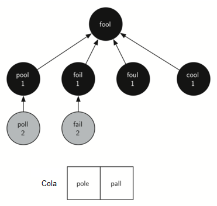

..  Copyright (C)  Brad Miller, David Ranum
    This work is licensed under the Creative Commons Attribution-NonCommercial-ShareAlike 4.0 International License. To view a copy of this license, visit http://creativecommons.org/licenses/by-nc-sa/4.0/.

Implementación de la búsqueda en anchura
~~~~~~~~~~~~~~~~~~~~~~~~~~~~~~~~~~~~~~~~

Con el grafo construido, ahora podemos concentrarnos en el algoritmo que usaremos para encontrar la solución más corta al problema de la escalera de palabras. El algoritmo de grafos que vamos a utilizar se denomina algoritmo “búsqueda en anchura”. La **búsqueda en anchura** (**BEA**) es uno de los algoritmos más sencillos para buscar en un grafo. También sirve como prototipo para otros varios algoritmos de grafos importantes que estudiaremos más adelante.

.. With the graph constructed we can now turn our attention to the algorithm we will use to find the shortest solution to the word ladder problem. The graph algorithm we are going to use is called the “breadth first search” algorithm. **Breadth first search** (**BFS**) is one of the easiest algorithms for searching a graph. It also serves as a prototype for several other important graph algorithms that we will study later.

Dado un grafo :math:`G` y un vértice inicial :math:`s`, una búsqueda en anchura procede explorando las aristas en el grafo para encontrar todos los vértices en :math:`G` para los cuales hay una ruta a partir de :math:`s`. Lo notable de una búsqueda en anchura es que encuentra *todos* los vértices que estén a una distancia :math:`k` de :math:`s` antes de encontrar *cualesquiera* vértices que estén una distancia :math:`k+1`. Una buena manera de visualizar lo que hace el algoritmo de búsqueda en anchura es imaginar que está construyendo un árbol, un nivel del árbol a la vez. Una primera búsqueda en anchura agrega todos los hijos del vértice inicial antes de que comience a descubrir a alguno de los nietos.

.. Given a graph :math:`G` and a starting vertex :math:`s`, a breadth first search proceeds by exploring edges in the graph to find all the vertices in :math:`G` for which there is a path from :math:`s`. The remarkable thing about a breadth first search is that it finds *all* the vertices that are a distance :math:`k` from :math:`s` before it finds *any* vertices that are a distance :math:`k+1`. One good way to visualize what the breadth first search algorithm does is to imagine that it is building a tree, one level of the tree at a time. A breadth first search adds all children of the starting vertex before it begins to discover any of the grandchildren.

Para realizar un seguimiento de su progreso, BEA pinta cada uno de los vértices en blanco, gris o negro. Todos los vértices se inicializan en blanco cuando se construyen. Un vértice blanco es un vértice no descubierto. Cuando un vértice es descubierto inicialmente es pintado de gris, y cuando BEA ha explorado un vértice completamente se pinta de negro. Esto significa que una vez que un vértice está pintado de negro, no tiene vértices blancos adyacentes a él. Un nodo gris, por otro lado, puede tener algunos vértices blancos adyacentes a él, lo que indica que todavía hay vértices adicionales por explorar.

.. To keep track of its progress, BFS colors each of the vertices white, gray, or black. All the vertices are initialized to white when they are constructed. A white vertex is an undiscovered vertex. When a vertex is initially discovered it is colored gray, and when BFS has completely explored a vertex it is colored black. This means that once a vertex is colored black, it has no white vertices adjacent to it. A gray node, on the other hand, may have some white vertices adjacent to it, indicating that there are still additional vertices to explore.

El algoritmo de búsqueda en anchura mostrado a continuación en el :ref:`Programa 2 <lst_wordbucket2>` utiliza la representación de un grafo mediante una lista de adyacencia que desarrollamos anteriormente. Además, utiliza una ``Cola``, un punto crucial como veremos, para decidir qué vértice explorar a continuación.

.. The breadth first search algorithm shown in :ref:`Listing 2 <lst_wordbucket2>` below uses the adjacency list graph representation we developed earlier. In addition it uses a ``Queue``, a crucial point as we will see, to decide which vertex to explore next.

Además, el algoritmo BEA utiliza una versión extendida de la clase ``Vertice``. Esta nueva clase Vértice añade tres nuevas variables de instancia: distancia, predecesor y color. Cada una de estas variables de instancia también tiene los métodos apropiados para consulta (obtener) y asignación. El código para esta clase Vértice expandida se incluye en el paquete ``pythoned``, pero no lo mostraremos aquí, ya que no hay nada nuevo para aprender viendo las variables de instancia adicionales.

.. In addition the BFS algorithm uses an extended version of the ``Vertex`` class. This new vertex class adds three new instance variables: distance, predecessor, and color. Each of these instance variables also has the appropriate getter and setter methods. The code for this expanded Vertex class is included in the ``pythonds`` package, but we will not show it to you here as there is nothing new to learn by seeing the additional instance variables.

El algoritmo BEA comienza en el vértice inicial ``s`` y pinta a ``inicio`` de gris para mostrar que está siendo explorado. Los otros dos valores, distancia y predecesor, se inicializan en 0 y ``None`` respectivamente para el vértice inicial. Finalmente, ``inicio`` se coloca en una ``Cola``. El siguiente paso es comenzar a explorar sistemáticamente los vértices en la parte delantera de la cola. Exploramos cada nuevo nodo en el frente de la cola iterando sobre su lista de adyacencia. A medida que se examina cada nodo en la lista de adyacencia, se comprueba su color. Si es blanco, el vértice no ha sido explorado, y suceden cuatro cosas:

.. BFS begins at the starting vertex ``s`` and colors ``inicio`` gray to show that it is currently being explored. Two other values, the distance and the predecessor, are initialized to 0 and ``None`` respectively for the starting vertex. Finally, ``inicio`` is placed on a ``Queue``. The next step is to begin to systematically explore vertices at the front of the queue. We explore each new node at the front of the queue by iterating over its adjacency list. As each node on the adjacency list is examined its color is checked. If it is white, the vertex is unexplored, and four things happen:

#. El nuevo vértice inexplorado ``vecino``, es coloreado de gris.

#. Al predecesor de ``vecino`` se le asigna el nodo actual ``verticeActual``

#. A la distancia a ``vecino`` se le asigna la distancia a ``verticeActual + 1``

#. ``vecino`` se agrega al final de una cola. La adición de ``vecino`` al final de la cola efectivamente programa este nodo para una exploración adicional, pero no hasta que todos los otros vértices de la lista de adyacencia de ``verticeActual`` hayan sido explorados.

   
.. _lst_wordbucket2:

**Programa 2**

::

    from pythoned.grafos import Grafo, Vertice
    from pythoned.basicas import Cola
    
    def bea(g,inicio):
      inicio.asignarDistancia(0)
      inicio.asignarPredecesor(None)
      colaVertices = Cola()
      colaVertices.agregar(inicio)
      while (colaVertices.tamano() > 0):
        verticeActual = colaVertices.avanzar()
        for vecino in verticeActual.obtenerConexiones():
          if (vecino.obtenerColor() == 'blanco'):
            vecino.asignarColor('gris')
            vecino.asignarDistancia(verticeActual.obtenerDistancia() + 1)
            vecino.asignarPredecesor(verticeActual)
            colaVertices.agregar(vecino)
        verticeActual.asignarColor('negro')

Veamos cómo la función ``bea`` construiría el primer árbol de búsqueda en anchura correspondiente al grafo de la :ref:`Figura 1 <fig_wordladder>`. Partiendo de fool tomamos todos los nodos que son adyacentes a fool y los agregamos al árbol. Los nodos adyacentes incluyen pool, foil, foul y cool. Cada uno de estos nodos se agrega a la cola de nuevos nodos a expandir. La :ref:`Figura 3 <fig_bfs1>` muestra el estado del árbol en progreso junto con la cola después de este paso.

.. Let’s look at how the ``bea`` function would construct the breadth first tree corresponding to the graph in :ref:`Figure 1 <fig_wordladder>`. Starting from fool we take all nodes that are adjacent to fool and add them to the tree. The adjacent nodes include pool, foil, foul, and cool. Each of these nodes are added to the queue of new nodes to expand. :ref:`Figure 3 <fig_bfs1>` shows the state of the in-progress tree along with the queue after this step.

.. _fig_bfs1:

   Figura 3: Primer paso en la búsqueda en anchura

   Figura 3: Primer paso en la búsqueda en anchura

En el paso siguiente ``bea`` elimina el nodo siguiente (pool) del frente de la cola y repite el proceso para todos sus nodos adyacentes. Sin embargo, cuando ``bea`` examina el nodo cool, encuentra que el color de cool ya ha cambiado a gris. Esto indica que hay una ruta más corta para cool y que cool ya está en la cola para una expansión adicional. El único nodo nuevo agregado a la cola mientras se examina pool es poll. El nuevo estado del árbol y de la cola se muestra en la :ref:`Figura 4 <fig_bfs2>`.

.. In the next step ``bea`` removes the next node (pool) from the front of the queue and repeats the process for all of its adjacent nodes. However, when ``bea`` examines the node cool, it finds that the color of cool has already been changed to gray. This indicates that there is a shorter path to cool and that cool is already on the queue for further expansion. The only new node added to the queue while examining pool is poll. The new state of the tree and queue is shown in :ref:`Figure 4 <fig_bfs2>`.

.. _fig_bfs2:

   Figura 4: Segundo paso en la búsqueda en anchura

   Figura 4: Segundo paso en la búsqueda en anchura

El vértice siguiente en la cola es foil. El único nodo nuevo que foil puede agregar al árbol es fail. A medida que ``bea`` continúa procesando la cola, ninguno de los dos nodos siguientes agrega nada nuevo a la cola o al árbol. La :ref:`Figura 5 <fig_bfs3>` muestra el árbol y la cola después de expandir todos los vértices del segundo nivel del árbol.

.. The next vertex on the queue is foil. The only new node that foil can add to the tree is fail. As ``bea`` continues to process the queue, neither of the next two nodes add anything new to the queue or the tree. :ref:`Figure 5 <fig_bfs3>` shows the tree and the queue after expanding all the vertices on the second level of the tree.

.. _fig_bfs3:

   
   Figura 5: Árbol de la búsqueda en anchura después de completar un nivel

   Figura 5: Árbol de la búsqueda en anchura después de completar un nivel

.. _fig_bfsDone:

   Figura 6: Árbol final de la búsqueda en anchura

   Figura 6: Árbol final de la búsqueda en anchura      

Usted debe seguir ejecutando el algoritmo por su cuenta para que se sienta cómodo con la forma en que funciona. La :ref:`Figura 6 <fig_bfsDone>` muestra el árbol de búsqueda en anchura final después de que todos los vértices de la :ref:`Figura 3 <fig_wordladder>` han sido expandidos. Lo sorprendente de la solución de la búsqueda en anchura es que no sólo hemos resuelto el problema de FOOL-SAGE con el que empezamos, sino que hemos solucionado muchos otros problemas a lo largo del camino. Podemos comenzar en cualquier vértice en el árbol de búsqueda en anchura y seguir las flechas del predecesor de nuevo hacia la raíz para encontrar la escalera de palabras más corta desde cualquier palabra hasta retroceder a fool. La siguiente función (:ref:`Programa 3 <lst_wordbucket3>`) muestra cómo seguir los enlaces del predecesor para imprimir la escalera de palabras.

.. You should continue to work through the algorithm on your own so that you are comfortable with how it works. :ref:`Figure 6 <fig_bfsDone>` shows the final breadth first search tree after all the vertices in :ref:`Figure 3 <fig_wordladder>` have been expanded. The amazing thing about the breadth first search solution is that we have not only solved the FOOL–SAGE problem we started out with, but we have solved many other problems along the way. We can start at any vertex in the breadth first search tree and follow the predecessor arrows back to the root to find the shortest word ladder from any word back to fool. The function below (:ref:`Listing 3 <lst_wordbucket3>`) shows how to follow the predecessor links to print out the word ladder.

.. _lst_wordbucket3:

**Programa 3**

::

    def recorrer(y):
        x = y
        while (x.obtenerPredecesor()):
            print(x.obtenerId())
            x = x.obtenerPredecesor()
        print(x.obtenerId())

    recorrer(g.obtenerVertice('sage'))

