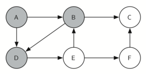

..  Copyright (C)  Brad Miller, David Ranum
    This work is licensed under the Creative Commons Attribution-NonCommercial-ShareAlike 4.0 International License. To view a copy of this license, visit http://creativecommons.org/licenses/by-nc-sa/4.0/.

Implementación de la gira del caballo
~~~~~~~~~~~~~~~~~~~~~~~~~~~~~~~~~~~~~

El algoritmo de búsqueda que usaremos para resolver el problema de la gira del caballo se denomina **búsqueda en profundidad** (**BEP**). Mientras que el algoritmo de búsqueda en anchura discutido en la sección anterior construye un árbol de búsqueda un nivel a la vez, una búsqueda en profundidad crea un árbol de búsqueda explorando una rama del árbol lo más profundamente posible. En esta sección veremos dos algoritmos que implementan una búsqueda en profundidad. El primer algoritmo que veremos resuelve directamente el problema de la gira del caballo al prohibir explícitamente que un nodo sea visitado más de una vez. La segunda implementación es más general, pero permite que los nodos sean visitados más de una vez a medida que se construye el árbol. La segunda versión se utiliza en las secciones subsiguientes para desarrollar algoritmos de grafos adicionales.

.. The search algorithm we will use to solve the knight’s tour problem is called **depth first search** (**DFS**).  Whereas the breadth first search algorithm discussed in the previous section builds a search tree one level at a time, a depth first search creates a search tree by exploring one branch of the tree as deeply as possible. In this section we will look at two algorithms that implement a depth first search. The first algorithm we will look at directly solves the knight’s tour problem by explicitly forbidding a node to be visited more than once. The second implementation is more general, but allows nodes to be visited more than once as the tree is constructed. The second version is used in subsequent sections to develop additional graph algorithms.

La exploración en profundidad del grafo es exactamente lo que necesitamos para encontrar una ruta que tiene exactamente 63 aristas. Veremos que cuando el algoritmo de búsqueda en profundidad encuentra un callejón sin salida (un lugar en el grafo donde no hay más movimientos posibles), él retrocede en el árbol al siguiente vértice más profundo que le permita realizar un movimiento legal.

.. The depth first exploration of the graph is exactly what we need in order to find a path that has exactly 63 edges. We will see that when the depth first search algorithm finds a dead end (a place in the graph where there are no more moves possible) it backs up the tree to the next deepest vertex that allows it to make a legal move.

La función ``giraCaballo`` recibe cuatro parámetros: ``n``, la profundidad actual en el árbol de búsqueda; ``ruta``, una lista de vértices visitados hasta el momento; ``u``, el vértice en el grafo que deseamos explorar; y ``limite`` el número de nodos en la ruta. La función ``giraCaballo`` es recursiva. Cuando se llama a la función ``giraCaballo``, ella verifica primero la condición del caso base. Si tenemos una ruta que contiene 64 vértices, regresamos de ``giraCaballo`` con un estado de ``True``, indicando que hemos encontrado una gira exitosa. Si la ruta no es lo suficientemente larga, seguimos explorando un nivel más profundo eligiendo un nuevo vértice para explorar y llamando a ``giraCaballo`` recursivamente para ese vértice.

.. The ``giraCaballo`` function takes four parameters: ``n``, the current depth in the search tree; ``path``, a list of vertices visited up to this point; ``u``, the vertex in the graph we wish to explore; and ``limit`` the number of nodes in the path. The ``giraCaballo`` function is recursive. When the ``giraCaballo`` function is called, it first checks the base case condition. If we have a path that contains 64 vertices, we return from ``giraCaballo`` with a status of ``True``, indicating that we have found a successful tour. If the path is not long enough we continue to explore one level deeper by choosing a new vertex to explore and calling ``giraCaballo`` recursively for that vertex.

BEP también utiliza colores para realizar un seguimiento de qué vértices del grafo se han visitado. Los vértices no visitados son de color blanco, y los vértices visitados son de color gris. Habremos llegado a un callejón sin salida si todos los vecinos de un vértice particular han sido explorados y aún no hemos alcanzado nuestra longitud objetivo de 64 vértices. Cuando llegamos a un callejón sin salida debemos retroceder. El retroceso sucede cuando volvemos de ``giraCaballo`` con un estado de ``False``. En la búsqueda en anchura utilizamos una cola para realizar un seguimiento de qué vértice se debe visitar a continuación. Dado que la búsqueda en profundidad es recursiva, estamos usando implícitamente una pila como ayuda para nuestro retroceso. Cuando volvemos de una llamada a ``giraCaballo`` con un estado de ``False``, en la línea 11, permanecemos dentro del ciclo ``while`` y examinamos el siguiente vértice en ``listaVecinos``.

.. DFS also uses colors to keep track of which vertices in the graph have been visited. Unvisited vertices are colored white, and visited vertices are colored gray. If all neighbors of a particular vertex have been explored and we have not yet reached our goal length of 64 vertices, we have reached a dead end. When we reach a dead end we must backtrack. Backtracking happens when we return from ``giraCaballo`` with a status of ``False``. In the breadth first search we used a queue to keep track of which vertex to visit next. Since depth first search is recursive, we are implicitly using a stack to help us with our backtracking. When we return from a call to ``giraCaballo`` with a status of ``False``, in line 11, we remain inside the ``while`` loop and look at the next vertex in ``listaVecinos``.

**Programa 3**

::

    from pythoned.grafos import Grafo, Vertice   
    def giraCaballo(n,ruta,u,limite): 
            u.asignarColor('gris')
            ruta.append(u)
            if n < limite:
                listaVecinos = list(u.obtenerConexiones())
                i = 0
                hecho = False
                while i < len(listaVecinos) and not hecho:
                    if listaVecinos[i].obtenerColor() == 'blanco':
                        hecho = giraCaballo(n+1, ruta, listaVecinos[i], limite)
                    i = i + 1    
                if not hecho:  # prepararse para retroceder
                    ruta.pop()
                    u.asignarColor('blanco')
            else:
                hecho = True
            return hecho

Veamos un ejemplo sencillo de ``giraCaballo`` en acción. Usted puede consultar las figuras que se muestran a continuación para seguir los pasos de la búsqueda. Para este ejemplo asumiremos que la llamada al método ``obtenerConexiones`` en la línea 6 ordena los nodos en orden alfabético. Comenzamos llamando a ``giraCaballo(0,ruta,A,6)``.

.. Let's look at a simple example of ``giraCaballo`` in action. You can refer to the figures below to follow the steps of the search. For this example we will assume that the call to the ``obtenerConexiones`` method on line 6 orders the nodes in alphabetical order. We begin by calling ``giraCaballo(0,path,A,6)``

``giraCaballo`` comienza con el nodo A (:ref:`Figura 3 <fig_kta>`). Los nodos adyacentes a A son B y D. Como B está alfabéticamente antes de D, BEP selecciona a B para la expansión subsiguiente como se muestra en la :ref:`Figura 4 <fig_ktb>`. La exploración de B ocurre cuando ``giraCaballo`` es llamada recursivamente. B es adyacente a C y D, por lo que ``giraCaballo`` elige explorar C a continuación. Sin embargo, como se puede ver en la :ref:`Figura 5 <fig_ktc>`, el nodo C es un callejón sin salida pues no tiene nodos blancos adyacentes. En este punto cambiamos el color del nodo C de nuevo a blanco. La llamada a ``giraCaballo`` devuelve un valor de ``False``. El retorno de la llamada recursiva efectivamente retrocede la búsqueda al vértice B (ver la :ref:`Figura 6 <fig_ktd>`). El siguiente vértice por explorar de la lista es el vértice D, por lo que ``giraCaballo`` hace una llamada recursiva moviéndose al nodo D (ver la :ref:`Figura 7 <fig_kte>`). Desde el vértice D, ``giraCaballo`` puede continuar haciendo llamadas recursivas hasta llegar nuevamente al nodo C (ver la :ref:`Figura 8 <fig_ktf>`, la :ref:`Figura 9 <fig_ktg>` y la :ref:`Figura 10 <fig_kth>`). Sin embargo, esta vez, cuando llegamos al nodo C, la prueba ``n < limite`` falla, por lo que sabemos que hemos agotado todos los nodos del grafo. En este punto podemos devolver ``True`` para indicar que hemos hecho una gira exitosa del grafo. Cuando devolvemos la lista, ``ruta`` tiene los valores ``[A, B, D, E, F, C]``, que es el orden que necesitamos para recorrer el grafo y visitar cada nodo exactamente una vez.

.. ``giraCaballo`` starts with node A :ref:`Figure 3 <fig_kta>`. The nodes adjacent to A are B and D. Since B is before D alphabetically, DFS selects B to expand next as shown in :ref:`Figure 4 <fig_ktb>`. Exploring B happens when ``giraCaballo`` is called recursively. B is adjacent to C and D, so ``giraCaballo`` elects to explore C next. However, as you can see in :ref:`Figure 5 <fig_ktc>` node C is a dead end with no adjacent white nodes. At this point we change the color of node C back to white. The call to ``giraCaballo`` returns a value of ``False``. The return from the recursive call effectively backtracks the search to vertex B (see :ref:`Figure 6 <fig_ktd>`). The next vertex on the list to explore is vertex D, so ``giraCaballo`` makes a recursive call moving to node D (see :ref:`Figure 7 <fig_kte>`). From vertex D on, ``giraCaballo`` can continue to make recursive calls until we get to node C again (see :ref:`Figure 8 <fig_ktf>`, :ref:`Figure 9 <fig_ktg>`, and  :ref:`Figure 10 <fig_kth>`).  However, this time when we get to node C the test ``n < limit`` fails so we know that we have exhausted all the nodes in the graph. At this point we can return ``True`` to indicate that we have made a successful tour of the graph. When we return the list, ``path`` has the values ``[A,B,D,E,F,C]``, which is the the order we need to traverse the graph to visit each node exactly once.

.. _fig_kta:

.. figure:: Figures/ktdfsa.png
   :align: center

   Figura 3: Comenzar con el nodo A

   Figura 3: Comenzar con el nodo A

.. _fig_ktb:

.. figure:: Figures/ktdfsb.png
   :align: center
           
   Figura 4: Explorar B

   Figura 4: Explorar B

     
.. _fig_ktc:

.. figure:: Figures/ktdfsc.png
   :align: center

   Figura 5: El nodo C es un callejón sin salida

   Figura 5: El nodo C es un callejón sin salida

.. _fig_ktd:

.. figure:: Figures/ktdfsd.png
   :align: center
           
   Figura 6: Retroceder a B

   Figura 6: Retroceder a B

  
.. _fig_kte:

   
   Figura 7: Explorar D

   Figura 7: Explorar D
   
   
.. _fig_ktf:

.. figure:: Figures/ktdfsf.png
   :align: center

   Figura 8: Explorar E

   Figura 8: Explorar E
   
.. _fig_ktg:

.. figure:: Figures/ktdfsg.png
   :align: center
   
   Figura 9: Explorar F

   Figura 9: Explorar F
   
         
.. _fig_kth:

.. figure:: Figures/ktdfsh.png
   :align: center

   Figura 10: Finalización

   Figura 10: Finalización
         

La :ref:`Figura 11 <fig_tour>` muestra cómo luce una gira completa en un tablero de ocho por ocho. Hay muchas giras posibles; algunas son simétricas. Con algunas modificaciones se pueden hacer giras circulares que comienzan y terminan en el mismo cuadrado.

.. :ref:`Figure 11 <fig_tour>` shows you what a complete tour around an eight-by-eight board looks like. There are many possible tours; some are symmetric. With some modification you can make circular tours that start and end at the same square.

.. _fig_tour:

.. figure:: Figures/completeTour.png
   :align: center

   Figura 11: Una gira completa en el tablero

   Figura 11: Una gira completa en el tablero
