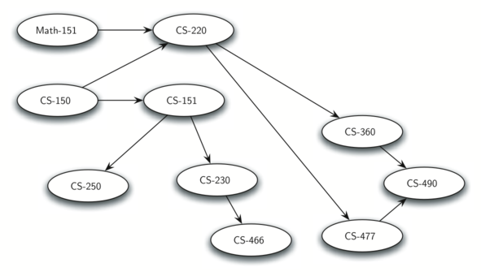

..  Copyright (C)  Brad Miller, David Ranum
    This work is licensed under the Creative Commons Attribution-NonCommercial-ShareAlike 4.0 International License. To view a copy of this license, visit http://creativecommons.org/licenses/by-nc-sa/4.0/.

Objetivos
---------

-  Aprender qué es un grafo y cómo se utiliza.

-  Implementar el tipo abstracto de datos **grafo** utilizando múltiples representaciones internas.

-  Ver cómo se pueden usar los grafos para resolver una amplia variedad de problemas.

En este capítulo estudiaremos grafos. Los grafos son una estructura más general que los árboles que estudiamos en el último capítulo; de hecho, se puede pensar en un árbol como un tipo especial de grafo. Los grafos se pueden usar para representar muchas cosas interesantes sobre nuestro mundo, incluyendo sistemas de carreteras, vuelos de avión de una ciudad a otra, cómo está conectada la Internet, o incluso la secuencia de clases que deben tomarse para completar una especialidad en ciencias de la computación. Veremos en este capítulo que una vez que tengamos una buena representación para un problema, podemos usar algunos algoritmos estándar de grafos para resolver lo que de otra manera podría parecer un problema muy difícil.

.. In this chapter we will study graphs. Graphs are a more general structure than the trees we studied in the last chapter; in fact you can think of a tree as a special kind of graph. Graphs can be used to represent many interesting things about our world, including systems of roads, airline flights from city to city, how the Internet is connected, or even the sequence of classes you must take to complete a major in computer science. We will see in this chapter that once we have a good representation for a problem, we can use some standard graph algorithms to solve what otherwise might seem to be a very difficult problem.

Si bien es relativamente fácil para los seres humanos ver mapa de carreteras y entender las relaciones entre diferentes lugares, una computadora no tiene tal conocimiento. Sin embargo, también podemos pensar en un mapa de carreteras como un grafo. Cuando lo hacemos, podemos hacer que nuestra computadora haga cosas interesantes para nosotros. Si usted alguna vez ha utilizado uno de los sitios de mapas de Internet, sabrá que una computadora puede encontrar el camino más corto, más rápido o más fácil para llegar de un lugar a otro.

.. While it is relatively easy for humans to look at a road map and understand the relationships between different places, a computer has no such knowledge. However, we can also think of a road map as a graph. When we do so we can have our computer do interesting things for us. If you have ever used one of the Internet map sites, you know that a computer can find the shortest, quickest, or easiest path from one place to another.

Como  estudiante de ciencias de la computación, usted puede preguntarse acerca de las asignaturas que debe tomar con el fin de obtener una especialidad. Un grafo es una buena manera de representar los prerrequisitos y otras interdependencias entre las asignaturas. La :ref:`Figura 1 <fig1>` muestra otro grafo. Éste representa las asignaturas y el orden en que deben ser tomadas para terminar una especialidad en ciencias de la computación en el *Luther College*.

.. As a student of computer science you may wonder about the courses you must take in order to get a major. A graph is good way to represent the prerequisites and other interdependencies among courses. :ref:`Figure 1 <fig1>` shows another graph. This one represents the courses and the order in which they must be taken to complete a major in computer science at Luther College.

.. _fig1:

    Figura 1: Prerequisitos para una especialidad en ciencias de la computación

    Figura 1: Prerequisitos para una especialidad en ciencias de la computación
