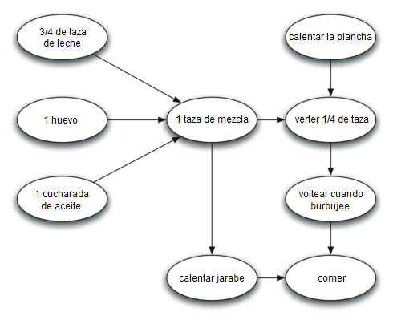
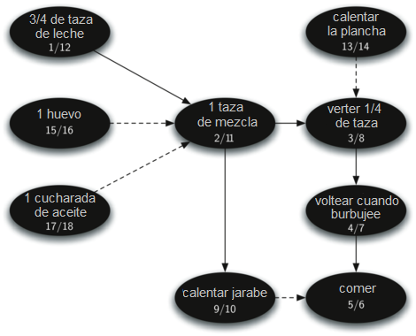
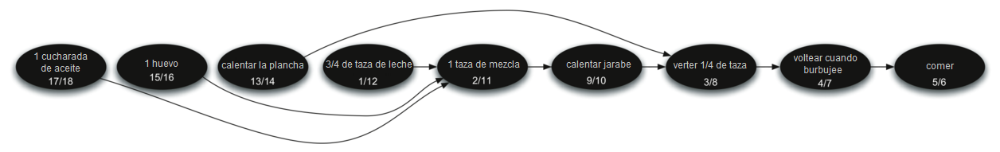

..  Copyright (C)  Brad Miller, David Ranum
    This work is licensed under the Creative Commons Attribution-NonCommercial-ShareAlike 4.0 International License. To view a copy of this license, visit http://creativecommons.org/licenses/by-nc-sa/4.0/.

Ordenamiento topológico
-----------------------

Para demostrar que los científicos de la computación pueden convertir casi cualquier cosa en un problema de grafos, consideremos el difícil problema de batir un montón de panqueques. La receta es realmente muy simple: 1 huevo, 1 taza de mezcla de panqueques, 1 cucharada de aceite y :math:`3 \over 4` de una taza de leche. Para hacer panqueques usted debe calentar la plancha, mezclar todos los ingredientes y derramar la mezcla sobre una plancha caliente. Cuando los panqueques empiecen a burbujear, déles vuelta y deje que se cocinen hasta que estén dorados en la parte de abajo. Antes de comer sus panqueques, usted querrá calentar un poco de jarabe dulce. La :ref:`Figura 27 <fig_pancakes>` ilustra este proceso como un grafo.

.. To demonstrate that computer scientists can turn just about anything into a graph problem, let’s consider the difficult problem of stirring up a batch of pancakes. The recipe is really quite simple: 1 egg, 1 cup of pancake mix, 1 tablespoon oil, and :math:`3 \over 4` cup of milk. To make pancakes you must heat the griddle, mix all the ingredients together and spoon the mix onto a hot griddle. When the pancakes start to bubble you turn them over and let them cook until they are golden brown on the bottom. Before you eat your pancakes you are going to want to heat up some syrup. :ref:`Figure 27 <fig_pancakes>` illustrates this process as a graph.

.. _fig_pancakes:

   Figura 27: Los pasos para hacer panqueques

   Figura 27: Los pasos para hacer panqueques

Lo difícil al preparar panqueques es saber qué hacer primero. Como se puede ver en la :ref:`Figura 27 <fig_pancakes>`, usted puede empezar calentando la plancha o añadiendo cualquiera de los ingredientes a la mezcla de panqueques. Para ayudarnos a decidir el orden preciso en el que debemos hacer cada uno de los pasos requeridos para hacer nuestros panqueques recurriremos a un algoritmo de grafos llamado el **ordenamiento topológico**.

.. The difficult thing about making pancakes is knowing what to do first. As you can see from :ref:`Figure 27 <fig_pancakes>` you might start by heating the griddle or by adding any of the ingredients to the pancake mix. To help us decide the precise order in which we should do each of the steps required to make our pancakes we turn to a graph algorithm called the **topological sort**.

Un ordenamiento topológico toma un grafo acíclico dirigido y produce un ordenamiento lineal de todos sus vértices de tal manera que si el grafo :math:`G` contiene una arista :math:`(v,w)` entonces el vértice :math:`v` está, en el orden, antes del vértice :math:`w`. Los grafos acíclicos dirigidos se usan en muchas aplicaciones para indicar la precedencia de los eventos. Hacer panqueques es sólo un ejemplo; otros ejemplos incluyen planificaciones de proyectos de software, grafos de precedencia para optimizar las consultas de bases de datos y la multiplicación de matrices.

.. A topological sort takes a directed acyclic graph and produces a linear ordering of all its vertices such that if the graph :math:`G` contains an edge :math:`(v,w)` then the vertex :math:`v` comes before the vertex :math:`w` in the ordering. Directed acyclic graphs are used in many applications to indicate the precedence of events. Making pancakes is just one example; other examples include software project schedules, precedence charts for optimizing database queries, and multiplying matrices.

El ordenamiento topológico es una adaptación simple pero útil de una búsqueda en profundidad. El algoritmo para el ordenamiento topológico es el siguiente:

.. The topological sort is a simple but useful adaptation of a depth first search. The algorithm for the topological sort is as follows:

#. Llamar a ``bep(g)`` para algún grafo ``g``. La principal razón por la que queremos invocar a la búsqueda en profundidad es para calcular los tiempos de finalización para cada uno de los vértices.

#. Almacenar los vértices en una lista en orden decreciente según el tiempo de finalización.

#. Devolver la lista ordenada como resultado del ordenamiento topológico.

La :ref:`Figura 28 <fig_pancakesDFS>` muestra el bosque de profundidad construido por ``bep`` para el grafo de preparación de panqueques mostrado en la :ref:`Figura 27 <fig_pancakes>`.

.. :ref:`Figure 28 <fig_pancakesDFS>` shows the depth first forest constructed by ``dfs`` on the pancake-making graph shown in :ref:`Figure 26 <fig_pancakes>`.

.. _fig_pancakesDFS:

   Figura 28: Resultado de la búsqueda en profundidad para el grafo de preparación de panqueques  

   Figura 28: Resultado de la búsqueda en profundidad para el grafo de preparación de panqueques

Por último, la :ref:`Figura 29 <fig_pancakesTS>` muestra los resultados de aplicar el algoritmo de ordenamiento topológico a nuestro grafo. Ahora se ha eliminado toda ambigüedad y sabemos exactamente el orden de los pasos para hacer panqueques.

.. Finally, :ref:`Figure 29 <fig_pancakesTS>` shows the results of applying the topological sort algorithm to our graph. Now all the ambiguity has been removed and we know exactly the order in which to perform the pancake making steps.

.. _fig_pancakesTS:

   Figura 29: Resultado del ordenamiento topológico aplicado a un grafo acíclico dirigido

   Figura 29: Resultado del ordenamiento topológico aplicado a un grafo acíclico dirigido
