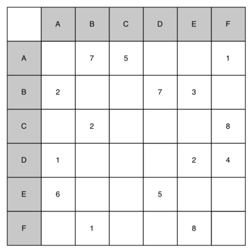

..  Copyright (C)  Brad Miller, David Ranum
    This work is licensed under the Creative Commons Attribution-NonCommercial-ShareAlike 4.0 International License. To view a copy of this license, visit http://creativecommons.org/licenses/by-nc-sa/4.0/.

Preguntas de discusión
----------------------

#. Dibuje el grafo correspondiente a la siguiente matriz de adyacencia.

2. Dibuje el grafo correspondiente a la siguiente lista de aristas.

   .. table:: 

           +--------+------+--------+
           | de     | a    | costo  |
           +========+======+========+
           | 1      | 2    | 10     |
           +--------+------+--------+
           | 1      | 3    | 15     |
           +--------+------+--------+
           | 1      | 6    | 5      |
           +--------+------+--------+
           | 2      | 3    | 7      |
           +--------+------+--------+
           | 3      | 4    | 7      |
           +--------+------+--------+
           | 3      | 6    | 10     |
           +--------+------+--------+
           | 4      | 5    | 7      |
           +--------+------+--------+
           | 6      | 4    | 5      |
           +--------+------+--------+
           | 5      | 6    | 13     |
           +--------+------+--------+

3. Haciendo caso omiso de las ponderaciones, realice una búsqueda en anchura en el grafo de la pregunta anterior.

4. ¿Cuál es el tiempo de jecución O-grande de la función ``construirGrafo``?

5. Deduzca el tiempo de ejecución O-grande para el algoritmo de ordenamiento topológico.

6. Deduzca el tiempo de ejecución O-grande para el algoritmo de componentes fuertemente conectados.

7. Muestre cada paso al aplicar el algoritmo de Dijkstra al grafo mostrado arriba.

8. Usando el algoritmo de Prim, encuentre el árbol de expansión de ponderación mínima para el grafo mostrado arriba.

9. Dibuje un grafo de dependencias que ilustre los pasos necesarios para enviar un correo electrónico. Realice un ordenamiento topológico de su grafo.

10. Deduzca una expresión para la base del exponente que se usa para expresar el tiempo de ejecución de la gira del caballo.

11. Explique por qué el algoritmo de BEP general no es adecuado para resolver el problema de la gira del caballo.

12. ¿Cuál es el tiempo de ejecución O-grande para el algoritmo de Prim del árbol de expansión mínimo?
