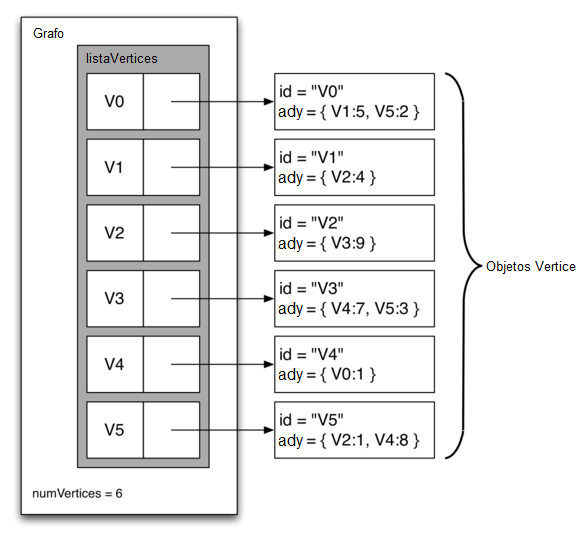

..  Copyright (C)  Brad Miller, David Ranum
    This work is licensed under the Creative Commons Attribution-NonCommercial-ShareAlike 4.0 International License. To view a copy of this license, visit http://creativecommons.org/licenses/by-nc-sa/4.0/.

Una lista de adyacencia
~~~~~~~~~~~~~~~~~~~~~~~

Una forma más eficiente, respecto al uso del espacio, de implementar un grafo conectado de forma rala es usar una lista de adyacencia. En una implementación de lista de adyacencia mantenemos una lista maestra de todos los vértices en el objeto Grafo y además cada objeto Vértice en el grafo mantiene una lista de los otros vértices a los que está conectado. En nuestra implementación de la clase ``Vertice`` usaremos un diccionario en lugar de una lista donde las claves del diccionario son los vértices, y los valores son las ponderaciones. La :ref:`Figura 4 <fig_adjlist>` ilustra la representación mediante una lista de adyacencia para el grafo de la :ref:`Figura 2 <fig_dgsimple>`.

.. A more space-efficient way to implement a sparsely connected graph is to use an adjacency list. In an adjacency list implementation we keep a master list of all the vertices in the Graph object and then each vertex object in the graph maintains a list of the other vertices that it is connected to. In our implementation of the ``Vertex`` class we will use a dictionary rather than a list where the dictionary keys are the vertices, and the values are the weights. :ref:`Figure 4 <fig_adjlist>` illustrates the adjacency list representation for the graph in :ref:`Figure 2 <fig_dgsimple>`.

.. _fig_adjlist:

   Figura 4: Representación mediante una lista de adyacencia de un grafo

   Figura 4: Representación mediante una lista de adyacencia de un grafo

La ventaja de la implementación mediante una lista de adyacencia es que nos permite representar de forma compacta un grafo ralo. La lista de adyacencia también nos permite encontrar fácilmente todos los enlaces que están directamente conectados a un vértice particular.

.. The advantage of the adjacency list implementation is that it allows us to compactly represent a sparse graph. The adjacency list also allows us to easily find all the links that are directly connected to a particular vertex.
