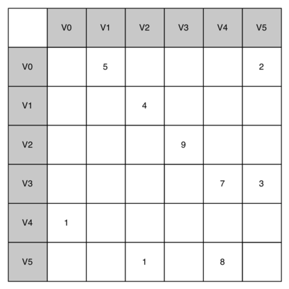

..  Copyright (C)  Brad Miller, David Ranum
    This work is licensed under the Creative Commons Attribution-NonCommercial-ShareAlike 4.0 International License. To view a copy of this license, visit http://creativecommons.org/licenses/by-nc-sa/4.0/.

Una matriz de adyacencia
~~~~~~~~~~~~~~~~~~~~~~~~

Una de las maneras más fáciles de implementar un grafo es usar una matriz bidimensional. En esta implementación de matriz, cada una de las filas y columnas representa un vértice en el grafo. El valor que se almacena en la celda en la intersección de la fila :math:`v` y la columna :math:`w` indica si hay una arista desde el vértice :math:`v` al vértice :math:`w`. Cuando dos vértices están conectados por una arista, decimos que son **adyacentes**. La :ref:`Figura 3 <fig_adjmat>` ilustra la matriz de adyacencia para el grafo de la :ref:`Figura 2 <fig_dgsimple>`. Un valor en una celda representa la ponderación de la arista que une el vértice :math:`v` con el vértice :math:`w`.

.. One of the easiest ways to implement a graph is to use a two-dimensional matrix. In this matrix implementation, each of the rows and columns represent a vertex in the graph. The value that is stored in the cell at the intersection of row :math:`v` and column :math:`w` indicates if there is an edge from vertex :math:`v` to vertex :math:`w`. When two vertices are connected by an edge, we say that they are **adjacent**. :ref:`Figure 3 <fig_adjmat>` illustrates the adjacency matrix for the graph in :ref:`Figure 2 <fig_dgsimple>`. A value in a cell represents the weight of the edge from vertex :math:`v` to vertex :math:`w`.

.. _fig_adjmat:

   Figura 3: Una representación de un grafo mediante una matriz de adyacencia

   Figura 3: Una representación de un grafo mediante una matriz de adyacencia

La ventaja de la matriz de adyacencia es que es simple, y que para grafos pequeños es fácil ver qué nodos están conectados a otros nodos. Sin embargo, note que la mayoría de las celdas de la matriz están vacías. Dado que la mayoría de las celdas están vacías decimos que esta matriz es “rala”. Una matriz no es una forma muy eficiente de almacenar datos ralos. De hecho, en Python usted debe incluso esforzarse por crear una estructura de matriz como la de la :ref:`Figura 3 <fig_adjmat>`.

.. The advantage of the adjacency matrix is that it is simple, and for small graphs it is easy to see which nodes are connected to other nodes. However, notice that most of the cells in the matrix are empty. Because most of the cells are empty we say that this matrix is “sparse.” A matrix is not a very efficient way to store sparse data. In fact, in Python you must go out of your way to even create a matrix structure like the one in :ref:`Figure 3 <fig_adjmat>`.

La matriz de adyacencia es una buena implementación para un grafo cuando el número de aristas es grande. Pero ¿qué entendemos por grande? ¿Cuántas aristas se necesitarían para llenar la matriz? Puesto que hay una fila y una columna para cada vértice en el grafo, el número de aristas requeridas para llenar la matriz es :math:`|V|^2`. Una matriz está llena cuando cada vértice está conectado a todos los otros vértices. Hay pocos problemas reales que se aproximan a este tipo de conectividad. Los problemas que veremos en este capítulo se refieren a grafos que están conectados de forma rala.

.. The adjacency matrix is a good implementation for a graph when the number of edges is large. But what do we mean by large? How many edges would be needed to fill the matrix? Since there is one row and one column for every vertex in the graph, the number of edges required to fill the matrix is :math:`|V|^2`. A matrix is full when every vertex is connected to every other vertex. There are few real problems that approach this sort of connectivity. The problems we will look at in this chapter all involve graphs that are sparsely connected.
