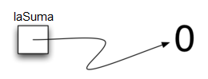
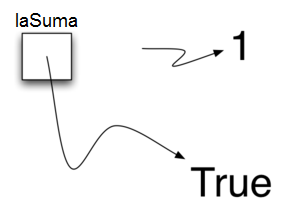

..  Copyright (C)  Brad Miller, David Ranum
    This work is licensed under the Creative Commons Attribution-NonCommercial-ShareAlike 4.0 International License. To view a copy of this license, visit http://creativecommons.org/licenses/by-nc-sa/4.0/.

Comencemos con los datos
~~~~~~~~~~~~~~~~~~~~~~~~

Hemos dicho anteriormente que Python soporta el paradigma de programación orientado a objetos. Esto significa que Python considera que los datos son el punto focal del proceso de solución de problemas. En Python, así como en cualquier otro lenguaje de programación orientado a objetos, definimos una **clase** como una descripción de cómo lucen los datos (el estado) y lo que los datos pueden hacer (el comportamiento). Las clases son análogas a los tipos abstractos de datos porque un usuario de una clase sólo ve el estado y el comportamiento de un ítem de datos. Los ítems de datos se llaman **objetos** en el paradigma orientado a objetos. Un objeto es una instancia de una clase.

.. We stated above that Python supports the object-oriented programming paradigm. This means that Python considers data to be the focal point of the problem-solving process. In Python, as well as in any other object-oriented programming language, we define a **class** to be a description of what the data look like (the state) and what the data can do (the behavior). Classes are analogous to abstract data types because a user of a class only sees the state and behavior of a data item. Data items are called **objects** in the object-oriented paradigm. An object is an instance of a class.

Tipos de datos atómicos incorporados
^^^^^^^^^^^^^^^^^^^^^^^^^^^^^^^^^^^^

Comenzaremos nuestro repaso considerando los tipos de datos atómicos. Python tiene dos clases numéricas incorporadas principales que implementan los tipos de datos enteros y de punto flotante. Estas clases de Python se llaman ``int`` y ``float``. Las operaciones aritméticas estándar, +, -, \*, /, y \*\* (potenciación), pueden utilizarse con paréntesis para forzar que el orden de las operaciones se aleje de la precedencia normal del operador. Otras operaciones muy útiles son el operador de residuo (módulo), %, y la división entera, //. Tenga en cuenta que cuando se dividen dos enteros, el resultado es de punto flotante. El operador de división entera devuelve la porción entera del cociente truncando cualquier parte fraccionaria.

.. We will begin our review by considering the atomic data types. Python has two main built-in numeric classes that implement the integer and floating point data types. These Python classes are called ``int`` and ``float``. The standard arithmetic operations, +, -, \*, /, and \*\* (exponentiation), can be used with parentheses forcing the order of operations away from normal operator precedence. Other very useful operations are the remainder (modulo) operator, %, and integer division, //. Note that when two integers are divided, the result is a floating point. The integer division operator returns the integer portion of the quotient by truncating any fractional part.

.. activecode:: intro_1
    :caption: Operadores aritméticos básicos

    print(2+3*4)
    print((2+3)*4)
    print(2**10)
    print(6/3)
    print(7/3)
    print(7//3)
    print(7%3)
    print(3/6)
    print(3//6)
    print(3%6)
    print(2**100)

El tipo de datos booleano, implementado como la clase ``bool`` de Python, será muy útil para representar valores de verdad. Los posibles valores de estado para un objeto booleano son ``True`` y ``False`` con los operadores booleanos estándar, ``and``, ``or`` y ``not``.

.. The boolean data type, implemented as the Python ``bool`` class, will be quite useful for representing truth values. The possible state values for a boolean object are ``True`` and ``False`` with the standard boolean operators, ``and``, ``or``, and ``not``.

::

    >>> True
    True
    >>> False
    False
    >>> False or True
    True
    >>> not (False or True)
    False
    >>> True and True
    True

Los objetos de datos booleanos también se utilizan como resultados para operadores de comparación tales como igualdad (==) y mayor que (:math:`>`). Además, los operadores relacionales y los operadores lógicos pueden combinarse para formar preguntas lógicas complejas. La :ref:`Tabla 1 <tab_relational>` muestra los operadores relacionales y lógicos con ejemplos mostrados en la sesión que sigue a continuación.

.. Boolean data objects are also used as results for comparison operators such as equality (==) and greater than (:math:`>`). In addition, relational operators and logical operators can be combined together to form complex logical questions. :ref:`Table 1 <tab_relational>` shows the relational and logical operators with examples shown in the session that follows.

.. _tab_relational:

.. table:: **Tabla 1: Operadores relacionales y lógicos**

    =========================== ============== =================================================================================
     **Nombre de la operación**   **Operador**                                                                   **Explicación**
    =========================== ============== =================================================================================
                      menor que    :math:`<`                                                                  Operador menor que
                      mayor que    :math:`>`                                                                  Operador mayor que
              menor que o igual   :math:`<=`                                                        Operador menor que o igual a
              mayor que o igual   :math:`>=`                                                        Operador mayor que o igual a
                          igual   :math:`==`                                                                Operador de igualdad
                       no igual   :math:`!=`                                                             Operador de no igualdad
                     and lógica   :math:`and`                      Ambos operandos deben ser True para que el resultado sea True
                      or lógica   :math:`or`                   Al menos un operando debe ser True para que el resultado sea True
                     not lógica  :math:`not`    Niega el valor de verdad. si es False lo vuelve True, si es True lo vuelve False
    =========================== ============== =================================================================================

.. activecode:: intro_2
    :caption: Operadores relacionales y lógicos básicos

    print(5==10)
    print(10 > 5)
    print((5 >= 1) and (5 <= 10))

Los identificadores se utilizan en los lenguajes de programación como nombres. En Python, los identificadores comienzan con una letra o un guión bajo (_), son sensibles a mayúsculas y minúsculas, y pueden ser de cualquier longitud. Recuerde que siempre es una buena idea usar nombres que tengan significado para que su código de programa sea más fácil de leer y entender.

.. Identifiers are used in programming languages as names. In Python, identifiers start with a letter or an underscore (_), are case sensitive, and can be of any length. Remember that it is always a good idea to use names that convey meaning so that your program code is easier to read and understand.

Una variable en Python se crea cuando se utiliza un nombre por primera vez en el lado izquierdo de una instrucción de asignación. Las instrucciones de asignación proporcionan una forma de asociar un nombre a un valor. La variable contendrá una referencia a una pieza de datos y no a los datos en sí. Considere la siguiente sesión:

.. A Python variable is created when a name is used for the first time on the left-hand side of an assignment statement. Assignment statements provide a way to associate a name with a value. The variable will hold a reference to a piece of data and not the data itself. Consider the following session:

::

    >>> laSuma = 0
    >>> laSuma
    0
    >>> laSuma = laSuma + 1
    >>> laSuma
    1
    >>> laSuma = True
    >>> laSuma
    True

La instrucción de asignación ``laSuma = 0`` crea una variable llamada ``laSuma`` y le permite contener la referencia al objeto de datos ``0`` (ver la :ref:`Figura 3 <fig_assignment1>`). En general, se evalúa el lado derecho de la instrucción de asignación y se asigna una referencia al objeto de datos resultante al nombre en el lado izquierdo. En este punto de nuestro ejemplo, el tipo de la variable es entero, ya que es el tipo de los datos a los que se refiere actualmente ``laSuma``. Si el tipo de datos cambia (véase la :ref:`Figura 4 <fig_assignment2>`), como se muestra arriba con el valor booleano ``True``, también cambia el tipo de la variable (``laSuma`` es ahora de tipo booleano). La instrucción de asignación cambia la referencia que está siendo retenida por la variable. Ésta es una característica dinámica de Python. La misma variable puede referirse a muchos tipos diferentes de datos.

.. The assignment statement ``theSum = 0`` creates a variable called ``theSum`` and lets it hold the reference to the data object ``0`` (see :ref:`Figure 3 <fig_assignment1>`). In general, the right-hand side of the assignment statement is evaluated and a reference to the resulting data object is “assigned” to the name on the left-hand side. At this point in our example, the type of the variable is integer as that is the type of the data currently being referred to by ``theSum``. If the type of the data changes (see :ref:`Figure 4 <fig_assignment2>`), as shown above with the boolean value ``True``, so does the type of the variable (``theSum`` is now of the type boolean). The assignment statement changes the reference being held by the variable. This is a dynamic characteristic of Python. The same variable can refer to many different types of data.

.. _fig_assignment1:

   Figura 3: Las variables contienen referencias a los objetos de datos
   
   Figura 3: Las variables contienen referencias a los objetos de datos

.. _fig_assignment2:

   Figura 4: La asignación cambia la referencia
   
   Figura 4: La asignación cambia la referencia

Tipos de datos de colecciones incorporados
^^^^^^^^^^^^^^^^^^^^^^^^^^^^^^^^^^^^^^^^^^

Además de las clases numéricas y booleanas, Python tiene una serie de clases de colecciones muy potentes. Las listas, las cadenas y las tuplas son colecciones ordenadas muy similares en la estructura general pero que tienen diferencias específicas que deben ser entendidas para que sean usadas correctamente. Los conjuntos y los diccionarios son colecciones no ordenadas.

.. In addition to the numeric and boolean classes, Python has a number of very powerful built-in collection classes. Lists, strings, and tuples are ordered collections that are very similar in general structure but have specific differences that must be understood for them to be used properly. Sets and dictionaries are unordered collections.

Una **lista** es una colección ordenada de cero o más referencias a objetos de datos de Python. Las listas se escriben como valores delimitados por comas encerrados entre corchetes. La lista vacía es simplemente ``[ ]``. Las listas son heterogéneas, lo que significa que los objetos de datos no necesitan ser todos de la misma clase y la colección se puede asignar a una variable como se muestra a continuación. El siguiente fragmento muestra una variedad de objetos de datos de Python en una lista.

.. A **list** is an ordered collection of zero or more references to Python data objects. Lists are written as comma-delimited values enclosed in square brackets. The empty list is simply ``[ ]``. Lists are heterogeneous, meaning that the data objects need not all be from the same class and the collection can be assigned to a variable as below. The following fragment shows a variety of Python data objects in a list.

::

    >>> [1,3,True,6.5]
    [1, 3, True, 6.5]
    >>> miLista = [1,3,True,6.5]
    >>> miLista
    [1, 3, True, 6.5]

Tenga en cuenta que cuando Python evalúa una lista, la misma lista es devuelta. Sin embargo, con el fin de recordar la lista para un procesamiento posterior, su referencia debe asignarse a una variable.

.. Note that when Python evaluates a list, the list itself is returned. However, in order to remember the list for later processing, its reference needs to be assigned to a variable.

Dado que las listas se consideran ordenadas secuencialmente, admiten varias operaciones que se pueden aplicar a cualquier secuencia de Python. La :ref:`Tabla 2 <tab_sequence>` compendia estas operaciones y la sesión subsiguiente da ejemplos de su uso.

.. Since lists are considered to be sequentially ordered, they support a number of operations that can be applied to any Python sequence. :ref:`Table 2 <tab_sequence>` reviews these operations and the following session gives examples of their use.

.. _tab_sequence:

.. table:: **Tabla 2: Operaciones sobre cualquier secuencia en Python**

    =========================== ============== ===========================================
     **Nombre de la operación**   **Operador**                             **Explicación**
    =========================== ============== ===========================================
                     indización            [ ]        Acceso a un elemento de la secuencia
                  concatenación             \+                          Combina secuencias
                     repetición             \*       Concatena un número repetido de veces
                      membresía             in   Pregunta si un ítem está en una secuencia
                       longitud            len Pregunta el número de ítems en la secuencia
                      partición          [ : ]           Extrae una parte de una secuencia
    =========================== ============== ===========================================

Note que los índices para las listas (secuencias) comienzan contando en 0. La operación de partición, miLista[1:3], devuelve una lista de ítems que empieza con el ítem indizado por 1 y que va hasta el ítem indizado por 3 pero sin incluirlo.

.. Note that the indices for lists (sequences) start counting with 0. The slice operation, myList[1:3], returns a list of items starting with the item indexed by 1 up to but not including the item indexed by 3.

A veces, usted querrá inicializar una lista. Esto se puede lograr rápidamente usando la repetición. Por ejemplo,

.. Sometimes, you will want to initialize a list. This can quickly be accomplished by using repetition. For example,

::

    >>> miLista = [0] * 6
    >>> miLista
    [0, 0, 0, 0, 0, 0]

Un aspecto muy importante relacionado con el operador de repetición es que el resultado es una repetición de referencias a los objetos de datos en la secuencia. Esto puede verse mejor considerando la siguiente sesión:

.. One very important aside relating to the repetition operator is that the result is a repetition of references to the data objects in the sequence. This can best be seen by considering the following session:

.. activecode:: intro_3
    :caption: Repetición de referencias

    miLista = [1,2,3,4]
    A = [miLista]*3
    print(A)
    miLista[2]=45
    print(A)

La variable ``A`` contiene una colección de tres referencias a la lista original llamada ``miLista``. Tenga en cuenta que un cambio a un elemento de ``miLista`` se refleja en las tres apariciones en ``A``.

.. The variable ``A`` holds a collection of three references to the original list called ``myList``. Note that a change to one element of ``myList`` shows up in all three occurrences in ``A``.

Las listas admiten varios métodos que se utilizarán para crear estructuras de datos. La :ref:`Tabla 3 <tab_listmethods>` proporciona un resumen. Después se muestran ejemplos de su uso.

.. Lists support a number of methods that will be used to build data structures. :ref:`Table 3 <tab_listmethods>` provides a summary. Examples of their use follow.

.. _tab_listmethods:

.. table:: **Tabla 3: Métodos suministrados por las listas en Python**

    ======================== =========================== =======================================================
       **Nombre del método**                     **Uso**                                         **Explicación**
    ======================== =========================== =======================================================
                  ``append``   ``unaLista.append(item)``              Agrega un nuevo ítem al final de una lista
                  ``insert`` ``unaLista.insert(i,item)``     Inserta un ítem en la i-ésima posición en una lista
                     ``pop``          ``unaLista.pop()``          Elimina y devuelve el último ítem de una lista
                     ``pop``         ``unaLista.pop(i)``         Elimina y devuelve el i-ésimo ítem en una lista
                    ``sort``         ``unaLista.sort()``                       Modifica una lista para que quede ordenada
                 ``reverse``      ``unaLista.reverse()``      Modifica una lista para que quede en orden inverso
                     ``del``         ``del unaLista[i]``                    Borra el ítem en la i-ésima posición
                   ``index``    ``unaLista.index(item)``  Devuelve el índice de la primera aparición de ``item``
                   ``count``    ``unaLista.count(item)``           Devuelve el número de apariciones de ``item``
                  ``remove``   ``unaLista.remove(item)``                Elimina la primera aparición de ``item``
    ======================== =========================== =======================================================

.. activecode:: intro_5
    :caption: Ejemplos de métodos de las listas

    miLista = [1024, 3, True, 6.5]
    miLista.append(False)
    print(miLista)
    miLista.insert(2,4.5)
    print(miLista)
    print(miLista.pop())
    print(miLista)
    print(miLista.pop(1))
    print(miLista)
    miLista.pop(2)
    print(miLista)
    miLista.sort()
    print(miLista)
    miLista.reverse()
    print(miLista)
    print(miLista.count(6.5))
    print(miLista.index(4.5))
    miLista.remove(6.5)
    print(miLista)
    del miLista[0]
    print(miLista)

Usted puede ver que algunos de los métodos, como ``pop``, devuelven un valor y también modifican la lista. Otros, como ``reverse``, simplemente modifican la lista sin devolver valor. ``pop`` actuará por defecto sobre el final de la lista, pero también puede eliminar y devolver un ítem específico. El rango de índices que comienza a partir de 0 se utiliza de nuevo para estos métodos. Usted también debe fijarse en la notación familiar de “punto” para pedir a un objeto que invoque un método. ``miLista.append (False)`` se puede leer como “pedir al objeto ``miLista`` que ejecute su método ``append`` y le envíe el valor ``False``”. Incluso objetos de datos simples tales como los enteros pueden invocar métodos de esta manera.

.. You can see that some of the methods, such as ``pop``, return a value and also modify the list. Others, such as ``reverse``, simply modify the list with no return value. ``pop`` will default to the end of the list but can also remove and return a specific item. The index range starting from 0 is again used for these methods. You should also notice the familiar “dot” notation for asking an object to invoke a method. ``myList.append(False)`` can be read as “ask the object ``myList`` to perform its ``append`` method and send it the value ``False``.” Even simple data objects such as integers can invoke methods in this way.

::

    >>> (54).__add__(21)
    75
    >>>

En este fragmento pedimos al objeto entero ``54`` que ejecute su método ``add`` (llamado ``__add__`` en Python) y le pasemos ``21`` como el valor a sumar. El resultado es la suma, ``75``. Por supuesto, solemos escribir esto como ``54 + 21``. Diremos mucho más sobre estos métodos más adelante en esta sección.

.. In this fragment we are asking the integer object ``54`` to execute its ``add`` method (called ``__add__`` in Python) and passing it ``21`` as the value to add. The result is the sum, ``75``. Of course, we usually write this as ``54+21``. We will say much more about these methods later in this section.

Una función común de Python que se discute a menudo junto con las listas es la función ``range``. ``range`` produce un objeto range que representa una secuencia de valores. Mediante el uso de la función ``list``, es posible ver el valor del objeto range como una lista. Esto se ilustra a continuación.

.. One common Python function that is often discussed in conjunction with lists is the ``range`` function. ``range`` produces a range object that represents a sequence of values. By using the ``list`` function, it is possible to see the value of the range object as a list. This is illustrated below.

::

    >>> range(10)
    range(0, 10)
    >>> list(range(10))
    [0, 1, 2, 3, 4, 5, 6, 7, 8, 9]
    >>> range(5,10)
    range(5, 10)
    >>> list(range(5,10))
    [5, 6, 7, 8, 9]
    >>> list(range(5,10,2))
    [5, 7, 9]
    >>> list(range(10,1,-1))
    [10, 9, 8, 7, 6, 5, 4, 3, 2]
    >>>

El objeto range representa una secuencia de enteros. Por defecto, iniciará con 0. Si se proporcionan más parámetros, iniciará y finalizará en determinados puntos e incluso puede omitir ítems. En nuestro primer ejemplo, ``range(10)``, la secuencia comienza con 0 y va hasta pero no incluye a 10. En nuestro segundo ejemplo, ``range(5,10)`` comienza en 5 y va hasta pero no incluye a 10. ``range (5,10,2)`` se comporta de manera similar, pero omite valores de dos en dos (nuevamente, 10 no está incluido).

.. The range object represents a sequence of integers. By default, it will start with 0. If you provide more parameters, it will start and end at particular points and can even skip items. In our first example, ``range(10)``, the sequence starts with 0 and goes up to but does not include 10. In our second example, ``range(5,10)`` starts at 5 and goes up to but not including 10. ``range(5,10,2)`` performs similarly but skips by twos (again, 10 is not included).

Las **cadenas** son colecciones secuenciales de cero o más letras, números y otros símbolos. Llamamos a estas letras, números y otros símbolos *caracteres*. Los valores de las cadenas literales se diferencian de los identificadores mediante el uso de comillas (simples o dobles).

.. **Strings** are sequential collections of zero or more letters, numbers and other symbols. We call these letters, numbers and other symbols *characters*. Literal string values are differentiated from identifiers by using quotation marks (either single or double).

::

    >>> "David"
    'David'
    >>> miNombre = "David"
    >>> miNombre[3]
    'i'
    >>> miNombre*2
    'DavidDavid'
    >>> len(miNombre)
    5
    >>>

Dado que las cadenas son secuencias, todas las operaciones para secuencias descritas anteriormente funcionan como se esperaría. Además, las cadenas tienen una serie de métodos, algunos de los cuales se muestran en la :ref:`Tabla 4<tab_stringmethods>`. Por ejemplo,

.. Since strings are sequences, all of the sequence operations described above work as you would expect. In addition, strings have a number of methods, some of which are shown in :ref:`Table 4<tab_stringmethods>`. For example,

::

    >>> miNombre
    'David'
    >>> miNombre.upper()
    'DAVID'
    >>> miNombre.center(10)
    '  David   '
    >>> miNombre.find('v')
    2
    >>> miNombre.split('v')
    ['Da', 'id']

De estos métodos, ``split`` será muy útil para el procesamiento de datos. ``split`` tomará una cadena y devolverá una lista de cadenas usando el caracter especificado en el argumento como punto de división. En el ejemplo, ``v`` es el punto de división. Si no se especifica ninguna división, el método split busca caracteres de espacios en blanco como tabulación, nueva línea y espacio.

.. Of these, ``split`` will be very useful for processing data. ``split`` will take a string and return a list of strings using the split character as a division point. In the example, ``v`` is the division point. If no division is specified, the split method looks for whitespace characters such as tab, newline and space.

.. _tab_stringmethods:

.. table:: **Tabla 4: Métodos suministrados por las cadenas en Python**

    ====================== ============================ ==========================================================================
     **Nombre del método**                    **Uso**                                                            **Explicación**
    ====================== ============================ ==========================================================================
                ``center``      ``unaCadena.center(w)``                   Devuelve una cadena centrada en un campo de tamaño ``w``
                 ``count``    ``unaCadena.count(item)``                 Devuelve el número de apariciones de ``item`` en la cadena
                 ``ljust``       ``unaCadena.ljust(w)`` Devuelve una cadena justificada a la izquierda en un campo de tamaño ``w``
                 ``lower``        ``unaCadena.lower()``                                          Devuelve una cadena en minúsculas
                 ``rjust``       ``unaCadena.rjust(w)``   Devuelve una cadena justificada a la derecha en un campo de tamaño ``w``
                  ``find``     ``unaCadena.find(item)``                     Devuelve el índice de la primera aparición de ``item``
                 ``split``  ``unaCadena.split(cardiv)``                              Divide una cadena en subcadenas en ``cardiv``
    ====================== ============================ ==========================================================================

Una diferencia importante entre las listas y las cadenas es que las listas se pueden modificar mientras que las secuencias no pueden ser modificadas. Esto se conoce como **mutabilidad**. Las listas son mutables; Las cadenas son inmutables. Por ejemplo, usted puede cambiar un ítem de una lista mediante la indización y la asignación. Con una cadena tal cambio no está permitido.

.. A major difference between lists and strings is that lists can be modified while strings cannot. This is referred to as **mutability**. Lists are mutable; strings are immutable. For example, you can change an item in a list by using indexing and assignment. With a string that change is not allowed.

::

    >>> miLista
    [1, 3, True, 6.5]
    >>> miLista[0]=2**10
    >>> miLista
    [1024, 3, True, 6.5]
    >>>
    >>> miNombre
    'David'
    >>> miNombre[0]='X'

    Traceback (most recent call last):
      File "<pyshell#84>", line 1, in -toplevel-
        miNombre[0]='X'
    TypeError: object doesn't support item assignment
    >>>

Las tuplas son muy similares a las listas en que son secuencias heterogéneas de datos. La diferencia es que una tupla es inmutable, como una cadena. No se puede cambiar una tupla. Las tuplas se escriben como valores delimitados por comas encerrados entre paréntesis. Como secuencias, pueden utilizar cualquier operación descrita anteriormente. Por ejemplo,

.. Tuples are very similar to lists in that they are heterogeneous sequences of data. The difference is that a tuple is immutable, like a string. A tuple cannot be changed. Tuples are written as comma-delimited values enclosed in parentheses. As sequences, they can use any operation described above. For example,

::

    >>> miTupla = (2,True,4.96)
    >>> miTupla
    (2, True, 4.96)
    >>> len(miTupla)
    3
    >>> miTupla[0]
    2
    >>> miTupla * 3
    (2, True, 4.96, 2, True, 4.96, 2, True, 4.96)
    >>> miTupla[0:2]
    (2, True)
    >>>

Sin embargo, si usted intenta cambiar un ítem en una tupla, obtendrá un error. Note que el mensaje de error proporciona la ubicación y el motivo del problema.

.. However, if you try to change an item in a tuple, you will get an error. Note that the error message provides location and reason for the problem.

::

    >>> miTupla[1]=False

    Traceback (most recent call last):
      File "<pyshell#137>", line 1, in -toplevel-
        miTupla[1]=False
    TypeError: object doesn't support item assignment
    >>>

Un conjunto es una colección no ordenada de cero o más objetos de datos de Python inmutables. Los conjuntos no permiten duplicaciones y se escriben como valores delimitados por comas encerrados entre llaves. El conjunto vacío está representado por ``set()``. Los conjuntos son heterogéneos y la colección se puede asignar a una variable como se muestra a continuación.

.. A set is an unordered collection of zero or more immutable Python data objects. Sets do not allow duplicates and are written as comma-delimited values enclosed in curly braces. The empty set is represented by ``set()``. Sets are heterogeneous, and the collection can be assigned to a variable as below.

::

    >>> {3,6,"gato",4.5,False}
    {False, 4.5, 3, 6, 'gato'}
    >>> miConjunto = {3,6,"gato",4.5,False}
    >>> miConjunto
    {False, 4.5, 3, 6, 'gato'}
    >>>

Aunque los conjuntos no se consideran secuenciales, sí soportan algunas de las operaciones conocidas qe fueron presentadas anteriormente. La :ref:`Tabla 5 <tab_setops>` compendia estas operaciones y la siguiente sesión da ejemplos de su uso.

.. Even though sets are not considered to be sequential, they do support a few of the familiar operations presented earlier. :ref:`Table 5 <tab_setops>` reviews these operations and the following session gives examples of their use.

.. _tab_setops:

.. table:: **Tabla 5: Operaciones sobre un conjunto en Python**

    =========================== =============================== =============================================================================================
     **Nombre de la operación**                    **Operador**                                                                               **Explicación**
    =========================== =============================== =============================================================================================
                      membresía                              in                                                                        Membresía del conjunto
                       longitud                             len                                                         Devuelve la cardinalidad del conjunto
                          ``|``   ``unConjunto | otroConjunto``                         Devuelve un nuevo conjunto con todos los elementos de ambos conjuntos
                          ``&``   ``unConjunto & otroConjunto``                   Devuelve un nuevo conjunto con sólo los elementos comunes a ambos conjuntos
                          ``-``   ``unConjunto - otroConjunto`` Devuelve un nuevo conjunto con todos los ítems del primer conjunto que no están en el segundo
                         ``<=``  ``unConjunto <= otroConjunto``                       Pregunta si todos los elementos del primer conjunto están en el segundo
    =========================== =============================== =============================================================================================

::

    >>> miConjunto
    {False, 4.5, 3, 6, 'gato'}
    >>> len(miConjunto)
    5
    >>> False in miConjunto
    True
    >>> "perro" in miConjunto
    False
    >>>

Los conjuntos soportan una serie de métodos que deben ser familiares para aquellos que han trabajado con ellos en el contexto de las matemáticas. La :ref:`Tabla 6 <tab_setmethods>` proporciona un resumen de ellos. Siguen ejemplos de su uso. Tenga en cuenta que ``union``, ``intersection``, ``issubset`` y ``difference`` tienen operadores que también se pueden utilizar.

.. Sets support a number of methods that should be familiar to those who have worked with them in a mathematics setting. :ref:`Table 6 <tab_setmethods>` provides a summary. Examples of their use follow. Note that ``union``, ``intersection``, ``issubset``, and ``difference`` all have operators that can be used as well.

.. _tab_setmethods:

.. table:: **Tabla 6: Métodos proporcionados por los conjuntos en Python**

    ======================== =========================================== =================================================================================================
       **Nombre del método**                                     **Uso**                                                                                   **Explicación**
    ======================== =========================================== =================================================================================================
                   ``union``          ``unConjunto.union(otroConjunto)``                             Devuelve un nuevo conjunto con todos los elementos de ambos conjuntos
            ``intersection``   ``unConjunto.intersection(otroConjunto)``                       Devuelve un nuevo conjunto con sólo los elementos comunes a ambos conjuntos
              ``difference``     ``unConjunto.difference(otroConjunto)`` Devuelve un nuevo conjunto con todos los elementos del primer conjunto que no están en el segundo
                ``issubset``       ``unConjunto.issubset(otroConjunto)``                                   Pregunta si todos los elementos de un conjunto están en el otro
                     ``add``                    ``unConjunto.add(item)``                                                                        Añade ``item`` al conjunto
                  ``remove``                 ``unConjunto.remove(item)``                                                                     Elimina ``item`` del conjunto
                     ``pop``                        ``unConjunto.pop()``                                                       Elimina un elemento arbitrario del conjunto
                   ``clear``                      ``unConjunto.clear()``                                                          Elimina todos los elementos del conjunto
    ======================== =========================================== =================================================================================================

::

    >>> miConjunto
    {False, 4.5, 3, 6, 'gato'}
    >>> tuConjunto = {99,3,100}
    >>> miConjunto.union(tuConjunto)
    {False, 4.5, 3, 100, 6, 'gato', 99}
    >>> miConjunto | tuConjunto
    {False, 4.5, 3, 100, 6, 'gato', 99}
    >>> miConjunto.intersection(tuConjunto)
    {3}
    >>> miConjunto & tuConjunto
    {3}
    >>> miConjunto.difference(tuConjunto)
    {False, 4.5, 6, 'gato'}
    >>> miConjunto - tuConjunto
    {False, 4.5, 6, 'gato'}
    >>> {3,100}.issubset(tuConjunto)
    True
    >>> {3,100}<=tuConjunto
    True
    >>> miConjunto.add("casa")
    >>> miConjunto
    {False, 4.5, 3, 6, 'casa', 'gato'}
    >>> miConjunto.remove(4.5)
    >>> miConjunto
    {False, 3, 6, 'casa', 'gato'}
    >>> miConjunto.pop()
    False
    >>> miConjunto
    {3, 6, 'casa', 'gato'}
    >>> miConjunto.clear()
    >>> miConjunto
    set()
    >>>

Nuestra colección final de Python es una estructura no ordenada llamada **diccionario**. Los diccionarios son colecciones de parejas de ítems asociadas en las que cada pareja consiste en una clave y un valor. Esta pareja clave-valor suele escribirse como clave:valor. Los diccionarios se escriben como parejas clave:valor delimitadas por comas encerradas entre llaves. Por ejemplo,

.. Our final Python collection is an unordered structure called a **dictionary**. Dictionaries are collections of associated pairs of items where each pair consists of a key and a value. This key-value pair is typically written as key:value. Dictionaries are written as comma-delimited key:value pairs enclosed in curly braces. For example,

::

    >>> capitales = {'Iowa':'DesMoines','Wisconsin':'Madison'}
    >>> capitales
    {'Wisconsin': 'Madison', 'Iowa': 'DesMoines'}
    >>>

Podemos manipular un diccionario accediendo a un valor a través de su clave o añadiendo otra pareja clave-valor. La sintaxis para el acceso se parece mucho a un acceso de secuencia, excepto que en lugar de utilizar el índice del ítem utilizamos la clave. Agregar un valor nuevo es similar.

.. We can manipulate a dictionary by accessing a value via its key or by adding another key-value pair. The syntax for access looks much like a sequence access except that instead of using the index of the item we use the key value. To add a new value is similar.

.. activecode:: intro_7
    :caption: Uso de un diccionario

    capitales = {'Iowa':'DesMoines','Wisconsin':'Madison'}
    print(capitales['Iowa'])
    capitales['Utah']='SaltLakeCity'
    print(capitales)
    capitales['California']='Sacramento'
    print(len(capitales))
    for k in capitales:
       print(capitales[k]," es la capital de ", k)

Es importante tener en cuenta que el diccionario se mantiene sin un orden particular con respecto a las claves. La primera pareja añadida (``'Utah':`` ``'SaltLakeCity'``) fue ubicada como primera en el diccionario y la segunda pareja añadida (``'California':`` ``'Sacramento'``) fue ubicada en último lugar. La ubicación de una clave depende de la idea de “transformación de claves” (*hashing* por su nombre en inglés), que se explicará con más detalle en el Capítulo 4. También mostramos la función ``len`` que desempeña el mismo papel que con las colecciones anteriores.

.. It is important to note that the dictionary is maintained in no particular order with respect to the keys. The first pair added (``'Utah':`` ``'SaltLakeCity'``) was placed first in the dictionary and the second pair added (``'California':`` ``'Sacramento'``) was placed last. The placement of a key is dependent on the idea of “hashing,” which will be explained in more detail in Chapter 4. We also show the length function performing the same role as with previous collections.

Los diccionarios tienen métodos y operadores. La :ref:`Tabla 7 <tab_dictopers>` y la :ref:`Tabla 8 <tab_dictmethods>` los describen, y la sesión los muestra en acción. Los métodos ``keys``, ``values`` e ``items`` devuelven objetos que contienen los valores de interés. Se puede usar la función ``list`` para convertirlos en listas. Usted también verá que hay dos variaciones en el método ``get``. Si la clave no está presente en el diccionario, ``get`` devolverá ``None``. Sin embargo, un segundo parámetro opcional puede especificar un valor devuelto.

.. Dictionaries have both methods and operators. :ref:`Table 7 <tab_dictopers>` and :ref:`Table 8 <tab_dictmethods>` describe them, and the session shows them in action. The ``keys``, ``values``, and ``items`` methods all return objects that contain the values of interest. You can use the ``list`` function to convert them to lists. You will also see that there are two variations on the ``get`` method. If the key is not present in the dictionary, ``get`` will return ``None``. However, a second, optional parameter can specify a return value instead.

.. _tab_dictopers:

.. table:: **Tabla 7: Operadores proporcionados por los diccionarios en Python**

    ===================== ===================== ============================================================================
             **Operador**               **Uso**                                                              **Explicación**
    ===================== ===================== ============================================================================
                   ``[]``       ``miDicc[k]``              Devuelve el valor asociado con ``k``, de lo contrario es un error
                   ``in`` ``clave in unDicc``   Devuelve ``True`` si clave está en el diccionario, ``False`` de lo contrario
                  ``del`` ``del unDicc[clave]``                                           Elimina la entrada del diccionario
    ===================== ===================== ============================================================================

::

    >>> extenTel={'david':1410,'brad':1137}
    >>> extenTel
    {'brad': 1137, 'david': 1410}
    >>> extenTel.keys()
    dict_keys(['brad', 'david'])
    >>> list(extenTel.keys())
    ['brad', 'david']
    >>> extenTel.values()
    dict_values([1137, 1410])
    >>> list(extenTel.values())
    [1137, 1410]
    >>> extenTel.items()
    dict_items([('brad', 1137), ('david', 1410)])
    >>> list(extenTel.items())
    [('brad', 1137), ('david', 1410)]
    >>> extenTel.get("kent")
    >>> extenTel.get("kent","NO HAY ENTRADA")
    'NO HAY ENTRADA'
    >>>

.. _tab_dictmethods:

.. table:: **Tabla 8: Métodos proporcionados por los diccionarios en Python**

    ======================== ===================== ===============================================================
       **Nombre del método**               **Uso**                                                 **Explicación**
    ======================== ===================== ===============================================================
                    ``keys``     ``unDicc.keys()``      Devuelve las claves del diccionario en un objeto dict_keys
                  ``values``   ``unDicc.values()``   Devuelve los valores del diccionario en un objeto dict_values
                   ``items``    ``unDicc.items()``        Devuelve las parejas clave-valor en un objeto dict_items
                     ``get``     ``unDicc.get(k)``  Devuelve el valor asociado con ``k``, ``None`` de lo contrario
                     ``get`` ``unDicc.get(k,alt)`` Devuelve el valor asociado con ``k``, ``alt`` en caso contrario
    ======================== ===================== ===============================================================

.. note::

    Este espacio de trabajo se proporciona para su comodidad. Usted puede usar esta ventana de activecode para probar lo que quiera.    

    .. activecode:: scratch_01_01

