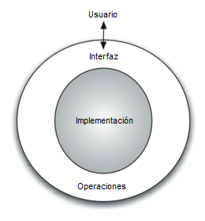

..  Copyright (C)  Brad Miller, David Ranum
    This work is licensed under the Creative Commons Attribution-NonCommercial-ShareAlike 4.0 International License. To view a copy of this license, visit http://creativecommons.org/licenses/by-nc-sa/4.0/.

¿Por qué estudiar estructuras de datos y tipos abstractos de datos?
~~~~~~~~~~~~~~~~~~~~~~~~~~~~~~~~~~~~~~~~~~~~~~~~~~~~~~~~~~~~~~~~~~~

Para administrar la complejidad de los problemas y el proceso de solución de problemas, los científicos de la computación usan abstracciones que les permiten enfocarse en el “panorama general” sin perder de vista los detalles. Mediante la creación de modelos del dominio del problema, somos capaces de utilizar un mejor y más eficiente proceso de solución de problemas. Estos modelos nos permiten describir los datos que nuestros algoritmos  manipularán en una manera mucho más consistente con respecto al problema en sí mismo. 

.. To manage the complexity of problems and the problem-solving process, computer scientists use abstractions to allow them to focus on the “big picture” without getting lost in the details. By creating models of the problem domain, we are able to utilize a better and more efficient problem-solving process. These models allow us to describe the data that our algorithms will manipulate in a much more consistent way with respect to the problem itself.

Nos referimos anteriormente a la abstracción procedimental como un proceso que oculta los detalles de una función particular para permitir que el usuario o el cliente la vea a un muy alto nivel.  Ahora dirigimos nuestra atención a una idea similar, aquélla de la **abstracción de datos**. Un **tipo abstracto de datos**, algunas veces abreviado **TAD**, es una descripción lógica de cómo vemos los datos y las operaciones que son permitidas sin importar cómo serán implementadas. Esto significa que estamos preocupados únicamente por lo qué están representando los datos y no por cómo serán construidos eventualmente. Al proporcionar este nivel de abstracción, estamos creando un **encapsulamiento** alrededor de los datos. La idea es que, al encapsular los detalles de la implementación, los estamos ocultando de la vista del usuario. Esto se denomina **ocultamiento de información**.

.. Earlier, we referred to procedural abstraction as a process that hides the details of a particular function to allow the user or client to view it at a very high level. We now turn our attention to a similar idea, that of **data abstraction**. An **abstract data type**, sometimes abbreviated **ADT**, is a logical description of how we view the data and the operations that are allowed without regard to how they will be implemented. This means that we are concerned only with what the data is representing and not with how it will eventually be constructed. By providing this level of abstraction, we are creating an **encapsulation** around the data. The idea is that by encapsulating the details of the implementation, we are hiding them from the user’s view. This is called **information hiding**.

La :ref:`Figura 2 <fig_adt>` muestra una imagen de qué es un tipo abstracto de datos y cómo opera. El usuario interactúa con la interfaz, usando las operaciones que han sido especificadas por el tipo abstracto de datos. El tipo abstracto de datos es el cascarón con el que el usuario interactúa. La implementación está oculta un nivel más en profundidad. El usuario no se preocupa de los detalles de la implementación.

.. :ref:`Figure 2 <fig_adt>` shows a picture of what an abstract data type is and how it operates. The user interacts with the interface, using the operations that have been specified by the abstract data type. The abstract data type is the shell that the user interacts with. The implementation is hidden one level deeper. The user is not concerned with the details of the implementation.

.. _fig_adt:

   Figura 2: Tipo abstracto de datos
   
   Figura 2: Tipo abstracto de datos

La implementación de un tipo abstracto de datos, a menudo denominada **estructura de datos**, requerirá que proporcionemos una vista física de los datos usando alguna colección de estructuras de programación y tipos de datos primitivos. Como hemos discutido anteriormente, la separación de estas dos perspectivas nos permitirá definir los modelos de datos complejos para nuestros problemas sin dar ninguna indicación sobre los detalles de cómo se construirá realmente el modelo. Esto proporciona una vista de los datos **independiente de la implementación**. Dado que normalmente habrá muchas maneras diferentes de implementar un tipo abstracto de datos, esta independencia de la implementación permite al programador modificar los detalles de la implementación sin cambiar la forma en la que el usuario de los datos interactúa con ella. El usuario puede así mantenerse enfocado en el proceso de solución de problemas.

.. The implementation of an abstract data type, often referred to as a **data structure**, will require that we provide a physical view of the data using some collection of programming constructs and primitive data types. As we discussed earlier, the separation of these two perspectives will allow us to define the complex data models for our problems without giving any indication as to the details of how the model will actually be built. This provides an **implementation-independent** view of the data. Since there will usually be many different ways to implement an abstract data type, this implementation independence allows the programmer to switch the details of the implementation without changing the way the user of the data interacts with it. The user can remain focused on the problem-solving process.

