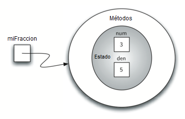
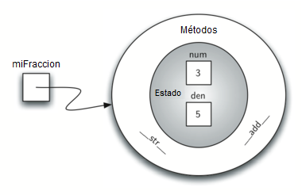
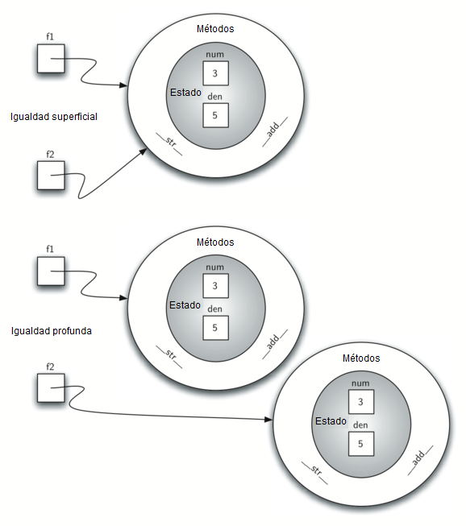
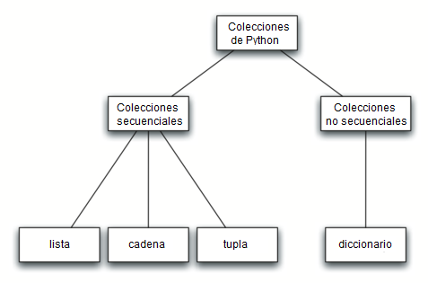
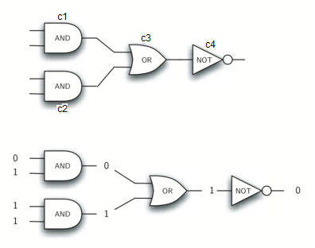
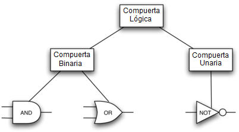
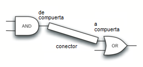

..  Copyright (C)  Brad Miller, David Ranum
    This work is licensed under the Creative Commons Attribution-NonCommercial-ShareAlike 4.0 International License. To view a copy of this license, visit http://creativecommons.org/licenses/by-nc-sa/4.0/.

Programación orientada a objetos en Python: Definición de clases
~~~~~~~~~~~~~~~~~~~~~~~~~~~~~~~~~~~~~~~~~~~~~~~~~~~~~~~~~~~~~~~~

Hemos dicho anteriormente que Python es un lenguaje de programación orientado a objetos. Hasta ahora, hemos utilizado una serie de clases incorporadas para mostrar ejemplos de datos y estructuras de control. Una de las características más poderosas en un lenguaje de programación orientado a objetos es la capacidad de permitir a un programador (solucionador de problemas) crear nuevas clases que modelen los datos necesarios para resolver el problema.

.. We stated earlier that Python is an object-oriented programming language. So far, we have used a number of built-in classes to show examples of data and control structures. One of the most powerful features in an object-oriented programming language is the ability to allow a programmer (problem solver) to create new classes that model data that is needed to solve the problem.

Recuerde que usamos tipos abstractos de datos para proporcionar la descripción lógica de cómo se ve un objeto de datos (su estado) y qué puede hacer (sus métodos). Mediante la construcción de una clase que implementa un tipo abstracto de datos, un programador puede aprovechar el proceso de abstracción y al mismo tiempo proporcionar los detalles necesarios para utilizar realmente la abstracción en un programa. Siempre que deseemos implementar un tipo abstracto de datos, lo haremos con una nueva clase.

.. Remember that we use abstract data types to provide the logical description of what a data object looks like (its state) and what it can do (its methods). By building a class that implements an abstract data type, a programmer can take advantage of the abstraction process and at the same time provide the details necessary to actually use the abstraction in a program. Whenever we want to implement an abstract data type, we will do so with a new class.

Una clase ``Fraccion``
^^^^^^^^^^^^^^^^^^^^^^

Un ejemplo muy común para mostrar los detalles de la implementación de una clase definida por el usuario es construir una clase para implementar el tipo abstracto de datos ``Fraccion``. Ya hemos visto que Python proporciona una serie de clases numéricas para nuestro uso. Hay ocasiones en las que, sin embargo, sería más apropiado ser capaz de crear objetos de datos que “luzcan” como fracciones.

.. A very common example to show the details of implementing a user-defined class is to construct a class to implement the abstract data type ``Fraction``. We have already seen that Python provides a number of numeric classes for our use. There are times, however, that it would be most appropriate to be able to create data objects that “look like” fractions.

Una fracción como :math:`\frac {3}{5}` consta de dos partes. El valor de arriba, conocido como el numerador, puede ser cualquier entero. El valor de abajo, llamado el denominador, puede ser cualquier entero mayor que 0 (las fracciones negativas tienen un numerador negativo). Aunque es posible crear una aproximación de punto flotante para cualquier fracción, en este caso nos gustaría representar la fracción como un valor exacto.

.. A fraction such as :math:`\frac {3}{5}` consists of two parts. The top value, known as the numerator, can be any integer. The bottom value, called the denominator, can be any integer greater than 0 (negative fractions have a negative numerator). Although it is possible to create a floating point approximation for any fraction, in this case we would like to represent the fraction as an exact value.

Las operaciones para el tipo ``Fraccion`` permitirán que un objeto de datos ``Fraccion`` se comporte como cualquier otro valor numérico. Necesitamos ser capaces de sumar, restar, multiplicar y dividir fracciones. También queremos ser capaces de mostrar fracciones usando la forma estándar de “barra”, por ejemplo 3/5. Además, todos los métodos de fracciones deben devolver resultados en sus términos menores de modo que, sin importar el cálculo que se realice, siempre terminemos con la forma más simplificada.

.. The operations for the ``Fraction`` type will allow a ``Fraction`` data object to behave like any other numeric value. We need to be able to add, subtract, multiply, and divide fractions. We also want to be able to show fractions using the standard “slash” form, for example 3/5. In addition, all fraction methods should return results in their lowest terms so that no matter what computation is performed, we always end up with the most common form.

En Python, definimos una nueva clase proporcionando un nombre y un conjunto de definiciones de métodos que son sintácticamente similares a las definiciones de funciones. Para este ejemplo,

.. In Python, we define a new class by providing a name and a set of method definitions that are syntactically similar to function definitions. For this example,

::

    class Fraccion:

       #los métodos van aquí

proporciona el esqueleto para definir los métodos. El primer método que todas las clases deben proporcionar es el constructor. El constructor define la forma en que se crean los objetos de datos. Para crear un objeto ``Fraccion``, tendremos que proporcionar dos piezas de datos, el numerador y el denominador. En Python, el método constructor siempre se llama __init__ (dos subrayados antes y después de ``init``) y se muestra en el :ref:`Programa 2 <lst_pyconstructor>`.

.. provides the framework for us to define the methods. The first method that all classes should provide is the constructor. The constructor defines the way in which data objects are created. To create a ``Fraction`` object, we will need to provide two pieces of data, the numerator and the denominator. In Python, the constructor method is always called __init__ (two underscores before and after ``init``) and is shown in :ref:`Listing 2 <lst_pyconstructor>`.

.. _lst_pyconstructor:

**Programa 2**

.. sourcecode:: python

    class Fraccion:

        def __init__(self,arriba,abajo):

            self.num = arriba
            self.den = abajo

Observe que la lista de parámetros formales contiene tres elementos (``self``, ``arriba``, ``abajo``). ``self`` es un parámetro especial que siempre se utilizará como una referencia al objeto mismo. Debe ser siempre el primer parámetro formal; no obstante, nunca se le dará un valor de parámetro real en la invocación. Como se describió anteriormente, las fracciones requieren dos piezas de datos de estado, el numerador y el denominador. La notación ``self.num`` en el constructor define que el objeto ``fraccion`` tenga un objeto de datos interno llamado ``num`` como parte de su estado. Del mismo modo, ``self.den`` crea el denominador. Los valores de los dos parámetros formales se asignan inicialmente al estado, permitiendo que el nuevo objeto ``fraccion`` conozca su valor inicial.

.. Notice that the formal parameter list contains three items (``self``, ``arriba``, ``abajo``). ``self`` is a special parameter that will always be used as a reference back to the object itself. It must always be the first formal parameter; however, it will never be given an actual parameter value upon invocation. As described earlier, fractions require two pieces of state data, the numerator and the denominator. The notation ``self.num`` in the constructor defines the ``fraction`` object to have an internal data object called ``num`` as part of its state. Likewise, ``self.den`` creates the denominator. The values of the two formal parameters are initially assigned to the state, allowing the new ``fraction`` object to know its starting value.

Para crear una instancia de la clase ``Fraccion``, debemos invocar al constructor. Esto ocurre usando el nombre de la clase y pasando los valores reales para el estado necesario (note que nunca invocamos directamente a ``__init__``). Por ejemplo,

.. To create an instance of the ``Fraction`` class, we must invoke the constructor. This happens by using the name of the class and passing actual values for the necessary state (note that we never directly ``invoke __init__``). For example,

::

    miFraccion = Fraccion(3,5)

Crea un objeto llamado ``miFraccion`` que representa la fracción :math:`\frac {3}{5}` (tres quintos). La :ref:`Figura 5 <fig_fraction1>` muestra este objeto tal como está implementado ahora.

.. creates an object called ``miFraccion`` representing the fraction :math:`\frac {3}{5}` (three-fifths). :ref:`Figure 5 <fig_fraction1>` shows this object as it is now implemented.

.. _fig_fraction1:

   Figura 5: Una instancia de la clase ``Fraccion``

   Figura 5: Una instancia de la clase ``Fraccion``

Lo siguiente que debemos hacer es implementar el comportamiento que requiere el tipo abstracto de datos. Para comenzar, considere lo que sucede cuando tratamos de imprimir un objeto ``Fraccion``.

.. The next thing we need to do is implement the behavior that the abstract data type requires. To begin, consider what happens when we try to print a ``Fraction`` object.

::

    >>> miF = Fraccion(3,5)
    >>> print(miF)
    <__main__.Fraction instance at 0x409b1acc>

El objeto ``fraccion``, ``miF``, no sabe cómo responder a esta solicitud de impresión. La función ``print`` requiere que el objeto sea convertido en una cadena para que se pueda escribir en la salida. La única opción que ``miF`` tiene es mostrar la referencia real que se almacena en la variable (la dirección en sí misma). Esto no es lo que queremos.

.. The ``fraction`` object, ``miF``, does not know how to respond to this request to print. The ``print`` function requires that the object convert itself into a string so that the string can be written to the output. The only choice ``miF`` has is to show the actual reference that is stored in the variable (the address itself). This is not what we want.

Hay dos maneras de resolver este problema. Una de ellas es definir un método llamado ``mostrar`` que permitirá que el objeto ``Fraccion`` se imprima como una cadena. Podemos implementar este método como se muestra en el :ref:`Programa 3 <lst_showmethod>`. Si como antes creamos un objeto ``Fraccion``, podemos pedirle que se muestre, en otras palabras, que se imprima en el formato apropiado. Desafortunadamente, esto no funciona en general. Para que la impresión funcione correctamente, necesitamos decirle a la clase ``Fraccion`` cómo puede convertirse en una cadena. Esto es lo que necesita la función ``print`` para hacer su trabajo.

.. There are two ways we can solve this problem. One is to define a method called ``show`` that will allow the ``Fraction`` object to print itself as a string. We can implement this method as shown in :ref:`Listing 3 <lst_showmethod>`. If we create a ``Fraction`` object as before, we can ask it to show itself, in other words, print itself in the proper format. Unfortunately, this does not work in general. In order to make printing work properly, we need to tell the ``Fraction`` class how to convert itself into a string. This is what the ``print`` function needs in order to do its job.

.. _lst_showmethod:

**Programa 3**

.. sourcecode:: python

       def mostrar(self):
            print(self.num,"/",self.den)

::

    >>> miF = Fraccion(3,5)
    >>> miF.mostrar()
    3 / 5
    >>> print(miF)
    <__main__.Fraction instance at 0x40bce9ac>
    >>>

En Python, todas las clases tienen un conjunto de métodos estándar que se proporcionan pero que podrían no funcionar correctamente. Uno de ellos, ``__str__``, es el método para convertir un objeto en una cadena. La implementación predeterminada para este método es devolver la cadena de la dirección de la instancia como ya hemos visto. Lo que necesitamos hacer es proporcionar una “mejor” implementación para este método. Diremos que esta implementación **reescribe** a la anterior, o que redefine el comportamiento del método.

.. In Python, all classes have a set of standard methods that are provided but may not work properly. One of these, ``__str__``, is the method to convert an object into a string. The default implementation for this method is to return the instance address string as we have already seen. What we need to do is provide a “better” implementation for this method. We will say that this implementation **overrides** the previous one, or that it redefines the method’s behavior.

Para ello, simplemente definimos un método con el nombre ``__str__`` y le damos una nueva implementación como se muestra en el :ref:`Programa 4 <lst_str>`. Esta definición no necesita ninguna otra información excepto el parámetro especial ``self``. A su vez, el método construirá una representación de cadena convirtiendo cada pieza de datos de estado internos en una cadena y luego colocando un caracter ``/`` entre las cadenas usando la concatenación de cadenas. La cadena resultante se devolverá cada vez que se solicite a un objeto ``Fraccion`` que se convierta en una cadena. Observe las diversas formas en que se utiliza esta función.

.. To do this, we simply define a method with the name ``__str__`` and give it a new implementation as shown in :ref:`Listing 4 <lst_str>`. This definition does not need any other information except the special parameter ``self``. In turn, the method will build a string representation by converting each piece of internal state data to a string and then placing a ``/`` character in between the strings using string concatenation. The resulting string will be returned any time a ``Fraccion`` object is asked to convert itself to a string. Notice the various ways that this function is used.

.. _lst_str:

**Programa 4**

.. sourcecode:: python

        def __str__(self):
            return str(self.num)+"/"+str(self.den)

::

    >>> miF = Fraccion(3,5)
    >>> print(miF)
    3/5
    >>> print("Comí", miF, "de la pizza")
    Comí 3/5 de la pizza
    >>> miF.__str__()
    '3/5'
    >>> str(miF)
    '3/5'
    >>>

Podemos redefinir muchos otros métodos para nuestra nueva clase ``Fraccion``. Algunas de los más importantes son las operaciones aritméticas básicas. Nos gustaría poder crear dos objetos ``Fraccion`` y luego sumarlos usando la notación estándar “+”. En este punto, si intentamos sumar dos fracciones, obtendremos lo siguiente:

.. We can override many other methods for our new ``Fraccion`` class. Some of the most important of these are the basic arithmetic operations. We would like to be able to create two ``Fraccion`` objects and then add them together using the standard “+” notation. At this point, if we try to add two fractions, we get the following:

::

    >>> f1 = Fraccion(1,4)
    >>> f2 = Fraccion(1,2)
    >>> f1+f2

    Traceback (most recent call last):
      File "<pyshell#173>", line 1, in -toplevel-
        f1+f2
    TypeError: unsupported operand type(s) for +:
              'instance' and 'instance'
    >>>

Si nos fijamos atentamente en el error, veremos que el problema es que el operador “+” no entiende los operandos para ``Fraccion``.

.. If you look closely at the error, you see that the problem is that the “+” operator does not understand the ``Fraccion`` operands.

Podemos corregir este error agregándole a la clase ``Fraccion`` un método que redefina el método asociado a la adición. En Python, este método se llama ``__add__`` y requiere dos parámetros. El primero, ``self``, siempre es necesario, y el segundo representa el otro operando en la expresión. Por ejemplo,

.. We can fix this by providing the ``Fraccion`` class with a method that overrides the addition method. In Python, this method is called ``__add__`` and it requires two parameters. The first, ``self``, is always needed, and the second represents the other operand in the expression. For example,

::

    f1.__add__(f2)

pedirá al objeto ``Fraccion`` ``f1`` que sume el objeto ``Fraccion`` ``f2`` a sí mismo. Esto se puede escribir en la notación estándar, ``f1 + f2``.

.. would ask the ``Fraccion`` object ``f1`` to add the ``Fraccion`` object ``f2`` to itself. This can be written in the standard notation, ``f1+f2``.

Dos fracciones deben tener el mismo denominador para poder ser sumadas. La forma más fácil de asegurarse de que tienen el mismo denominador es simplemente utilizar el producto de los dos denominadores como un denominador común de modo que :math:`\frac {a}{b} + \frac {c}{d} = \frac {ad}{bd} + \frac {cb}{bd} = \frac {ad + cb}{bd}`. La implementación se muestra en el :ref:`Programa 5 <lst_addmethod>`. La función de adición devuelve un nuevo objeto ``Fraccion`` con el numerador y el denominador de la suma. Podemos usar este método escribiendo una expresión aritmética estándar que involucre fracciones, asignando el resultado de la adición e imprimiendo nuestro resultado.

.. Two fractions must have the same denominator to be added. The easiest way to make sure they have the same denominator is to simply use the product of the two denominators as a common denominator so that :math:`\frac {a}{b} + \frac {c}{d} = \frac {ad}{bd} + \frac {cb}{bd} = \frac{ad+cb}{bd}` The implementation is shown in :ref:`Listing 5 <lst_addmethod>`. The addition function returns a new ``Fraccion`` object with the numerator and denominator of the sum. We can use this method by writing a standard arithmetic expression involving fractions, assigning the result of the addition, and then printing our result.

.. _lst_addmethod:

**Programa 5**

.. sourcecode:: python

       def __add__(self,otraFraccion):

            nuevoNum = self.num*otraFraccion.den + self.den*otraFraccion.num
            nuevoDen = self.den * otraFraccion.den

            return Fraccion(nuevoNum,nuevoDen)
            
            

::

    >>> f1=Fraccion(1,4)
    >>> f2=Fraccion(1,2)
    >>> f3=f1+f2
    >>> print(f3)
    6/8
    >>>

El método de adición ya funciona como queremos, pero una cosa podría ser mejor. Note que :math:`6/8` es el resultado correcto (:math:`\frac {1}{4} + \frac{1}{2}`) pero no está en la representación de “términos menores”. La mejor representación sería :math:`3/4`. Con el fin de estar seguros de que nuestros resultados estén siempre en los términos menores, necesitamos una función auxiliar que sepa cómo simplificar las fracciones. Esta función tendrá que buscar el máximo común divisor, o MCD. Podemos entonces dividir el numerador y el denominador por el MCD y el resultado se simplificará a los términos menores.

.. The addition method works as we desire, but one thing could be better.Note that :math:`6/8` is the correct result(:math:`\frac {1}{4} + \frac {1}{2}`) but that it is not in the “lowest terms” representation. The best representation would be :math:`3/4`. In order to be sure that our results are always in the lowest terms, we need a helper function that knows how to reduce fractions. This function will need to look for the greatest common divisor, or MCD. We can then divide the numerator and the denominator by the MCD and the result will be reduced to lowest terms.

El algoritmo más conocido para encontrar un máximo común divisor es el Algoritmo de Euclides, el cual será discutido en detalle en el Capítulo 8. El Algoritmo de Euclides establece que el máximo común divisor de dos enteros :math:`m` y :math:`n` es :math:`n` si :math:`n` divide de forma exacta a :math:`m`. No obstante, si :math:`n` no divide exactamente a :math:`m`, entonces la respuesta es el máximo común divisor de :math:`n` y el residuo de :math:`m` dividido entre :math:`n`. Aquí simplemente proporcionaremos una implementación iterativa (ver :ref:`ActiveCode 1 <lst_mcd>`). Tenga en cuenta que esta implementación del algoritmo del MCD sólo funciona cuando el denominador es positivo. Esto es aceptable para nuestra clase ``Fraccion`` porque hemos dicho que una fracción negativa estará representada por un numerador negativo.

.. The best-known algorithm for finding a greatest common divisor is Euclid’s Algorithm, which will be discussed in detail in Chapter 8. Euclid’s Algorithm states that the greatest common divisor of two integers :math:`m` and :math:`n` is :math:`n` if :math:`n` divides :math:`m` evenly. However, if :math:`n` does not divide :math:`m` evenly, then the answer is the greatest common divisor of :math:`n` and the remainder of :math:`m` divided by :math:`n`. We will simply provide an iterative implementation here (see :ref:`ActiveCode 1 <lst_mcd>`). Note that this implementation of the MCD algorithm only works when the denominator is positive. This is acceptable for our fraction class because we have said that a negative fraction will be represented by a negative numerator.

.. _lst_mcd:

.. activecode::  mcd_cl
    :caption: Función del máximo común divisor

    def mcd(m,n):
        while m%n != 0:
            mViejo = m
            nViejo = n

            m = nViejo
            n = mViejo%nViejo
        return n

    print(mcd(20,10))

Ahora podemos utilizar esta función para ayudar a simplificar cualquier fracción. Para poner una fracción en los términos menores, dividiremos el numerador y el denominador por su máximo común divisor. Por lo tanto, para la fracción :math:`6/8`, el máximo común divisor es 2. Dividiendo arriba y abajo por 2 se crea una nueva fracción, :math:`3/4` (ver el :ref:`Programa 6 <lst_newaddmethod>`).

.. Now we can use this function to help reduce any fraction. To put a fraction in lowest terms, we will divide the numerator and the denominator by their greatest common divisor. So, for the fraction :math:`6/8`, the greatest common divisor is 2. Dividing the top and the bottom by 2 creates a new fraction, :math:`3/4` (see :ref:`Listing 6 <lst_newaddmethod>`).

.. _lst_newaddmethod:

**Programa 6**

.. sourcecode:: python

        def __add__(self,otraFraccion):
            nuevoNum = self.num*otraFraccion.den + self.den*otraFraccion.num
            nuevoDen = self.den * otraFraccion.den
            comun = mcd(nuevoNum,nuevoDen)
            return Fraccion(nuevoNum//comun,nuevoDen//comun)
            
            
::

    >>> f1=Fraccion(1,4)
    >>> f2=Fraccion(1,2)
    >>> f3=f1+f2
    >>> print(f3)
    3/4
    >>>

.. _fig_fraction2:

   Figura 6: Una instancia de la clase ``Fraccion`` con dos métodos
   
   Figura 6: Una instancia de la clase ``Fraccion`` con dos métodos

Nuestro objeto ``Fraccion`` ahora tiene dos métodos muy útiles y se parece a la :ref:`Figura 6 <fig_fraction2>`. Un grupo adicional de métodos que necesitamos incluir en nuestra clase de ejemplo ``Fraccion`` permitirá que dos fracciones se comparen entre sí. Supongamos que tenemos dos objetos ``Fraccion``, ``f1`` y ``f2``. ``f1==f2`` solo será ``True`` si son referencias al mismo objeto. Dos objetos diferentes con los mismos numeradores y denominadores no serían iguales en esta implementación. Esto se denomina **igualdad superficial** (ver la :ref:`Figura 7 <fig_fraction3>`).

.. Our ``Fraccion`` object now has two very useful methods and looks like :ref:`Figure 6 <fig_fraction2>`. An additional group of methods that we need to include in our example ``Fraccion`` class will allow two fractions to compare themselves to one another. Assume we have two ``Fraccion`` objects, ``f1`` and ``f2``. ``f1==f2`` will only be ``True`` if they are references to the same object. Two different objects with the same numerators and denominators would not be equal under this implementation. This is called **shallow equality** (see :ref:`Figure 7 <fig_fraction3>`).

.. _fig_fraction3:

   Figura 7: Igualdad superficial *versus* igualdad profunda
   
   Figura 7: Igualdad superficial *versus* igualdad profunda

Podemos crear **igualdad profunda** (véase la :ref:`Figura 7 <fig_fraction3>`) –igualdad por el mismo valor, no por la misma referencia– redefiniendo el método ``__eq__``. El método ``__eq__`` es otro método estándar disponible en cualquier clase. El método ``__eq__`` compara dos objetos y devuelve ``True`` si sus valores son iguales, ``False`` de lo contrario.

.. We can create **deep equality** (see :ref:`Figure 7 <fig_fraction3>`)–equality by the same value, not the same reference–by overriding the ``__eq__`` method. The ``__eq__`` method is another standard method available in any class. The ``__eq__`` method compares two objects and returns ``True`` if their values are the same, ``False`` otherwise.

En la clase ``Fraccion`` podemos implementar el método ``__eq__`` poniendo de nuevo las dos fracciones en sus términos menores y luego comparando los numeradores (ver el :ref:`Programa 7 <lst_cmpmethod>`). Es importante tener en cuenta que hay otros operadores relacionales que pueden redefinirse. Por ejemplo, el método ``__le__`` proporciona la funcionalidad de “menor que o igual”.

.. In the ``Fraccion`` class, we can implement the ``__eq__`` method by again putting the two fractions in common terms and then comparing the numerators (see :ref:`Listing 7 <lst_cmpmethod>`). It is important to note that there are other relational operators that can be overridden. For example, the ``__le__`` method provides the less than or equal functionality.

.. _lst_cmpmethod:

**Programa 7**

.. sourcecode:: python

        def __eq__(self, otro):
            primerNum = self.num * otro.den
            segundoNum = otro.num * self.den

            return primerNum == segundoNum

La clase ``Fraccion`` completa, hasta este punto, se muestra en el :ref:`ActiveCode 2 <lst_fractioncode>`. Dejamos los métodos aritméticos y relacionales restantes como ejercicios.

.. The complete ``Fraccion`` class, up to this point, is shown in :ref:`ActiveCode 2 <lst_fractioncode>`. We leave the remaining arithmetic and relational methods as exercises.

.. _lst_fractioncode:

.. activecode:: fraction_class
   :caption: La clase Fraccion

   def mcd(m,n):
       while m%n != 0:
           mViejo = m
           nViejo = n

           m = nViejo
           n = mViejo%nViejo
       return n

   class Fraccion:
        def __init__(self,arriba,abajo):
            self.num = arriba
            self.den = abajo

        def __str__(self):
            return str(self.num)+"/"+str(self.den)

        def show(self):
            print(self.num,"/",self.den)

        def __add__(self,otraFraccion):
            nuevoNum = self.num*otraFraccion.den + \
                         self.den*otraFraccion.num
            nuevoDen = self.den * otraFraccion.den
            comun = mcd(nuevoNum,nuevoDen)
            return Fraccion(nuevoNum//comun,nuevoDen//comun)

        def __eq__(self, otro):
            primerNum = self.num * otro.den
            segundoNum = otro.num * self.den

            return primerNum == segundoNum

   x = Fraccion(1,2)
   y = Fraccion(2,3)
   print(x+y)
   print(x == y)

.. admonition:: Autoevaluación

   Para asegurarnos de que usted entiende cómo se implementan los operadores en las clases de Python y cómo se escriben correctamente los métodos, escriba algunos métodos para implementar ``*, /,`` y ``-``. También implemente los operadores de comparación > y <

   .. actex:: self_check_4

Herencia: Compuertas lógicas y circuitos
^^^^^^^^^^^^^^^^^^^^^^^^^^^^^^^^^^^^^^^^

Nuestra sección final presentará otro aspecto importante de la programación orientada a objetos. **La herencia** es la habilidad para que una clase esté relacionada con otra clase de la misma manera que las personas pueden estar relacionadas entre sí. Los hijos heredan características de sus padres. Del mismo modo, las clases hija en Python pueden heredar datos y comportamientos característicos de una clase madre. Estas clases se denominan a menudo **subclases** y **superclases**, respectivamente.

.. Our final section will introduce another important aspect of object-oriented programming. **Inheritance** is the ability for one class to be related to another class in much the same way that people can be related to one another. Children inherit characteristics from their parents. Similarly, Python child classes can inherit characteristic data and behavior from a parent class. These classes are often referred to as **subclasses** and **superclasses**.

La :ref:`Figura 8 <fig_inherit1>` muestra las colecciones incorporadas de Python y sus relaciones entre sí. Llamamos a una estructura de relación como ésta una **jerarquía de herencias**. Por ejemplo, la lista es un hija de la colección secuencial. En este caso, llamamos hija a la lista y madre a la secuencia (o la subclase lista y la superclase secuencia). Esto a menudo se denomina ``Relación ES-UNA`` (la lista **ES-UNA** colección secuencial). Esto implica que las listas heredan características importantes de las secuencias, a saber, el ordenamiento de los datos y operaciones, tales como la concatenación, la repetición y la indización.

.. :ref:`Figure 8 <fig_inherit1>` shows the built-in Python collections and their relationships to one another. We call a relationship structure such as this an **inheritance hierarchy**. For example, the list is a child of the sequential collection. In this case, we call the list the child and the sequence the parent (or subclass list and superclass sequence). This is often referred to as an ``IS-A Relationship`` (the list **IS-A** sequential collection). This implies that lists inherit important characteristics from sequences, namely the ordering of the underlying data and operations such as concatenation, repetition, and indexing.

.. _fig_inherit1:

   Figura 8: Una jerarquía de herencias para las colecciones de Python
   
   Figura 8: Una jerarquía de herencias para las colecciones de Python

Las listas, las tuplas y las cadenas son todas tipos de colecciones secuenciales. Todas heredan organización de datos y operaciones comunes. Sin embargo, cada una de ellas es distinta según los datos sean o no homogéneos y si la colección es inmutable. Los hijos se parecen a sus padres pero se distinguen agregando características adicionales.

.. Lists, tuples, and strings are all types of sequential collections. They all inherit common data organization and operations. However, each of them is distinct based on whether the data is homogeneous and whether the collection is immutable. The children all gain from their parents but distinguish themselves by adding additional characteristics.

Al organizar las clases de esta manera jerárquica, los lenguajes de programación orientados a objetos permiten que el código previamente escrito se extienda para satisfacer las necesidades de una nueva situación. Además, al organizar los datos de esta manera jerárquica, podemos comprender mejor las relaciones que existen entre ellos. Podemos ser más eficientes en la construcción de nuestras representaciones abstractas.

.. By organizing classes in this hierarchical fashion, object-oriented programming languages allow previously written code to be extended to meet the needs of a new situation. In addition, by organizing data in this hierarchical manner, we can better understand the relationships that exist. We can be more efficient in building our abstract representations.

Para explorar esta idea más a fondo, construiremos una **simulación**, una aplicación para simular circuitos digitales. El bloque constructivo básico para esta simulación será la compuerta lógica. Estos conmutadores electrónicos representan relaciones de álgebra booleana entre su entrada y su salida. En general, las compuertas tienen una sola línea de salida. El valor de la salida depende de los valores dados en las líneas de entrada.

.. To explore this idea further, we will construct a **simulation**, an application to simulate digital circuits. The basic building block for this simulation will be the logic gate. These electronic switches represent boolean algebra relationships between their input and their output. In general, gates have a single output line. The value of the output is dependent on the values given on the input lines.

Las compuertas AND tienen dos líneas de entrada, cada una de las cuales puede ser 0 ó 1 (representando ``False`` o ``True``, repectivamente). Si ambas líneas de entrada tienen valor 1, la salida resultante es 1. Sin embargo, si una o ambas líneas de entrada son 0, el resultado es 0. Las compuertas OR también tienen dos líneas de entrada y producen un 1 si uno o ambos valores de entrada son 1. En el caso en que ambas líneas de entrada sean 0, el resultado es 0.

.. AND gates have two input lines, each of which can be either 0 or 1 (representing ``False`` or ``True``, repectively). If both of the input lines have the value 1, the resulting output is 1. However, if either or both of the input lines is 0, the result is 0. OR gates also have two input lines and produce a 1 if one or both of the input values is a 1. In the case where both input lines are 0, the result is 0.

Las compuertas NOT se diferencian de las otras dos compuertas porque sólo tienen una única línea de entrada. El valor de salida es simplemente el opuesto al valor de entrada. Si aparece 0 en la entrada, se produce 1 en la salida. Similarmente, un 1 produce un 0. La :ref:`Figura 9 <fig_truthtable>` muestra cómo se representa típicamente cada una de estas compuertas. Cada compuerta tiene también una **tabla de verdad** de valores que muestran el mapeo de entrada a salida que es llevado a cabo por la compuerta.

.. NOT gates differ from the other two gates in that they only have a single input line. The output value is simply the opposite of the input value. If 0 appears on the input, 1 is produced on the output. Similarly, 1 produces 0. :ref:`Figure 9 <fig_truthtable>` shows how each of these gates is typically represented. Each gate also has a **truth table** of values showing the input-to-output mapping that is performed by the gate.

.. _fig_truthtable:

.. figure:: Figures/truthtable.png
   :align: center

   Figura 9: Tres tipos de compuertas lógicas
   
   Figura 9: Tres tipos de compuertas lógicas

Podemos construir circuitos que tengan funciones lógicas al combinar estas compuertas en varios patrones y luego aplicarles un conjunto de valores de entrada. La :ref:`Figura 10 <fig_circuit1>` muestra un circuito que consta de dos compuertas AND, una compuerta OR y una única compuerta NOT. Las líneas de salida de las dos compuertas AND se conectan directamente en la compuerta OR y la salida resultante de la compuerta OR es suministrada a la compuerta NOT. Si aplicamos un conjunto de valores de entrada a las cuatro líneas de entrada (dos por cada puerta AND), los valores se procesan y aparece un resultado en la salida de la compuerta NOT. La :ref:`Figura 10 <fig_circuit1>` también muestra un ejemplo con valores.

.. By combining these gates in various patterns and then applying a set of input values, we can build circuits that have logical functions. :ref:`Figure 10 <fig_circuit1>` shows a circuit consisting of two AND gates, one OR gate, and a single NOT gate. The output lines from the two AND gates feed directly into the OR gate, and the resulting output from the OR gate is given to the NOT gate. If we apply a set of input values to the four input lines (two for each AND gate), the values are processed and a result appears at the output of the NOT gate. :ref:`Figure 10 <fig_circuit1>` also shows an example with values.

.. _fig_circuit1:

   Figura 10: Circuito
   
   Figura 10: Circuito

Para implementar un circuito, primero construiremos una representación para compuertas lógicas. Las compuertas lógicas se organizan fácilmente en una jerarquía de herencias de clase como se muestra en la :ref:`Figura 11 <fig_gates>`. En la parte superior de la jerarquía, la clase ``CompuertaLogica`` representa las características más generales de las compuertas lógicas: a saber, una etiqueta para la compuerta y una línea de salida. El siguiente nivel de subclases divide las compuertas lógicas en dos familias, las que tienen una línea de entrada y las que tienen dos. Debajo de ellas, aparecen las funciones lógicas específicas de cada una.

.. In order to implement a circuit, we will first build a representation for logic gates. Logic gates are easily organized into a class inheritance hierarchy as shown in :ref:`Figure 11 <fig_gates>`. At the top of the hierarchy, the ``CompuertaLogica`` class represents the most general characteristics of logic gates: namely, a label for the gate and an output line. The next level of subclasses breaks the logic gates into two families, those that have one input line and those that have two. Below that, the specific logic functions of each appear.

.. _fig_gates:

   Figura 11: Una jerarquía de herencias para las compuertas lógicas
   
   Figura 11: Una jerarquía de herencias para las compuertas lógicas

Ahora podemos comenzar a implementar las clases empezando con la más general, ``CompuertaLogica``. Como se ha indicado anteriormente, cada compuerta tiene una etiqueta para la identificación y una sola línea de salida. Además, necesitamos métodos para permitir que un usuario de una compuerta le pida la etiqueta a la compuerta.

.. We can now start to implement the classes by starting with the most general, ``CompuertaLogica``. As noted earlier, each gate has a label for identification and a single output line. In addition, we need methods to allow a user of a gate to ask the gate for its label.

El otro comportamiento que necesita toda compuerta lógica es la capacidad de conocer su valor de salida. Esto requerirá que la compuerta lleve a cabo la lógica apropiada con base en la entrada actual. Con el fin de producir la salida, la compuerta tiene que saber específicamente cuál es esa lógica. Esto implica invocar a un método para realizar el cálculo lógico. La clase completa se muestra en el :ref:`Programa 8 <lst_logicgateclass>`.

.. The other behavior that every logic gate needs is the ability to know its output value. This will require that the gate perform the appropriate logic based on the current input. In order to produce output, the gate needs to know specifically what that logic is. This means calling a method to perform the logic computation. The complete class is shown in :ref:`Listing 8 <lst_logicgateclass>`.

.. _lst_logicgateclass:

**Programa 8**

.. sourcecode:: python

    class CompuertaLogica:

        def __init__(self,n):
            self.etiqueta = n
            self.salida = None

        def obtenerEtiqueta(self):
            return self.etiqueta

        def obtenerSalida(self):
            self.salida = self.ejecutarLogicaDeCompuerta()
            return self.salida

En este punto, no implementaremos la función ``ejecutarLogicaDeCompuerta``. La razón de esto es que no sabemos cómo llevará a cabo cada compuerta su propia operación lógica. Estos detalles serán incluidos por cada compuerta individual que se añada a la jerarquía. Esta es una idea muy poderosa en la programación orientada a objetos. Estamos escribiendo un método que usará código que aún no existe. El parámetro ``self`` es una referencia al verdadero objeto compuerta que invoca el método. Cualquier compuerta lógica nueva que se agregue a la jerarquía simplemente tendrá que implementar la función ``ejecutarLogicaDeCompuerta`` y se utilizará en el momento apropiado. Una vez se haya usado, la compuerta puede proporcionar su valor de salida. Esta capacidad de extender una jerarquía que existe actualmente y proporcionar las funciones específicas que la jerarquía necesita para usar la nueva clase es extremadamente importante para reutilizar el código ya existente.

.. At this point, we will not implement the ``ejecutarLogicaDeCompuerta`` function. The reason for this is that we do not know how each gate will perform its own logic operation. Those details will be included by each individual gate that is added to the hierarchy. This is a very powerful idea in object-oriented programming. We are writing a method that will use code that does not exist yet. The parameter ``self`` is a reference to the actual gate object invoking the method. Any new logic gate that gets added to the hierarchy will simply need to implement the ``ejecutarLogicaDeCompuerta`` function and it will be used at the appropriate time. Once done, the gate can provide its output value. This ability to extend a hierarchy that currently exists and provide the specific functions that the hierarchy needs to use the new class is extremely important for reusing existing code.

Categorizamos las compuertas lógicas en función del número de líneas de entrada. La compuerta AND tiene dos líneas de entrada. La compuerta OR también tiene dos líneas de entrada. Las compuertas NOT tienen una línea de entrada. La clase ``CompuertaBinaria`` será una subclase de ``CompuertaLogica`` y agregará dos líneas de entrada. La clase ``CompuertaUnaria`` también será subclase de ``CompuertaLogica`` pero sólo contará con una única línea de entrada. En el diseño de circuitos asistido por computador, estas líneas a veces se llaman “pines” por lo que vamos a utilizar esa terminología en nuestra implementación.

.. We categorized the logic gates based on the number of input lines. The AND gate has two input lines. The OR gate also has two input lines. NOT gates have one input line. The ``CompuertaBinaria`` class will be a subclass of ``CompuertaLogica`` and will add two input lines. The ``CompuertaUnaria`` class will also subclass ``CompuertaLogica`` but will have only a single input line. In computer circuit design, these lines are sometimes called “pins” so we will use that terminology in our implementation.

.. _lst_binarygateclass:

**Programa 9**

.. sourcecode:: python

    class CompuertaBinaria(CompuertaLogica):

        def __init__(self,n):
            CompuertaLogica.__init__(self,n)

            self.pinA = None
            self.pinB = None

        def obtenerPinA(self):
            return int(input("Ingrese la entrada del Pin A para la compuerta "+ self.obtenerEtiqueta()+"-->"))

        def obtenerPinB(self):
            return int(input("Ingrese la entrada del Pin B para la compuerta "+ self.obtenerEtiqueta()+"-->"))

.. _lst_unarygateclass:

**Programa 10**

.. sourcecode:: python

    class CompuertaUnaria(CompuertaLogica):

        def __init__(self,n):
            CompuertaLogica.__init__(self,n)

            self.pin = None

        def obtenerPin(self):
            return int(input("Ingrese la entrada del Pin para la compuerta "+ self.obtenerEtiqueta()+"-->"))
            
El :ref:`Programa 9 <lst_logicgateclass>` y el :ref:`Programa 10 <lst_logicgateclass>` implementan estas dos clases. Los constructores en ambas clases comienzan con una llamada explícita al constructor de la clase madre utilizando el método ``__init__`` de la madre. Al crear una instancia de la clase ``CompuertaBinaria``, primero queremos inicializar cualesquiera ítems de datos heredados de ``CompuertaLogica``. En este caso, eso significa la etiqueta para la compuerta. A continuación, el constructor agrega las dos líneas de entrada (``pinA`` y ``pinB``). Éste es un patrón muy común que debe usarse siempre al crear jerarquías de clases. Los constructores de las clases hija deben llamar a los constructores de las clases madre y luego ocuparse de sus propios datos distintivos.            

.. :ref:`Listing 9 <lst_logicgateclass>` and :ref:`Listing 10 <lst_logicgateclass>` implement these two classes. The constructors in both of these classes start with an explicit call to the constructor of the parent class using the parent's ``__init__`` method. When creating an instance of the ``CompuertaBinaria`` class, we first want to initialize any data items that are inherited from ``CompuertaLogica``. In this case, that means the label for the gate. The constructor then goes on to add the two input lines (``pinA`` and ``pinB``). This is a very common pattern that you should always use when building class hierarchies. Child class constructors need to call parent class constructors and then move on to their own distinguishing data.

Python también tiene una función llamada ``super`` que se puede usar en lugar de nombrar explícitamente la clase madre. Éste es un mecanismo más general, y es ampliamente utilizado especialmente cuando una clase tiene más de una clase madre. Sin embargo, esa opción no se discutirá en esta introducción. Por ejemplo, en nuestro ejemplo anterior, ``CompuertaLogica.__init__(self,n)`` podría reemplazarse por ``super(CompuertaUnaria,self).__init__(n)``.

.. Python also has a function called ``super`` which can be used in place of explicitly naming the parent class.  This is a more general mechanism, and is widely used, especially when a class has more than one parent.  But, this is not something we are going to discuss in this introduction.  For example in our example above ``CompuertaLogica.__init__(self,n)`` could be replaced with ``super(CompuertaUnaria,self).__init__(n)``.

El único comportamiento que añade la clase ``CompuertaBinaria`` es la capacidad de obtener los valores de las dos líneas de entrada. Dado que estos valores vienen de algún lugar externo, simplemente le pediremos al usuario a través de una instrucción ``input`` que los proporcione. La misma implementación se usa para la clase ``CompuertaUnaria`` excepto que sólo hay una línea de entrada.

.. The only behavior that the ``CompuertaBinaria`` class adds is the ability to get the values from the two input lines. Since these values come from some external place, we will simply ask the user via an input statement to provide them. The same implementation occurs for the ``CompuertaUnaria`` class except that there is only one input line.

Ahora que tenemos una clase general para las compuertas dependiendo del número de líneas de entrada, podemos construir compuertas específicas que tengan un comportamiento único. Por ejemplo, la clase ``CompuertaAND`` será una subclase de ``CompuertaBinaria``, ya que las compuertas AND tienen dos líneas de entrada. Como antes, la primera línea del constructor invoca al constructor de la clase madre (``CompuertaBinaria``), que a su vez llama al constructor de su clase madre (``CompuertaLogica``). Note que la clase ``CompuertaAND`` no proporciona ningún dato nuevo, ya que hereda dos líneas de entrada, una línea de salida y una etiqueta.

.. Now that we have a general class for gates depending on the number of input lines, we can build specific gates that have unique behavior. For example, the ``CompuertaAND`` class will be a subclass of ``CompuertaBinaria`` since AND gates have two input lines. As before, the first line of the constructor calls upon the parent class constructor (``CompuertaBinaria``), which in turn calls its parent class constructor (``CompuertaLogica``). Note that the ``CompuertaAND`` class does not provide any new data since it inherits two input lines, one output line, and a label.

.. _lst_andgateclass:

**Programa 11**

.. sourcecode:: python

    class CompuertaAND(CompuertaBinaria):

        def __init__(self,n):
            CompuertaBinaria.__init__(self,n)

        def ejecutarLogicaDeCompuerta(self):

            a = self.obtenerPinA()
            b = self.obtenerPinB()
            if a==1 and b==1:
                return 1
            else:
                return 0

Lo único que ``CompuertaAND`` necesita agregar es el comportamiento específico que realiza la operación booleana que se describió anteriormente. Éste es el lugar donde podemos proporcionar el método ``ejecutarLogicaDeCompuerta``. Para una compuerta AND, este método debe obtener primero los dos valores de entrada y luego devuelve 1 sólo si ambos valores de entrada son 1. La clase completa se muestra en el :ref:`Programa 11 <lst_andgateclass>`.

.. The only thing ``CompuertaAND`` needs to add is the specific behavior that performs the boolean operation that was described earlier. This is the place where we can provide the ``ejecutarLogicaDeCompuerta`` method. For an AND gate, this method first must get the two input values and then only return 1 if both input values are 1. The complete class is shown in :ref:`Listing 11 <lst_andgateclass>`.

Podemos mostrar la clase ``CompuertaAND`` en acción creando una instancia y pidiéndole que calcule su salida. La sesión siguiente muestra un objeto ``CompuertaAND``, ``c1``, que tiene una etiqueta interna ``"C1"``. Cuando invocamos el método ``obtenerSalida``, el objeto debe llamar primero a su método ``ejecutarLogicaDeCompuerta`` que a su vez consulta las dos líneas de entrada. Una vez que se proporcionan los valores, se muestra la salida correcta.

.. We can show the ``CompuertaAND`` class in action by creating an instance and asking it to compute its output. The following session shows an ``CompuertaAND`` object, ``c1``, that has an internal label ``"C1"``. When we invoke the ``obtenerSalida`` method, the object must first call its ``ejecutarLogicaDeCompuerta`` method which in turn queries the two input lines. Once the values are provided, the correct output is shown.

::

   >>> c1 = CompuertaAND("C1")
   >>> c1.obtenerSalida()
   Ingrese la entrada del Pin A para la compuerta C1-->1
   Ingrese la entrada del Pin B para la compuerta C1-->0
   0

El mismo desarrollo se puede hacer para las compuertas OR y las compuertas NOT. La clase ``CompuertaOR`` también será una subclase de ``CompuertaBinaria`` y la clase ``CompuertaNOT`` extenderá la clase ``CompuertaUnaria``. Ambas clases tendrán que proporcionar sus propias funciones ``ejecutarLogicaDeCompuerta``, ya que ése será su comportamiento específico.

.. The same development can be done for OR gates and NOT gates. The ``CompuertaOR`` class will also be a subclass of ``CompuertaBinaria`` and the ``CompuertaNOT`` class will extend the ``CompuertaUnaria`` class. Both of these classes will need to provide their own ``ejecutarLogicaDeCompuerta`` functions, as this is their specific behavior.

Podemos utilizar una sola compuerta construyendo primero una instancia de una de las clases de compuerta y, luego, pidiendo a la compuerta su salida (que a su vez necesitará que se proporcionen las entradas). Por ejemplo:

.. We can use a single gate by first constructing an instance of one of the gate classes and then asking the gate for its output (which will in turn need inputs to be provided). For example:

::

    >>> c2 = CompuertaOR("C2")
    >>> c2.obtenerSalida()
    Ingrese la entrada del Pin A para la compuerta C2-->1
    Ingrese la entrada del Pin B para la compuerta C2-->1
    1
    >>> c2.obtenerSalida()
    Ingrese la entrada del Pin A para la compuerta C2-->0
    Ingrese la entrada del Pin B para la compuerta C2-->0
    0
    >>> c3 = CompuertaNOT("C3")
    >>> c3.obtenerSalida()
    Ingrese la entrada del Pin para la compuerta C3-->0
    1

Ahora que tenemos las compuertas básicas funcionando, podemos centrar nuestra atención en la construcción de circuitos. Para crear un circuito, necesitamos conectar las compuertas juntas, la salida de una fluirá hacia la entrada de otra. Para ello, implementaremos una nueva clase llamada ``Conector``.

.. Now that we have the basic gates working, we can turn our attention to building circuits. In order to create a circuit, we need to connect gates together, the output of one flowing into the input of another. To do this, we will implement a new class called ``Conector``.

La clase ``Conector`` no residirá en la jerarquía de las compuertas. Sin embargo, sí usará la jerarquía de ellas por el hecho que cada conector tendrá dos compuertas, una en cada extremo (ver la :ref:`Figura 12 <fig_connector>`). Esta relación es muy importante en la programación orientada a objetos. Se llama la **Relación TIENE-UN(A)**. Recuerde que antes usamos la frase “Relación ES-UN(A)” para decir que una clase hija está relacionada con una clase madre, por ejemplo ``CompuertaUnaria`` ES-UNA ``CompuertaLogica``.

.. The ``Conector`` class will not reside in the gate hierarchy. It will, however, use the gate hierarchy in that each connector will have two gates, one on either end (see :ref:`Figure 12 <fig_connector>`). This relationship is very important in object-oriented programming. It is called the **HAS-A Relationship**. Recall earlier that we used the phrase “IS-A Relationship” to say that a child class is related to a parent class, for example ``CompuertaUnaria`` IS-A ``CompuertaLogica``.

.. _fig_connector:

   Figura 12: Un conector conecta la salida de una compuerta a la entrada de otra
   
   Figura 12: Un conector conecta la salida de una compuerta a la entrada de otra

Ahora, con la clase ``Conector``, decimos que un ``Conector`` TIENE-UNA ``CompuertaLogica`` lo cual significa que los conectores tendrán instancias de la clase ``CompuertaLogica`` dentro de ellos, pero no forman parte de la jerarquía. Al diseñar clases, es muy importante distinguir entre aquéllas que tienen la relación ES-UN(A) (lo cual requiere herencia) y aquéllas que tienen relaciones TIENE-UN(A) (sin herencia).

.. Now, with the ``Conector`` class, we say that a ``Conector`` HAS-A ``CompuertaLogica`` meaning that connectors will have instances of the ``CompuertaLogica`` class within them but are not part of the hierarchy. When designing classes, it is very important to distinguish between those that have the IS-A relationship (which requires inheritance) and those that have HAS-A relationships (with no inheritance).

El :ref:`Programa 12 <lst_Connectorclass>` muestra la clase ``Conector``. Las dos instancias de compuertas dentro de cada objeto conector se referirán como ``deCompuerta`` y ``aCompuerta``, reconociendo que los valores de los datos “fluirán” desde la salida de una compuerta a una línea de entrada de la siguiente. El llamado a ``asignarProximoPin`` es muy importante para realizar conexiones (ver el :ref:`Programa 13 <lst_setpin>`). Necesitamos agregar este método a nuestras clases de compuertas para que cada ``aCompuerta`` pueda elegir la línea de entrada adecuada para la conexión.

.. :ref:`Listing 12 <lst_Connectorclass>` shows the ``Conector`` class. The two gate instances within each connector object will be referred to as the ``deCompuerta`` and the ``aCompuerta``, recognizing that data values will “flow” from the output of one gate into an input line of the next. The call to ``asignarProximoPin`` is very important for making connections (see :ref:`Listing 13 <lst_setpin>`). We need to add this method to our gate classes so that each ``aCompuerta`` can choose the proper input line for the connection.

.. _lst_Connectorclass:

**Programa 12** 

.. sourcecode:: python

    class Conector:

        def __init__(self, deComp, aComp):
            self.deCompuerta = deComp
            self.aCompuerta = aComp

            aComp.asignarProximoPin(self)

        def obtenerFuente(self):
            return self.deCompuerta

        def obtenerDestino(self):
            return self.aCompuerta

En la clase ``CompuertaBinaria``, para compuertas con dos posibles líneas de entrada, el conector debe conectarse a una sola línea. Si ambas están disponibles, elegiremos ``pinA`` de forma predeterminada. Si ``pinA`` ya está conectado, entonces elegiremos ``pinB``. No es posible conectarse a una compuerta sin líneas de entrada disponibles.

.. In the ``CompuertaBinaria`` class, for gates with two possible input lines, the connector must be connected to only one line. If both of them are available, we will choose ``pinA`` by default. If ``pinA`` is already connected, then we will choose ``pinB``. It is not possible to connect to a gate with no available input lines.

.. _lst_setpin:

**Programa 13**

.. sourcecode:: python

        def asignarProximoPin(self,fuente):
            if self.pinA == None:
                self.pinA = fuente
            else:
                if self.pinB == None:
                    self.pinB = fuente
                else:
                   raise RuntimeError("Error: NO HAY PINES DISPONIBLES")

Ahora es posible obtener entradas desde dos lugares: externamente, como antes, y desde la salida de una compuerta que está conectada a esa línea de entrada. Esto requiere un cambio en los métodos ``obtenerPinA`` y ``obtenerPinB`` (ver el :ref:`Programa 14 <lst_newgetpin>`). Si la línea de entrada no está conectada a nada (``None``), entonces se pide al usuario que ingrese el valor externamente como antes. Sin embargo, si hay una conexión, se accede a ella y se consulta el valor de salida de ``deCompuerta``. Esto, a su vez, hace que esa compuerta procese su lógica. Se continúa este proceso hasta que todas las entradas estén disponibles y el valor de salida final se convierta en la entrada requerida para la compuerta en cuestión. En cierto sentido, el circuito opera hacia atrás para encontrar la entrada necesaria para finalmente producir la salida.

.. Now it is possible to get input from two places: externally, as before, and from the output of a gate that is connected to that input line. This requires a change to the ``obtenerPinA`` and ``obtenerPinB`` methods (see :ref:`Listing 14 <lst_newgetpin>`). If the input line is not connected to anything (``None``), then ask the user externally as before. However, if there is a connection, the connection is accessed and ``deCompuerta``’s output value is retrieved. This in turn causes that gate to process its logic. This continues until all input is available and the final output value becomes the required input for the gate in question. In a sense, the circuit works backwards to find the input necessary to finally produce output.

.. _lst_newgetpin:

**Programa 14**

.. sourcecode:: python

        def obtenerPinA(self):
            if self.pinA == None:
                return input("Ingrese la entrada del Pin A para la compuerta " + self.obtenerNombre()+"-->")
            else:
                return self.pinA.obtenerFuente().obtenerSalida()

El siguiente fragmento construye el circuito mostrado anteriormente en esta sección:

.. The following fragment constructs the circuit shown earlier in the section:

::

    >>> c1 = CompuertaAND("C1")
    >>> c2 = CompuertaAND("C2")
    >>> c3 = CompuertaOR("C3")
    >>> c4 = CompuertaNOT("C4")
    >>> c1 = Conector(c1,c3)
    >>> c2 = Conector(c2,c3)
    >>> c3 = Conector(c3,c4)

Las salidas de las dos compuertas AND (``c1`` y ``c2``) están conectadas a la compuerta OR (``c3``) y la salida de esta última está conectada a la compuerta NOT (``c4``). La salida de la compuerta NOT es la salida de todo el circuito. Por ejemplo:

.. The outputs from the two AND gates (``c1`` and ``c2``) are connected to the OR gate (``c3``) and that output is connected to the NOT gate (``c4``). The output from the NOT gate is the output of the entire circuit. For example:

::

    >>> c4.obtenerSalida()
    Ingrese la entrada del Pin A para la compuerta C1-->0
    Ingrese la entrada del Pin B para la compuerta C1-->1
    Ingrese la entrada del Pin A para la compuerta C2-->1
    Ingrese la entrada del Pin B para la compuerta C2-->1
    0

Inténtelo usted mismo usando el ActiveCode 4.

.. activecode:: complete_cuircuit
    :caption: El programa del circuito completo.

    class CompuertaLogica:

        def __init__(self,n):
            self.nombre = n
            self.salida = None

        def obtenerNombre(self):
            return self.nombre

        def obtenerSalida(self):
            self.salida = self.ejecutarLogicaDeCompuerta()
            return self.salida

    class CompuertaBinaria(CompuertaLogica):

        def __init__(self,n):
            CompuertaLogica.__init__(self,n)

            self.pinA = None
            self.pinB = None

        def obtenerPinA(self):
            if self.pinA == None:
                return int(input("Ingrese la entrada del Pin A para la compuerta "+self.obtenerNombre()+"-->"))
            else:
                return self.pinA.obtenerFuente().obtenerSalida()

        def obtenerPinB(self):
            if self.pinB == None:
                return int(input("Ingrese la entrada del Pin B para la compuerta "+self.obtenerNombre()+"-->"))
            else:
                return self.pinB.obtenerFuente().obtenerSalida()

        def asignarProximoPin(self,fuente):
            if self.pinA == None:
                self.pinA = fuente
            else:
                if self.pinB == None:
                    self.pinB = fuente
                else:
                    print("No se puede conectar: NO HAY PINES DISPONIBLES en esta compuerta")

    class CompuertaAND(CompuertaBinaria):

        def __init__(self,n):
            CompuertaBinaria.__init__(self,n)

        def ejecutarLogicaDeCompuerta(self):

            a = self.obtenerPinA()
            b = self.obtenerPinB()
            if a==1 and b==1:
                return 1
            else:
                return 0

    class CompuertaOR(CompuertaBinaria):

        def __init__(self,n):
            CompuertaBinaria.__init__(self,n)

        def ejecutarLogicaDeCompuerta(self):

            a = self.obtenerPinA()
            b = self.obtenerPinB()
            if a ==1 or b==1:
                return 1
            else:
                return 0

    class CompuertaUnaria(CompuertaLogica):

        def __init__(self,n):
            CompuertaLogica.__init__(self,n)

            self.pin = None

        def obtenerPin(self):
            if self.pin == None:
                return int(input("Ingrese la entrada del Pin para la compuerta "+self.obtenerNombre()+"-->"))
            else:
                return self.pin.obtenerFuente().obtenerSalida()

        def asignarProximoPin(self,fuente):
            if self.pin == None:
                self.pin = fuente
            else:
                print("No se puede conectar: NO HAY PINES DISPONIBLES en esta compuerta")

    class CompuertaNOT(CompuertaUnaria):

        def __init__(self,n):
            CompuertaUnaria.__init__(self,n)

        def ejecutarLogicaDeCompuerta(self):
            if self.obtenerPin():
                return 0
            else:
                return 1

    class Conector:

        def __init__(self, deComp, aComp):
            self.deCompuerta = deComp
            self.aCompuerta = aComp

            aComp.asignarProximoPin(self)

        def obtenerFuente(self):
            return self.deCompuerta

        def obtenerDestino(self):
            return self.aCompuerta

    def main():
       c1 = CompuertaAND("C1")
       c2 = CompuertaAND("C2")
       c3 = CompuertaOR("C3")
       c4 = CompuertaNOT("C4")
       c1 = Conector(c1,c3)
       c2 = Conector(c2,c3)
       c3 = Conector(c3,c4)
       print(c4.obtenerSalida())

    main()

.. admonition:: Autoevaluación

   Cree dos nuevas clases de compuertas, una llamada CompuertaNOR y otra llamada CompuertaNAND. Las compuertas NAND funcionan como compuertas AND que tienen una NOT conectada a la salida. Las compuertas NOR funcionan como compuertas OR que tienen una NOT conectada a la salida.

   Cree una serie de compuertas que demuestren que la siguiente ecuación NOT((A and B) or (C and D)) es equivalente a NOT(A and B) and NOT (C and D). Asegúrese de usar algunas de sus nuevas compuertas en la simulación.

   .. actex:: self_check_5

      class CompuertaLogica:

          def __init__(self,n):
              self.nombre = n
              self.salida = None

          def obtenerNombre(self):
              return self.nombre

          def obtenerSalida(self):
              self.salida = self.ejecutarLogicaDeCompuerta()
              return self.salida

      class CompuertaBinaria(CompuertaLogica):

          def __init__(self,n):
              CompuertaLogica.__init__(self,n)

              self.pinA = None
              self.pinB = None

          def obtenerPinA(self):
              if self.pinA == None:
                  return int(input("Ingrese la entrada del Pin A para la compuerta "+self.obtenerNombre()+"-->"))
              else:
                  return self.pinA.obtenerFuente().obtenerSalida()

          def obtenerPinB(self):
              if self.pinB == None:
                  return int(input("Ingrese la entrada del Pin B para la compuerta "+self.obtenerNombre()+"-->"))
              else:
                  return self.pinB.obtenerFuente().obtenerSalida()

          def asignarProximoPin(self,fuente):
              if self.pinA == None:
                  self.pinA = fuente
              else:
                  if self.pinB == None:
                      self.pinB = fuente
                  else:
                      print("No se puede conectar: NO HAY PINES DISPONIBLES en esta compuerta")

      class CompuertaAND(CompuertaBinaria):

          def __init__(self,n):
              CompuertaBinaria.__init__(self,n)

          def ejecutarLogicaDeCompuerta(self):

              a = self.obtenerPinA()
              b = self.obtenerPinB()
              if a==1 and b==1:
                  return 1
              else:
                  return 0

      class CompuertaOR(CompuertaBinaria):

          def __init__(self,n):
              CompuertaBinaria.__init__(self,n)

          def ejecutarLogicaDeCompuerta(self):

              a = self.obtenerPinA()
              b = self.obtenerPinB()
              if a ==1 or b==1:
                  return 1
              else:
                  return 0

      class CompuertaUnaria(CompuertaLogica):

          def __init__(self,n):
              CompuertaLogica.__init__(self,n)

              self.pin = None

          def obtenerPin(self):
              if self.pin == None:
                  return int(input("Ingrese la entrada del Pin para la compuerta "+self.obtenerNombre()+"-->"))
              else:
                  return self.pin.obtenerFuente().obtenerSalida()

          def asignarProximoPin(self,fuente):
              if self.pin == None:
                  self.pin = fuente
              else:
                  print("No se puede conectar: NO HAY PINES DISPONIBLES en esta compuerta")

      class CompuertaNOT(CompuertaUnaria):

          def __init__(self,n):
              CompuertaUnaria.__init__(self,n)

          def ejecutarLogicaDeCompuerta(self):
              if self.obtenerPin():
                  return 0
              else:
                  return 1

      class Conector:

          def __init__(self, deComp, aComp):
              self.deCompuerta = deComp
              self.aCompuerta = aComp

              aComp.asignarProximoPin(self)

          def obtenerFuente(self):
              return self.deCompuerta

          def obtenerDestino(self):
              return self.aCompuerta

      def main():
         c1 = CompuertaAND("C1")

         print(c1.obtenerSalida())

      main()

.. .. admonition:: Reto de autoevaluación

..    Uno de los bloques fundamentales de una computadora es algo llamado un flip-flop. Es una especie de circuito que es estable y almacena la última pieza de datos que se puso en ella. Un flip-flop simple se puede hacer con dos compuertas NOR que se conectan juntas como en el siguiente diagrama.

..    .. image:: Figures/flipflop.png

..    Éste es un problema desafiante porque
..    Observe que si las entradas iniciales de Reset y Set son 0, entonces la salida del flip-flop es 0. Pero si la entrada Set se conmuta a 1 entonces la salida se convierte en 1. Lo maravilloso es que cuando la entrada Set cambia a 0 la salida permanece en 1, hasta que la entrada se conmuta a 1 lo cual reinicializa la salida del circuito de nuevo en 0.
