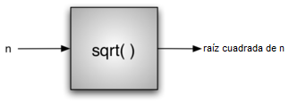

..  Copyright (C)  Brad Miller, David Ranum
    This work is licensed under the Creative Commons Attribution-NonCommercial-ShareAlike 4.0 International License. To view a copy of this license, visit http://creativecommons.org/licenses/by-nc-sa/4.0/.

¿Qué son las ciencias de la computación?
----------------------------------------

Las ciencias de la computación son a menudo difíciles de definir. Ésto probablemente se debe a la referencia indirecta de la palabra “"computadora” en el nombre de estas ciencias. Como quizás usted sepa, las ciencias de la computación no son simplemente el estudio de la computadoras. Sin embargo, las computadoras juegan un rol de soporte importante como una herramienta en la disciplina. Ellas son simplemente éso: herramientas.

.. Computer science is often difficult to define. This is probably due to the unfortunate use of the word “computer” in the name. As you are perhaps aware, computer science is not simply the study of computers. Although computers play an important supporting role as a tool in the discipline, they are just that–tools.

Las ciencias de la computación son el estudio de problemas, la solución de problemas y las soluciones que resultan del proceso de solución de problemas. Dado un problema, el objetivo de un científico de la computación es desarrollar un **algoritmo**, una lista paso a paso de las instrucciones para resolver cualquier caso del problema que pudiera surgir. Los algoritmos son procesos finitos que, si se siguen, resolverán el problema. Los algoritmos son soluciones.

.. Computer science is the study of problems, problem-solving, and the solutions that come out of the problem-solving process. Given a problem, a computer scientist’s goal is to develop an **algorithm**, a step-by-step list of instructions for solving any instance of the problem that might arise. Algorithms are finite processes that if followed will solve the problem. Algorithms are solutions.

Las ciencias de la computación pueden pensarse como el estudio de los algoritmos. Sin embargo, debemos ser cuidadosos e incluir el hecho de que algunos problemas puede que no tengan solución. Aunque probar esta afirmación está más allá del alcance de este texto, el hecho de que algunos problemas no puedan ser resueltos es importante para quienes estudian ciencias de la computación. Podemos entonces definir completamente ciencias de la computación mediante la inclusión de ambos tipos de problemas y diciendo que las ciencias de la computación son el estudio de las soluciones a los problemas así como el estudio de los problemas que no tienen solución.

.. Computer science can be thought of as the study of algorithms. However, we must be careful to include the fact that some problems may not have a solution. Although proving this statement is beyond the scope of this text, the fact that some problems cannot be solved is important for those who study computer science. We can fully define computer science, then, by including both types of problems and stating that computer science is the study of solutions to problems as well as the study of problems with no solutions.

Es también muy común incluir la palabra **calculable** al describir problemas y soluciones. Decimos que un problema es calculable si existe un algoritmo para resolverlo. Una definición alternativa para ciencias de la computación es entonces decir que las ciencias de la computación son el estudio de los problemas que son calculables y de los que no son, el estudio de existencia y de la inexistencia de algoritmos. en cualquier caso, usted notará que la palabra “computadora” no apareció en absoluto. Las soluciones son consideradas independientes de la máquina. 

.. It is also very common to include the word **computable** when describing problems and solutions. We say that a problem is computable if an algorithm exists for solving it. An alternative definition for computer science, then, is to say that computer science is the study of problems that are and that are not computable, the study of the existence and the nonexistence of algorithms. In any case, you will note that the word “computer” did not come up at all. Solutions are considered independent from the machine. 

Las ciencias de la computación, puesto que se refieren al proceso de solución de problemas en sí mismo, es también el estudio de la **abstracción**. La abstracción nos permite ver el problema y la solución de modo que se separen las denominadas perspectivas lógica y física. La idea básica nos resulta familiar en un ejemplo común. 

.. Computer science, as it pertains to the problem-solving process itself, is also the study of **abstraction**. Abstraction allows us to view the problem and solution in such a way as to separate the so-called logical and physical perspectives. The basic idea is familiar to us in a common example.

Considere el automóvil que usted pudo haber conducido hoy camino a la escuela o al trabajo. Como conductor, un usuario del carro, usted tiene ciertas interacciones que tienen lugar con el fin de utilizar el carro para su propósito previsto. Usted ingresa, inserta la llave, arranca el carro, hace cambios de marcha, frena, acelera y maneja con el fin de conducir. Desde un punto de vista de la abstracción, podemos decir que usted está viendo la perspectiva lógica del automóvil. Usted está usando las funciones brindadas por los diseñadores del carro para el propósito de transportarlo de un lugar a otro. Estas funciones se refieren algunas veces como la **interfaz**. 

.. Consider the automobile that you may have driven to school or work today. As a driver, a user of the car, you have certain interactions that take place in order to utilize the car for its intended purpose. You get in, insert the key, start the car, shift, brake, accelerate, and steer in order to drive. From an abstraction point of view, we can say that you are seeing the logical perspective of the automobile. You are using the functions provided by the car designers for the purpose of transporting you from one location to another. These functions are sometimes also referred to as the **interface**.

De otro lado, la operaria mecánica que debe reparar su automóvil toma un punto de vista muy diferente. Ella no sólo sabe cómo conducir sino que también debe conocer todos los detalles necesarios para llevar a cabo todas las funciones que nosotros damos por sentadas. Ella necesita entender cómo funciona el motor, cómo la transmisión cambia de marcha, cómo se controla la temperatura, y así sucesivamente. Ésto se conoce como la perspectiva física, los detalles que tienen lugar “bajo el capó”.

.. On the other hand, the mechanic who must repair your automobile takes a very different point of view. She not only knows how to drive but must know all of the details necessary to carry out all the functions that we take for granted. She needs to understand how the engine works, how the transmission shifts gears, how temperature is controlled, and so on. This is known as the physical perspective, the details that take place “under the hood.”

Lo mismo ocurre cuando usamos computadoras. La mayoría de personas las usan para escribir documentos, enviar y recibir correos electrónicos, navegar en la web, reproducir música, almacenar imágenes y usar juegos sin conocimiento alguno de los detalles que tienen lugar para permitir que esos tipos de aplicaciones funcionen. Ven las computadoras desde una pespectiva lógica o de usuario. Los científicos de la computación, los programadores, el personal de apoyo tecnológico y los administradores de sistemas adoptan una vista de la computadora muy diferente. Deben conocer los detalles de cómo funcionan los sistemas operativos, cómo están configurados los protocolos de red y cómo codificar varios *scripts* que controlan su función. Deben ser capaces de controlar los detalles de bajo nivel que un usuario simplemente asume.

.. The same thing happens when we use computers. Most people use computers to write documents, send and receive email, surf the web, play music, store images, and play games without any knowledge of the details that take place to allow those types of applications to work. They view computers from a logical or user perspective. Computer scientists, programmers, technology support staff, and system administrators take a very different view of the computer. They must know the details of how operating systems work, how network protocols are configured, and how to code various scripts that control function. They must be able to control the low-level details that a user simply assumes.

El punto común para ambos ejemplos es que el usuario de la abstracción, a veces también llamado el cliente, no necesita conocer los detalles siempre y cuando esté enterado del modo en que la interfaz funciona. Dicha interfaz es la manera como nosotros, como usuarios, nos comunicamos con las complejidades subyacentes de la implementación. Como otro ejemplo de abstracción, considere el módulo ``math`` de Python. Una vez importamos el módulo, podemos llevar a cabo cálculos tales como

.. The common point for both of these examples is that the user of the abstraction, sometimes also called the client, does not need to know the details as long as the user is aware of the way the interface works. This interface is the way we as users communicate with the underlying complexities of the implementation. As another example of abstraction, consider the Python ``math`` module. Once we import the module, we can perform computations such as

::

    >>> import math
    >>> math.sqrt(16)
    4.0
    >>>

Éste es un ejemplo de **abstracción procedimental**. No sabemos necesariamente cómo está siendo calculada la raíz cuadrada, pero conocemos cómo se llama la función y cómo usarla. Si realizamos la importación correctamente, podemos asumir que la función nos dará los resultados correctos. Sabemos que alguien implementó una solución para el problema de la raíz cuadrada pero únicamente necesitamos saber cómo usarla. Esto se refiere a menudo como una vista de “caja negra” de un proceso. Simplemente describirmos la interfaz: el nombre de la función, qué se necesita (los parámetros) y qué será devuelto. Los detalles están ocultos en el interior (ver :ref:`Figura 1 <fig_procabstraction>`).

.. This is an example of **procedural abstraction**. We do not necessarily know how the square root is being calculated, but we know what the function is called and how to use it. If we perform the import correctly, we can assume that the function will provide us with the correct results. We know that someone implemented a solution to the square root problem but we only need to know how to use it. This is sometimes referred to as a “black box” view of a process. We simply describe the interface: the name of the function, what is needed (the parameters), and what will be returned. The details are hidden inside (see :ref:`Figure 1 <fig_procabstraction>`).

.. _fig_procabstraction:

   Figura 1: Abstracción procedimental
   
   Figura 1: Abstracción procedimental
