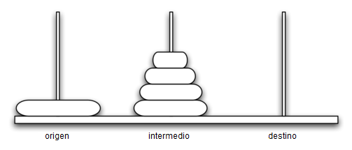

..  Copyright (C)  Brad Miller, David Ranum
    This work is licensed under the Creative Commons Attribution-NonCommercial-ShareAlike 4.0 International License. To view a copy of this license, visit http://creativecommons.org/licenses/by-nc-sa/4.0/.

Las torres de Hanoi
~~~~~~~~~~~~~~~~~~~

El rompecabezas de la Torre de Hanoi fue inventado por el matemático francés Edouard Lucas en 1883. Se inspiró en una leyenda acerca de un templo hindú donde el rompecabezas fue presentado a los jóvenes sacerdotes. Al principio de los tiempos, a los sacerdotes se les dieron tres postes y una pila de 64 discos de oro, cada disco un poco más pequeño que el de debajo. Su misión era transferir los 64 discos de uno de los tres postes a otro, con dos limitaciones importantes. Sólo podían mover un disco a la vez, y nunca podían colocar un disco más grande encima de uno más pequeño. Los sacerdotes trabajaban muy eficientemente, día y noche, moviendo un disco cada segundo. Cuando terminaran su trabajo, dice la leyenda, el templo se desmenuzaría en polvo y el mundo se desvanecería.

.. The Tower of Hanoi puzzle was invented by the French mathematician Edouard Lucas in 1883. He was inspired by a legend that tells of a Hindu temple where the puzzle was presented to young priests. At the beginning of time, the priests were given three poles and a stack of 64 gold disks, each disk a little smaller than the one beneath it. Their assignment was to transfer all 64 disks from one of the three poles to another, with two important constraints. They could only move one disk at a time, and they could never place a larger disk on top of a smaller one. The priests worked very efficiently, day and night, moving one disk every second. When they finished their work, the legend said, the temple would crumble into dust and the world would vanish.

Aunque la leyenda es interesante, usted no tiene que preocuparse de que el final del mundo ocurra pronto en cualquier momento. El número de movimientos necesarios para mover correctamente una torre de 64 discos es :math:`2^{64}-1 = 18,446,744,073,709,551,615`. A una velocidad de un movimiento por segundo, ¡eso sería :math:`584,942,417,355` años! Claramente hay algo más en este rompecabezas de lo que parece.

.. Although the legend is interesting, you need not worry about the world ending any time soon. The number of moves required to correctly move a tower of 64 disks is :math:`2^{64}-1 = 18,446,744,073,709,551,615`. At a rate of one move per second, that is :math:`584,942,417,355` years! Clearly there is more to this puzzle than meets the eye.

La :ref:`Figura 1 <fig_hanoi>` muestra un ejemplo de una configuración de discos en el proceso de movimiento del primer poste al tercero. Observe que, según especifican las reglas, los discos de cada poste se apilan de manera que los discos más pequeños estén siempre encima de los discos más grandes. Si usted no ha intentado resolver este rompecabezas antes, debe probarlo ahora. No necesita discos y postes elegantes, una pila de libros o trozos de papel servirán.

.. :ref:`Figure 1 <fig_hanoi>` shows an example of a configuration of disks in the middle of a move from the first peg to the third. Notice that, as the rules specify, the disks on each peg are stacked so that smaller disks are always on top of the larger disks. If you have not tried to solve this puzzle before, you should try it now. You do not need fancy disks and poles–a pile of books or pieces of paper will work.

.. _fig_hanoi:

   
   Figura 1: Una disposición ilustrativa de los discos para la Torre de Hanoi

   Figura 1: Una disposición ilustrativa de los discos para la Torre de Hanoi

¿Cómo vamos a resolver este problema recursivamente? ¿Cómo resolvería usted este problema en todo caso? ¿Cuál es nuestro caso base? Pensemos en este problema desde abajo hacia arriba. Supongamos que usted tiene una torre de cinco discos, originalmente en un poste. Si usted ya sabía cómo mover una torre de cuatro discos al poste dos, entonces podría mover fácilmente el disco inferior al poste tres, y luego mover la torre de cuatro discos desde el poste dos al poste tres. Pero ¿qué tal si usted no sabe cómo mover una torre de altura cuatro? Supongamos que usted sabía cómo mover una torre de altura tres al poste tres; entonces sería fácil mover el cuarto disco al poste dos y mover los tres discos del poste tres encima de aquél. Pero ¿qué tal si usted no sabe cómo mover una torre de tres discos? ¿Qué tal si usted mueve una torre de dos discos al poste dos y luego mueve el tercer disco al poste tres, y luego mueve la torre de altura dos encima de dicho disco? Pero ¿qué tal si todavía no sabe cómo hacer esto? Seguramente estaría de acuerdo en que mover un solo disco al poste tres es bastante fácil, trivial incluso podría decirse. Esto suena como un caso base.

.. How do we go about solving this problem recursively? How would you go about solving this problem at all? What is our base case? Let’s think about this problem from the bottom up. Suppose you have a tower of five disks, originally on peg one. If you already knew how to move a tower of four disks to peg two, you could then easily move the bottom disk to peg three, and then move the tower of four from peg two to peg three. But what if you do not know how to move a tower of height four? Suppose that you knew how to move a tower of height three to peg three; then it would be easy to move the fourth disk to peg two and move the three from peg three on top of it. But what if you do not know how to move a tower of three? How about moving a tower of two disks to peg two and then moving the third disk to peg three, and then moving the tower of height two on top of it? But what if you still do not know how to do this? Surely you would agree that moving a single disk to peg three is easy enough, trivial you might even say. This sounds like a base case in the making.

El siguiente es un esquema de alto nivel de cómo mover una torre desde el poste de origen, hasta el poste destino, utilizando un poste intermedio:

.. Here is a high-level outline of how to move a tower from the starting pole, to the goal pole, using an intermediate pole:

#. Mover una torre de altura-1 a un poste intermedio, utilizando el poste destino.

#. Mover el disco restante al poste destino.

#. Mover la torre de altura-1 desde el poste intermedio hasta el poste destino usando el poste de origen.

Siempre y cuando obedezcamos la regla de que los discos más grandes deben permanecer en la parte inferior de la pila, podemos usar los tres pasos anteriores recursivamente, tratando cualquier disco más grande como si ni siquiera estuviera allí. Lo único que falta en el esquema anterior es la identificación de un caso base. El problema de la torre de Hanoi más simple es una torre de un disco. En ese caso, sólo necesitamos mover un solo disco a su destino final. Una torre de un disco será nuestro caso base. Además, los pasos descritos anteriormente nos mueven hacia el caso base reduciendo la altura de la torre en los pasos 1 y 3. El :ref:`Programa 1 <lst_hanoi>` muestra el código en Python para resolver el rompecabezas de la Torre de Hanoi.

.. As long as we always obey the rule that the larger disks remain on the bottom of the stack, we can use the three steps above recursively, treating any larger disks as though they were not even there. The only thing missing from the outline above is the identification of a base case. The simplest Tower of Hanoi problem is a tower of one disk. In this case, we need move only a single disk to its final destination. A tower of one disk will be our base case. In addition, the steps outlined above move us toward the base case by reducing the height of the tower in steps 1 and 3. :ref:`Listing 1 <lst_hanoi>` shows the Python code to solve the Tower of Hanoi puzzle.

.. _lst_hanoi:

**Programa 1**

.. highlight:: python
    :linenothreshold: 2

::

    def moverTorre(altura,origen, destino, intermedio):
        if altura >= 1:
            moverTorre(altura-1,origen,intermedio,destino)
            moverDisco(origen,destino)
            moverTorre(altura-1,intermedio,destino,origen)
            
.. highlight:: python
    :linenothreshold: 500

Note que el código en el :ref:`Programa 1 <lst_hanoi>` es casi idéntico a la descripción en español. La clave de la simplicidad del algoritmo es que realizamos dos llamadas recursivas diferentes, una en la línea 3 y otra en la línea 5. En la línea 3 movemos todo menos el disco inferior de la torre de origen hacia un poste intermedio. La siguiente línea simplemente mueve el disco inferior a su lugar final. Luego, en la línea 5, movemos la torre desde el poste intermedio hasta la parte superior del disco más grande. El caso base se detecta cuando la altura de la torre es 0; en ese caso no habrá nada que hacer, por lo que la función ``moverTorre`` simplemente regresa el control. Lo importante a tener en cuenta al tratar el caso base de esta manera es que simplemente el regreso desde ``moverTorre`` es lo que finalmente permite que la función ``moverDisco`` sea invocada.

.. Notice that the code in :ref:`Listing 1 <lst_hanoi>` is almost identical to the English description. The key to the simplicity of the algorithm is that we make two different recursive calls, one on line 3 and a second on line 5. On line 3 we move all but the bottom disk on the initial tower to an intermediate pole. The next line simply moves the bottom disk to its final resting place. Then on line 5 we move the tower from the intermediate pole to the top of the largest disk. The base case is detected when the tower height is 0; in this case there is nothing to do, so the ``moverTorre`` function simply returns. The important thing to remember about handling the base case this way is that simply returning from ``moverTorre`` is what finally allows the ``moverDisco`` function to be called.

La función ``moverDisco``, que se muestra en el :ref:`Programa 2 <lst_movedisk>`, es muy simple. Todo lo que hace es imprimir que se está moviendo un disco de un poste a otro. Si usted codifica y ejecuta el programa ``moverTorre`` podrá ver que le da una solución muy eficiente al rompecabezas.

.. The function ``moverDisco``, shown in :ref:`Listing 2 <lst_movedisk>`, is very simple. All it does is print out that it is moving a disk from one pole to another. If you type in and run the ``moverTorre`` program you can see that it gives you a very efficient solution to the puzzle.

.. _lst_movedisk:

**Programa 2**

::

    def moverDisco(desde,hacia):
        print("mover disco de",desde,"a",hacia)
   
El programa en el ActiveCode 1 proporciona la solución completa para tres discos.
     
.. The program in ActiveCode 1 provides the entire solution for three disks.
        
.. activecode:: hanoi
    :caption: Solución recursiva del problema de las torres de Hanoi

    def moverTorre(altura,origen, destino, intermedio):
        if altura >= 1:
            moverTorre(altura-1,origen,intermedio,destino)
            moverDisco(origen,destino)
            moverTorre(altura-1,intermedio,destino,origen)

    def moverDisco(desde,hacia):
        print("mover disco de",desde,"a",hacia)
    
    moverTorre(3,"A","B","C")

Ahora que usted ha visto el código para ``moverTorre`` y ``moverDisco``, es posible que se pregunte por qué no tenemos una estructura de datos que realice explícitamente un seguimiento de qué discos están en qué postes. He aquí una sugerencia: si usted fuera a supervisar explícitamente los discos, utilizaría probablemente tres objetos ``Pila``, uno para cada poste. La respuesta es que Python proporciona implícitamente las pilas que necesitamos a través de la pila de llamadas.

.. Now that you have seen the code for both ``moverTorre`` and ``moverDisco``, you may be wondering why we do not have a data structure that explicitly keeps track of what disks are on what poles. Here is a hint: if you were going to explicitly keep track of the disks, you would probably use three ``Stack`` objects, one for each pole. The answer is that Python provides the stacks that we need implicitly through the call stack.
