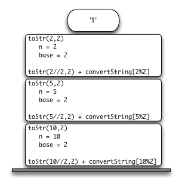

..  Copyright (C)  Brad Miller, David Ranum
    This work is licensed under the Creative Commons Attribution-NonCommercial-ShareAlike 4.0 International License. To view a copy of this license, visit http://creativecommons.org/licenses/by-nc-sa/4.0/.

Marcos de pila: Implementación de la recursividad
---------------------------------------------------

Supongamos que en lugar de concatenar el resultado de la llamada recursiva a ``aCadena`` con la cadena de ``cadenaConversion``, modificamos nuestro algoritmo para incluir las cadenas en una pila antes de hacer la llamada recursiva. El código de este algoritmo modificado se muestra en el :ref:`ActiveCode 1 <lst_recstack>`.

.. Suppose that instead of concatenating the result of the recursive call to ``toStr`` with the string from ``convertString``, we modified our algorithm to push the strings onto a stack prior to making the recursive call. The code for this modified algorithm is shown in :ref:`ActiveCode 1 <lst_recstack>`.

.. activecode:: lst_recstack
    :caption: Conversión de un entero a una cadena usando una pila
    :nocodelens:

    from pythoned.basicas.pila import Pila

    pilaResultados = Pila()

    def aCadena(n,base):
        cadenaConversion = "0123456789ABCDEF"
        while n > 0:
            if n < base:
                pilaResultados.incluir(cadenaConversion[n])
            else:
                pilaResultados.incluir(cadenaConversion[n % base])
            n = n // base
        resultado = ""
        while not pilaResultados.estaVacia():
            resultado = resultado + str(pilaResultados.extraer())
        return resultado

    print(aCadena(1453,16))

Cada vez que hacemos una llamada a ``aCadena``, incluimos un carácter en la pila. Volviendo al ejemplo anterior podemos ver que después de la cuarta llamada a ``aCadena`` la pila se vería como muestra la  :ref:`Figura 5 <fig_recstack>`. Tenga en cuenta que ahora podemos simplemente extraer los caracteres de la pila y concatenarlos en el resultado final, ``"1010"``.

.. Each time we make a call to ``toStr``, we push a character on the stack. Returning to the previous example we can see that after the fourth call to ``toStr`` the stack would look like :ref:`Figure 5 <fig_recstack>`. Notice that now we can simply pop the characters off the stack and concatenate them into the final result, ``"1010"``.

.. _fig_recstack:

.. figure:: Figures/recstack.png
   :align: center

   Figura 5: Cadenas colocadas en la pila durante la conversión

   Figura 5: Cadenas colocadas en la pila durante la conversión

El ejemplo anterior nos da una idea de cómo implementa Python una llamada a función recursiva. Cuando se llama a una función en Python, se asigna un **marco de pila** para manejar las variables locales de la función. Cuando la función realiza la devolución, el valor devuelto se deja en el tope de la pila para que la función invocante tenga acceso a él. La :ref:`Figura 6 <fig_callstack>` ilustra la pila de llamadas después de la instrucción return de la línea 4.

.. The previous example gives us some insight into how Python implements a recursive function call. When a function is called in Python, a **stack frame** is allocated to handle the local variables of the function. When the function returns, the return value is left on top of the stack for the calling function to access. :ref:`Figure 6 <fig_callstack>` illustrates the call stack after the return statement on line 4.

.. _fig_callstack:

   Figura 6: Pila de llamadas generada por ``aCadena(10,2)``

   Figura 6: Pila de llamadas generada por ``aCadena(10,2)``

Note que la llamada a ``aCadena(2//2,2)`` deja como valor devuelto un ``"1"`` en la pila. Este valor devuelto se utiliza entonces en lugar de la llamada de función (``aCadena(1,2)``) en la expresión ``"1" + cadenaConversión[2%2]``, que dejará la cadena ``"10"`` en el tope de la pila. De esta manera, la pila de llamadas de Python reemplaza la pila que usamos explícitamente en el :ref:`Programa 4 <lst_recstack>`. En nuestro ejemplo de sumatoria de números en una lista, usted puede pensar en el valor devuelto en la pila como una sustitución de una variable de acumulación.

.. Notice that the call to ``toStr(2//2,2)`` leaves a return value of ``"1"`` on the stack. This return value is then used in place of the function call (``toStr(1,2)``) in the expression ``"1" + cadenaConversion[2%2]``, which will leave the string ``"10"`` on the top of the stack. In this way, the Python call stack takes the place of the stack we used explicitly in :ref:`Listing 4 <lst_recstack>`. In our list summing example, you can think of the return value on the stack taking the place of an accumulator variable.

Los marcos de pila también proporcionan un entorno para las variables utilizadas por la función. A pesar de que estamos llamando a la misma función una y otra vez, cada llamada crea un nuevo entorno para las variables que son locales a la función.

.. The stack frames also provide a scope for the variables used by the function. Even though we are calling the same function over and over, each call creates a new scope for the variables that are local to the function.
