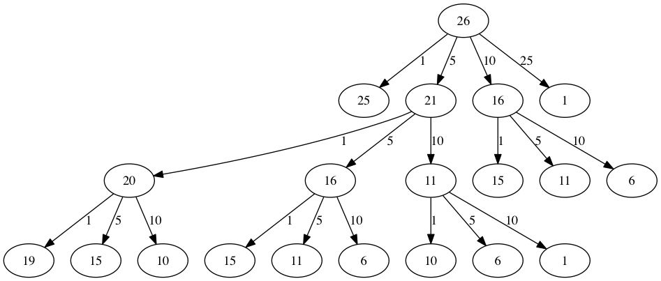

..  Copyright (C)  Brad Miller, David Ranum
    This work is licensed under the Creative Commons Attribution-NonCommercial-ShareAlike 4.0 International License. To view a copy of this license, visit http://creativecommons.org/licenses/by-nc-sa/4.0/.

Programación dinámica
---------------------

Muchos programas en ciencias de la computación se escriben para optimizar algún valor; por ejemplo, encontrar el camino más corto entre dos puntos, encontrar la línea que mejor se ajusta a un conjunto de puntos, o encontrar el conjunto más pequeño de objetos que satisface algunos criterios. Hay muchas estrategias que usan los científicos de la computación para resolver estos problemas. Uno de los objetivos de este libro es presentarle a usted varias estrategias de solución de problemas diferentes. La **programación dinámica** es una estrategia para estos tipos de problemas de optimización.

.. Many programs in computer science are written to optimize some value; for example, find the shortest path between two points, find the line that best fits a set of points, or find the smallest set of objects that satisfies some criteria. There are many strategies that computer scientists use to solve these problems. One of the goals of this book is to expose you to several different problem solving strategies. **Dynamic programming** is one strategy for these types of optimization problems.

Un ejemplo clásico de un problema de optimización consiste en dar las vueltas utilizando el menor número de monedas. Supongamos que usted es un programador para un fabricante de máquinas expendedoras. Su empresa desea agilizar el esfuerzo dando la menor cantidad posible de monedas para las vueltas de cada transacción. Supongamos que un cliente inserta un billete de un dólar y compra un ítem de 37 centavos. ¿Cuál es el menor número de monedas que usted puede usar para dar las vueltas? La respuesta es seis monedas: dos de 25 centavos, una de 10 centavos, y tres de un centavo. ¿Cómo llegamos a la respuesta de seis monedas? Comenzamos con la moneda más grande de nuestro arsenal (la de 25 centavos) y usamos la mayor cantidad posible, luego vamos a la siguiente moneda de menor valor y usamos el mayor número posible. Este primer enfoque se llama un **método codicioso** porque tratamos de resolver una gran parte del problema tan inmediatamente como sea posible.

.. A classic example of an optimization problem involves making change using the fewest coins. Suppose you are a programmer for a vending machine manufacturer. Your company wants to streamline effort by giving out the fewest possible coins in change for each transaction. Suppose a customer puts in a dollar bill and purchases an item for 37 cents. What is the smallest number of coins you can use to make change? The answer is six coins: two quarters, one dime, and three pennies. How did we arrive at the answer of six coins? We start with the largest coin in our arsenal (a quarter) and use as many of those as possible, then we go to the next lowest coin value and use as many of those as possible. This first approach is called a **greedy method** because we try to solve as big a piece of the problem as possible right away.

El método codicioso funciona bien cuando usamos monedas estadounidenses, pero supongamos que su empresa decide instalar sus máquinas expendedoras en Elbonia donde, además de las monedas usuales de 1, 5, 10 y 25 centavos, también tienen una moneda de 21 centavos. En este caso, nuestro método codicioso no logra encontrar la solución óptima para las vueltas de 63 centavos. Con la adición de la moneda de 21 centavos, el método codicioso aún hallaría que la solución es de seis monedas. Sin embargo, la respuesta óptima es tres monedas de 21 centavos.

.. The greedy method works fine when we are using U.S. coins, but suppose that your company decides to deploy its vending machines in Lower Elbonia where, in addition to the usual 1, 5, 10, and 25 cent coins they also have a 21 cent coin. In this instance our greedy method fails to find the optimal solution for 63 cents in change. With the addition of the 21 cent coin the greedy method would still find the solution to be six coins. However, the optimal answer is three 21 cent pieces.

Veamos un método con el que podríamos estar seguros de que encontraríamos la respuesta óptima al problema. Dado que esta sección trata sobre la recursividad, usted quizás ya habrá adivinado que usaremos una solución recursiva. Comencemos con la identificación del caso base. Si estamos tratando de dar unas vueltas que corresponden a la misma cantidad que el valor de una de nuestras monedas, la respuesta es fácil, una moneda.

.. Let’s look at a method where we could be sure that we would find the optimal answer to the problem. Since this section is about recursion, you may have guessed that we will use a recursive solution. Let’s start with identifying the base case. If we are trying to make change for the same amount as the value of one of our coins, the answer is easy, one coin.

Tenemos varias opciones si la cantidad no coincide. Lo que queremos es el mínimo valor resultante entre las siguientes opciones: a) un centavo más el número de monedas necesarias para dar las vueltas por la cantidad original menos un centavo, o b) una moneda de 5 centavos más el número de monedas necesarias para dar las vueltas por la cantidad original menos cinco centavos, o c) una moneda de 10 centavos más el número de monedas necesarias para dar las vueltas por la cantidad original menos diez centavos, y así sucesivamente. Por lo tanto, el número de monedas necesarias para dar las vueltas por la cantidad original se puede calcular de acuerdo con la siguiente expresión:

.. If the amount does not match we have several options. What we want is the minimum of a penny plus the number of coins needed to make change for the original amount minus a penny, or a nickel plus the number of coins needed to make change for the original amount minus five cents, or a dime plus the number of coins needed to make change for the original amount minus ten cents, and so on. So the number of coins needed to make change for the original amount can be computed according to the following: 

.. math::

      numeroMonedas =
   min
   \begin{cases}
   1 + numeroMonedas(cantidad original - 1) \\
   1 + numeroMonedas(cantidad original - 5) \\
   1 + numeroMonedas(cantidad original - 10) \\
   1 + numeroMonedas(cantidad original - 25)
   \end{cases}
   \label{eqn_change}

El algoritmo para hacer lo que acabamos de describir se muestra en el :ref:`Programa 7 <lst_change1>`. En la línea 3 estamos verificando nuestro caso base; es decir, estamos tratando de dar las vueltas correspondientes a la cantidad exacta de una de nuestras monedas. Si no tenemos una moneda igual a la cantidad de las vueltas, hacemos llamadas recursivas para cada valor de moneda diferente menor que la cantidad de las vueltas que estamos tratando de generar. La línea 6 muestra cómo filtramos la lista de monedas a aquéllas que sean menores que el valor actual de las vueltas usando una comprensión de listas. La llamada recursiva también reduce la cantidad total de las vueltas que necesitamos generar con el valor de la moneda seleccionada. La llamada recursiva se hace en la línea 7. Note que en esa misma línea sumamos 1 a nuestro número de monedas para explicar el hecho de que estamos usando una moneda. Simplemente sumar 1 es lo mismo que si hubiéramos hecho una llamada recursiva en la cual satisfacemos la condición del caso base inmediatamente.

.. The algorithm for doing what we have just described is shown in :ref:`Listing 7 <lst_change1>`. In line 3 we are checking our base case; that is, we are trying to make change in the exact amount of one of our coins. If we do not have a coin equal to the amount of change, we make recursive calls for each different coin value less than the amount of change we are trying to make. Line 6 shows how we filter the list of coins to those less than the current value of change using a list comprehension. The recursive call also reduces the total amount of change we need to make by the value of the coin selected. The recursive call is made in line 7. Notice that on that same line we add 1 to our number of coins to account for the fact that we are using a coin. Just adding 1 is the same as if we had made a recursive call asking where we satisfy the base case condition immediately.

.. _lst_change1:

.. highlight:: python
    :linenothreshold: 5

**Programa 7**

::

    def vueltasRec(listaValoresMonedas,vueltas):
       minMonedas = vueltas
       if vueltas in listaValoresMonedas:
         return 1
       else:
          for i in [m for m in listaValoresMonedas if m <= vueltas]:
             numeroMonedas = 1 + vueltasRec(listaValoresMonedas,vueltas-i)
             if numeroMonedas < minMonedas:
                minMonedas = numeroMonedas
       return minMonedas

    print(vueltasRec([1,5,10,25],63))

.. highlight:: python
    :linenothreshold: 500

El problema con el algoritmo del :ref:`Programa 7 <lst_change1>` es que es extremadamente ineficiente. De hecho, requiere 67.716.925 llamadas recursivas para encontrar la solución óptima al problema de los 63 centavos usando 4 monedas. Para entender la falla fatal en nuestro enfoque, mire la :ref:`Figura 3 <fig_c1ct>`, que ilustra una pequeña fracción de las 377 llamadas de función necesarias para encontrar el conjunto óptimo de monedas para dar unas vueltas de 26 centavos.

.. The trouble with the algorithm in :ref:`Listing 7 <lst_change1>` is that it is extremely inefficient. In fact, it takes 67,716,925 recursive calls to find the optimal solution to the 4 coins, 63 cents problem! To understand the fatal flaw in our approach look at :ref:`Figure 5 <fig_c1ct>`, which illustrates a small fraction of the 377 function calls needed to find the optimal set of coins to make change for 26 cents.

Cada nodo en la gráfica corresponde a una llamada a la función ``vueltasRec``. La etiqueta en el nodo indica el valor de las vueltas para el que estamos calculando el número de monedas. La etiqueta de la flecha indica la moneda que acabamos de usar. Siguiendo la gráfica podemos ver la combinación de monedas que nos ha llevado a cualquier punto de la gráfica. El principal problema es que estamos recalculando demasiado. Por ejemplo, la gráfica muestra que el algoritmo recalcularía el número óptimo de monedas para unas vueltas de 15 centavos al menos tres veces. Cada uno de estos cálculos para encontrar el número óptimo de monedas para 15 centavos, en sí mismo, implica 52 llamadas a la función. Es evidente que estamos perdiendo mucho tiempo y esfuerzo recalculando resultados anteriores.

.. Each node in the graph corresponds to a call to ``vueltasRec``. The label on the node indicates the amount of change for which we are computing the number of coins. The label on the arrow indicates the coin that we just used. By following the graph we can see the combination of coins that got us to any point in the graph. The main problem is that we are re-doing too many calculations. For example, the graph shows that the algorithm would recalculate the optimal number of coins to make change for 15 cents at least three times. Each of these computations to find the optimal number of coins for 15 cents itself takes 52 function calls. Clearly we are wasting a lot of time and effort recalculating old results.

.. _fig_c1ct:

   Figura 3: Árbol de llamadas a la función para el Programa 7

   Figura 3: Árbol de llamadas a la función para el Programa 7

La clave para reducir la cantidad de trabajo que hacemos es recordar algunos de los resultados pasados de modo que podamos evitar recalcular los resultados que ya conocemos. Una solución simple es almacenar los resultados en una tabla para el número mínimo de monedas cuando los encontremos. Entonces antes de calcular un nuevo mínimo, primero buscamos en la tabla para ver si un resultado ya es conocido. Si ya hay un resultado en la tabla, usamos el valor de la tabla en lugar de recalcularlo. El :ref:`ActiveCode 1 <lst_change2>` muestra un algoritmo modificado para incorporar nuestro esquema de búsqueda en tabla.

.. The key to cutting down on the amount of work we do is to remember some of the past results so we can avoid recomputing results we already know. A simple solution is to store the results for the minimum number of coins in a table when we find them. Then before we compute a new minimum, we first check the table to see if a result is already known. If there is already a result in the table, we use the value from the table rather than recomputing. :ref:`ActiveCode 1 <lst_change2>` shows a modified algorithm to incorporate our table lookup scheme.

.. activecode:: lst_change2
    :caption: Conteo recursivo de monedas con búsqueda en tabla
    :nocodelens:

    def vueltasRecB(listaValoresMonedas,vueltas,resultadosConocidos):
       minMonedas = vueltas
       if vueltas in listaValoresMonedas:   
          resultadosConocidos[vueltas] = 1
          return 1
       elif resultadosConocidos[vueltas] > 0:
          return resultadosConocidos[vueltas]
       else:
           for i in [m for m in listaValoresMonedas if m <= vueltas]:
             numeroMonedas = 1 + vueltasRecB(listaValoresMonedas, vueltas-i, 
                                  resultadosConocidos)
             if numeroMonedas < minMonedas:
                minMonedas = numeroMonedas
                resultadosConocidos[vueltas] = minMonedas
       return minMonedas

    print(vueltasRecB([1,5,10,25],63,[0]*64))

Note que en la línea 6 hemos añadido una verificación para ver si nuestra tabla contiene el número mínimo de monedas para cierta cantidad de vueltas. Si no lo contiene, calculamos dicho mínimo recursivamente y almacenamos el mínimo calculado en la tabla. El uso de este algoritmo modificado reduce a 221 el número de llamadas recursivas que necesitamos hacer para el problema de los 63 centavos usando 4 monedas.

.. Notice that in line 6 we have added a test to see if our table contains the minimum number of coins for a certain amount of change. If it does not, we compute the minimum recursively and store the computed minimum in the table. Using this modified algorithm reduces the number of recursive calls we need to make for the four coin, 63 cent problem to 221 calls!

Aunque el algoritmo en el :ref:`AcitveCode 1 <lst_change2>` es correcto, se ve y se siente como un poco artificioso. Además, si miramos las listas de ``resultadosConocidos`` podemos ver que hay algunos vacíos en la tabla. De hecho, el término para lo que hemos hecho no es programación dinámica, sino que hemos mejorado el rendimiento de nuestro programa mediante el uso de una técnica conocida como “memoización”, o más comúnmente llamado “*cacheo*”.

.. Although the algorithm in :ref:`AcitveCode 1 <lst_change2>` is correct, it looks and feels like a bit of a hack.  Also, if we look at the ``resultadosConocidos`` lists we can see that there are some holes in the table. In fact the term for what we have done is not dynamic programming but rather we have improved the performance of our program by using a technique known as “memoization,” or more commonly called “caching.”

Un verdadero algoritmo de programación dinámica adoptará un enfoque más sistemático del problema. Nuestra solución de programación dinámica va a empezar con dar las vueltas por un centavo y sistemáticamente ascenderá hasta la cantidad de vueltas que necesitamos. Esto nos garantiza que en cada paso del algoritmo ya sabemos el número mínimo de monedas necesarias para dar las vueltas correspondientes a cualquier cantidad menor.

.. A truly dynamic programming algorithm will take a more systematic approach to the problem. Our dynamic programming solution is going to start with making change for one cent and systematically work its way up to the amount of change we require. This guarantees us that at each step of the algorithm we already know the minimum number of coins needed to make change for any smaller amount.

Veamos cómo llenaremos una tabla de cantidades mínimas de monedas para usar al dar unas vueltas de 11 centavos. La :ref:`Figura 4 <fig_dpcoins>` ilustra el proceso. Empezamos con un centavo. La única solución posible es una moneda (una de un centavo). La fila siguiente muestra la cantidad mínima de monedas para un centavo y para dos centavos. Una vez más, la única solución es dos monedas de un centavo. La quinta fila es donde las cosas se ponen interesantes. Ahora tenemos dos opciones a considerar, cinco monedas de un centavo o una de 5 centavos. ¿Cómo decidimos cuál es el mejor opción? Consultamos la tabla y vemos que el número de monedas necesarias para dar las vueltas por cuatro centavos es cuatro, más un centavo adicional para completar cinco, lo cual da como resultado cinco monedas. O podemos fijarnos en cero centavos más una moneda de 5 centavos para completar cinco centavos, lo cual da como resultado una 1 moneda. Como el mínimo entre uno y cinco es uno, almacenamos 1 en la tabla. Avance rápidamente al final de la tabla y considere el caso de 11 centavos. La :ref:`Figura 5 <fig_eleven>` muestra las tres opciones que tenemos que considerar:

.. Let’s look at how we would fill in a table of minimum coins to use in making change for 11 cents. :ref:`Figure 4 <fig_dpcoins>` illustrates the process. We start with one cent. The only solution possible is one coin (a penny). The next row shows the minimum for one cent and two cents. Again, the only solution is two pennies. The fifth row is where things get interesting. Now we have two options to consider, five pennies or one nickel. How do we decide which is best? We consult the table and see that the number of coins needed to make change for four cents is four, plus one more penny to make five, equals five coins. Or we can look at zero cents plus one more nickel to make five cents equals 1 coin. Since the minimum of one and five is one we store 1 in the table. Fast forward again to the end of the table and consider 11 cents. :ref:`Figure 5 <fig_eleven>` shows the three options that we have to consider:

#. Una moneda de un centavo más el número mínimo de monedas para dar unas vueltas de :math:`11-1 = 10` centavos (1)

#. Una moneda de 5 centavos más el número mínimo de monedas para dar unas vueltas de :math:`11 - 5 = 6` centavos (2)

#. Una moneda de 10 centavos más el número mínimo de monedas para dar unas vueltas de :math:`11 - 10 = 1` centavo (1)

Bien sea la opción 1 o la 3 nos dará un total de dos monedas que es el número mínimo de monedas para completar 11 centavos.

.. Either option 1 or 3 will give us a total of two coins which is the minimum number of coins for 11 cents.

.. _fig_dpcoins:

.. figure:: Figures/changeTable.png
   :align: center
   :alt: image
       
   Figura 4: Mínimo número de monedas necesarias para dar las vueltas

   Figura 4: Mínimo número de monedas necesarias para dar las vueltas

.. _fig_eleven:

.. figure:: Figures/elevenCents.png
   :align: center
   :alt: image

   Figura 5: Tres opciones a considerar para el número mínimo de monedas para completar once centavos

   Figura 5: Tres opciones a considerar para el número mínimo de monedas para completar once centavos

El :ref:`Programa 8 <lst_dpchange>` es un algoritmo de programación dinámica para solucionar nuestro problema de de dar las vueltas. ``vueltasProgDin`` tiene tres parámetros: una lista de valores válidos de monedas, la cantidad de vueltas que queremos completar y una lista del número mínimo de monedas necesarias para completar cada valor. Cuando la función termine, ``minMonedas`` contendrá la solución para todos los valores desde 0 hasta el valor de ``vueltas``.

.. :ref:`Listing 8 <lst_dpchange>` is a dynamic programming algorithm to solve our change-making problem. ``vueltasProgDin`` takes three parameters: a list of valid coin values, the amount of change we want to make, and a list of the minimum number of coins needed to make each value. When the function is done ``minMonedas`` will contain the solution for all values from 0 to the value of ``vueltas``.

.. _lst_dpchange:

**Programa 8**

::

    def vueltasProgDin(listaValoresMonedas,vueltas,minMonedas):
       for centavos in range(vueltas+1):
          conteoMonedas = centavos
          for j in [m for m in listaValoresMonedas if m <= centavos]:
                if minMonedas[centavos-j] + 1 < conteoMonedas:
                   conteoMonedas = minMonedas[centavos-j]+1
          minMonedas[centavos] = conteoMonedas
       return minMonedas[vueltas]

Note que ``vueltasProgDin`` no es una función recursiva, a pesar que empezamos con una solución recursiva a este problema. Es importante darse cuenta de que sólo porque usted sea capaz de escribir una solución recursiva a un problema no significa que ésa sea la solución mejor o más eficiente. La mayor parte del trabajo en esta función se realiza mediante el ciclo que comienza en la línea 4. En este ciclo consideramos el uso de todas las monedas posibles para dar las vueltas por la cantidad especificada por ``centavos``. Como hicimos con el ejemplo de 11 centavos descrito arriba, recordamos el valor mínimo y lo guardamos en nuestra lista ``minMonedas``.

.. Note that ``vueltasProgDin`` is not a recursive function, even though we started with a recursive solution to this problem. It is important to realize that just because you can write a recursive solution to a problem does not mean it is the best or most efficient solution. The bulk of the work in this function is done by the loop that starts on line 4. In this loop we consider using all possible coins to make change for the amount specified by ``centavos``. Like we did for the 11 cent example above, we remember the minimum value and store it in our ``minMonedas`` list.

Aunque nuestro algoritmo de dar las vueltas hace un buen trabajo para averiguar el número mínimo de monedas, no nos ayuda a dar las vueltas, ya que no realiza un seguimiento de las monedas que usamos. Podemos extender la función ``vueltasProgDin`` fácilmente para realizar un seguimiento de las monedas usadas recordando simplemente la última moneda que agregamos para cada entrada de la tabla ``minMonedas``. Si conocemos la última moneda añadida, simplemente podemos restar el valor de la moneda para encontrar una entrada anterior en la tabla que nos diga la última moneda que agregamos para completar esa cantidad. Podemos seguir retrocediendo por la tabla hasta que lleguemos al principio.

.. Although our making change algorithm does a good job of figuring out the minimum number of coins, it does not help us make change since we do not keep track of the coins we use. We can easily extend ``vueltasProgDin`` to keep track of the coins used by simply remembering the last coin we add for each entry in the ``minMonedas`` table. If we know the last coin added, we can simply subtract the value of the coin to find a previous entry in the table that tells us the last coin we added to make that amount. We can keep tracing back through the table until we get to the beginning. 

El :ref:`ActiveCode 2 <lst_dpremember>` muestra el algoritmo ``vueltasProgDin`` modificado para realizar un seguimiento de las monedas utilizadas, junto con una función ``imprimirMonedas`` que recorre la tabla para imprimir el valor de cada moneda usada. Esto muestra el algoritmo en acción resolviendo el problema para nuestros amigos en Elbonia. Las dos primeras líneas de ``main`` fijan la cantidad a convertir y crean la lista de monedas usadas. Las dos líneas siguientes crean las listas que necesitamos para almacenar los resultados. ``monedasUsadas`` es una lista de las monedas usadas para dar las vueltas, y ``conteoMonedas`` es el número mínimo de monedas usadas para dar las vueltas por la cantidad correspondiente a la posición en la lista.

.. :ref:`ActiveCode 2 <lst_dpremember>` shows the ``vueltasProgDin`` algorithm modified to keep track of the coins used, along with a function ``imprimirMonedas`` that walks backward through the table to print out the value of each coin used. This shows the algorithm in action solving the problem for our friends in Lower Elbonia. The first two lines of ``main`` set the amount to be converted and create the list of coins used. The next two lines create the lists we need to store the results. ``monedasUsadas`` is a list of the coins used to make change, and ``conteoMonedas`` is the minimum number of coins used to make change for the amount corresponding to the position in the list.

Note que las monedas que imprimimos vienen directamente del arreglo ``monedasUsadas``. Para la primera llamada comenzamos en la posición 63 del arreglo y se imprime 21. Luego tomamos :math:`63 - 21 = 42` y miramos el elemento 42 de la lista. Una vez más encontramos un 21 almacenado allí. Finalmente, el elemento 21 del arreglo también contiene 21, dándonos las tres monedas de 21 centavos.

.. Notice that the coins we print out come directly from the ``monedasUsadas`` array. For the first call we start at array position 63 and print 21. Then we take :math:`63 - 21 = 42` and look at the 42nd element of the list. Once again we find a 21 stored there. Finally, element 21 of the array also contains 21, giving us the three 21 cent pieces.

.. activecode:: lst_dpremember
    :caption: Solución completa al problema de dar las vueltas
    :nocodelens:

    def vueltasProgDin(listaValoresMonedas,vueltas,minMonedas,monedasUsadas):
       for centavos in range(vueltas+1):
          conteoMonedas = centavos
          nuevaMoneda = 1
          for j in [m for m in listaValoresMonedas if m <= centavos]:  
                if minMonedas[centavos-j] + 1 < conteoMonedas:
                   conteoMonedas = minMonedas[centavos-j]+1
                   nuevaMoneda = j
          minMonedas[centavos] = conteoMonedas
          monedasUsadas[centavos] = nuevaMoneda
       return minMonedas[vueltas]

    def imprimirMonedas(monedasUsadas,vueltas):
       moneda = vueltas
       while moneda > 0:
          estaMoneda = monedasUsadas[moneda]
          print(estaMoneda)
          moneda = moneda - estaMoneda

    def main():
        cantidad = 63
        listaM = [1,5,10,21,25]
        monedasUsadas = [0]*(cantidad+1)
        conteoMonedas = [0]*(cantidad+1)
        
        print("Dar unas vueltas de",cantidad,"centavos requiere")
        print(vueltasProgDin(listaM,cantidad,conteoMonedas,monedasUsadas),"monedas")
        print("Tales monedas son:")
        imprimirMonedas(monedasUsadas,cantidad)
        print("La lista usada es la siguiente:")
        print(monedasUsadas)
        
    main()
        

