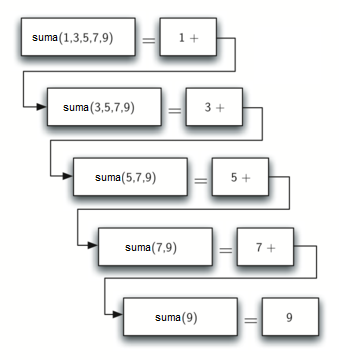
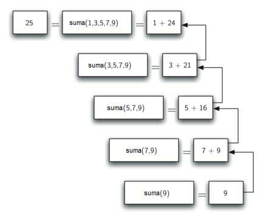

..  Copyright (C)  Brad Miller, David Ranum
    This work is licensed under the Creative Commons Attribution-NonCommercial-ShareAlike 4.0 International License. To view a copy of this license, visit http://creativecommons.org/licenses/by-nc-sa/4.0/.

Cálculo de la suma de una lista de números
~~~~~~~~~~~~~~~~~~~~~~~~~~~~~~~~~~~~~~~~~~

Iniciamos nuestra investigación con un problema simple que usted ya sabe resolver sin recursividad. Suponga que usted desea calcular la suma de una lista de números como por ejemplo: :math:`[1, 3, 5, 7, 9]`. Una función iterativa que calcula la suma se muestra en el :ref:`ActiveCode 1 <lst_itsum>`. La función utiliza una variable acumuladora (``laSuma``) para calcular el total acumulado de los números de la lista comenzando en :math:`0` y sumando cada número de la lista.

.. We will begin our investigation with a simple problem that you already know how to solve without using recursion. Suppose that you want to calculate the sum of a list of numbers such as: :math:`[1, 3, 5, 7, 9]`. An iterative function that computes the sum is shown in :ref:`ActiveCode 1 <lst_itsum>`. The function uses an accumulator variable (``laSuma``) to compute a running total of all the numbers in the list by starting with :math:`0` and adding each number in the list.

.. activecode:: lst_itsum
    :caption: Sumatoria iterativa

    def sumalista(listaNumeros):
        laSuma = 0
        for i in listaNumeros:
            laSuma = laSuma + i
        return laSuma
        
    print(sumalista([1,3,5,7,9]))

Imagine por un minuto que usted no tiene ciclos ``while`` o ``for``. ¿Cómo calcularía la suma de una lista de números? Si usted fuera un matemático, podría comenzar recordando que la adición es una función que se define para dos parámetros, un pareja de números. Para redefinir el problema original de sumar una lista al problema alternativo de sumar parejas de números, podríamos reescribir la lista como una expresión completamente agrupada. Tal expresión tiene el siguiente aspecto:

.. Pretend for a minute that you do not have ``while`` loops or ``for`` loops. How would you compute the sum of a list of numbers? If you were a mathematician you might start by recalling that addition is a function that is defined for two parameters, a pair of numbers. To redefine the problem from adding a list to adding pairs of numbers, we could rewrite the list as a fully parenthesized expression. Such an expression looks like this: 

.. math::
    ((((1 + 3) + 5) + 7) + 9)

También podemos agrupar la expresión en el orden inverso,
    
.. We can also parenthesize the expression the other way around,

.. math::

     (1 + (3 + (5 + (7 + 9)))) 

Observe que el conjunto más interno de paréntesis, :math:`(7 + 9)`, es un problema que podemos resolver sin un ciclo o cualquiera otra instrucción especial. De hecho, podemos utilizar la siguiente secuencia de simplificaciones para calcular una suma final.

.. Notice that the innermost set of parentheses, :math:`(7 + 9)`, is a problem that we can solve without a loop or any special constructs. In fact, we can use the following sequence of simplifications to compute a final sum.

.. math::

    total = \  (1 + (3 + (5 + (7 + 9)))) \\
    total = \  (1 + (3 + (5 + 16))) \\
    total = \  (1 + (3 + 21)) \\
    total = \  (1 + 24) \\
    total = \  25

¿Cómo podemos tomar esta idea y convertirla en un programa en Python? Primero, vamos a plantear el problema de la suma en términos de listas de Python. Podemos decir que la suma de la lista ``listaNumeros`` es la suma del primer elemento de la lista (``listaNumeros[0]``) y la suma de los números en el resto de la lista (``listaNumeros[1:]``). Para expresarlo en una forma funcional:

.. math::

      sumaLista(listaNumeros) = primero(listaNumeros) + sumaLista(resto(listaNumeros))
    \label{eqn:sumalista}

En esta ecuación :math:`primero(listaNumeros)` devuelve el primer elemento de la lista y :math:`resto(listaNumeros)` devuelve una lista de todos los elementos menos el primero. Esto se expresa fácilmente en Python como se muestra en el :ref:`ActiveCode 2 <lst_recsum>`.

.. In this equation :math:`primero(listaNumeros)` returns the first element of the list and :math:`resto(listaNumeros)` returns a list of everything but the first element. This is easily expressed in Python as shown in :ref:`ActiveCode 2 <lst_recsum>`.

.. activecode:: lst_recsum
    :caption: Sumatoria recursiva

    def sumalista(listaNumeros):
       if len(listaNumeros) == 1:
            return listaNumeros[0]
       else:
            return listaNumeros[0] + sumalista(listaNumeros[1:])
            
    print(sumalista([1,3,5,7,9]))

Hay algunas ideas clave que examinar en este programa. Primero, en la línea 2 estamos comprobando si la lista es de longitud uno. Esta comprobación es crucial y es nuestra cláusula de escape de la función. La suma de una lista de longitud 1 es trivial; es simplemente el número en la lista. Segundo, ¡en la línea 5 nuestra función se llama a sí misma! Ésta es la razón por la que llamamos recursivo al algoritmo ``sumalista``. Una función recursiva es una función que se llama a sí misma.

.. There are a few key ideas in this listing to look at. First, on line 2 we are checking to see if the list is one element long. This check is crucial and is our escape clause from the function. The sum of a list of length 1 is trivial; it is just the number in the list. Second, on line 5 our function calls itself! This is the reason that we call the ``sumalista`` algorithm recursive. A recursive function is a function that calls itself.

La :ref:`Figura 1 <fig_recsumin>` muestra la serie de **llamadas recursivas** que se necesitan para sumar la lista :math:`[1, 3, 5, 7, 9]`. Usted debe pensar en esta serie de llamadas como una serie de simplificaciones. Cada vez que hacemos una llamada recursiva estamos resolviendo un problema más pequeño, hasta llegar al punto en el que el problema no puede ser más pequeño.

.. :ref:`Figure 1 <fig_recsumin>` shows the series of **recursive calls** that are needed to sum the list :math:`[1, 3, 5, 7, 9]`. You should think of this series of calls as a series of simplifications. Each time we make a recursive call we are solving a smaller problem, until we reach the point where the problem cannot get any smaller.

.. _fig_recsumin:

   Figura 1: Serie de llamadas recursivas para sumar una lista de números

   Figura 1: Serie de llamadas recursivas para sumar una lista de números

Cuando llegamos al punto en que el problema es tan simple como puede llegar a ser, comenzamos a juntar las soluciones de cada uno de los pequeños problemas hasta que el problema inicial se resuelva. La :ref:`Figura 2 <fig_recsumout>` muestra las sumas que se realizan a medida que ``sumalista`` funciona hacia atrás a través de la serie de llamadas. Cuando ``sumalista`` devuelve el resultado del problema superior, tenemos la solución de todo el problema.

.. _fig_recsumout:

   Figura 2: Series de devoluciones recursivas para sumar una lista de números

   Figura 2: Series de devoluciones recursivas para sumar una lista de números
