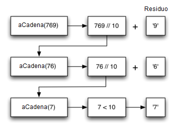
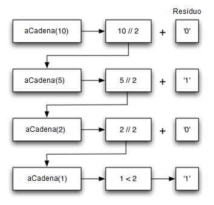

..  Copyright (C)  Brad Miller, David Ranum
    This work is licensed under the Creative Commons Attribution-NonCommercial-ShareAlike 4.0 International License. To view a copy of this license, visit http://creativecommons.org/licenses/by-nc-sa/4.0/.

Conversión de un entero a una cadena en cualquier base
~~~~~~~~~~~~~~~~~~~~~~~~~~~~~~~~~~~~~~~~~~~~~~~~~~~~~~

Supongamos que usted desea convertir un entero a una cadena en una base entre la binaria y la hexadecimal. Por ejemplo, conviertir el entero 10 a su representación de cadena en decimal: ``"10"``, o a su representación de cadena en binario: ``"1010"``. Aunque hay muchos algoritmos para resolver este problema, incluyendo el algoritmo discutido en la sección de pilas, la formulación recursiva del problema es muy elegante.

.. Suppose you want to convert an integer to a string in some base between binary and hexadecimal. For example, convert the integer 10 to its string representation in decimal as ``"10"``, or to its string representation in binary as ``"1010"``. While there are many algorithms to solve this problem, including the algorithm discussed in the stack section, the recursive formulation of the problem is very elegant.

Veamos un ejemplo concreto usando la base 10 y el número 769. Supongamos que tenemos una secuencia de caracteres que corresponde a los primeros 10 dígitos, como ``cadenaConversion = "0123456789"``. Es fácil convertir un número menor que 10 a su equivalente en cadena al buscarlo en la secuencia. Por ejemplo, si el número es 9, entonces la cadena es ``cadenaConversion[9]`` o ``"9"``. Si logramos descomponer el número 769 en tres números de un solo dígito, 7, 6 y 9, convertirlo entonces a una cadena es simple. Un número menor que 10 parece un buen caso base.

.. Let’s look at a concrete example using base 10 and the number 769. Suppose we have a sequence of characters corresponding to the first 10 digits, like ``cadenaConversion = "0123456789"``. It is easy to convert a number less than 10 to its string equivalent by looking it up in the sequence. For example, if the number is 9, then the string is ``cadenaConversion[9]`` or ``"9"``. If we can arrange to break up the number 769 into three single-digit numbers, 7, 6, and 9, then converting it to a string is simple. A number less than 10 sounds like a good base case.

Saber cuál es nuestra base sugiere que el algoritmo global implicará tres componentes:

.. Knowing what our base is suggests that the overall algorithm will involve three components:

#. Reducir el número original a una serie de números de un solo dígito.

#. Convertir el número de un sólo dígito a una cadena mediante una búsqueda.

#. Concatenar las cadenas de un solo dígito para formar el resultado final.

El siguiente paso es averiguar cómo cambiar el estado y avanzar hacia el caso base. Puesto que estamos trabajando con un número entero, consideremos qué operaciones matemáticas podrían reducir un número. Las candidatas más probables son la división y la resta. Mientras que la resta podría funcionar, no está claro qué debemos restar de qué. La división entera con los residuos nos da una dirección clara. Echemos un vistazo a lo que sucede si dividimos un número por la base a la que estamos tratando de convertirlo.

.. The next step is to figure out how to change state and make progress toward the base case. Since we are working with an integer, let’s consider what mathematical operations might reduce a number. The most likely candidates are division and subtraction. While subtraction might work, it is unclear what we should subtract from what. Integer division with remainders gives us a clear direction. Let’s look at what happens if we divide a number by the base we are trying to convert to.

Usando división entera para dividir 769 entre 10, obtenemos 76 con un residuo de 9. Esto nos da dos buenos resultados. En primer lugar, el residuo es un número menor que nuestra base que se puede convertir inmediatamente en una cadena mediante la búsqueda en ``cadenaConversion``. En segundo lugar, obtenemos un número que es más pequeño que nuestro original y nos mueve hacia el caso base de tener un único número menor que nuestra base. Ahora nuestro trabajo es convertir 76 a su representación de cadena. Nuevamente usaremos la división entera más el residuo para obtener resultados de 7 y 6 respectivamente. Finalmente, hemos reducido el problema a la conversión de 7, lo cual puede hacerse fácilmente ya que satisface la condición de caso base de :math:`n < base`, donde :math:`base = 10`. La serie de operaciones que acabamos de realizar se ilustra en la :ref:`Figura 3 <fig_tostr>`. Observe que los números que queremos recordar están en los bloques restantes a lo largo del lado derecho del diagrama.

.. Using integer division to divide 769 by 10, we get 76 with a remainder of 9. This gives us two good results. First, the remainder is a number less than our base that can be converted to a string immediately by lookup. Second, we get a number that is smaller than our original and moves us toward the base case of having a single number less than our base. Now our job is to convert 76 to its string representation. Again we will use integer division plus remainder to get results of 7 and 6 respectively. Finally, we have reduced the problem to converting 7, which we can do easily since it satisfies the base case condition of :math:`n < base`, where :math:`base = 10`. The series of operations we have just performed is illustrated in :ref:`Figure 3 <fig_tostr>`. Notice that the numbers we want to remember are in the remainder boxes along the right side of the diagram.

.. _fig_tostr:

   Figura 3: Conversión de un entero a una cadena en base 10

   Figura 3: Conversión de un entero a una cadena en base 10

El :ref:`ActiveCode 1 <lst_rectostr>` muestra el código en Python que implementa el algoritmo descrito anteriormente para cualquier base entre 2 y 16.

.. :ref:`ActiveCode 1 <lst_rectostr>` shows the Python code that implements the algorithm outlined above for any base between 2 and 16.

.. activecode:: lst_rectostr
    :caption: Conversión recursiva de un entero a una cadena

    def aCadena(n,base):
       cadenaConversion = "0123456789ABCDEF"
       if n < base:
          return cadenaConversion[n]
       else:
          return aCadena(n//base,base) + cadenaConversion[n%base]

    print(aCadena(1453,16))

Observe que en la línea 3 verificamos el caso base donde ``n`` es menor que la base a la que estamos convirtiendo. Cuando detectamos el caso base, dejamos la recursividad y simplemente devolvemos la cadena de la secuencia ``cadenaConversion``. En la línea 6 satisfacemos tanto la segunda ley como la tercera, haciendo la llamada recursiva y reduciendo el tamaño del problema mediante la división.

.. Notice that in line 3 we check for the base case where ``n`` is less than the base we are converting to. When we detect the base case, we stop recursing and simply return the string from the ``cadenaConversion`` sequence. In line 6 we satisfy both the second and third laws–by making the recursive call and by reducing the problem size–using division.

Examinemos el algoritmo nuevamente; esta vez vamos a convertir el número 10 a su representación en base 2 como cadena (``"1010"``).

.. Let’s trace the algorithm again; this time we will convert the number 10 to its base 2 string representation (``"1010"``).

.. _fig_tostr2:

   Figura 4: Conversión del número 10 a su representación en base 2 como cadena

   Figura 4: Conversión del número 10 a su representación en base 2 como cadena

La :ref:`Figura 4 <fig_tostr2>` muestra que obtenemos los resultados que estamos buscando, pero parece que los dígitos están en el orden equivocado. El algoritmo funciona correctamente porque primero hacemos la llamada recursiva en la línea 6 y luego le concatenamos la representación en cadena del residuo. Si invertimos los valores devueltos por ``cadenaConversion`` y por la llamada ``aCadena``, ¡la cadena resultante quedaría al revés! Pero al retrasar la operación de concatenación hasta después de que la llamada recursiva haya devuelto su valor, nos permite obtener el resultado en el orden correcto. Esto debería recordarle a usted nuestra discusión sobre las pilas en el capítulo anterior.

.. :ref:`Figure 4 <fig_tostr2>` shows that we get the results we are looking for, but it looks like the digits are in the wrong order. The algorithm works correctly because we make the recursive call first on line 6, then we add the string representation of the remainder. If we reversed returning the ``cadenaConversion`` lookup and returning the ``aCadena`` call, the resulting string would be backward! But by delaying the concatenation operation until after the recursive call has returned, we get the result in the proper order. This should remind you of our discussion of stacks back in the previous chapter.

.. admonition:: Autoevaluación

   Escriba una función que tome una cadena como parámetro y devuelva una nueva cadena que sea la inversa de la cadena original.

   .. actex:: recursion_sc_1
      :nocodelens:

      from test import testEqual
      def invertir(s):
          return s
      
      testEqual(invertir("hola"),"aloh")
      testEqual(invertir("l"),"l")      
      testEqual(invertir("seguir"),"riuges")
      testEqual(invertir(""),"")

   Escriba una función que tome una cadena como parámetro y devuelva True si la cadena es un palíndromo y False en caso contrario. Recuerde que una cadena es un palíndromo si se escribe igual tanto hacia delante como hacia atrás. Por ejemplo: radar es un palíndromo. Como punto adicional, considere que los palíndromos también pueden ser frases, pero es necesario eliminar los espacios y la puntuación antes de hacer la verificación. Por ejemplo: anita lava la tina es un palíndromo. Otros palíndromos divertidos incluyen:
   
   * reconocer
   * La ruta natural
   * A la Manuela dale una mala
   * Ana, la galana
   * Anita, la gorda lagartona, no traga la droga latina
   * Aroma a mora
   * A ti no, bonita
   * Luz azul

   .. actex:: recursion_sc_2
      :nocodelens:

      from test import testEqual
      def eliminarEspacio(s):
          return s

      def esPalindromo(s):
          return False
      
      testEqual(esPalindromo(eliminarEspacio("x")),True)            
      testEqual(esPalindromo(eliminarEspacio("radar")),True)
      testEqual(esPalindromo(eliminarEspacio("hola")),False)
      testEqual(esPalindromo(eliminarEspacio("")),True)                  
      testEqual(esPalindromo(eliminarEspacio("reconocer")),True)      
      testEqual(esPalindromo(eliminarEspacio("luz azul")),True)

