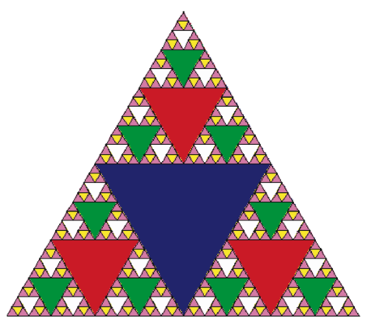
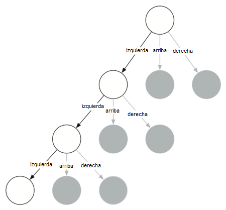

..  Copyright (C)  Brad Miller, David Ranum
    This work is licensed under the Creative Commons Attribution-NonCommercial-ShareAlike 4.0 International License. To view a copy of this license, visit http://creativecommons.org/licenses/by-nc-sa/4.0/.

El triángulo de Sierpinski
--------------------------

Otro fractal que exhibe la propiedad de auto-similitud es el triángulo de Sierpinski. Un ejemplo se muestra en la :ref:`Figura 3 <fig_sierpinski>`. El triángulo de Sierpinski ilustra un algoritmo recursivo de tres vías. El procedimiento manual para dibujar un triángulo de Sierpinski es simple. Comience con un único triángulo grande. Divida este gran triángulo en cuatro nuevos triángulos conectando el punto medio de cada lado. Ignorando el triángulo medio que usted acaba de crear, aplique el mismo procedimiento a cada uno de los tres triángulos de las esquinas. Cada vez que cree un nuevo conjunto de triángulos, aplique recursivamente este procedimiento a los tres triángulos más pequeños de las esquinas. Usted podría seguir aplicando este procedimiento indefinidamente si tuviera un lápiz suficientemente afilado. Antes de seguir leyendo, intente dibujar el triángulo Sierpinski usted mismo, usando el método descrito.

.. Another fractal that exhibits the property of self-similarity is the Sierpinski triangle. An example is shown in :ref:`Figure 3 <fig_sierpinski>`. The Sierpinski triangle illustrates a three-way recursive algorithm. The procedure for drawing a Sierpinski triangle by hand is simple. Start with a single large triangle. Divide this large triangle into four new triangles by connecting the midpoint of each side. Ignoring the middle triangle that you just created, apply the same procedure to each of the three corner triangles. Each time you create a new set of triangles, you recursively apply this procedure to the three smaller corner triangles. You can continue to apply this procedure indefinitely if you have a sharp enough pencil. Before you continue reading, you may want to try drawing the Sierpinski triangle yourself, using the method described.

.. _fig_sierpinski:

     Figura 3: El triángulo de Sierpinski

     Figura 3: El triángulo de Sierpinski

Puesto que podemos seguir aplicando el algoritmo indefinidamente, ¿cuál es el caso base? Veremos que el caso base se establece arbitrariamente como el número de veces que queremos dividir el triángulo en partes. A veces llamamos a este número el “grado” del fractal. Cada vez que hacemos una llamada recursiva, le restamos 1 al grado hasta llegar a 0. Cuando alcancemos un grado de 0, dejaremos de hacer llamadas recursivas. El código que generó el Triángulo de Sierpinski de la :ref:`Figura 3 <fig_sierpinski>` se muestra en el :ref:`ActiveCode 1 <lst_st>`.

.. Since we can continue to apply the algorithm indefinitely, what is the base case? We will see that the base case is set arbitrarily as the number of times we want to divide the triangle into pieces. Sometimes we call this number the “grado” of the fractal. Each time we make a recursive call, we subtract 1 from the grado until we reach 0. When we reach a grado of 0, we stop making recursive calls. The code that generated the Sierpinski Triangle in :ref:`Figure 3 <fig_sierpinski>` is shown in :ref:`ActiveCode 1 <lst_st>`.

.. activecode:: lst_st
    :caption: Código para dibujar el triángulo de Sierpinski
    :nocodelens:

    import turtle

    def dibujarTriangulo(puntos,color,miTortuga):
        miTortuga.fillcolor(color)
        miTortuga.up()
        miTortuga.goto(puntos[0][0],puntos[0][1])
        miTortuga.down()
        miTortuga.begin_fill()
        miTortuga.goto(puntos[1][0],puntos[1][1])
        miTortuga.goto(puntos[2][0],puntos[2][1])
        miTortuga.goto(puntos[0][0],puntos[0][1])
        miTortuga.end_fill()

    def obtenerMitad(p1,p2):
        return ( (p1[0]+p2[0]) / 2, (p1[1] + p2[1]) / 2)

    def sierpinski(puntos,grado,miTortuga):
        colormap = ['blue','red','green','white','yellow',
                    'violet','orange']
        dibujarTriangulo(puntos,colormap[grado],miTortuga)
        if grado > 0:
            sierpinski([puntos[0],
                            obtenerMitad(puntos[0], puntos[1]),
                            obtenerMitad(puntos[0], puntos[2])],
                       grado-1, miTortuga)
            sierpinski([puntos[1],
                            obtenerMitad(puntos[0], puntos[1]),
                            obtenerMitad(puntos[1], puntos[2])],
                       grado-1, miTortuga)
            sierpinski([puntos[2],
                            obtenerMitad(puntos[2], puntos[1]),
                            obtenerMitad(puntos[0], puntos[2])],
                       grado-1, miTortuga)

    def main():
       miTortuga = turtle.Turtle()
       miVentana = turtle.Screen()
       misPuntos = [[-100,-50],[0,100],[100,-50]]
       sierpinski(misPuntos,3,miTortuga)
       miVentana.exitonclick()

    main()

El programa en el :ref:`ActiveCode 1 <lst_st>` sigue las ideas descritas anteriormente. Lo primero que hace ``sierpinski`` es dibujar el triángulo exterior. A continuación, hay tres llamadas recursivas, una para cada uno de los nuevos triángulos de las esquinas que obtenemos al conectar los puntos medios. Una vez más, hacemos uso del módulo estándar ``turtle`` que viene incorporado en Python. Usted puede aprender todos los detalles de los métodos disponibles en el módulo usando el comando ``help('turtle')`` desde la consola de Python.

.. The program in :ref:`ActiveCode 1 <lst_st>` follows the ideas outlined above. The first thing ``sierpinski`` does is draw the outer triangle. Next, there are three recursive calls, one for each of the new corner triangles we get when we connect the midpoints. Once again we make use of the standard turtle module that comes with Python. You can learn all the details of the methods available in the turtle module by using ``help('turtle')`` from the Python prompt.

Mire el código y piense en el orden en que se dibujarán los triángulos. Aunque el orden exacto de las esquinas depende de cómo se especifica el conjunto inicial, supongamos que las esquinas están en el siguiente orden: izquierda, arriba, abajo y derecha. Debido a la forma en que la función ``sierpinski`` se llama a sí misma, ``sierpinski`` se dirige hacia el triángulo más pequeño permitido en la esquina inferior izquierda, y luego comienza a llenar el resto de los triángulos dirigiéndose hacia atrás. Luego llena los triángulos en la esquina superior dirigiéndose hacia el triángulo más pequeño y más alto. Finalmente, llena la esquina inferior derecha, dirigiéndose hacia el triángulo más pequeño en la parte inferior derecha.

.. Look at the code and think about the order in which the triangles will be drawn. While the exact order of the corners depends upon how the initial set is specified, let’s assume that the corners are ordered lower left, top, lower right. Because of the way the ``sierpinski`` function calls itself, ``sierpinski`` works its way to the smallest allowed triangle in the lower-left corner, and then begins to fill out the rest of the triangles working back. Then it fills in the triangles in the top corner by working toward the smallest, topmost triangle. Finally, it fills in the lower-right corner, working its way toward the smallest triangle in the lower right.

A veces es útil pensar en un algoritmo recursivo en términos de un diagrama de las llamadas de la función. La :ref:`Figura 4 <fig_stcalltree>` muestra que las llamadas recursivas siempre se hacen avanzando hacia la izquierda. Las funciones activas se indican en negro y las llamadas de función inactivas aparecen en gris. Cuanto más lejos vaya usted hacia la parte inferior de la :ref:`Figura 4 <fig_stcalltree>`, más pequeños serán los triángulos. La función termina dibujando un nivel a la vez; una vez que ella termina con la parte inferior izquierda, se mueve a la parte inferior central, y así sucesivamente.

.. Sometimes it is helpful to think of a recursive algorithm in terms of a diagram of function calls. :ref:`Figure 4 <fig_stcalltree>` shows that the recursive calls are always made going to the left. The active functions are outlined in black, and the inactive function calls are in gray. The farther you go toward the bottom of :ref:`Figure 4 <fig_stcalltree>`, the smaller the triangles. The function finishes drawing one level at a time; once it is finished with the bottom left it moves to the bottom middle, and so on.

.. _fig_stcalltree:

   
    Figura 4: Construcción del triángulo de Sierpinski

    Figura 4: Construcción del triángulo de Sierpinski

La función ``sierpinski`` depende en gran medida de la función ``obtenerMitad``, la cual toma como argumentos dos puntos extremos y devuelve el punto intermedio entre ellos. Además, el :ref:`ActiveCode 1 <lst_st>` tiene una función que dibuja un triángulo relleno usando los métodos ``begin_fill`` y ``end_fill``.

.. The ``sierpinski`` function relies heavily on the ``obtenerMitad`` function. ``obtenerMitad`` takes as arguments two endpoints and returns the point halfway between them. In addition, :ref:`ActiveCode 1 <lst_st>` has a function that draws a filled triangle using the ``begin_fill`` and ``end_fill`` turtle methods.
