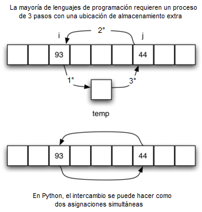

..  Copyright (C)  Brad Miller, David Ranum
    This work is licensed under the Creative Commons Attribution-NonCommercial-ShareAlike 4.0 International License. To view a copy of this license, visit http://creativecommons.org/licenses/by-nc-sa/4.0/.

El ordenamiento burbuja
~~~~~~~~~~~~~~~~~~~~~~~

El **ordenamiento burbuja** hace múltiples pasadas a lo largo de una lista. Compara los ítems adyacentes e intercambia los que no están en orden. Cada pasada a lo largo de la lista ubica el siguiente valor más grande en su lugar apropiado. En esencia, cada ítem “burbujea” hasta el lugar al que pertenece.

.. The **bubble sort** makes multiple passes through a list. It compares adjacent items and exchanges those that are out of order. Each pass through the list places the next largest value in its proper place. In essence, each item “bubbles” up to the location where it belongs.

La :ref:`Figura 1 <fig_bubblepass>` muestra la primera pasada de un ordenamiento burbuja. Los ítems sombreados se comparan para ver si no están en orden. Si hay  *n* ítems en la lista, entonces hay :math:`n-1` parejas de ítems que deben compararse en la primera pasada. Es importante tener en cuenta que, una vez que el valor más grande de la lista es parte de una pareja, éste avanzará continuamente hasta que la pasada se complete.

.. :ref:`Figure 1 <fig_bubblepass>` shows the first pass of a bubble sort. The shaded items are being compared to see if they are out of order. If there are *n* items in the list, then there are :math:`n-1` pairs of items that need to be compared on the first pass. It is important to note that once the largest value in the list is part of a pair, it will continually be moved along until the pass is complete.

.. _fig_bubblepass:

.. figure:: Figures/bubblepass.png
   :align: center

   Figura 1: La primera pasada de ``ordenamientoBurbuja``

   Figura 1: La primera pasada de ``ordenamientoBurbuja``

Al comienzo de la segunda pasada, el valor más grande ya está en su lugar. Quedan :math:`n-1` ítems por ordenar, lo que significa que habrá :math:`n-2` parejas. Puesto que cada pasada ubica al siguiente valor mayor en su lugar, el número total de pasadas necesarias será :math:`n-1`. Después de completar la pasada :math:`n-1`, el ítem más pequeño debe estar en la posición correcta sin requerir procesamiento adicional. El :ref:`ActiveCode 1 <lst_bubble>` muestra la función ``ordenamientoBurbuja`` completa. La función recibe la lista como un parámetro, y lo modifica intercambiando ítems según sea necesario.

.. At the start of the second pass, the largest value is now in place. There are :math:`n-1` items left to sort, meaning that there will be :math:`n-2` pairs. Since each pass places the next largest value in place, the total number of passes necessary will be :math:`n-1`. After completing the :math:`n-1` passes, the smallest item must be in the correct position with no further processing required. :ref:`ActiveCode 1 <lst_bubble>` shows the complete ``ordenamientoBurbuja`` function. It takes the list as a parameter, and modifies it by exchanging items as necessary.

La operación de intercambio es ligeramente diferente en Python que en la mayoría de los otros lenguajes de programación. Normalmente, el intercambio de dos ítems en una lista requiere una ubicación de almacenamiento temporal (una ubicación de memoria adicional). Un fragmento de código como

.. The exchange operation, sometimes called a “swap,” is slightly different in Python than in most other programming languages. Typically, swapping two elements in a list requires a temporary storage location (an additional memory location). A code fragment such as

::

    temp = unaLista[i]
    unaLista[i] = unaLista[j]
    unaLista[j] = temp

intercambiará los ítems :math:`i`-ésimo y :math:`j`-ésimo de la lista. Sin el almacenamiento temporal, uno de los valores sería sobrescrito.

.. will exchange the `ith` and `jth` items in the list. Without the temporary storage, one of the values would be overwritten.

En Python es posible realizar la asignación simultánea. La instrucción ``a,b=b,a`` dará lugar a que se realicen dos instrucciones de asignación al mismo tiempo (véase la :ref:`Figura 2 <fig_pythonswap>`). Usando la asignación simultánea, la operación de intercambio se puede hacer en una sola instrucción.

.. In Python, it is possible to perform simultaneous assignment. The statement ``a,b=b,a`` will result in two assignment statements being done at the same time (see :ref:`Figure 2 <fig_pythonswap>`). Using simultaneous assignment, the exchange operation can be done in one statement.

Las líneas 5-7 en el :ref:`ActiveCode 1 <lst_bubble>` realizan el intercambio de los ítems :math:`i`-ésimo e :math:`(i+1)`-ésimo utilizando el procedimiento de tres pasos descrito anteriormente. Note que también podríamos haber utilizado la asignación simultánea para intercambiar los ítems.

.. Lines 5-7 in :ref:`ActiveCode 1 <lst_bubble>` perform the exchange of the :math:`i` and :math:`(i+1)th` items using the three–step procedure described earlier. Note that we could also have used the simultaneous assignment to swap the items.

.. _fig_pythonswap:

   Figura 2: Intercambio de dos valores en Python

   Figura 2: Intercambio de dos valores en Python

El siguiente ejemplo de ActiveCode muestra la función ``ordenamiento Burbuja`` completa operando sobre la lista mostrada arriba.

.. The following activecode example shows the complete ``ordenamientoBurbuja`` function working on the list shown above.

.. activecode:: lst_bubble
    :caption: El ordenamiento burbuja

    def ordenamientoBurbuja(unaLista):
        for numPasada in range(len(unaLista)-1,0,-1):
            for i in range(numPasada):
                if unaLista[i]>unaLista[i+1]:
                    temp = unaLista[i]
                    unaLista[i] = unaLista[i+1]
                    unaLista[i+1] = temp

    unaLista = [54,26,93,17,77,31,44,55,20]
    ordenamientoBurbuja(unaLista)
    print(unaLista)

La siguiente animación muestra a ``ordenamientoBurbuja`` en acción.

.. The following animation shows ``ordenamientoBurbuja`` in action.

.. animation:: bubble_anim
   :modelfile: sortmodels.js
   :viewerfile: sortviewers.js
   :model: BubbleSortModel
   :viewer: BarViewer

.. Para más detalles, el CodeLens 1 permite ver la ejecución del algoritmo paso a paso.
..
.. .. codelens:: bubbletrace
..     :caption: Seguimiento del ordenamiento burbuja
..
..     def ordenamientoBurbuja(unaLista):
..       for numPasada in range(len(unaLista)-1,0,-1):
..           for i in range(numPasada):
..               if unaLista[i]>unaLista[i+1]:
..                   temp = unaLista[i]
..                   unaLista[i] = unaLista[i+1]
..                   unaLista[i+1] = temp

..     unaLista = [54,26,93,17,77,31,44,55,20]
..     ordenamientoBurbuja(unaLista)
..     print(unaLista)
                    

Para analizar el ordenamiento burbuja, debemos tener en cuenta que independientemente de cómo están dispuestos los ítems en la lista inicial, se harán :math:`n-1` pasadas para ordenar una lista de tamaño *n*. La :ref:`Tabla 1 <tbl_bubbleanalysis>` muestra el número de comparaciones para cada pasada. El número total de comparaciones es la suma de los primeros :math:`n-1` enteros. Recuerde que la suma de los primeros *n* números enteros es :math:`\frac{1}{2}n^{2} + \frac{1}{2}n`. La suma de los primeros `n-1` enteros es :math:`\frac{1}{2}n^{2} + \frac{1}{2}n - n`, que es igual a :math:`\frac{1}{2}n^{2} - \frac{1}{2}n`. Esto es todavía :math:`O(n^{2})` comparaciones. En el mejor de los casos, si la lista ya está ordenada, no se realizarán intercambios. Sin embargo, en el peor de los casos, cada comparación causará un intercambio. En promedio, intercambiamos la mitad de las veces.

.. To analyze the bubble sort, we should note that regardless of how the items are arranged in the initial list, :math:`n-1` passes will be made to sort a list of size *n*. :ref:`Table 1 <tbl_bubbleanalysis>` shows the number of comparisons for each pass. The total number of comparisons is the sum of the first :math:`n-1` integers. Recall that the sum of the first *n* integers is :math:`\frac{1}{2}n^{2} + \frac{1}{2}n`. The sum of the first :math:`n-1` integers is :math:`\frac{1}{2}n^{2} + \frac{1}{2}n - n`, which is :math:`\frac{1}{2}n^{2} - \frac{1}{2}n`. This is still :math:`O(n^{2})` comparisons. In the best case, if the list is already ordered, no exchanges will be made. However, in the worst case, every comparison will cause an exchange. On average, we exchange half of the time.

.. _tbl_bubbleanalysis:

.. table:: **Tabla 1: Comparaciones para cada pasada del ordenamiento burbuja**

    ================= ==================
    **Pasadas**        **Comparaciones**
    ================= ==================
             1         :math:`n-1`
             2         :math:`n-2`
             3         :math:`n-3`
             ...       ...
       :math:`n-1`     :math:`1`
    ================= ==================

Un ordenamiento burbuja se considera frecuentemente como el método de ordenamiento más ineficiente ya que debe intercambiar ítems antes de que se conozca su ubicación final. Estas operaciones de intercambio “desperdiciadas” son muy costosas. Sin embargo, debido a que el ordenamiento burbuja hace pasadas por toda la parte no ordenada de la lista, tiene la capacidad de hacer algo que la mayoría de los algoritmos de ordenamiento no pueden. En particular, si durante una pasada no hubo intercambios, entonces sabemos que la lista ya debe estar ordenada. Un ordenamiento burbuja se puede modificar para detenerse anticipadamente si encuentra que la lista ya ha sido ordenada. Esto significa que para las listas que requieran sólo unas pocas pasadas, un ordenamiento burbuja puede tener la ventaja de reconocer que la lista ya está ordenada y se detendrá. El :ref:`ActiveCode 2 <lst_shortbubble>` muestra esta modificación, que a menudo se conoce como el **ordenamiento burbuja corto**.

.. A bubble sort is often considered the most inefficient sorting method since it must exchange items before the final location is known. These “wasted” exchange operations are very costly. However, because the bubble sort makes passes through the entire unsorted portion of the list, it has the capability to do something most sorting algorithms cannot. In particular, if during a pass there are no exchanges, then we know that the list must be sorted. A bubble sort can be modified to stop early if it finds that the list has become sorted. This means that for lists that require just a few passes, a bubble sort may have an advantage in that it will recognize the sorted list and stop. :ref:`ActiveCode 2 <lst_shortbubble>` shows this modification, which is often referred to as the **short bubble**.

.. activecode:: lst_shortbubble
    :caption: Ordenamiento burbuja corto

    def ordenamientoBurbujaCorto(unaLista):
        intercambios = True
        numPasada = len(unaLista)-1
        while numPasada > 0 and intercambios:
           intercambios = False
           for i in range(numPasada):
               if unaLista[i]>unaLista[i+1]:
                   intercambios = True
                   temp = unaLista[i]
                   unaLista[i] = unaLista[i+1]
                   unaLista[i+1] = temp
           numPasada = numPasada-1

    unaLista=[20,30,40,90,50,60,70,80,100,110]
    ordenamientoBurbujaCorto(unaLista)
    print(unaLista)
    
.. Finalmente, a continuación está ``ordenamientoBurbujaCorto`` en un CodeLens (CodeLens 2)..
..
.. .. codelens:: shortbubbletrace
..     :caption: Seguimiento al ordenamiento burbuja corto
..
..     def ordenamientoBurbujaCorto(unaLista):
..         intercambios = True
..         numPasada = len(unaLista)-1
..         while numPasada > 0 and intercambios:
..            intercambios = False
..            for i in range(numPasada):
..                if unaLista[i]>unaLista[i+1]:
..                    intercambios = True
..                    temp = unaLista[i]
..                    unaLista[i] = unaLista[i+1]
..                    unaLista[i+1] = temp
..            numPasada = numPasada-1
..
..     unaLista=[20,30,40,90,50,60,70,80,100,110]
..     ordenamientoBurbujaCorto(unaLista)
..     print(unaLista)
 
.. admonition:: Autoevaluación

   .. mchoice:: question_sort_1
       :correct: b
       :answer_a: [1, 9, 19, 7, 3, 10, 13, 15, 8, 12]
       :answer_b: [1, 3, 7, 9, 10, 8, 12, 13, 15, 19]
       :answer_c: [1, 7, 3, 9, 10, 13, 8, 12, 15, 19]
       :answer_d: [1, 9, 19, 7, 3, 10, 13, 15, 8, 12]
       :feedback_a:  Esta respuesta representa tres intercambios. Una pasada implica que usted continúa haciendo intercambios hasta el final de la lista.
       :feedback_b:  Muy bien
       :feedback_c: Un ordenamiento burbuja continúa intercambiando números hasta la posición del índica numPasada. Pero recuerde que numPasada comienza con el valor de la longitud de la lista - 1.
       :feedback_d: Usted ha estado haciendo un ordenamiento por inserción, no un ordenamiento burbuja.

       Suponga que usted tiene que ordenar la siguiente lista de números: [19, 1, 9, 7, 3, 10, 13, 15, 8, 12]. ¿Cuál de las siguientes listas representa la lista parcialmente ordenada tras tres pasadas completas del ordenamiento burbuja?
