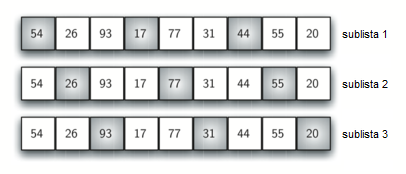
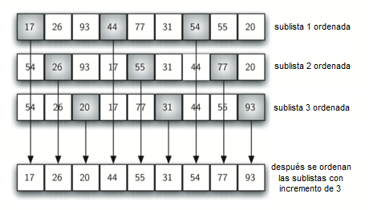
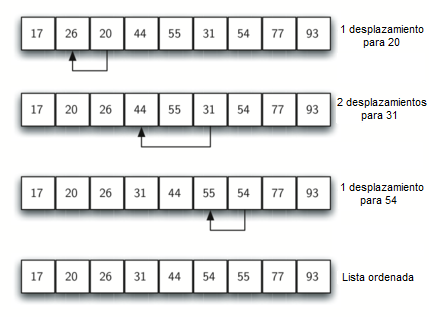
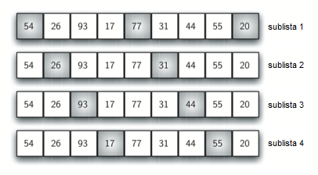

..  Copyright (C)  Brad Miller, David Ranum
    This work is licensed under the Creative Commons Attribution-NonCommercial-ShareAlike 4.0 International License. To view a copy of this license, visit http://creativecommons.org/licenses/by-nc-sa/4.0/.

El ordenamiento de Shell
~~~~~~~~~~~~~~~~~~~~~~~~

El **ordenamiento de Shell**, a veces llamado “ordenamiento de incremento decreciente”, mejora el ordenamiento por inserción al romper la lista original en varias sublistas más pequeñas, cada una de las cuales se ordena mediante un ordenamiento por inserción. La manera única en que se eligen estas sublistas es la clave del ordenamiento de Shell. En lugar de dividir la lista en sublistas de ítems contiguos, el ordenamiento de Shell usa un incremento ``i``, a veces denominado **brecha**, para crear una sublista eligiendo todos los ítems que están separados por ``i`` ítems.

.. The **shell sort**, sometimes called the “diminishing increment sort,” improves on the insertion sort by breaking the original list into a number of smaller sublists, each of which is sorted using an insertion sort. The unique way that these sublists are chosen is the key to the shell sort. Instead of breaking the list into sublists of contiguous items, the shell sort uses an increment ``i``, sometimes called the **gap**, to create a sublist by choosing all items that are ``i`` items apart.

Este proceso se puede ver en la :ref:`Figura 6 <fig_incrementsA>`. La lista tiene nueve ítems. Si usamos un incremento de tres, hay tres sublistas, cada una de las cuales puede ordenarse mediante un ordenamiento por inserción. Después de completar estos ordenamientos, obtenemos la lista que se muestra en la :ref:`Figura 7 <fig_incrementsB>`. Aunque esta lista no está completamente ordenada, ha ocurrido algo muy interesante. Al ordenar las sublistas, hemos acercado los ítems a donde realmente pertenecen.

.. This can be seen in :ref:`Figure 6 <fig_incrementsA>`. This list has nine items. If we use an increment of three, there are three sublists, each of which can be sorted by an insertion sort. After completing these sorts, we get the list shown in :ref:`Figure 7 <fig_incrementsB>`. Although this list is not completely sorted, something very interesting has happened. By sorting the sublists, we have moved the items closer to where they actually belong.

.. _fig_incrementsA:

   Figura 6: Un ordenamiento de Shell con incrementos de tres

   Figura 6: Un ordenamiento de Shell con incrementos de tres

.. _fig_incrementsB:

   Figura 7: Un ordenamiento de Shell después de ordenar cada sublista

   Figura 7: Un ordenamiento de Shell después de ordenar cada sublista

La :ref:`Figura 8 <fig_incrementsC>` muestra un ordenamiento por inserción final que usa un incremento de uno; en otras palabras, un ordenamiento por inserción estándar. Note que mediante la realización anticipada de los ordenamientos de las sublistas, hemos reducido el número total de operaciones de desplazamiento necesarias para poner la lista en su orden definitivo. Para este caso, sólo necesitamos cuatro desplazamientos más para completar el proceso.

.. :ref:`Figure 8 <fig_incrementsC>` shows a final insertion sort using an increment of one; in other words, a standard insertion sort. Note that by performing the earlier sublist sorts, we have now reduced the total number of shifting operations necessary to put the list in its final order. For this case, we need only four more shifts to complete the process.

.. _fig_incrementsC:

   Figura 8: Ordenamiento de Shell: Un ordenamiento por inserción final con incremento de 1

   Figura 8: Ordenamiento de Shell: Un ordenamiento por inserción final con incremento de 1

.. _fig_incrementsD:

   Figura 9: Sublistas iniciales para el ordenamiento de Shell

   Figura 9: Sublistas iniciales para el ordenamiento de Shell

Dijimos antes que la forma en que se eligen los incrementos es la característica única del ordenamiento de Shell. La función mostrada en el :ref:`ActiveCode 1 <lst_shell>` utiliza un conjunto diferente de incrementos. En este caso, comenzamos con :math:`\frac {n}{2}` sublistas. En la siguiente pasada, se ordenan :math:`\frac {n}{4}` sublistas. Eventualmente, se ordena una sola lista con el ordenamiento por inserción básico. La :ref:`Figura 9 <fig_incrementsD>` muestra las primeras sublistas para nuestro ejemplo usando este incremento.

.. We said earlier that the way in which the increments are chosen is the unique feature of the shell sort. The function shown in :ref:`ActiveCode 1 <lst_shell>` uses a different set of increments. In this case, we begin with :math:`\frac {n}{2}` sublists. On the next pass, :math:`\frac {n}{4}` sublists are sorted. Eventually, a single list is sorted with the basic insertion sort. :ref:`Figure 9 <fig_incrementsD>` shows the first sublists for our example using this increment.

La siguiente invocación a la función ``ordenamientoDeShell`` muestra las listas parcialmente ordenadas después de cada incremento, siendo el ordenamiento final un ordenamiento por inserción con un incremento de uno.

.. The following invocation of the ``ordenamientoDeShell`` function shows the partially sorted lists after each increment, with the final sort being an insertion sort with an increment of one.

.. _lst_shell:

.. activecode:: lst_shellSort
    :caption: Ordenamiento de Shell

    def ordenamientoDeShell(unaLista):
        contadorSublistas = len(unaLista)//2
        while contadorSublistas > 0:

          for posicionInicio in range(contadorSublistas):
            brechaOrdenamientoPorInsercion(unaLista,posicionInicio,contadorSublistas)

          print("Después de los incrementos de tamaño",contadorSublistas,
                                       "La lista es",unaLista)

          contadorSublistas = contadorSublistas // 2

    def brechaOrdenamientoPorInsercion(unaLista,inicio,brecha):
        for i in range(inicio+brecha,len(unaLista),brecha):

            valorActual = unaLista[i]
            posicion = i

            while posicion>=brecha and unaLista[posicion-brecha]>valorActual:
                unaLista[posicion]=unaLista[posicion-brecha] 
                posicion = posicion-brecha

            unaLista[posicion]=valorActual
            
    unaLista = [54,26,93,17,77,31,44,55,20]
    ordenamientoDeShell(unaLista)
    print(unaLista)

.. animation:: shell_anim
   :modelfile: sortmodels.js
   :viewerfile: sortviewers.js
   :model: ShellSortModel
   :viewer: BarViewer
   
   
   
.. Para tener mayores detalles, el CodeLens 5 le permite a usted ejecutar el algoritmo paso a paso.
..
..
.. .. codelens:: shellSorttrace
..     :caption: Seguimiento del ordenamiento de Shell
..
..     def ordenamientoDeShell(unaLista):
..         contadorSublistas = len(unaLista)//2
..         while contadorSublistas > 0:
..
..           for posicionInicio in range(contadorSublistas):
..             brechaOrdenamientoPorInsercion(unaLista,posicionInicio,contadorSublistas)
..
..           print("Después de los incrementos de tamaño",contadorSublistas,
..                                        "La lista es",unaLista)
..
..           contadorSublistas = contadorSublistas // 2
..
..     def brechaOrdenamientoPorInsercion(unaLista,inicio,brecha):
..         for i in range(inicio+brecha,len(unaLista),brecha):
..
..             valorActual = unaLista[i]
..             posicion = i
..
..             while posicion>=brecha and unaLista[posicion-brecha]>valorActual:
..                 unaLista[posicion]=unaLista[posicion-brecha]
..                 posicion = posicion-brecha
..
..             unaLista[posicion]=valorActual
..
..     unaLista = [54,26,93,17,77,31,44,55,20]
..     ordenamientoDeShell(unaLista)
..     print(unaLista)

A primera vista usted podría pensar que un ordenamiento de Shell no puede ser mejor que un ordenamiento por inserción, ya que ejecuta un ordenamiento por inserción completo como último paso. Resulta, sin embargo, que este ordenamiento por inserción final no necesita hacer muchas comparaciones (o desplazamientos) ya que la lista ha sido pre-ordenada mediante ordenamientos por inserción incrementales anteriores, como se describió antes. En otras palabras, cada pasada produce una lista que está "más ordenada" que la anterior. Esto hace que la pasada final sea muy eficiente.

.. At first glance you may think that a shell sort cannot be better than an insertion sort, since it does a complete insertion sort as the last step. It turns out, however, that this final insertion sort does not need to do very many comparisons (or shifts) since the list has been pre-sorted by earlier incremental insertion sorts, as described above. In other words, each pass produces a list that is “more sorted” than the previous one. This makes the final pass very efficient.

Aunque un análisis general del ordenamiento de Shell está muy por encima del alcance de este texto, podemos decir que tiende a caer entre :math:`O(n)` y :math:`O(n^{2})`, con base en el comportamiento descrito anteriormente. Para los incrementos que se muestran en el :ref:`Programa 5 <lst_shell>`, el desempeño es :math:`O(n^{2})`. Cambiando el incremento, por ejemplo usando :math:`2^{k}-1` (1, 3, 7, 15, 31 y así sucesivamente), un ordenamiento de Shell puede realizarse en :math:`O(n^{\frac {3}{2}})`.

.. Although a general analysis of the shell sort is well beyond the scope of this text, we can say that it tends to fall somewhere between :math:`O(n)` and :math:`O(n^{2})`, based on the behavior described above. For the increments shown in :ref:`Listing 5 <lst_shell>`, the performance is :math:`O(n^{2})`. By changing the increment, for example using :math:`2^{k}-1` (1, 3, 7, 15, 31, and so on), a shell sort can perform at :math:`O(n^{\frac {3}{2}})`.

.. admonition:: Autoevaluación

   .. mchoice:: question_sort_4
      :correct: a
      :answer_a: [5, 3, 8, 7, 16, 19, 9, 17, 20, 12]
      :answer_b: [3, 7, 5, 8, 9, 12, 19, 16, 20, 17]
      :answer_c: [3, 5, 7, 8, 9, 12, 16, 17, 19, 20]
      :answer_d: [5, 16, 20, 3, 8, 12, 9, 17, 20, 7]
      :feedback_a:  Cada grupo de números representados por posiciones de índices separados por 3 se clasifican correctamente.
      :feedback_b:  Esta solución es para un tamaño de brecha de dos.
      :feedback_c: Esta es una lista completamente ordenada, usted ha ido demasiado lejos.
      :feedback_d: El tamaño de brecha de tres indica que el grupo representado por cada tercer número p.ej. 0, 3, 6, 9 y 1, 4, 7 y 2, 5, 8 se ordenan, no que sean grupos de 3.

      Dada la siguiente lista de números:  [5, 16, 20, 12, 3, 8, 9, 17, 19, 7]
      ¿Cuál de las siguientes respuestas ilustra el contenido de la lista después de que todo el intercambio está completo para un tamaño de brecha de 3?
