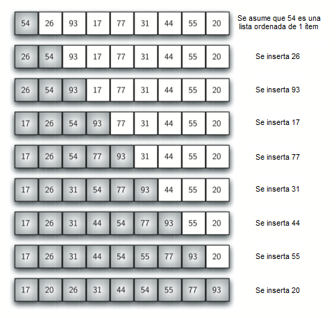

..  Copyright (C)  Brad Miller, David Ranum
    This work is licensed under the Creative Commons Attribution-NonCommercial-ShareAlike 4.0 International License. To view a copy of this license, visit http://creativecommons.org/licenses/by-nc-sa/4.0/.

El ordenamiento por inserción
~~~~~~~~~~~~~~~~~~~~~~~~~~~~~

El **ordenamiento por inserción**, aunque sigue siendo :math:`O(n^{2})`, funciona de una manera ligeramente diferente. Siempre mantiene una sublista ordenada en las posiciones inferiores de la lista. Cada ítem nuevo se “inserta” de vuelta en la sublista previa de manera que la sublista ordenada sea un ítem más larga. La :ref:`Figura 4 <fig_insertionsort>` muestra el proceso de ordenamiento por inserción. Los ítems sombreados representan las sublistas ordenadas a medida que el algoritmo lleva a cabo cada pasada.

.. The **insertion sort**, although still :math:`O(n^{2})`, works in a slightly different way. It always maintains a sorted sublist in the lower positions of the list. Each new item is then “inserted” back into the previous sublist such that the sorted sublist is one item larger. :ref:`Figure 4 <fig_insertionsort>` shows the insertion sorting process. The shaded items represent the ordered sublists as the algorithm makes each pass.

.. _fig_insertionsort:

   Figura 4: ``ordenamientoPorInsercion``

   Figura 4: ``ordenamientoPorInsercion``

Comenzamos asumiendo que una lista con un ítem (posición :math:`0`) ya está ordenada. En cada pasada, una para cada ítem desde 1 hasta :math:`n-1`, el ítem actual se comparara contra los de la sublista ya ordenada. A medida que revisamos en la sublista ya ordenada, desplazamos a la derecha los ítems que sean mayores. Cuando llegamos a un ítem menor o al final de la sublista, se puede insertar el ítem actual.

.. We begin by assuming that a list with one item (position :math:`0`) is already sorted. On each pass, one for each item 1 through :math:`n-1`, the current item is checked against those in the already sorted sublist. As we look back into the already sorted sublist, we shift those items that are greater to the right. When we reach a smaller item or the end of the sublist, the current item can be inserted.

La :ref:`Figura 5 <fig_insertionpass>` muestra los detalles de la quinta pasada. En este punto del algoritmo, se tiene una sublista ordenada de cinco ítems que consta de los números 17, 26, 54, 77 y 93. Queremos insertar el 31 de vuelta en los ítems ya ordenados. La primera comparación con 93 hace que 93 se desplace hacia la derecha. El 77 y el 54 también se desplazan. Cuando se encuentra el ítem 26, el proceso de desplazamiento se detiene y el 31 se ubica en la posición disponible. Ahora tenemos una sublista ordenada de seis ítems.

.. :ref:`Figure 5 <fig_insertionpass>` shows the fifth pass in detail. At this point in the algorithm, a sorted sublist of five items consisting of 17, 26, 54, 77, and 93 exists. We want to insert 31 back into the already sorted items. The first comparison against 93 causes 93 to be shifted to the right. 77 and 54 are also shifted. When the item 26 is encountered, the shifting process stops and 31 is placed in the open position. Now we have a sorted sublist of six items.

.. _fig_insertionpass:

.. figure:: Figures/insertionpass.png
   :align: center

   Figura 5: ``ordenamientoPorInsercion``: Quinta pasada del ordenamiento

   Figura 5: ``ordenamientoPorInsercion``: Quinta pasada del ordenamiento

La implementación de ``ordenamientoPorInsercion`` (:ref:`ActiveCode 1 <lst_insertion>`) muestra que se tienen de nuevo :math:`n-1` pasadas para ordenar los *n* ítems. La iteración comienza en la posición 1 y va hasta la posición :math:`n-1`, ya que estos son los ítems que necesitan ser insertados de nuevo en las sublistas ordenadas. La línea 8 realiza la operación de intercambio que mueve un valor una posición hacia arriba en la lista, dejando espacio detrás de ella para la inserción. Recuerde que esto no es un intercambio completo como el que fue hecho en los algoritmos anteriores.

.. The implementation of ``ordenamientoPorInsercion`` (:ref:`ActiveCode 1 <lst_insertion>`) shows that there are again :math:`n-1` passes to sort *n* items. The iteration starts at position 1 and moves through position :math:`n-1`, as these are the items that need to be inserted back into the sorted sublists. Line 8 performs the shift operation that moves a value up one position in the list, making room behind it for the insertion. Remember that this is not a complete exchange as was performed in the previous algorithms.

El número máximo de comparaciones para un ordenamiento por inserción es la suma de los primeros :math:`n-1` enteros. Nuevamente, esto es :math:`O(n^{2})`. Sin embargo, en el mejor de los casos, sólo se necesita hacer una comparación en cada pasada. Este sería el caso de una lista que ya estaba ordenada.

.. The maximum number of comparisons for an insertion sort is the sum of the first :math:`n-1` integers. Again, this is :math:`O(n^{2})`. However, in the best case, only one comparison needs to be done on each pass. This would be the case for an already sorted list.

También es importante hacer una acotación sobre la diferencia entre desplazamiento e intercambio. En general, una operación de desplazamiento requiere aproximadamente un tercio de la carga de procesamiento de un intercambio ya que sólo se realiza una asignación. En las pruebas de referencia, el ordenamiento por inserción logrará un rendimiento muy bueno.

.. One note about shifting versus exchanging is also important. In general, a shift operation requires approximately a third of the processing work of an exchange since only one assignment is performed. In benchmark studies, insertion sort will show very good performance.

.. activecode:: lst_insertion
    :caption: Ordenamiento por inserción

    def ordenamientoPorInsercion(unaLista):
       for indice in range(1,len(unaLista)):

         valorActual = unaLista[indice]
         posicion = indice

         while posicion>0 and unaLista[posicion-1]>valorActual:
             unaLista[posicion]=unaLista[posicion-1]
             posicion = posicion-1

         unaLista[posicion]=valorActual

    unaLista = [54,26,93,17,77,31,44,55,20]
    ordenamientoPorInsercion(unaLista)
    print(unaLista)

.. animation:: insertion_anim
   :modelfile: sortmodels.js
   :viewerfile: sortviewers.js
   :model: InsertionSortModel
   :viewer: BarViewer

.. Para más detalles, el CodeLens 4 le permite a usted ejecutar el algoritmo paso a paso.
..
.. .. codelens:: insertionsortcodetrace
..     :caption: Seguimiento al ordenamiento por inserción
..
..     def ordenamientoPorInsercion(unaLista):
..        for indice in range(1,len(unaLista)):
..
..          valorActual = unaLista[indice]
..          posicion = indice
..
..          while posicion>0 and unaLista[posicion-1]>valorActual:
..              unaLista[posicion]=unaLista[posicion-1]
..              posicion = posicion-1
..
..          unaLista[posicion]=valorActual
..
..     unaLista = [54,26,93,17,77,31,44,55,20]
..     ordenamientoPorInsercion(unaLista)
..     print(unaLista)

.. admonition:: Autoevaluación

   .. mchoice:: question_sort_3
      :correct: c
      :answer_a: [4, 5, 12, 15, 14, 10, 8, 18, 19, 20]
      :answer_b: [15, 5, 4, 10, 12, 8, 14, 18, 19, 20]
      :answer_c: [4, 5, 15, 18, 12, 19, 14, 10, 8, 20]
      :answer_d: [15, 5, 4, 18, 12, 19, 14, 8, 10, 20]
      :feedback_a: Éste es un ordenamiento burbuja.
      :feedback_b: Éste es el resultado de un ordenamiento por selección.
      :feedback_c: El ordenamiento por selección opera al inicio de la lista. Cada pasada produce una lista ordenada más larga.
      :feedback_d: El ordenamiento por inserción opera en el frente de la lista, no en el final.

       Suponga que usted tiene que ordenar la siguiente lista de números: [15, 5, 4, 18, 12, 19, 14, 10, 8, 20] ¿Cuál de las siguientes listas representa la lista parcialmente ordenada tras tres pasadas completas del ordenamiento por inserción?
