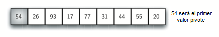
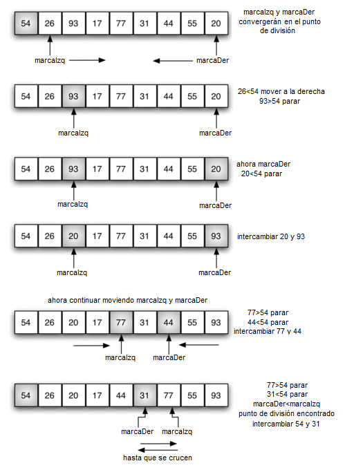
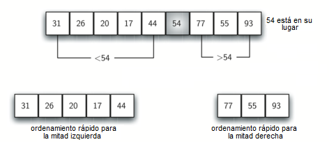

..  Copyright (C)  Brad Miller, David Ranum
    This work is licensed under the Creative Commons Attribution-NonCommercial-ShareAlike 4.0 International License. To view a copy of this license, visit http://creativecommons.org/licenses/by-nc-sa/4.0/.

El ordenamiento rápido
~~~~~~~~~~~~~~~~~~~~~~

El **ordenamiento rápido** usa dividir y conquistar para obtener las mismas ventajas que el ordenamiento por mezcla, pero sin utilizar almacenamiento adicional. Sin embargo, es posible que la lista no se divida por la mitad. Cuando esto sucede, veremos que el desempeño disminuye.

.. The **quick sort** uses divide and conquer to gain the same advantages as the merge sort, while not using additional storage. As a trade-off, however, it is possible that the list may not be divided in half. When this happens, we will see that performance is diminished.

Un ordenamiento rápido primero selecciona un valor, que se denomina el valor **pivote**. Aunque hay muchas formas diferentes de elegir el valor pivote, simplemente usaremos el primer ítem de la lista. El papel del valor pivote es ayudar a dividir la lista. La posición real a la que pertenece el valor pivote en la lista final ordenada, comúnmente denominado **punto de división**, se utilizará para dividir la lista para las llamadas posteriores a la función de ordenamiento rápido.

.. A quick sort first selects a value, which is called the **pivot value**. Although there are many different ways to choose the pivot value, we will simply use the first item in the list. The role of the pivot value is to assist with splitting the list. The actual position where the pivot value belongs in the final sorted list, commonly called the **split point**, will be used to divide the list for subsequent calls to the quick sort.

La :ref:`Figura 12 <fig_splitvalue>` muestra que 54 servirá como nuestro primer valor pivote. Como ya hemos visto este ejemplo unas cuantas veces, sabemos que 54 eventualmente terminará en la posición que actualmente contiene a 31. El proceso de **partición** sucederá a continuación. Encontrará el punto de división y al mismo tiempo moverá otros ítems al lado apropiado de la lista, según sean menores o mayores que el valor pivote.

.. :ref:`Figure 12 <fig_splitvalue>` shows that 54 will serve as our first pivot value. Since we have looked at this example a few times already, we know that 54 will eventually end up in the position currently holding 31. The **partition** process will happen next. It will find the split point and at the same time move other items to the appropriate side of the list, either less than or greater than the pivot value.

.. _fig_splitvalue:

   Figura 12: El primer valor pivote para un ordenamiento rápido

   Figura 12: El primer valor pivote para un ordenamiento rápido

El particionamiento comienza localizando dos marcadores de posición -llamémoslos ``marcaIzq`` y ``marcaDer``- al principio y al final de los ítems restantes de la lista (posiciones 1 y 8 en la :ref:`Figura 13 <fig_partitionA>`). El objetivo del proceso de partición es mover ítems que están en el lado equivocado con respecto al valor pivote mientras que también se converge en el punto de división. La :ref:`Figura 13 <fig_partitionA>` muestra este proceso a medida que localizamos la posición del 54.

.. Partitioning begins by locating two position markers—let’s call them ``marcaIzq`` and ``marcaDer``—at the beginning and end of the remaining items in the list (positions 1 and 8 in :ref:`Figure 13 <fig_partitionA>`). The goal of the partition process is to move items that are on the wrong side with respect to the pivot value while also converging on the split point. :ref:`Figure 13 <fig_partitionA>` shows this process as we locate the position of 54.

.. _fig_partitionA:

   Figura 13: Encontrar el punto de división para el 54

   Figura 13: Encontrar el punto de división para el 54

Comenzamos incrementando ``marcaIzq`` hasta que localicemos un valor que sea mayor que el valor pivote. Luego decrementamos ``marcaDer`` hasta que encontremos un valor que sea menor que el valor pivote. En tal punto habremos descubierto dos ítems que están fuera de lugar con respecto al eventual punto de división. Para nuestro ejemplo, esto ocurre en 93 y 20. Ahora podemos intercambiar estos dos ítems y luego repetir el proceso de nuevo.

.. We begin by incrementing ``marcaIzq`` until we locate a value that is greater than the pivot value. We then decrement ``marcaDer`` until we find a value that is less than the pivot value. At this point we have discovered two items that are out of place with respect to the eventual split point. For our example, this occurs at 93 and 20. Now we can exchange these two items and then repeat the process again.

Nos detendremos en el punto donde ``marcaDer`` se vuelva menor que ``marcaIzq``. La posición de ``marcaDer`` es ahora el punto de división. El valor pivote se puede intercambiar con el contenido del punto de división y el valor pivote está ahora en su lugar (:ref:`Figura 14 <fig_partition B>`). Además, todos los ítems a la izquierda del punto de división son menores que el valor pivote y todos los ítems a la derecha del punto de división son mayores que el valor pivote. La lista ahora se puede dividir en el punto de división y el ordenamiento rápido se puede invocar recursivamente para las dos mitades.

.. At the point where ``marcaDer`` becomes less than ``marcaIzq``, we stop. The position of ``marcaDer`` is now the split point. The pivot value can be exchanged with the contents of the split point and the pivot value is now in place (:ref:`Figure 14 <fig_partitionB>`). In addition, all the items to the left of the split point are less than the pivot value, and all the items to the right of the split point are greater than the pivot value. The list can now be divided at the split point and the quick sort can be invoked recursively on the two halves.

.. _fig_partitionB:

   Figura 14: Finalización para completar el proceso de partición para encontrar el punto de división para 54

   Figura 14: Finalización para completar el proceso de partición para encontrar el punto de división para 54

La función ``ordenamientoRapido`` mostrada en el :ref:`ActiveCode 1 <lst_quick>` invoca una función recursiva, ``ordenamientoRapidoAuxiliar``. La función ``ordenamientoRapidoAuxiliar`` comienza con el mismo caso base que el ordenamiento por mezcla. Si la longitud de la lista es menor o igual a uno, ya está ordenada. Si es mayor, entonces puede ser particionada y ordenada recursivamente. La función ``particion`` implementa el proceso descrito anteriormente.

.. The ``ordenamientoRapido`` function shown in :ref:`ActiveCode 1 <lst_quick>` invokes a recursive function, ``ordenamientoRapidoAuxiliar``. ``ordenamientoRapidoAuxiliar`` begins with the same base case as the merge sort. If the length of the list is less than or equal to one, it is already sorted. If it is greater, then it can be partitioned and recursively sorted. The ``particion`` function implements the process described earlier.

.. activecode:: lst_quick
    :caption: Ordenamiento rápido

    def ordenamientoRapido(unaLista):
       ordenamientoRapidoAuxiliar(unaLista,0,len(unaLista)-1)

    def ordenamientoRapidoAuxiliar(unaLista,primero,ultimo):
       if primero<ultimo:

           puntoDivision = particion(unaLista,primero,ultimo)

           ordenamientoRapidoAuxiliar(unaLista,primero,puntoDivision-1)
           ordenamientoRapidoAuxiliar(unaLista,puntoDivision+1,ultimo)

    def particion(unaLista,primero,ultimo):
       valorPivote = unaLista[primero]

       marcaIzq = primero+1
       marcaDer = ultimo

       hecho = False
       while not hecho:

           while marcaIzq <= marcaDer and unaLista[marcaIzq] <= valorPivote:
               marcaIzq = marcaIzq + 1

           while unaLista[marcaDer] >= valorPivote and marcaDer >= marcaIzq:
               marcaDer = marcaDer -1

           if marcaDer < marcaIzq:
               hecho = True
           else:
               temp = unaLista[marcaIzq]
               unaLista[marcaIzq] = unaLista[marcaDer]
               unaLista[marcaDer] = temp

       temp = unaLista[primero]
       unaLista[primero] = unaLista[marcaDer]
       unaLista[marcaDer] = temp

       return marcaDer

    unaLista = [54,26,93,17,77,31,44,55,20]
    ordenamientoRapido(unaLista)
    print(unaLista)

.. animation:: quick_anim
   :modelfile: sortmodels.js
   :viewerfile: sortviewers.js
   :model: QuickSortModel
   :viewer: BarViewer

.. Para mayores detalles, el CodeLens 7 le permite a usted ejecutar el algoritmo paso a paso.
..
.. .. codelens:: quicktrace
..     :caption: Seguimiento al ordenamiento rápido
..
..     def ordenamientoRapido(unaLista):
..        ordenamientoRapidoAuxiliar(unaLista,0,len(unaLista)-1)
..
..     def ordenamientoRapidoAuxiliar(unaLista,primero,ultimo):
..        if primero<ultimo:
..
..            puntoDivision = particion(unaLista,primero,ultimo)
..
..            ordenamientoRapidoAuxiliar(unaLista,primero,puntoDivision-1)
..            ordenamientoRapidoAuxiliar(unaLista,puntoDivision+1,ultimo)
..
..
..     def particion(unaLista,primero,ultimo):
..        valorPivote = unaLista[primero]
..
..        marcaIzq = primero+1
..        marcaDer = ultimo
..
..        hecho = False
..        while not hecho:
..
..            while marcaIzq <= marcaDer and \
..                    unaLista[marcaIzq] <= valorPivote:
..                marcaIzq = marcaIzq + 1
..
..            while unaLista[marcaDer] >= valorPivote and \
..                    marcaDer >= marcaIzq:
..                marcaDer = marcaDer -1
..
..            if marcaDer < marcaIzq:
..                hecho = True
..            else:
..                temp = unaLista[marcaIzq]
..                unaLista[marcaIzq] = unaLista[marcaDer]
..                unaLista[marcaDer] = temp
..
..        temp = unaLista[primero]
..        unaLista[primero] = unaLista[marcaDer]
..        unaLista[marcaDer] = temp
..
..
..        return marcaDer
..
..     unaLista = [54,26,93,17,77,31,44,55,20]
..     ordenamientoRapido(unaLista)
..     print(unaLista)

Para analizar la función ``ordenamientoRapido``, tenga en cuenta que para una lista de longitud *n*, si la partición siempre ocurre en el centro de la lista, habrá de nuevo :math:`\log n` divisiones. Con el fin de encontrar el punto de división, cada uno de los *n* ítems debe ser comparado contra el valor pivote. El resultado es :math:`n\log n`. Además, no hay necesidad de memoria adicional como en el proceso de ordenamiento por mezcla.

.. To analyze the ``ordenamientoRapido`` function, note that for a list of length *n*, if the partition always occurs in the middle of the list, there will again be :math:`\log n` divisions. In order to find the split point, each of the *n* items needs to be checked against the pivot value. The result is :math:`n\log n`. In addition, there is no need for additional memory as in the merge sort process.

Lamentablemente, en el peor de los casos, los puntos de división pueden no estar en el centro y podrían estar muy sesgados a la izquierda o a la derecha, dejando una división muy desigual. En este caso, ordenar una lista de *n* ítems se divide en ordenar una lista de 0 ítems y una lista de :math:`n-1` ítems. Similarmente, ordenar una lista de tamaño :math:`n-1` se divide en una lista de tamaño 0 y una lista de tamaño :math:`n-2` y así sucesivamente. El resultado es un ordenamiento :math:`O(n^{2})` con toda la sobrecarga que requiere la recursión.

.. Unfortunately, in the worst case, the split points may not be in the middle and can be very skewed to the left or the right, leaving a very uneven division. In this case, sorting a list of *n* items divides into sorting a list of 0 items and a list of :math:`n-1` items. Then sorting a list of :math:`n-1` divides into a list of size 0 and a list of size :math:`n-2`, and so on. The result is an :math:`O(n^{2})` sort with all of the overhead that recursion requires.

Mencionamos anteriormente que hay diferentes maneras de elegir el valor pivote. En particular, podemos tratar de aliviar algunas de las posibilidades de una división desigual mediante el uso de una técnica denominada **mediana de tres**. Para elegir el valor pivote, consideraremos el primer ítem, el ítem medio y el último ítem de la lista. En nuestro ejemplo, son 54, 77 y 20. Ahora escogemos el valor de la mediana, en nuestro caso 54, y lo usamos para el valor pivote (por supuesto, ése era el valor pivote que utilizamos originalmente). La idea es que en caso que el primer ítem de la lista no pertenezca al centro de la lista, la mediana de tres elegirá un mejor valor “central”. Esto será particularmente útil cuando la lista original ya está algo ordenada al comenzar. Dejamos la implementación de esta selección de valores pivote como ejercicio.

.. We mentioned earlier that there are different ways to choose the pivot value. In particular, we can attempt to alleviate some of the potential for an uneven division by using a technique called **median of three**. To choose the pivot value, we will consider the first, the middle, and the last element in the list. In our example, those are 54, 77, and 20. Now pick the median value, in our case 54, and use it for the pivot value (of course, that was the pivot value we used originally). The idea is that in the case where the the first item in the list does not belong toward the middle of the list, the median of three will choose a better “middle” value. This will be particularly useful when the original list is somewhat sorted to begin with. We leave the implementation of this pivot value selection as an exercise.

.. admonition:: Autoevaluación

   .. mchoice:: question_sort_7
      :correct: d
      :answer_a: [9, 3, 10, 13, 12]
      :answer_b: [9, 3, 10, 13, 12, 14]
      :answer_c: [9, 3, 10, 13, 12, 14, 17, 16, 15, 19]
      :answer_d: [9, 3, 10, 13, 12, 14, 19, 16, 15, 17]
      :feedback_a: Es importante recordar que el ordenamiento rápido opera sobre toda la lista y la ordena sin requerir almacenamiento adicional.
      :feedback_b: Es importante recordar que el ordenamiento rápido opera sobre toda la lista y la ordena sin requerir almacenamiento adicional.
      :feedback_c: El primer particionamiento opera sobre toda la lista, y el segundo particionamiento opera sobre la partición izquierda no sobre la derecha.
      :feedback_d: El primer particionamiento opera sobre toda la lista y el segundo particionamiento opera sobre la partición izquierda.

      Dada la siguiente lista de números [14, 17, 13, 15, 19, 10, 3, 16, 9, 12] ¿Cuál respuesta corresponde al contenido de la lista después de la segunda partición de acuerdo al algoritmo de ordenamiento rápido?

   .. mchoice:: question_sort_8
       :correct: b
       :answer_a: 1
       :answer_b: 9
       :answer_c: 16
       :answer_d: 19
       :feedback_a: Los tres números utilizados en la selección del pivote son 1, 9, 19. El 1 no es la mediana, y sería una muy mala elección para el pivote ya que es el número más pequeño de la lista.
       :feedback_b: Bien hecho.
       :feedback_c: Aunque 16 sería la mediana de 1, 16, 19 el centro está en len(lista) // 2.
       :feedback_d: Los tres números utilizados en la selección del pivote son 1, 9, 19. El 9 es la mediana. El 19 sería una mala elección ya que es casi el mayor valor.

       Dada la siguiente lista de números [1, 20, 11, 5, 2, 9, 16, 14, 13, 19] ¿Cuál sería el primer valor pivote usando el método de la mediana de tres?

   .. mchoice:: question_sort_9
       :multiple_answers:
       :answer_a: Ordenamiento de Shell
       :answer_b: Ordenamiento rápido
       :answer_c: Ordenamiento por mezcla
       :answer_d: Ordenamiento por inserción
       :correct: c
       :feedback_a: El ordenamiento de Shell sort es aproximadamente ``n^1.5``
       :feedback_b: El ordenamiento rápido puede ser O(n log n), pero si los puntos pivote no son bien escogidos y la lista está cuidadosamente arreglada, puede ser O(n^2).
       :feedback_c: El ordenamiento por mezcla es el único con garantía de ser O(n log n) aún en el peor caso. El costo es que el ordenamiento por mezcla usa más memoria.
       :feedback_d: El ordenamiento por inserción es ``O(n^2)``

       ¿Cuál de los siguientes algoritmos de ordenamiento tienen garatía de ser O(n log n) aún en el peor caso?
