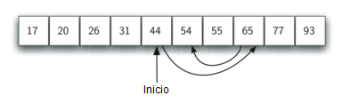

..  Copyright (C)  Brad Miller, David Ranum
    This work is licensed under the Creative Commons Attribution-NonCommercial-ShareAlike 4.0 International License. To view a copy of this license, visit http://creativecommons.org/licenses/by-nc-sa/4.0/.

La búsqueda binaria
~~~~~~~~~~~~~~~~~~~

Es posible aprovechar mejor la lista ordenada si somos inteligentes en nuestras comparaciones. En la búsqueda secuencial, cuando comparamos contra el primer ítem, hay a lo sumo :math:`n-1` ítems restantes para verificar si el primer ítem no es el valor que estamos buscando. En lugar de buscar secuencialmente en la lista, una **búsqueda binaria** comenzará examinando el ítem central. Si ese ítem es el que estamos buscando, hemos terminado. Si no es el ítem correcto, podemos utilizar la naturaleza ordenada de la lista para eliminar la mitad de los ítems restantes. Si el ítem que buscamos es mayor que el ítem central, sabemos que toda la mitad inferior de la lista, así como el ítem central, se pueden ignorar de la consideración posterior. El ítem, si es que está en la lista, debe estar en la mitad superior.

.. It is possible to take greater advantage of the ordered list if we are clever with our comparisons. In the sequential search, when we compare against the first item, there are at most :math:`n-1` more items to look through if the first item is not what we are looking for. Instead of searching the list in sequence, a **binary search** will start by examining the middle item. If that item is the one we are searching for, we are done. If it is not the correct item, we can use the ordered nature of the list to eliminate half of the remaining items. If the item we are searching for is greater than the middle item, we know that the entire lower half of the list as well as the middle item can be eliminated from further consideration. The item, if it is in the list, must be in the upper half.

Podemos entonces repetir el proceso con la mitad superior. Comenzar en el ítem central y compararlo con el valor que estamos buscando. Una vez más, o lo encontramos o dividimos la lista por la mitad, eliminando por tanto otra gran parte de nuestro espacio de búsqueda posible. La :ref:`Figura 3 <fig_binsearch>` muestra cómo este algoritmo puede encontrar rápidamente el valor 54. La función completa se muestra en el :ref:`CodeLens 3 <lst_binarysearchpy>`.

.. We can then repeat the process with the upper half. Start at the middle item and compare it against what we are looking for. Again, we either find it or split the list in half, therefore eliminating another large part of our possible search space. :ref:`Figure 3 <fig_binsearch>` shows how this algorithm can quickly find the value 54. The complete function is shown in :ref:`CodeLens 3 <lst_binarysearchpy>`.

.. _fig_binsearch:

   Figura 3: Búsqueda binaria en una lista ordenada de enteros

   Figura 3: Búsqueda binaria en una lista ordenada de enteros

.. _lst_binarysearchpy:

.. codelens:: search3
    :caption: Búsqueda binaria en una lista ordenada

    def busquedaBinaria(unaLista, item):
        primero = 0
        ultimo = len(unaLista)-1
        encontrado = False

        while primero<=ultimo and not encontrado:
            puntoMedio = (primero + ultimo)//2
            if unaLista[puntoMedio] == item:
                encontrado = True
            else:
                if item < unaLista[puntoMedio]:
                    ultimo = puntoMedio-1
                else:
                    primero = puntoMedio+1

        return encontrado

    listaPrueba = [0, 1, 2, 8, 13, 17, 19, 32, 42,]
    print(busquedaBinaria(listaPrueba, 3))
    print(busquedaBinaria(listaPrueba, 13))

Antes de pasar al análisis, debemos observar que este algoritmo es un gran ejemplo de una estrategia de dividir y conquistar. Dividir y conquistar significa que dividimos el problema en partes más pequeñas, resolvemos dichas partes más pequeñas de alguna manera y luego reensamblamos todo el problema para obtener el resultado. Cuando realizamos una búsqueda binaria en una lista, primero verificamos el ítem central. Si el ítem que estamos buscando es menor que el ítem central, podemos simplemente realizar una búsqueda binaria en la mitad izquierda de la lista original. Del mismo modo, si el ítem es mayor, podemos realizar una búsqueda binaria en la mitad derecha. De cualquier manera, ésta es una llamada recursiva a la función de búsqueda binaria pasándole una lista más pequeña. El :ref:`CodeLens 4 <lst_recbinarysearch>` muestra esta versión recursiva.

.. Before we move on to the analysis, we should note that this algorithm is a great example of a divide and conquer strategy. Divide and conquer means that we divide the problem into smaller pieces, solve the smaller pieces in some way, and then reassemble the whole problem to get the result. When we perform a binary search of a list, we first check the middle item. If the item we are searching for is less than the middle item, we can simply perform a binary search of the left half of the original list. Likewise, if the item is greater, we can perform a binary search of the right half. Either way, this is a recursive call to the binary search function passing a smaller list. :ref:`CodeLens 4 <lst_recbinarysearch>` shows this recursive version.

.. _lst_recbinarysearch:

.. codelens:: search4
    :caption: Una búsqueda binaria--Versión recursiva

    def busquedaBinaria(unaLista, item):
        if len(unaLista) == 0:
            return False
        else:
            puntoMedio = len(unaLista)//2
            if unaLista[puntoMedio]==item:
              return True
            else:
              if item<unaLista[puntoMedio]:
                return busquedaBinaria(unaLista[:puntoMedio],item)
              else:
                return busquedaBinaria(unaLista[puntoMedio+1:],item)

    listaPrueba = [0, 1, 2, 8, 13, 17, 19, 32, 42,]
    print(busquedaBinaria(listaPrueba, 3))
    print(busquedaBinaria(listaPrueba, 13))

Análisis de la búsqueda binaria
^^^^^^^^^^^^^^^^^^^^^^^^^^^^^^^

Para analizar el algoritmo de búsqueda binaria, necesitamos recordar que cada comparación elimina aproximadamente la mitad de los ítem restantes de la consideración. ¿Cuál es el número máximo de comparaciones que este algoritmo requerirá para examinar la lista completa? Si empezamos con *n* ítems, alrededor de :math:`\frac{n}{2}` ítems se dejarán después de la primera comparación. Después de la segunda comparación, habrá aproximadamente :math:`\frac{n}{4}`. Después :math:`\frac{n}{8}`, :math:`\frac{n}{16}`, y así sucesivamente. ¿Cuántas veces podemos dividir la lista? La :ref:`Tabla 3 <tbl_binaryanalysis>` nos ayuda a ver la respuesta.

.. To analyze the binary search algorithm, we need to recall that each comparison eliminates about half of the remaining items from consideration. What is the maximum number of comparisons this algorithm will require to check the entire list? If we start with *n* items, about :math:`\frac{n}{2}` items will be left after the first comparison. After the second comparison, there will be about :math:`\frac{n}{4}`. Then :math:`\frac{n}{8}`, :math:`\frac{n}{16}`, and so on. How many times can we split the list? :ref:`Table 3 <tbl_binaryanalysis>` helps us to see the answer.

.. _tbl_binaryanalysis:

.. table:: **Tabla 3: Análisis tabulado para una búsqueda binaria**

    ======================== ======================================== 
           **Comparaciones** **Número aproximado de ítems restantes** 
    ======================== ======================================== 
                           1                   :math:`\frac {n}{2}` 
                           2                   :math:`\frac {n}{4}` 
                           3                   :math:`\frac {n}{8}` 
                         ...                                        
                           i                 :math:`\frac {n}{2^i}` 
    ======================== ======================================== 

Cuando dividimos la lista suficientes veces, terminamos con una lista que tiene un único ítem. Ya sea aquél ítem único el valor que estamos buscando o no lo sea. En todo caso, habremos terminado. El número de comparaciones necesarias para llegar a este punto es *i* donde :math:`\frac {n}{2^i} = 1`. La solución para *i* nos da :math:`i=\log n`. El número máximo de comparaciones es logarítmico con respecto al número de ítems de la lista. Por lo tanto, la búsqueda binaria es :math:`O(\log n)`.

.. When we split the list enough times, we end up with a list that has just one item. Either that is the item we are looking for or it is not. Either way, we are done. The number of comparisons necessary to get to this point is *i* where :math:`\frac {n}{2^i} =1`. Solving for *i* gives us :math:`i=\log n`. The maximum number of comparisons is logarithmic with respect to the number of items in the list. Therefore, the binary search is :math:`O(\log n)`.

Es necesario enfrentar una cuestión de análisis adicional. En la solución recursiva mostrada anteriormente, la llamada recursiva,

.. One additional analysis issue needs to be addressed. In the recursive solution shown above, the recursive call,

``busquedaBinaria(unaLista[:puntoMedio],item)``

usa el operador de partición para crear la mitad izquierda de la lista que se pasa a la siguiente invocación (similarmente para la mitad derecha también). En el análisis que hicimos arriba se asumió que el operador de partición requiere un tiempo constante. Sin embargo, sabemos que el operador de partición en Python es realmente O(k). Esto significa que la búsqueda binaria utilizando la partición no funcionará estrictamente en tiempo logarítmico. Por suerte esto se puede remediar pasando la lista junto con los índices de inicio y final. Los índices se pueden calcular como lo hicimos en el :ref:`Programa 3 <lst_binarysearchpy>`. Dejamos esta implementación como ejercicio.

.. uses the slice operator to create the left half of the list that is then passed to the next invocation (similarly for the right half as well). The analysis that we did above assumed that the slice operator takes constant time. However, we know that the slice operator in Python is actually O(k). This means that the binary search using slice will not perform in strict logarithmic time. Luckily this can be remedied by passing the list along with the starting and ending indices. The indices can be calculated as we did in :ref:`Listing 3 <lst_binarysearchpy>`. We leave this implementation as an exercise.

A pesar de que una búsqueda binaria es generalmente mejor que una búsqueda secuencial, es importante tener en cuenta que para valores pequeños de *n*, el costo adicional del ordenamiento probablemente no vale la pena. De hecho, siempre debemos considerar si es rentable asumir el trabajo extra del ordenamiento para obtener beneficios en la búsqueda. Si podemos ordenar una sola vez y luego buscar muchas veces, el costo del ordenamiento no es tan significativo. Sin embargo, para listas grandes, incluso ordenar una vez puede resultar tan costoso que simplemente realizar una búsqueda secuencial desde el principio podría ser la mejor opción.

.. Even though a binary search is generally better than a sequential search, it is important to note that for small values of *n*, the additional cost of sorting is probably not worth it. In fact, we should always consider whether it is cost effective to take on the extra work of sorting to gain searching benefits. If we can sort once and then search many times, the cost of the sort is not so significant. However, for large lists, sorting even once can be so expensive that simply performing a sequential search from the start may be the best choice.

.. admonition:: Autoevaluación

   .. mchoice:: BSRCH_1
      :correct: b
      :answer_a: 11, 5, 6, 8
      :answer_b: 12, 6, 11, 8
      :answer_c: 3, 5, 6, 8
      :answer_d: 18, 12, 6, 8
      :feedback_a:  Parece que usted podr&iacute;a haber errado por un paso. Recuerde que la primera posici&oacute;n es el &iacute;ndice 0.
      :feedback_b:  La b&uacute;squeda binaria comienza en el punto medio y cada vez divide la lista por la mitad.
      :feedback_c: La b&uacute;squeda binaria no comienza al principio y busca secuencialmente, ella comienza en el centro y parte la lista por la mitad despu&eacute;s de cada comparaci&oacute;n.
      :feedback_d: Parece que usted est&acute; comenzando desde el final y est&aacute; partiendo cada vez la lista a la mitad.

      Suponga que usted tiene la siguiente lista ordenada [3, 5, 6, 8, 11, 12, 14, 15, 17, 18] y que está utilizando el algoritmo de búsqueda binaria recursiva. ¿Qué grupo de numeros muestra correctamente la secuencia de comparaciones utilizadas para encontrar la clave 8?

   .. mchoice:: BSRCH_2
      :correct: d
      :answer_a: 11, 14, 17
      :answer_b: 18, 17, 15
      :answer_c: 14, 17, 15
      :answer_d: 12, 17, 15
      :feedback_a:  Parece que usted podría haber errado por un paso. Recuerde que la primera posici&oacute;n es el &iacute;ndice 0.
      :feedback_b:  Recuerde que la b&uacute;squeda binaria comienza en la mitad y divide la lista en dos partes.
      :feedback_c:  Parece que usted podr&iacute;a haber errado por un paso, tenga cuidado de que est&eacute; calculando el punto medio utilizando aritm&eacute;tica de enteros.
      :feedback_d: La b&uacute;squeda binaria comienza en el punto medio y cada vez divide la lista por la mitad. La b&uacute;squeda termina cuando la lista est&acute; vac&iacute;a.

      Suponga que usted tiene la siguiente lista ordenada [3, 5, 6, 8, 11, 12, 14, 15, 17, 18] y está utilizando el algoritmo de búsqueda binaria recursiva. ¿Qué grupo de números muestra correctamente la secuencia de comparaciones utilizadas para buscar la clave 16?

