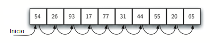
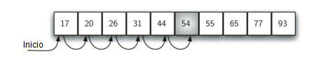

..  Copyright (C)  Brad Miller, David Ranum
    This work is licensed under the Creative Commons Attribution-NonCommercial-ShareAlike 4.0 International License. To view a copy of this license, visit http://creativecommons.org/licenses/by-nc-sa/4.0/.

La búsqueda secuencial
~~~~~~~~~~~~~~~~~~~~~~

Cuando los ítems de datos se almacenan en una colección, por ejemplo en una lista, decimos que tienen una relación lineal o secuencial. Cada ítem de datos se almacena en una posición relativa a los demás. En las listas de Python, estas posiciones relativas son los valores de los índices de los ítems individuales. Dado que estos valores de los índices están ordenados, es posible para nosotros visitarlos en secuencia. Este proceso da lugar a nuestra primera técnica de búsqueda, la **búsqueda secuencial**.

.. When data items are stored in a collection such as a list, we say that they have a linear or sequential relationship. Each data item is stored in a position relative to the others. In Python lists, these relative positions are the index values of the individual items. Since these index values are ordered, it is possible for us to visit them in sequence. This process gives rise to our first searching technique, the **sequential search**.

La :ref:`Figura 1 <fig_seqsearch>` muestra cómo funciona esta búsqueda. Comenzando en el primer ítem de la lista, simplemente nos trasladamos de un ítem a otro, siguiendo el orden secuencial subyacente hasta que encontremos lo que buscamos o nos quedemos sin ítems. Si nos quedamos sin ítems, hemos descubierto que el ítem que estábamos buscando no estaba presente.

.. :ref:`Figure 1 <fig_seqsearch>` shows how this search works. Starting at the first item in the list, we simply move from item to item, following the underlying sequential ordering until we either find what we are looking for or run out of items. If we run out of items, we have discovered that the item we were searching for was not present.

.. _fig_seqsearch:

   Figura 1: Búsqueda secuencial en una lista de enteros

   Figura 1: Búsqueda secuencial en una lista de enteros

La implementación en Python para este algoritmo se muestra en el :ref:`CodeLens 1 <lst_seqsearchpython>`. La función necesita la lista y el ítem que estamos buscando y devuelve un valor booleano que indica si el ítem está o no presente. La variable booleana ``encontrado`` se inicializa en ``False`` y se le asigna el valor ``True`` si descubrimos el ítem en la lista.

.. The Python implementation for this algorithm is shown in :ref:`CodeLens 1 <lst_seqsearchpython>`. The function needs the list and the item we are looking for and returns a boolean value as to whether it is present. The boolean variable ``encontrado`` is initialized to ``False`` and is assigned the value ``True`` if we discover the item in the list.

.. _lst_seqsearchpython:

.. codelens:: search1
    :caption: Búsqueda secuencial en una lista no ordenada

    def busquedaSecuencial(unaLista, item):
        pos = 0
        encontrado = False
        
        while pos < len(unaLista) and not encontrado:
            if unaLista[pos] == item:
                encontrado = True
            else:
                pos = pos+1

        return encontrado

    listaPrueba = [1, 2, 32, 8, 17, 19, 42, 13, 0]
    print(busquedaSecuencial(listaPrueba, 3))
    print(busquedaSecuencial(listaPrueba, 13))

Análisis de la búsqueda secuencial
^^^^^^^^^^^^^^^^^^^^^^^^^^^^^^^^^^

Para analizar los algoritmos de búsqueda, tenemos que tomar una decisión sobre una unidad básica de cálculo. Recuerde que éste es típicamente el paso común que debe repetirse para resolver el problema. Para buscar, tiene sentido contar el número de comparaciones realizadas. Cada comparación puede o no descubrir el ítem que estamos buscando. Además, aquí hacemos otra suposición. La lista de ítems no está ordenada de ninguna manera. Los ítems se han colocado al azar en la lista. En otras palabras, la probabilidad de que el ítem que estamos buscando esté en una posición determinada es exactamente la misma para cada posición de la lista.

.. To analyze searching algorithms, we need to decide on a basic unit of computation. Recall that this is typically the common step that must be repeated in order to solve the problem. For searching, it makes sense to count the number of comparisons performed. Each comparison may or may not discover the item we are looking for. In addition, we make another assumption here. The list of items is not ordered in any way. The items have been placed randomly into the list. In other words, the probability that the item we are looking for is in any particular position is exactly the same for each position of the list.

Si el ítem no está en la lista, la única manera de saberlo es compararlo con cada ítem presente. Si hay :math:`n` ítems, entonces la búsqueda secuencial requiere :math:`n` comparaciones para descubrir que el ítem no está allí. En el caso de que el ítem sí esté en la lista, el análisis no es tan sencillo. En realidad hay tres escenarios diferentes que pueden ocurrir. En el mejor de los casos encontraremos el ítem en el primer lugar que miramos, al principio de la lista. Sólo necesitaremos una comparación. En el peor de los casos, no descubriremos el ítem hasta la última comparación, la `n`-ésima comparación.

.. If the item is not in the list, the only way to know it is to compare it against every item present. If there are :math:`n` items, then the sequential search requires :math:`n` comparisons to discover that the item is not there. In the case where the item is in the list, the analysis is not so straightforward. There are actually three different scenarios that can occur. In the best case we will find the item in the first place we look, at the beginning of the list. We will need only one comparison. In the worst case, we will not discover the item until the very last comparison, the `nth` comparison.

¿Cómo sería el caso promedio? En promedio, encontraremos el ítem alrededor de la mitad de la lista; es decir, compararemos contra :math:`\frac{n}{2}` ítems. Recordemos, sin embargo, que a medida que *n* se hace grande, los coeficientes, sean cuales sean, se vuelven insignificantes en nuestra aproximación, por lo que la complejidad de la búsqueda secuencial es :math:`O(n)`. La :ref:`Tabla 1 <tbl_seqsearchtable>` resume estos resultados.

.. What about the average case? On average, we will find the item about halfway into the list; that is, we will compare against :math:`\frac{n}{2}` items. Recall, however, that as *n* gets large, the coefficients, no matter what they are, become insignificant in our approximation, so the complexity of the sequential search, is :math:`O(n)`. :ref:`Table 1 <tbl_seqsearchtable>` summarizes these results.

.. _tbl_seqsearchtable:

.. table:: **Tabla 1: Comparaciones utilizadas en una búsqueda secuencial en una lista no ordenada**

    ======================== ========================== ========================== ========================
    **Caso**                      **Mejor caso**             **Peor caso**         **Caso promedio**
    ======================== ========================== ========================== ========================
    El ítem está presente         :math:`1`                  :math:`n`                  :math:`\frac{n}{2}`
    El ítem no está presente      :math:`n`                  :math:`n`                  :math:`n`
    ======================== ========================== ========================== ========================

Supusimos anteriormente que los ítems en nuestra colección habían sido colocados aleatoriamente de modo que no hubiera orden relativo entre ellos. ¿Qué pasaría con la búsqueda secuencial si los ítems estuvieran ordenados de alguna manera? ¿Seríamos capaces de mejorar en algo la eficiencia en nuestra técnica de búsqueda?

.. We assumed earlier that the items in our collection had been randomly placed so that there is no relative order between the items. What would happen to the sequential search if the items were ordered in some way? Would we be able to gain any efficiency in our search technique?

Suponga que la lista de ítems se construyó de modo que los ítems estuvieran en orden ascendente, de menor a mayor. Si el ítem que estamos buscando está presente en la lista, la posibilidad de que esté en alguna de las *n* posiciones sigue siendo la misma que antes. Aún tendremos que hacer el mismo número de comparaciones para encontrar el ítem. Sin embargo, si el ítem no está presente hay una ligera ventaja. La :ref:`Figura 2 <fig_seqsearch2>` muestra este proceso a medida que el algoritmo busca el ítem 50. Observe que los ítems aún se comparan en secuencia hasta el 54. No obstante, en este punto, sabemos algo más. No sólo el 54 no es el ítem que estamos buscando, sino que ningún otro ítem más allá de 54 servirá ya que la lista está ordenada. En este caso, el algoritmo no tiene que seguir mirando a lo largo de todos los ítems para reportar que no se encontró el elemento. Puede detenerse inmediatamente. El :ref:`CodeLens 2 <lst_seqsearchpython2>` muestra esta variación de la función de búsqueda secuencial.

.. Assume that the list of items was constructed so that the items were in ascending order, from low to high. If the item we are looking for is present in the list, the chance of it being in any one of the *n* positions is still the same as before. We will still have the same number of comparisons to find the item. However, if the item is not present there is a slight advantage. :ref:`Figure 2 <fig_seqsearch2>` shows this process as the algorithm looks for the item 50. Notice that items are still compared in sequence until 54. At this point, however, we know something extra. Not only is 54 not the item we are looking for, but no other elements beyond 54 can work either since the list is sorted. In this case, the algorithm does not have to continue looking through all of the items to report that the item was not found. It can stop immediately. :ref:`CodeLens 2 <lst_seqsearchpython2>` shows this variation of the sequential search function.

.. _fig_seqsearch2:

   Figura 2: Búsqueda secuencial en una lista ordenada de enteros

   Figura 2: Búsqueda secuencial en una lista ordenada de enteros

.. _lst_seqsearchpython2:

.. codelens:: search2
    :caption: Búsqueda secuencial en una lista ordenada

    def busquedaSecuencialOrdenada(unaLista, item):
        pos = 0
        encontrado = False
        parar = False
        while pos < len(unaLista) and not encontrado and not parar:
            if unaLista[pos] == item:
                encontrado = True
            else:
                if unaLista[pos] > item:
                    parar = True
                else:
                    pos = pos+1

        return encontrado

    listaPrueba = [0, 1, 2, 8, 13, 17, 19, 32, 42,]
    print(busquedaSecuencialOrdenada(listaPrueba, 3))
    print(busquedaSecuencialOrdenada(listaPrueba, 13))

La :ref:`Tabla 2 <tbl_seqsearchtable2>` resume estos resultados. Note que en el mejor de los casos podríamos descubrir que el ítem no está en la lista mirando únicamente un ítem. En promedio, lo sabremos solamente después de mirar :math:`\frac{n}{2}` ítems. Sin embargo, esta técnica sigue siendo :math:`O(n)`. En resumen, una búsqueda secuencial se mejora ordenando la lista sólo en caso que no encontremos el ítem.

.. :ref:`Table 2 <tbl_seqsearchtable2>` summarizes these results. Note that in the best case we might discover that the item is not in the list by looking at only one item. On average, we will know after looking through only :math:`\frac {n}{2}` items. However, this technique is still :math:`O(n)`. In summary, a sequential search is improved by ordering the list only in the case where we do not find the item.

.. _tbl_seqsearchtable2:

.. table:: **Tabla 2: Comparaciones usadas en la búsqueda secuencial en una lista ordenada**

     ======================== ============== ==============  ===================
                              **Mejor caso**  **Peor caso**  **Caso promedio**
     ======================== ============== ==============  ===================
     El ítem está presente    :math:`1`        :math:`n`     :math:`\frac{n}{2}`
     El ítem no está presente :math:`1`        :math:`n`     :math:`\frac{n}{2}`
     ======================== ============== ==============  ===================

.. admonition:: Autoevaluación

   .. mchoice:: question_SRCH_1
      :correct: d
      :answer_a: 5
      :answer_b: 10
      :answer_c: 4
      :answer_d: 2
      :feedback_a: Con cinco comparaciones obtendría el segundo 18 en la lista.
      :feedback_b: No es necesario buscar en toda la lista, solo hasta que usted encuentre la clave que está buscando.
      :feedback_c: No, recuerde que en una búsqueda secuencial usted empieza desde el principio y revisa cada clave hasta que encuentre lo que busque o la lista se agote.
      :feedback_d: En este caso sólo se necesitaron 2 comparaciones para encontrar la clave.

      Suponga que usted está realizando una búsqueda secuencial en la lista [15, 18, 2, 19, 18, 0, 8, 14, 19, 14]. ¿Cuántas comparaciones necesitaría hacer para encontrar la clave 18?

   .. mchoice:: question_SRCH_2
      :correct: c
      :answer_a: 10
      :answer_b: 5
      :answer_c: 7
      :answer_d: 6
      :feedback_a:  No es necesario buscar en toda la lista, ya que está ordenada, usted puede detener la búsqueda cuando haya comparado contra un valor mayor que la clave.
      :feedback_b: Dado que 11 es menor que el valor clave 13, usted debe seguir buscando.
      :feedback_c: Puesto que 14 es mayor que el valor clave 13, usted puede detener la búsqueda.
      :feedback_d: Ya que 12 es menor que el valor clave 13, usted debe seguir buscando.

      Suponga que usted está realizando una búsqueda secuencial en la lista ordenada [3, 5, 6, 8, 11, 12, 14, 15, 17, 18]. ¿Cuántas comparaciones necesitaría hacer para encontrar la clave 13?
