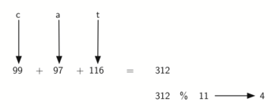

..  Copyright (C)  Brad Miller, David Ranum
    This work is licensed under the Creative Commons Attribution-NonCommercial-ShareAlike 4.0 International License. To view a copy of this license, visit http://creativecommons.org/licenses/by-nc-sa/4.0/.

Transformación de claves (hashing)
~~~~~~~~~~~~~~~~~~~~~~~~~~~~~~~~~~

En secciones anteriores pudimos hacer mejoras en nuestros algoritmos de búsqueda aprovechando la información acerca de dónde se almacenan los ítems en la colección con respecto a los demás. Por ejemplo, al saber que se ordenó una lista, podríamos buscar en tiempo logarítmico usando una búsqueda binaria. En esta sección intentaremos ir un paso más allá construyendo una estructura de datos en la que se pueda buscar en tiempo :math:`O(1)`. Este concepto se conoce como búsqueda por **transformación de claves (o hashing en inglés)**.

Para hacer esto, necesitaremos saber aún más sobre dónde podrían estar los ítems cuando vamos a buscarlos en la colección. Si cada ítem está donde debe estar, entonces la búsqueda puede usar una sola comparación para descubrir la presencia de un ítem. Veremos, sin embargo, que éste no suele ser el caso.

Una **tabla hash** es una colección de ítems que se almacenan de tal manera que sea más fácil encontrarlos más tarde. Cada posición de la tabla hash, a menudo llamada una **ranura**, puede contener un ítem y se llama por un valor entero comenzando en 0. Por ejemplo, tendremos una ranura llamada 0, una ranura llamada 1, una ranura llamada 2, y así sucesivamente. Inicialmente, la tabla hash no contiene ningún ítem por lo que cada ranura está vacía. Podemos implementar una tabla hash usando una lista con cada ítem inicializado con el valor especial de Python ``None``. La :ref:`Figura 4 <fig_hashtable1>` muestra una tabla hash de tamaño :math:`m=11`. En otras palabras, hay *m* ranuras en la tabla, con nombres de 0 a 10.

.. _fig_hashtable1:

.. figure:: Figures/hashtable.png
   :align: center

   Figura 4: Tabla hash con 11 ranuras vacías

   Figura 4: Tabla hash con 11 ranuras vacías

La correspondencia entre un ítem y la ranura a donde pertenece ese ítem en la tabla hash se denomina la función **hash**. La función hash tomará cualquier ítem de la colección y devolverá un número entero en el rango de nombres de las ranuras, entre 0 y *m*-1. Supongamos que tenemos el conjunto de ítems enteros 54, 26, 93, 17, 77 y 31. Nuestra primera función hash, a veces denominada “método del residuo”, simplemente toma un ítem y lo divide por el tamaño de la tabla, devolviendo el residuo como su valor hash (:math:`h(item)=item \% 11`). La :ref:`Tabla 4 <tbl_hashvalues1>` da todos los valores hash para nuestros ítems de ejemplo. Tenga en cuenta que este método del residuo (módulo aritmético) estará típicamente presente en alguna forma en todas las funciones hash, ya que el resultado debe estar en el rango de nombres de las ranuras.

.. _tbl_hashvalues1:

.. table:: **Tabla 4: Función hash simple usando los residuos**

    ================= ================ 
             **Ítem**   **Valor hash** 
    ================= ================ 
                   54               10 
                   26                4 
                   93                5 
                   17                6 
                   77                0 
                   31                9 
    ================= ================ 

Una vez calculados los valores hash, podemos insertar cada ítem en la tabla hash en la posición designada como se muestra en la :ref:`Figura 5 <fig_hashtable2>`. Note que 6 de las 11 ranuras están ocupadas. Esto se conoce como el **factor de carga**, y es denotado comúnmente por :math:`\lambda = \frac {numeroDeItems}{tamanoTabla}`. Para este ejemplo, :math:`\lambda = \frac {6}{11}`.

.. _fig_hashtable2:

.. figure:: Figures/hashtable2.png
   :align: center

   Figura 5: Tabla hash con seis ítems

   Figura 5: Tabla hash con seis ítems

Ahora, cuando queramos buscar un ítem, simplemente usamos la función hash para calcular el nombre de la ranura para el ítem y luego verificamos la tabla hash para ver si está presente. Esta operación de búsqueda es :math:`O(1)`, ya que se requiere una cantidad de tiempo constante para calcular el valor hash y luego indizar la tabla hash en esa ubicación. Si todo está donde debería estar, hemos encontrado un algoritmo de búsqueda de tiempo constante.

Usted probablemente ya puede ver que esta técnica sólo va a funcionar si a cada ítem le corresponde una ubicación exclusiva en la tabla hash. Por ejemplo, si el ítem 44 hubiera sido el siguiente ítem de nuestra colección, tendría un valor hash de 0 (:math:`44 \% 11 = 0`). Dado que 77 también tenía un valor hash de 0, tendríamos un problema. Según la función hash, dos o más ítems necesitarían estar en la misma ranura. Esto se conoce como **colisión** (también se puede llamar un “choque”). Evidentemente, las colisiones crean un problema para la técnica de búsqueda por transformación de claves. Las discutiremos en detalle más adelante.

Funciones hash
^^^^^^^^^^^^^^

Dada una colección de ítems, una función hash que asigna cada ítem en una ranura única se conoce como una **función hash perfecta**. Si conociéramos los ítems y la colección nunca cambiara, entonces sería posible construir una función hash perfecta (consulte los ejercicios para obtener más información sobre las funciones hash perfectas). Desafortunadamente, dada una colección arbitraria de ítems, no existe una forma sistemática de construir una función hash perfecta. Afortunadamente, no necesitamos que la función hash sea perfecta para aún obtener una mayor eficiencia de desempeño.

Una forma de tener siempre una función hash perfecta es aumentar el tamaño de la tabla hash para que cada valor posible se pueda acomodar en el rango de ítems. Esto garantiza que cada ítem tendrá una ranura exclusiva. Aunque esto es práctico para un número pequeño de ítems, no es factible cuando el número de ítems posibles es grande. Por ejemplo, si los ítems fueran números de Seguridad Social de nueve dígitos, este método requeriría casi mil millones de ranuras. Si sólo queremos almacenar datos para un grupo de 25 estudiantes, estaríamos desperdiciando una enorme cantidad de memoria.

Nuestro objetivo es crear una función hash que minimice el número de colisiones, sea fácil de calcular y distribuya uniformemente los ítems en la tabla hash. Hay varias maneras comunes de extender el método simple del residuo. Vamos a considerar aquí algunas de ellas.

El **método de plegado** para construir las funciones hash comienza dividiendo el ítem en partes del mismo tamaño (la última parte puede que no sea del mismo tamaño). Luego se suman estas partes para obtener el valor hash resultante. Por ejemplo, si nuestro ítem era el número telefónico 436-555-4601, tomaríamos los dígitos y los dividiríamos en grupos de 2 (43,65,55,46,01). Después de la suma :math:`43+65+55+46+01`, obtendremos 210. Si asumimos que nuestra tabla hash tiene 11 ranuras, entonces necesitamos realizar el paso adicional de dividir entre 11 y recordar el residuo. En este caso :math:`210\ \%\ 11` es 1, por lo que el número telefónico 436-555-4601 se asigna a la ranura 1. Algunos métodos de plegado van un paso más allá e invierten cada una de las otras partes antes de la suma. Para el ejemplo anterior obtendríamos :math:`43+56+55+64+01 = 219` lo cual da :math:`219\ \%\ 11 = 10`.

Otra técnica numérica para construir una función hash se denomina el método del **centro del cuadrado**. En primer lugar elevamos el ítem al cuadrado, y luego extraemos cierta parte de los dígitos resultantes. Por ejemplo, si el ítem fuera 44, primero calcularíamos :math:`44^{2} = 1,936`. Extrayendo los dos dígitos centrales, 93, y realizando el paso restante, obtendríamos 5 (:math:`93\ \%\ 11`). La :ref:`Tabla 5 <tbl_hashvalues2>` muestra las correspondencias de los ítems tanto con el método del residuo como con el método del centro del cuadrado. Verifique que usted entiende cómo se calcularon estos valores.

.. _tbl_hashvalues2:

.. table:: **Tabla 5: Comparación de los métodos del residuo y del centro del cuadrado**

    ================= =============== ======================= 
             **Ítem**     **Residuo** **Centro del cuadrado** 
    ================= =============== ======================= 
                   54              10                       3 
                   26               4                       7 
                   93               5                       9 
                   17               6                       8 
                   77               0                       4 
                   31               9                       6 
    ================= =============== ======================= 

También podemos crear funciones hash para ítems basados en caracteres tales como las cadenas. La cadena “cat” puede pensarse como una secuencia de valores ordinales.

::

    >>> ord('c')
    99
    >>> ord('a')
    97
    >>> ord('t')
    116

Podemos entonces tomar estos tres valores ordinales, sumarlos y usar el método del residuo para obtener un valor hash (vea la :ref:`Figura 6 <fig_stringhash>`). El :ref:`Programa 1 <lst_hashfunction1>` muestra una función llamada ``hash`` que toma una cadena y un tamaño de tabla y devuelve el valor hash correspondiente en el rango de 0 a ``tamanoTabla``-1.

.. _fig_stringhash:

   Figura 6: Transformación de claves (hashing) de una cadena usando valores ordinales

   Figura 6: Transformación de claves (hashing) de una cadena usando valores ordinales

.. _lst_hashfunction1:

**Programa 1**

::

    def hash(unaCadena, tamanoTabla):
        suma = 0
        for pos in range(len(unaCadena)):
            suma = suma + ord(unaCadena[pos])

        return suma%tamanoTabla
        
Es interesante observar que al usar esta función hash, los anagramas siempre tendrán el mismo valor hash. Para remediar esto, podríamos usar la posición del carácter como un peso o ponderación. La :ref:`Figura 7 <fig_stringhash2>` muestra una posible forma de utilizar el valor de la posición como factor de ponderación. La modificación de la función ``hash`` se deja como un ejercicio.

.. _fig_stringhash2:

.. figure:: Figures/stringhash2.png
   :align: center

   Figura 7: Transformación de claves de una cadena usando valores ordinales con ponderación

   Figura 7: Transformación de claves de una cadena usando valores ordinales con ponderación

Tal vez usted sea capaz de pensar en una serie de formas adicionales para calcular valores hash para los ítems en una colección. Lo importante de recordar es que la función hash tiene que ser eficiente para que no se convierta en la parte dominante del proceso de almacenamiento y búsqueda. Si la función hash es demasiado compleja, entonces se vuelve más trabajoso calcular el nombre de la ranura de lo que costaría simplemente hacer una búsqueda secuencial básica o una búsqueda binaria como se describió anteriormente. Esto invalidaría rápidamente el propósito de la transformación de claves.

Solución de colisiones
^^^^^^^^^^^^^^^^^^^^^^

Ahora regresamos al problema de las colisiones. Cuando a dos ítems se les asigna la misma ranura, debemos contar con un método sistemático para colocar el segundo ítem en la tabla hash. Este proceso se denomina **solución de colisiones**. Como dijimos anteriormente, si la función hash es perfecta, nunca se producirán colisiones. Sin embargo, como esto no suele ser posible, la solución de colisiones se convierte en una parte muy importante de la transformación de claves.

.. We now return to the problem of collisions. When two items hash to the same slot, we must have a systematic method for placing the second item in the hash table. This process is called **collision resolution**. As we stated earlier, if the hash function is perfect, collisions will never occur. However, since this is often not possible, collision resolution becomes a very important part of hashing.

Un método para solucionar las colisiones examina la tabla hash e intenta encontrar otra ranura disponible para contener el ítem que causó la colisión. Una manera sencilla de hacerlo es comenzar en la posición del valor hash original y luego moverse secuencialmente a lo largo de las ranuras hasta encontrar la primera que esté vacía. Tenga en cuenta que es posible que necesite volver a la primera ranura (circularmente) para cubrir toda la tabla hash. Este proceso de solución de colisiones se conoce como **direccionamiento abierto** ya que intenta encontrar la siguiente ranura o dirección disponible ("abierta") en la tabla hash. Al visitar sistemáticamente cada una de las ranuras, de una en una, estamos ejecutando una técnica de direccionamiento abierto llamada **prueba lineal**.

.. One method for resolving collisions looks into the hash table and tries to find another open slot to hold the item that caused the collision. A simple way to do this is to start at the original hash value position and then move in a sequential manner through the slots until we encounter the first slot that is empty. Note that we may need to go back to the first slot (circularly) to cover the entire hash table. This collision resolution process is referred to as **open addressing** in that it tries to find the next open slot or address in the hash table. By systematically visiting each slot one at a time, we are performing an open addressing technique called **linear probing**.

La :ref:`Figura 8 <fig_linearprobing>` muestra un conjunto extendido de ítems enteros según la función hash del método simple del residuo (54, 26, 93, 17, 77, 31, 44, 55, 20). La :ref:`Tabla 4 <tbl_hashvalues1> 'muestra los valores hash para los ítems originales. La :ref:`Figura 5 <fig_hashtable2>` muestra el contenido original. Cuando intentamos colocar el 44 en la ranura 0, se produce una colisión. Según la técnica de prueba lineal, miramos secuencialmente, ranura por ranura, hasta encontrar una posición disponible. En este caso, encontramos la ranura 1.

.. :ref:`Figure 8 <fig_linearprobing>` shows an extended set of integer items under the simple remainder method hash function (54,26,93,17,77,31,44,55,20). :ref:`Table 4 <tbl_hashvalues1>` above shows the hash values for the original items. :ref:`Figure 5 <fig_hashtable2>` shows the original contents. When we attempt to place 44 into slot 0, a collision occurs. Under linear probing, we look sequentially, slot by slot, until we find an open position. In this case, we find slot 1.

Una vez más, el 55 debe ir en la ranura 0, pero debe ser colocado en la ranura 2, ya que ésa es la siguiente posición disponible. El valor final, 20, debería ubicarse en la ranura 9. Dado que la ranura 9 está llena, comenzamos a realizar la prueba lineal. Visitamos las ranuras 10, 0, 1 y 2 y finalmente encontramos una ranura vacía en la posición 3.

.. Again, 55 should go in slot 0 but must be placed in slot 2 since it is the next open position. The final value of 20 hashes to slot 9. Since slot 9 is full, we begin to do linear probing. We visit slots 10, 0, 1, and 2, and finally find an empty slot at position 3.

.. _fig_linearprobing:

.. figure:: Figures/linearprobing1.png
   :align: center

   Figura 8: Solución de colisiones con prueba lineal

   Figura 8: Solución de colisiones con prueba lineal

Una vez que hemos construido una tabla hash utilizando direccionamiento abierto y prueba lineal, es esencial que utilicemos los mismos métodos para buscar ítems. Supongamos que queremos buscar el ítem 93. Cuando calculamos el valor hash, obtenemos 5. Al mirar en la ranura 5 confirmamos que está el 93, y podemos devolver ``True``. ¿Qué pasaría si estamos buscando el 20? Ahora el valor hash es 9 y en la ranura 9 está almacenado el 31. No podemos simplemente devolver ``False``, ya que sabemos que podría haber habido colisiones. Ahora nos vemos obligados a hacer una búsqueda secuencial, comenzando en la posición 10, buscando hasta que encontremos el ítem 20 o encontremos una ranura vacía.

.. Once we have built a hash table using open addressing and linear probing, it is essential that we utilize the same methods to search for items. Assume we want to look up the item 93. When we compute the hash value, we get 5. Looking in slot 5 reveals 93, and we can return ``True``. What if we are looking for 20? Now the hash value is 9, and slot 9 is currently holding 31. We cannot simply return ``False`` since we know that there could have been collisions. We are now forced to do a sequential search, starting at position 10, looking until either we find the item 20 or we find an empty slot.

Una desventaja de la prueba lineal es la tendencia al **agrupamiento**; Los ítems tienden a agruparse en la tabla. Esto significa que si se producen muchas colisiones con el mismo valor hash, se llenará cierto número de ranuras circundantes debido a la solución mediante prueba lineal. Esto tendrá un impacto en otros ítems que estén siendo insertados, como vimos antes cuando tratamos de agregar el ítem 20. Un grupo de ítems con valor hash 0 tendrían que ser saltados para finalmente encontrar una posición disponible. Este grupo se muestra en la :ref:`Figura 9 <fig_clustering>`.

.. A disadvantage to linear probing is the tendency for **clustering**; items become clustered in the table. This means that if many collisions occur at the same hash value, a number of surrounding slots will be filled by the linear probing resolution. This will have an impact on other items that are being inserted, as we saw when we tried to add the item 20 above. A cluster of values hashing to 0 had to be skipped to finally find an open position. This cluster is shown in :ref:`Figure 9 <fig_clustering>`.

.. _fig_clustering:

.. figure:: Figures/clustering.png
   :align: center

   Figura 9: Un grupo de ítems para la ranura 0

   Figura 9: Un grupo de ítems para la ranura 0

Una manera de lidiar con el agrupamiento es extender la técnica de prueba lineal de modo que en vez de buscar secuencialmente la siguiente ranura disponible, saltemos ranuras, distribuyendo de manera más uniforme los ítems que han causado colisiones. Esto potencialmente reducirá el agrupamiento que se produce. La :ref:`Figura 10 <fig_linearprobing2>` muestra los ítems cuando la solución de colisiones se realiza con una prueba "más 3". Esto significa que una vez se produzca una colisión, examinaremos cada tercera ranura hasta encontrar una que esté vacía.

.. One way to deal with clustering is to extend the linear probing technique so that instead of looking sequentially for the next open slot, we skip slots, thereby more evenly distributing the items that have caused collisions. This will potentially reduce the clustering that occurs. :ref:`Figure 10 <fig_linearprobing2>` shows the items when collision resolution is done with a “plus 3” probe. This means that once a collision occurs, we will look at every third slot until we find one that is empty.

.. _fig_linearprobing2:

.. figure:: Figures/linearprobing2.png
   :align: center

   Figura 10: Solución de colisiones usando “Más 3”

   Figura 10: Solución de colisiones usando “Más 3”

El nombre general para este proceso de buscar otra ranura después de una colisión es **transformación de claves repetida (rehashing)**. Con prueba lineal simple, la función rehash es :math:`valorHashNuevo = rehash(valorHashViejo)` donde :math:`rehash(pos) = (pos + 1) \% tamanoDeTabla`. El rehash "más 3" se puede definir como :math:`rehash(pos) = (pos + 3) \% tamanoDeTabla`. En general :math:`rehash(pos) = (pos + salto) \% tamanoDeTabla`. Es importante tener en cuenta que el tamaño del “salto” debe ser tal que todas las ranuras en la tabla eventualmente sean visitadas. De lo contrario, parte de la tabla no se utilizará. Para asegurar esto, a menudo se sugiere que el tamaño de la tabla sea un número primo. Ésa es la razón por la que en nuestros ejemplos hemos estado usando 11.

.. The general name for this process of looking for another slot after a collision is **rehashing**. With simple linear probing, the rehash function is :math:`valorHashNuevo = rehash(valorHashViejo)` where :math:`rehash(pos) = (pos + 1) \% tamanoDeTabla`. The “plus 3” rehash can be defined as :math:`rehash(pos) = (pos+3) \% tamanoDeTabla`. In general, :math:`rehash(pos) = (pos + skip) \% tamanoDeTabla`. It is important to note that the size of the “skip” must be such that all the slots in the table will eventually be visited. Otherwise, part of the table will be unused. To ensure this, it is often suggested that the table size be a prime number. This is the reason we have been using 11 in our examples.

Una variación de la idea de la prueba lineal se denomina **prueba cuadrática**. En lugar de usar un valor de “salto” constante, usamos una función rehash que incrementa el valor de hash en 1, 4, 9, 16, etc. Esto significa que si el primer valor hash es *h*, los valores sucesivos son :math:`h+1`, :math:`h+4`, :math:`h+9`, :math:`h+16`, y así sucesivamente. En otras palabras, la prueba cuadrática utiliza un salto que consiste en cuadrados perfectos sucesivos. La :ref:`Figura 11 <fig_quadratic>` muestra nuestros valores de ejemplo después de que son ubicados utilizando esta técnica.

.. A variation of the linear probing idea is called **quadratic probing**. Instead of using a constant “skip” value, we use a rehash function that increments the hash value by 1, 3, 5, 7, 9, and so on. This means that if the first hash value is *h*, the successive values are :math:`h+1`, :math:`h+4`, :math:`h+9`, :math:`h+16`, and so on. In other words, quadratic probing uses a skip consisting of successive perfect squares. :ref:`Figure 11 <fig_quadratic>` shows our example values after they are placed using this technique.

.. _fig_quadratic:

.. figure:: Figures/quadratic.png
   :align: center

   Figura 11: Solución de colisiones usando prueba cuadrática

   Figura 11: Solución de colisiones usando prueba cuadrática

Un método alternativo para manejar el problema de colisiones es permitir que cada ranura contenga una referencia a una colección (o cadena) de ítems. El **encadenamiento** permite que muchos ítems existan en la misma ubicación en la tabla hash. Cuando ocurren colisiones, el elemento todavía se coloca en la ranura adecuada de la tabla hash. A medida que más y más ítems obtienen un valor hash a la misma ubicación, aumenta la dificultad de buscar el ítem en la colección. La :ref:`Figura 12 <fig_chaining>` muestra los ítems a medida que se agregan a una tabla hash que utiliza encadenamiento para resolver las colisiones.

.. An alternative method for handling the collision problem is to allow each slot to hold a reference to a collection (or chain) of items. **Chaining** allows many items to exist at the same location in the hash table. When collisions happen, the item is still placed in the proper slot of the hash table. As more and more items hash to the same location, the difficulty of searching for the item in the collection increases. :ref:`Figure 12 <fig_chaining>` shows the items as they are added to a hash table that uses chaining to resolve collisions.

.. _fig_chaining:

.. figure:: Figures/chaining.png
   :align: center

   Figura 12: Solución de colisiones con encadenamiento

   Figura 12: Solución de colisiones con encadenamiento

Cuando queremos buscar un ítem, usamos la función hash para generar la ranura donde debe residir. Puesto que cada ranura contiene una colección, utilizamos una técnica de búsqueda para decidir si el elemento está presente. La ventaja es que en promedio es probable que haya muchos menos ítems en cada ranura, así que la búsqueda es quizás más eficiente. Examinaremos el análisis de la transformación de claves al final de esta sección.

.. When we want to search for an item, we use the hash function to generate the slot where it should reside. Since each slot holds a collection, we use a searching technique to decide whether the item is present. The advantage is that on the average there are likely to be many fewer items in each slot, so the search is perhaps more efficient. We will look at the analysis for hashing at the end of this section.

.. admonition:: Autoevaluación

   .. mchoice:: HASH_1
      :correct: c
      :answer_a: 1, 10
      :answer_b: 13, 0
      :answer_c: 1, 0
      :answer_d: 2, 3
      :feedback_a:  Tenga cuidado en usar el residuo, no la división entera
      :feedback_b:  No divida entre dos, use el operador módulo.
      :feedback_c: 27 % 13 == 1 y 130 % 13 == 0
      :feedback_d: Use el operador módulo

      En una tabla hash de tamaño 13, ¿qué índices de posición corresponden a las siguientes dos claves?: 27,  130

   .. mchoice:: HASH_2
      :correct: b
      :answer_a: 100, __, __, 113, 114, 105, 116, 117, 97, 108, 99
      :answer_b: 99, 100, __, 113, 114, __, 116, 117, 105, 97, 108
      :answer_c: 100, 113, 117, 97, 14, 108, 116, 105, 99, __, __
      :answer_d: 117, 114, 108, 116, 105, 99, __, __, 97, 100, 113
      :feedback_a:  Parece que usted puede haber estado aplicando aritmética módulo 2. Usted necesita utilizar el tamaño de la tabla hash como valor de la operación módulo.
      :feedback_b:  El uso de aritmética módulo 11 y de prueba lineal da estos valores
      :feedback_c: Parece que usted puede haber estado aplicando aritmética módulo 10, use el tamaño de la tabla.
      :feedback_d: Tenga cuidado en usar la operación módulo, no la división entera

      Supongamos que a usted se le da el siguiente conjunto de claves para insertar en una tabla hash que puede contener exactamente 11 valores: 113, 117, 97, 100, 114, 108, 116, 105, 99 ¿Cuál de las siguientes opciones demuestra mejor el contenido de la tabla hash después de que se han insertado todas las claves utilizando la prueba lineal?

Implementación del tipo abstracto de datos ``Vector Asociativo``
^^^^^^^^^^^^^^^^^^^^^^^^^^^^^^^^^^^^^^^^^^^^^^^^^^^^^^^^^^^^^^^^

Una de las colecciones más útiles de Python es el diccionario. Recuerde que un diccionario es un tipo de datos asociativo donde usted puede almacenar parejas clave-valor. La clave se utiliza para buscar el valor de datos asociado. A menudo nos referimos a esta idea como un **vector asociativo o mapa**.

.. One of the most useful Python collections is the dictionary. Recall that a dictionary is an associative data type where you can store key–data pairs. The key is used to look up the associated data value. We often refer to this idea as a **map**.

El tipo abstracto de datos Vector Asociativo se define como sigue. La estructura es una colección no ordenada de asociaciones entre una clave y un valor de datos. Las claves de un vector asociativo son únicas para que exista una relación uno a uno entre una clave y un valor. Las operaciones se dan a continuación.

.. The map abstract data type is defined as follows. The structure is an unordered collection of associations between a key and a data value. The keys in a map are all unique so that there is a one-to-one relationship between a key and a value. The operations are given below.

-  ``VectorAsociativo()`` Crea un vector asociativo nuevo y vacío. Devuelve una colección vector asociativo vacía.

-  ``agregar(clave,valor)`` Agrega una nueva pareja clave-valor al vector asociativo. Si la clave ya está en el vector asociativo, reemplaza el valor anterior por el nuevo.

-  ``obtener(clave)`` Dada una clave, devuelva el valor almacenado en el vector asociativo o ``None`` de lo contrario.

-  ``eliminar`` Elimina la pareja clave-valor del vector asociativo utilizando una instrucción de la forma ``eliminar VectorAsociativo[clave]``.

-  ``tamano()`` Devuelve el número de parejas clave-valor almacenadas en el vector asociativo.

-  ``in`` Devuelve ``True`` para una instrucción de la forma ``clave in VectorAsociativo``, si la clave dada está en el vector asociativo, ``False`` de lo contrario.

Uno de los grandes beneficios de un diccionario es el hecho de que dada una clave, podemos buscar el valor del dato asociado muy rápidamente. Con el fin de proporcionar esta capacidad de búsqueda rápida, necesitamos una implementación que soporte una búsqueda eficiente. Podríamos usar una lista con búsqueda secuencial o binaria, pero sería incluso mejor usar una tabla hash como se ha descrito anteriormente, ya que la búsqueda de un ítem en una tabla hash se acerca a un desempeño :math:`O(1)`.

.. One of the great benefits of a dictionary is the fact that given a key, we can look up the associated data value very quickly. In order to provide this fast look up capability, we need an implementation that supports an efficient search. We could use a list with sequential or binary search but it would be even better to use a hash table as described above since looking up an item in a hash table can approach :math:`O(1)` performance.

En el :ref:`Programa 2 <lst_hashtablecodeconstructor>` utilizamos dos listas para crear una clase ``TablaHash`` que implementa el tipo abstracto de datos Vector Asociativo. Una lista, llamada ``ranuras``, contendrá los ítems que constituyen las claves y una lista paralela, llamada ``datos``, almacenará los valores de los datos. Cuando busquemos una clave, la posición correspondiente en la lista de datos contendrá el valor de datos asociado a la clave. Trataremos la lista de claves como una tabla hash utilizando las ideas presentadas anteriormente. Tenga en cuenta que el tamaño inicial de la tabla hash se ha elegido que sea 11. Aunque esto es arbitrario, es importante que el tamaño sea un número primo para que el algoritmo de solución de colisión pueda ser lo más eficiente posible.

.. In :ref:`Listing 2 <lst_hashtablecodeconstructor>` we use two lists to create a ``HashTable`` class that implements the Map abstract data type. One list, called ``slots``, will hold the key items and a parallel list, called ``data``, will hold the data values. When we look up a key, the corresponding position in the data list will hold the associated data value. We will treat the key list as a hash table using the ideas presented earlier. Note that the initial size for the hash table has been chosen to be 11. Although this is arbitrary, it is important that the size be a prime number so that the collision resolution algorithm can be as efficient as possible.

.. _lst_hashtablecodeconstructor:

**Programa 2**

::

    class TablaHash:
        def __init__(self):
            self.tamano = 11
            self.ranuras = [None] * self.tamano
            self.datos = [None] * self.tamano

La función ``funcionHash`` implementa el método simple del residuo. La técnica de solución de colisiones es la prueba lineal con una función rehash “más 1”. La función ``agregar`` (ver el :ref:`Programa 3 <lst_hashtablecodestore>`) asume que habrá una ranura vacía a menos que la clave ya esté presente en ``self.ranuras``. Dicha función calcula el valor hash original y si esa ranura no está vacía, repite la función ``rehash`` hasta que aparezca una ranura vacía. Si una ranura no vacía ya contiene la clave, el valor del dato antiguo se reemplaza con el nuevo valor del dato. Hacer frente a la situación en la que no quedan ranuras vacías se deja como un ejercicio.

.. ``funcionHash`` implements the simple remainder method. The collision resolution technique is linear probing with a “plus 1” rehash function. The ``put`` function (see :ref:`Listing 3 <lst_hashtablecodestore>`) assumes that there will eventually be an empty slot unless the key is already present in the ``self.ranuras``. It computes the original hash value and if that slot is not empty, iterates the ``rehash`` function until an empty slot occurs. If a nonempty slot already contains the key, the old data value is replaced with the new data value.  Dealing with the situation where there are no empty slots left is an exercise.

.. _lst_hashtablecodestore:

**Programa 3**

::

    def agregar(self,clave,dato):
      valorHash = self.funcionHash(clave,len(self.ranuras))

      if self.ranuras[valorHash] == None:
        self.ranuras[valorHash] = clave
        self.datos[valorHash] = dato
      else:
        if self.ranuras[valorHash] == clave:
          self.datos[valorHash] = dato  #reemplazo
        else:
          proximaRanura = self.rehash(valorHash,len(self.ranuras))
          while self.ranuras[proximaRanura] != None and \
                          self.ranuras[proximaRanura] != clave:
            proximaRanura = self.rehash(proximaRanura,len(self.ranuras))

          if self.ranuras[proximaRanura] == None:
            self.ranuras[proximaRanura]=clave
            self.datos[proximaRanura]=dato
          else:
            self.datos[proximaRanura] = dato #reemplazo

    def funcionHash(self,clave,tamano):
         return clave%tamano

    def rehash(self,hashViejo,tamano):
        return (hashViejo+1)%tamano

Del mismo modo, la función ``obtener`` (ver :ref:`Programa 4 <lst_hashtablecodesearch>`) comienza calculando el valor hash inicial. Si el valor no está en la ranura inicial, se usa la función ``rehash`` para localizar la siguiente posición posible. Observe que la línea 15 garantiza que la búsqueda finalizará comprobando que no hemos regresado a la ranura inicial. Si eso ocurre, hemos agotado todas las ranuras posibles y el ítem no debe estar presente.

.. Likewise, the ``get`` function (see :ref:`Listing 4 <lst_hashtablecodesearch>`) begins by computing the initial hash value. If the value is not in the initial slot, ``rehash`` is used to locate the next possible position. Notice that line 15 guarantees that the search will terminate by checking to make sure that we have not returned to the initial slot. If that happens, we have exhausted all possible slots and the item must not be present.

Los métodos finales de la clase ``TablaHash`` proporcionan funcionalidad adicional de diccionarios. Sobrecargamos los métodos __getitem__ y __setitem__ para permitir el acceso usando ``[]``. Esto significa que una vez se ha creado una ``TablaHash``, el familiar operador de índización estará disponible. Dejamos los métodos restantes como ejercicios.

.. The final methods of the ``HashTable`` class provide additional dictionary functionality. We overload the __getitem__ and __setitem__ methods to allow access using``[]``. This means that once a ``HashTable`` has been created, the familiar index operator will be available. We leave the remaining methods as exercises.

.. _lst_hashtablecodesearch:

**Programa 4**

.. highlight:: python
    :linenothreshold: 5

::

    def obtener(self,clave):
      ranuraInicio = self.funcionHash(clave,len(self.ranuras))

      dato = None
      parar = False
      encontrado = False
      posicion = ranuraInicio
      while self.ranuras[posicion] != None and  \
                           not encontrado and not parar:
         if self.ranuras[posicion] == clave:
           encontrado = True
           dato = self.datos[posicion]
         else:
           posicion=self.rehash(posicion,len(self.ranuras))
           if posicion == ranuraInicio:
               parar = True
      return dato

    def __getitem__(self,clave):
        return self.obtener(clave)

    def __setitem__(self,clave,dato):
        self.agregar(clave,dato)
        
        
        
.. highlight:: python
    :linenothreshold: 500
    
La siguiente sesión muestra la clase ``TablaHash`` en acción. En primer lugar vamos a crear una tabla hash y a almacenar algunos ítems con claves enteras y valores de datos que sean cadenas de caracteres. 

.. The following session shows the ``HashTable`` class in action. First we will create a hash table and store some items with integer keys and string data values.

::

    >>> H=TablaHash()
    >>> H[54]="gato"
    >>> H[26]="perro"
    >>> H[93]="leon"
    >>> H[17]="tigre"
    >>> H[77]="pajaro"
    >>> H[31]="vaca"
    >>> H[44]="cabra"
    >>> H[55]="cerdo"
    >>> H[20]="pollo"
    >>> H.ranuras
    [77, 44, 55, 20, 26, 93, 17, None, None, 31, 54]
    >>> H.datos
    ['pajaro', 'cabra', 'cerdo', 'pollo', 'perro', 
     'leon', 'tigre', None, None, 'vaca', 'gato']

A continuación, accederemos y modificaremos algunos ítems de la tabla hash. Observe que el valor para la clave 20 está siendo reemplazando.

.. Next we will access and modify some items in the hash table. Note that the value for the key 20 is being replaced.

::

    >>> H[20]
    'pollo'
    >>> H[17]
    'tigre'
    >>> H[20]='pato'
    >>> H[20]
    'pato'
    >>> H.datos
    ['pajaro', 'cabra', 'cerdo', 'pato', 'perro',
      'leon', 'tigre', None, None, 'vaca', 'gato']
    >> print(H[99])
    None

El ejemplo completo de la tabla hash se encuentra en el ActiveCode 1.

.. The complete hash table example can be found in ActiveCode 1.

.. activecode:: hashtablecomplete
   :caption: Ejemplo completo de la tabla hash
   :hidecode:
   
   class TablaHash:
       def __init__(self):
           self.tamano = 11
           self.ranuras = [None] * self.tamano
           self.datos = [None] * self.tamano

       def agregar(self,clave,dato):
         valorHash = self.funcionHash(clave,len(self.ranuras))

         if self.ranuras[valorHash] == None:
           self.ranuras[valorHash] = clave
           self.datos[valorHash] = dato
         else:
           if self.ranuras[valorHash] == clave:
             self.datos[valorHash] = dato  #reemplazo
           else:
             proximaRanura = self.rehash(valorHash,len(self.ranuras))
             while self.ranuras[proximaRanura] != None and \
                             self.ranuras[proximaRanura] != clave:
               proximaRanura = self.rehash(proximaRanura,len(self.ranuras))

             if self.ranuras[proximaRanura] == None:
               self.ranuras[proximaRanura]=clave
               self.datos[proximaRanura]=dato
             else:
               self.datos[proximaRanura] = dato #reemplazo

       def funcionHash(self,clave,tamano):
            return clave%tamano

       def rehash(self,hashViejo,tamano):
           return (hashViejo+1)%tamano

       def obtener(self,clave):
         ranuraInicio = self.funcionHash(clave,len(self.ranuras))

         dato = None
         parar = False
         encontrado = False
         posicion = ranuraInicio
         while self.ranuras[posicion] != None and  \
                              not encontrado and not parar:
            if self.ranuras[posicion] == clave:
              encontrado = True
              dato = self.datos[posicion]
            else:
              posicion=self.rehash(posicion,len(self.ranuras))
              if posicion == ranuraInicio:
                  parar = True
         return dato

       def __getitem__(self,clave):
           return self.obtener(clave)

       def __setitem__(self,clave,dato):
           self.agregar(clave,dato)

   H=TablaHash()
   H[54]="gato"
   H[26]="perro"
   H[93]="leon"
   H[17]="tigre"
   H[77]="pajaro"
   H[31]="vaca"
   H[44]="cabra"
   H[55]="cerdo"
   H[20]="pollo"
   print(H.ranuras)
   print(H.datos)

   print(H[20])

   print(H[17])
   H[20]='pato'
   print(H[20])
   print(H[99])
   
    

Análisis de la transformación de claves
^^^^^^^^^^^^^^^^^^^^^^^^^^^^^^^^^^^^^^^

Hemos dicho anteriormente que, en el mejor caso, la transformación de claves brindaría una técnica de búsqueda de tiempo constante :math:`O(1)`. Sin embargo, debido a las colisiones, el número de comparaciones no suele ser tan simple. A pesar de que un análisis completo de la transformación de claves está más allá del alcance de este texto, podemos indicar algunos resultados bien conocidos que aproximan el número de comparaciones necesarias para buscar un ítem.

.. We stated earlier that in the best case hashing would provide a :math:`O(1)`, constant time search technique. However, due to collisions, the number of comparisons is typically not so simple. Even though a complete analysis of hashing is beyond the scope of this text, we can state some well-known results that approximate the number of comparisons necessary to search for an item.

La información más importante que necesitamos para analizar el uso de una tabla hash es el factor de carga, :math:`\lambda`. Conceptualmente, si :math:`\lambda` es pequeño, entonces hay una menor probabilidad de colisiones, lo que significa que los elementos tienen más probabilidades de estar en las ranuras donde pertenecen. Si :math:`\lambda` es grande, lo que significa que la tabla se está llenando, entonces hay más y más colisiones. Esto significa que la solución de colisiones es más difícil, requiriendo más comparaciones para encontrar una ranura vacía. Con el encadenamiento, un incremento en las colisiones significa un incremento en el número de ítems en cada cadena.

.. The most important piece of information we need to analyze the use of a hash table is the load factor, :math:`\lambda`. Conceptually, if :math:`\lambda` is small, then there is a lower chance of collisions, meaning that items are more likely to be in the slots where they belong. If :math:`\lambda` is large, meaning that the table is filling up, then there are more and more collisions. This means that collision resolution is more difficult, requiring more comparisons to find an empty slot. With chaining, increased collisions means an increased number of items on each chain.

Como antes, tendremos un resultado tanto para una búsqueda exitosa como para una búsqueda sin éxito. Para una búsqueda exitosa usando direccionamiento abierto con prueba lineal, el número promedio de comparaciones es aproximadamente :math:`\frac{1}{2}\left(1+\frac{1}{1-\lambda}\right)` y para una búsqueda infructuosa es :math:`\frac{1}{2}\left(1+\left(\frac{1}{1-\lambda}\right)^2\right)`. Si estamos utilizando encadenamiento, el número promedio de comparaciones es :math:`1 + \frac {\lambda}{2}` para el caso exitoso, y simplemente :math:`\lambda` comparaciones si la búsqueda no tiene éxito.

.. As before, we will have a result for both a successful and an unsuccessful search. For a successful search using open addressing with linear probing, the average number of comparisons is approximately :math:`\frac{1}{2}\left(1+\frac{1}{1-\lambda}\right)` and an unsuccessful search gives :math:`\frac{1}{2}\left(1+\left(\frac{1}{1-\lambda}\right)^2\right)` If we are using chaining, the average number of comparisons is :math:`1 + \frac {\lambda}{2}` for the successful case, and simply :math:`\lambda` comparisons if the search is unsuccessful.
