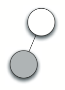

..  Copyright (C)  Brad Miller, David Ranum
    This work is licensed under the Creative Commons Attribution-NonCommercial-ShareAlike 4.0 International License. To view a copy of this license, visit http://creativecommons.org/licenses/by-nc-sa/4.0/.

Árbol de análisis
~~~~~~~~~~~~~~~~~

Con la implementación de nuestra estructura de datos de árbol completa, miremos ahora un ejemplo de cómo puede usarse un árbol para resolver algunos problemas reales. En esta sección examinaremos los árboles de análisis. Los árboles de análisis se pueden usar para representar construcciones del mundo real como oraciones o expresiones matemáticas.

.. With the implementation of our tree data structure complete, we now look at an example of how a tree can be used to solve some real problems. In this section we will look at parse trees. Parse trees can be used to represent real-world constructions like sentences or mathematical expressions.

.. _fig_nlparse:

.. figure:: Figures/nlParse.png
   :align: center
   :alt: image

   Figura 1: Un árbol de análisis para una oración simple
   
   Figura 1: Un árbol de análisis para una oración simple

La :ref:`Figura 1 <fig_nlparse>` muestra la estructura jerárquica de una oración simple. Representar una oración como una estructura de árbol nos permite trabajar con las partes individuales de la oración usando subárboles.

.. :ref:`Figure 1 <fig_nlparse>` shows the hierarchical structure of a simple sentence. Representing a sentence as a tree structure allows us to work with the individual parts of the sentence by using subtrees.

.. _fig_meparse:

.. figure:: Figures/meParse.png
   :align: center
   :alt: image

   Figura 2: Árbol de análisis para :math:`((7+3)*(5-2))`

   Figura 2: Árbol de análisis para :math:`((7+3)*(5-2))`

También podemos representar una expresión matemática como :math:`((7 + 3) * (5 - 2))` como un árbol de análisis, tal como se muestra en la :ref:`Figura 2 <fig_meparse>`. Ya hemos visto las expresiones completamente agrupadas, así que ¿qué sabemos acerca de esta expresión? Sabemos que la multiplicación tiene una mayor precedencia que la suma o la resta. Debido a los paréntesis, sabemos que antes de poder hacer la multiplicación debemos evaluar las expresiones de suma y resta que están entre paréntesis. La jerarquía del árbol nos ayuda a entender el orden de la evaluación para toda la expresión. Antes de poder evaluar la multiplicación del nivel superior, debemos evaluar la suma y la resta en los subárboles. La suma, que es el subárbol izquierdo, da un resultado de 10. La resta, que es el subárbol derecho, da 3. Usando la estructura jerárquica de los árboles, podemos simplemente reemplazar un subárbol completo con un nodo una vez que hemos evaluado las expresiones en los hijos. La aplicación de este procedimiento de sustitución nos da el árbol simplificado que se muestra en la :ref:`Figura 3 <fig_mesimple>`.

.. We can also represent a mathematical expression such as :math:`((7 + 3) * (5 - 2))` as a parse tree, as shown in :ref:`Figure 2 <fig_meparse>`. We have already looked at fully parenthesized expressions, so what do we know about this expression? We know that multiplication has a higher precedence than either addition or subtraction. Because of the parentheses, we know that before we can do the multiplication we must evaluate the parenthesized addition and subtraction expressions. The hierarchy of the tree helps us understand the order of evaluation for the whole expression. Before we can evaluate the top-level multiplication, we must evaluate the addition and the subtraction in the subtrees. The addition, which is the left subtree, evaluates to 10. The subtraction, which is the right subtree, evaluates to 3. Using the hierarchical structure of trees, we can simply replace an entire subtree with one node once we have evaluated the expressions in the children. Applying this replacement procedure gives us the simplified tree shown in :ref:`Figure 3 <fig_mesimple>`.

.. _fig_mesimple:

.. figure:: Figures/meSimple.png
   :align: center
   :alt: image

   Figura 3: Un árbol de análisis simplificado para :math:`((7+3)*(5-2))`

   Figura 3: Un árbol de análisis simplificado para :math:`((7+3)*(5-2))`

En lo restante de esta sección vamos a examinar los árboles de análisis en más detalle. En particular, veremos

.. In the rest of this section we are going to examine parse trees in more detail. In particular we will look at

-  Cómo crear un árbol de análisis a partir de una expresión matemática completamente agrupada.

-  Cómo evaluar la expresión almacenada en un árbol de análisis.

-  Cómo recuperar la expresión matemática original a partir de un árbol de análisis.

El primer paso en la construcción de un árbol de análisis es descomponer la cadena de la expresión en una lista de símbolos. Hay cuatro tipos diferentes de símbolos a considerar: paréntesis izquierdos, paréntesis derechos, operadores y operandos. Sabemos que cada vez que leamos un paréntesis izquierdo estaremos comenzando una nueva expresión, y por lo tanto debemos crear un nuevo árbol que corresponda a esa expresión. Por el contrario, cuando leamos un paréntesis derecho, habremos terminado una expresión. También sabemos que los operandos van a ser nodos hoja e hijos de sus operadores. Finalmente, sabemos que cada operador va a tener tanto un hijo izquierdo como un hijo derecho.

.. The first step in building a parse tree is to break up the expression string into a list of tokens. There are four different kinds of tokens to consider: left parentheses, right parentheses, operators, and operands. We know that whenever we read a left parenthesis we are starting a new expression, and hence we should create a new tree to correspond to that expression. Conversely, whenever we read a right parenthesis, we have finished an expression. We also know that operands are going to be leaf nodes and children of their operators. Finally, we know that every operator is going to have both a left and a right child.

Usando la información anterior podemos definir cuatro reglas como sigue:

.. Using the information from above we can define four rules as follows:

#. Si el símbolo actual es un ``'('``, agregar un nodo nuevo como hijo izquierdo del nodo actual y descender al hijo izquierdo.

#. Si el símbolo actual está en la lista ``['+', '-', '/', '*']``, asignar al valor raíz del nodo actual el operador representado por el símbolo actual. Agregar un nuevo nodo como hijo derecho del nodo actual y descender al hijo derecho.

#. Si el símbolo actual es un número, asignar dicho número al valor raíz del nodo actual y regresar al padre.

#. Si el símbolo actual es un ``')'``, ir al padre del nodo actual.

Antes de escribir el código en Python, echemos un vistazo a un ejemplo de las reglas descritas anteriormente en acción. Usaremos la expresión :math:`(3 + (4 * 5))`. Descompondremos esta expresión en la siguiente lista de símbolos de caracteres individuales ``['(', '3', '+',`` ``'(', '4', '*', '5' ,')',')']``. Inicialmente comenzaremos con un árbol de análisis que consiste en un nodo raíz vacío. La :ref:`Figura 4 <fig_bldExpstep>` ilustra la estructura y el contenido del árbol de análisis, a medida que se procesa cada nuevo símbolo.

.. Before writing the Python code, let’s look at an example of the rules outlined above in action. We will use the expression :math:`(3 + (4 * 5))`. We will parse this expression into the following list of character tokens ``['(', '3', '+',`` ``'(', '4', '*', '5' ,')',')']``. Initially we will start out with a parse tree that consists of an empty root node. :ref:`Figure 4 <fig_bldExpstep>` illustrates the structure and contents of the parse tree, as each new token is processed.

.. _fig_bldExpstep:

.. figure:: Figures/buildExp1.png
   :align: center
   :alt: image

.. figure:: Figures/buildExp3.png
   :align: center
   :alt: image

.. figure:: Figures/buildExp4.png
   :align: center
   :alt: image

.. figure:: Figures/buildExp5.png
   :align: center
   :alt: image

.. figure:: Figures/buildExp6.png
   :align: center
   :alt: image

.. figure:: Figures/buildExp7.png
   :align: center
   :alt: image

.. figure:: Figures/buildExp8.png
   :align: center
   :alt: image

   Figura 4: Seguimiento de la contrucción del aŕbol de análisis

   Figura 4: Seguimiento de la contrucción del aŕbol de análisis

Utilizando la :ref:`Figura 4 <fig_bldExpstep>`, recorramos el ejemplo paso a paso:

.. Using :ref:`Figure 4 <fig_bldExpstep>`, let’s walk through the example step by step:

a) Creamos un árbol vacío.

b) El primer símbolo leído es un (. Por la regla 1, creamos un nuevo nodo como hijo izquierdo de la raíz. Hacemos que el nodo actual sea este nuevo hijo.

c) El siguiente símbolo leído es un 3. Por la regla 3, asignamos el 3 al valor raíz del nodo actual y volvemos a subir el árbol al padre.

d) El siguiente símbolo leído es un +. Por la regla 2, asignamos el + al valor raíz del nodo actual y añadimos un nodo nuevo como hijo derecho. El nuevo hijo derecho se convierte en el nodo actual.

e) El siguiente símbolo leído es un (. Por la regla 1, creamos un nuevo nodo como hijo izquierdo del nodo actual. El nuevo hijo izquierdo se convierte en el nodo actual.

f) El siguiente símbolo leído es un 4. Por la regla 3, asignamos el 4 al valor raíz del nodo actual. Hacemos que el padre de 4 sea ahora el nodo actual.

g) El siguiente símbolo leído es un \*. Por la regla 2, asignamos el \* al valor raíz del nodo actual y creamos un nuevo hijo derecho. El nuevo hijo derecho se convierte en el nodo actual.

h) El siguiente símbolo leído es un 5. Por la regla 3, asignamos el 5 al valor raíz del nodo actual. Hacemos que el padre de 5 sea ahora el nodo actual.

i) El siguiente símbolo leído es un ). Por la regla 4 hacemos que el padre del \* sea ahora el nodo actual.

j) El siguiente símbolo leído es un ). Por la regla 4 hacemos que el padre del + sea ahora el nodo actual. En este punto no hay padre para el + entonces hemos terminado.

A partir del ejemplo anterior, está claro que necesitamos realizar un seguimiento del nodo actual, así como del padre del nodo actual. La interfaz de la clase árbol binario nos proporciona una forma de obtener los hijos de un nodo, a través de los métodos ``obtenerHijoIzquierdo`` y ``obtenerHijoDerecho``, pero ¿cómo podemos hacer un seguimiento de los padres? Una solución simple para mantener un registro de los padres a medida que recorremos el árbol es usar una pila. Siempre que deseemos descender a un hijo del nodo actual, primero incluimos el nodo actual en la pila. Cuando queramos regresar al padre del nodo actual, extraemos el padre de la pila.

.. From the example above, it is clear that we need to keep track of the current node as well as the parent of the current node. The tree interface provides us with a way to get children of a node, through the ``obtenerHijoIzquierdo`` and ``obtenerHijoDerecho`` methods, but how can we keep track of the parent? A simple solution to keeping track of parents as we traverse the tree is to use a stack. Whenever we want to descend to a child of the current node, we first push the current node on the stack. When we want to return to the parent of the current node, we pop the parent off the stack.

Utilizando las reglas arriba descritas, junto con las operaciones de ``Pila`` y ``ArbolBinario``, ahora estamos listos para escribir una función en Python para crear un árbol de análisis. El código para el constructor de nuestro árbol de análisis se presenta en el :ref:`ActiveCode 1 <lst_buildparse>`.

.. Using the rules described above, along with the ``Stack`` and ``BinaryTree`` operations, we are now ready to write a Python function to create a parse tree. The code for our parse tree builder is presented in :ref:`ActiveCode 1 <lst_buildparse>`.

.. _lst_buildparse:

.. activecode::  parsebuild
    :caption: Contrucción de un árbol de análisis
    :nocodelens:

    from pythoned.basicas.pila import Pila
    from pythoned.arboles.arbolBinario import ArbolBinario 

    def construirArbolAnalisis(expresionAgrupada):
        listaSimbolos = expresionAgrupada.split()
        pilaPadres = Pila()
        arbolExpresion = ArbolBinario('')
        pilaPadres.incluir(arbolExpresion)
        arbolActual = arbolExpresion
        for i in listaSimbolos:
            if i == '(':            
                arbolActual.insertarIzquierdo('')
                pilaPadres.incluir(arbolActual)
                arbolActual = arbolActual.obtenerHijoIzquierdo()
            elif i not in ['+', '-', '*', '/', ')']:  
                arbolActual.asignarValorRaiz(int(i))
                padre = pilaPadres.extraer()
                arbolActual = padre
            elif i in ['+', '-', '*', '/']:       
                arbolActual.asignarValorRaiz(i)
                arbolActual.insertarDerecho('')
                pilaPadres.incluir(arbolActual)
                arbolActual = arbolActual.obtenerHijoDerecho()
            elif i == ')':          
                arbolActual = pilaPadres.extraer()
            else:
                raise ValueError
        return arbolExpresion

    miArbolAnalisis = construirArbolAnalisis("( ( 10 + 5 ) * 3 )")
    print(miArbolAnalisis) # Imprimir el objeto árbol pero no muestra los valores en los nodos    
    #miArbolAnalisis.postorden()  #definida y explicada en la próxima sección

Las cuatro reglas para construir un árbol de análisis están codificadas como las primeras cuatro cláusulas de la instrucción ``if`` en las líneas 11, 15, 19 y 24 del :ref:`ActiveCode 1 <lst_buildparse>`. En cada caso, usted podrá ver que el código implementa la regla, como se ha descrito anteriormente, con unas pocas llamadas a los métodos de ``ArbolBinario`` o de ``Pila``. La única comprobación de errores que hacemos en esta función está en la cláusula ``else`` en la que generamos una excepción ``ValueError`` si recibimos un símbolo de la lista que no reconocemos.

.. The four rules for building a parse tree are coded as the first four clauses of the ``if`` statement on lines 11, 15, 19, and 24 of :ref:`ActiveCode 1 <lst_buildparse>`. In each case you can see that the code implements the rule, as described above, with a few calls to the ``BinaryTree`` or ``Stack`` methods. The only error checking we do in this function is in the ``else`` clause where we raise a ``ValueError`` exception if we get a token from the list that we do not recognize.

Ahora que hemos construido un árbol de análisis, ¿qué podemos hacer con él? Como primer ejemplo, escribiremos una función para evaluar el árbol de análisis, devolviendo el resultado numérico. Para escribir esta función, haremos uso de la naturaleza jerárquica del árbol. Fíjese de nuevo en la :ref:`Figura 2 <fig_meparse>`. Recordemos que podemos reemplazar el árbol original por el árbol simplificado que se muestra en la :ref:`Figura 3 <fig_mesimple>`. Esto sugiere que podemos escribir un algoritmo que evalúa un árbol de análisis mediante la evaluación recursiva de cada subárbol.

.. Now that we have built a parse tree, what can we do with it? As a first example, we will write a function to evaluate the parse tree, returning the numerical result. To write this function, we will make use of the hierarchical nature of the tree. Look back at :ref:`Figure 2 <fig_meparse>`. Recall that we can replace the original tree with the simplified tree shown in :ref:`Figure 3 <fig_mesimple>`. This suggests that we can write an algorithm that evaluates a parse tree by recursively evaluating each subtree.

Como hemos hecho con algoritmos recursivos anteriores, comenzaremos el diseño de la función de evaluación recursiva identificando el caso base. Un caso base natural para los algoritmos recursivos que operan sobre árboles es comprobar si hay un nodo hoja. En un árbol de análisis, los nodos hoja siempre serán operandos. Dado que los objetos numéricos como números enteros y de punto flotante no requieren más interpretación, la función ``evaluar`` puede simplemente devolver el valor almacenado en el nodo hoja. El paso recursivo que mueve la función hacia el caso base es llamar a ``evaluar`` sobre los hijos izquierdo y derecho del nodo actual. La llamada recursiva efectivamente nos mueve hacia abajo en el árbol, hacia un nodo hoja.

.. As we have done with past recursive algorithms, we will begin the design for the recursive evaluation function by identifying the base case. A natural base case for recursive algorithms that operate on trees is to check for a leaf node. In a parse tree, the leaf nodes will always be operands. Since numerical objects like integers and floating points require no further interpretation, the ``evaluate`` function can simply return the value stored in the leaf node. The recursive step that moves the function toward the base case is to call ``evaluate`` on both the left and the right children of the current node. The recursive call effectively moves us down the tree, toward a leaf node.

Para poner juntos los resultados de las dos llamadas recursivas, podemos aplicar simplemente el operador almacenado en el nodo padre a los resultados devueltos de la evalución de ambos hijos. En el ejemplo de la :ref:`Figura 3 <fig_mesimple>` vemos que los dos hijos de la raíz se evalúan a sí mismos, es decir, 10 y 3. Aplicar el operador de multiplicación nos da un resultado final de 30.

.. To put the results of the two recursive calls together, we can simply apply the operator stored in the parent node to the results returned from evaluating both children. In the example from :ref:`Figure 3 <fig_mesimple>` we see that the two children of the root evaluate to themselves, namely 10 and 3. Applying the multiplication operator gives us a final result of 30.

El código para una función ``evaluar`` recursiva se muestra en el :ref:`Programa 1 <lst_eval>`. Primero, obtenemos referencias a los hijos izquierdo y derecho del nodo actual. Si la evaluación de tanto el hijo izquierdo como la del hijo derecho es ``None``, entonces sabemos que el nodo actual es realmente un nodo hoja. Esta comprobación está en la línea 7. Si el nodo actual no es un nodo hoja, se busca el operador en el nodo actual y se aplica a los resultados de la evaluación recursiva de los hijos izquierdo y derecho.

.. The code for a recursive ``evaluate`` function is shown in :ref:`Listing 1 <lst_eval>`. First, we obtain references to the left and the right children of the current node. If both the left and right children evaluate to ``None``, then we know that the current node is really a leaf node. This check is on line 7. If the current node is not a leaf node, look up the operator in the current node and apply it to the results from recursively evaluating the left and right children.

Para implementar la aritmética, usamos un diccionario con las claves ``'+', '-', '*'`` y ``'/'``. Los valores almacenados en el diccionario son funciones del módulo de operator de Python. El módulo operator nos proporciona las versiones funcionales de muchos operadores utilizados comúnmente. Cuando buscamos un operador en el diccionario, se recupera el objeto de función correspondiente. Dado que el objeto recuperado es una función, podemos llamarla de la manera usual ``funcion(parametro1, parametro2)``. Así que la búsqueda ``operadores['+'](2,2)`` es equivalente a ``operator.add(2,2)``.

.. To implement the arithmetic, we use a dictionary with the keys ``'+', '-', '*'``, and ``'/'``. The values stored in the dictionary are functions from Python’s operator module. The operator module provides us with the functional versions of many commonly used operators. When we look up an operator in the dictionary, the corresponding function object is retrieved. Since the retrieved object is a function, we can call it in the usual way ``function(param1,param2)``. So the lookup ``opers['+'](2,2)`` is equivalent to ``operator.add(2,2)``.

.. _lst_eval:

**Programa 1**

.. sourcecode:: python

    def evaluar(arbolAnalisis):
        operadores = {'+':operator.add, '-':operator.sub, '*':operator.mul, '/':operator.truediv}
         
        hijoIzquierdo = arbolAnalisis.obtenerHijoIzquierdo()
        hijoDerecho = arbolAnalisis.obtenerHijoDerecho()
    
        if hijoIzquierdo and hijoDerecho:
            fn = operadores[arbolAnalisis.obtenerValorRaiz()]
            return fn(evaluar(hijoIzquierdo),evaluar(hijoDerecho))
        else:
            return arbolAnalisis.obtenerValorRaiz()

.. highlight:: python
    :linenothreshold: 500

Finalmente, haremos un seguimiento a la función ``evaluar`` en el árbol de análisis que creamos en la :ref:`Figura 4 <fig_bldExpstep>`. Cuando llamamos a ``evaluar`` por primera vez, pasamos la raíz de todo el árbol como el parámetro ``arbolAnalisis``. Luego obtenemos referencias a los hijos izquierdo y derecho para asegurarnos de que existan. La llamada recursiva tiene lugar en la línea 9. Comenzamos buscando el operador en la raíz del árbol, que es ``'+'``. El operador ``'+'`` está asociado a la llamada de la función ``operator.add``, que recibe dos parámetros. Como de costumbre para una llamada a una función en Python, lo primero que hace Python es evaluar los parámetros que se pasan a la función. En este caso ambos parámetros son llamadas recursivas a nuestra función ``evaluar``. Usando evaluación de izquierda a derecha, la primera llamada recursiva va a la izquierda. En la primera llamada recursiva, la función ``evaluar`` recibe el subárbol izquierdo. Encontramos que el nodo no tiene hijos izquierdos o derechos, por lo que estamos en un nodo hoja. Cuando estamos en un nodo hoja simplemente devolvemos el valor almacenado en el nodo hoja como resultado de la evaluación. En este caso devolvemos el número entero 3.

.. Finally, we will trace the ``evaluate`` function on the parse tree we created in :ref:`Figure 4 <fig_bldExpstep>`. When we first call ``evaluate``, we pass the root of the entire tree as the parameter ``arbolAnalisis``. Then we obtain references to the left and right children to make sure they exist. The recursive call takes place on line 9. We begin by looking up the operator in the root of the tree, which is ``'+'``. The ``'+'`` operator maps to the ``operator.add`` function call, which takes two parameters. As usual for a Python function call, the first thing Python does is to evaluate the parameters that are passed to the function. In this case both parameters are recursive function calls to our ``evaluate`` function. Using left-to-right evaluation, the first recursive call goes to the left. In the first recursive call the ``evaluate`` function is given the left subtree. We find that the node has no left or right children, so we are in a leaf node. When we are in a leaf node we just return the value stored in the leaf node as the result of the evaluation. In this case we return the integer 3.

En este punto tenemos un parámetro evaluado para nuestra llamada del nivel superior a ``operator.add``. Pero todavía no hemos terminado. Continuando la evaluación de izquierda a derecha de los parámetros, ahora hacemos una llamada recursiva para evaluar el hijo derecho de la raíz. Encontramos que el nodo tiene tanto un hijo izquierdo como un hijo derecho, así que buscamos el operador almacenado en este nodo, ``'*'``, y llamamos a esta función usando los hijos izquierdo y derecho como parámetros. En este punto usted puede ver que ambas llamadas recursivas serán a los nodos hoja, cuyas evaluaciones corresponden a los enteros cuatro y cinco respectivamente. Con los dos parámetros evaluados, devolvemos el resultado de ``operator.mul(4,5)``. En este punto hemos evaluado los operandos para el operador ``'+'`` del nivel superior y todo lo que queda por hacer es terminar con la llamada a ``operator.add(3,20)``. El resultado de la evaluación de todo el árbol de la expresión :math:`(3 + (4 * 5))` es 23.

.. At this point we have one parameter evaluated for our top-level call to ``operator.add``. But we are not done yet. Continuing the left-to-right evaluation of the parameters, we now make a recursive call to evaluate the right child of the root. We find that the node has both a left and a right child so we look up the operator stored in this node, ``'*'``, and call this function using the left and right children as the parameters. At this point you can see that both recursive calls will be to leaf nodes, which will evaluate to the integers four and five respectively. With the two parameters evaluated, we return the result of ``operator.mul(4,5)``. At this point we have evaluated the operands for the top level ``'+'`` operator and all that is left to do is finish the call to ``operator.add(3,20)``. The result of the evaluation of the entire expression tree for :math:`(3 + (4 * 5))` is 23.
