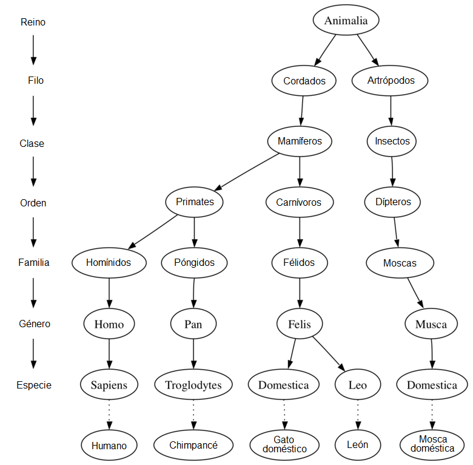

..  Copyright (C)  Brad Miller, David Ranum
    This work is licensed under the Creative Commons Attribution-NonCommercial-ShareAlike 4.0 International License. To view a copy of this license, visit http://creativecommons.org/licenses/by-nc-sa/4.0/.

Ejemplos de árboles
-------------------

Ahora que hemos estudiado estructuras de datos lineales como pilas y colas y que tenemos cierta experiencia con la recursividad, examinaremos una estructura de datos común llamada **árbol**. Los árboles se usan en muchas áreas de las ciencias de la computación, incluyendo sistemas operativos, gráficos, sistemas de bases de datos y redes de computadoras. Las estructuras de datos tipo árbol tienen muchas cosas en común con sus primos botánicos. Una estructura de datos tipo árbol tiene una raíz, ramas y hojas. La diferencia entre un árbol de la naturaleza y un árbol de las ciencias de la computación es que una estructura de datos tipo árbol tiene su raíz en la parte superior y sus hojas en la parte inferior.

.. Now that we have studied linear data structures like stacks and queues and have some experience with recursion, we will look at a common data structure called the **tree**. Trees are used in many areas of computer science, including operating systems, graphics, database systems, and computer networking. Tree data structures have many things in common with their botanical cousins. A tree data structure has a root, branches, and leaves. The difference between a tree in nature and a tree in computer science is that a tree data structure has its root at the top and its leaves on the bottom.

Antes de comenzar nuestro estudio de las estructuras de datos tipo árbol, veamos algunos ejemplos comunes. Nuestro primer ejemplo de un árbol es un árbol de clasificación de la biología. La :ref:`Figura 1 <fig_biotree>` muestra un ejemplo de la clasificación biológica de algunos animales. A partir de este sencillo ejemplo, podemos aprender sobre varias propiedades de los árboles. La primera propiedad que este ejemplo demuestra es que los árboles son jerárquicos. Por jerárquico, queremos decir que los árboles están estructurados en capas con las cosas más generales cerca de la parte superior y las cosas más específicas cerca de la parte inferior. La parte superior de la jerarquía es el Reino, la siguiente capa del árbol (los “hijos” de la capa superior) es el Filo, luego está la Clase, y así sucesivamente. Sin embargo, no importa cuán profundo vayamos en el árbol de clasificación, todos los organismos siguen siendo animales.

.. Before we begin our study of tree data structures, let’s look at a few common examples. Our first example of a tree is a classification tree from biology. :ref:`Figure 1 <fig_biotree>` shows an example of the biological classification of some animals. From this simple example, we can learn about several properties of trees. The first property this example demonstrates is that trees are hierarchical. By hierarchical, we mean that trees are structured in layers with the more general things near the top and the more specific things near the bottom. The top of the hierarchy is the Kingdom, the next layer of the tree (the “children” of the layer above) is the Phylum, then the Class, and so on. However, no matter how deep we go in the classification tree, all the organisms are still animals.

.. _fig_biotree:

   Figura 1: Taxonomía de algunos animales comunes mostrada como un árbol

   Figura 1: Taxonomía de algunos animales comunes mostrada como un árbol

Note que usted puede comenzar en la parte superior del árbol y seguir una ruta formada por círculos y flechas hasta llegar a la parte inferior. En cada nivel del árbol podríamos hacernos una pregunta y luego seguir la ruta que coincida con nuestra respuesta. Por ejemplo, podríamos preguntar: “¿Es este animal un cordado o es un artrópodo?” Si la respuesta es “cordado” entonces seguimos esa ruta y preguntamos, “¿Es este cordado un mamífero?” Si no, estamos atrapados (pero únicamente en este ejemplo simplificado). Cuando estamos en el nivel de los Mamíferos preguntamos, “¿Es este Mamífero un Primate o es un Carnívoro?” Podemos seguir las rutas hasta llegar al fondo del árbol donde tenemos el nombre común de las especies.

.. Notice that you can start at the top of the tree and follow a path made of circles and arrows all the way to the bottom. At each level of the tree we might ask ourselves a question and then follow the path that agrees with our answer. For example we might ask, “Is this animal a Chordate or an Arthropod?” If the answer is “Chordate” then we follow that path and ask, “Is this Chordate a Mammal?” If not, we are stuck (but only in this simplified example). When we are at the Mammal level we ask, “Is this Mammal a Primate or a Carnivore?” We can keep following paths until we get to the very bottom of the tree where we have the common name.

Una segunda propiedad de los árboles es que todos los hijos de un nodo son independientes de los hijos de otro nodo. Por ejemplo, el género Felis tiene los hijos Domestica y Leo. El género Musca también tiene un hijo llamado Domestica, pero es un nodo diferente y es independiente del hijo Domestica de Felis. Esto significa que podemos cambiar el nodo que es hijo de Musca sin afectar al hijo de Felis.

.. A second property of trees is that all of the children of one node are independent of the children of another node. For example, the Genus Felis has the children Domestica and Leo. The Genus Musca also has a child named Domestica, but it is a different node and is independent of the Domestica child of Felis. This means that we can change the node that is the child of Musca without affecting the child of Felis.

Una tercera propiedad es que cada nodo hoja es único. Podemos especificar una ruta desde la raíz del árbol hasta una hoja que identifique de manera única a cada especie en el reino animal; Por ejemplo, Animalia :math:`\rightarrow` Cordados :math:`\rightarrow` Mamíferos :math:`\rightarrow` Carnívoros :math:`\rightarrow` Félidos :math:`\rightarrow` Felis :math:`\rightarrow` Domestica.

.. A third property is that each leaf node is unique. We can specify a path from the root of the tree to a leaf that uniquely identifies each species in the animal kingdom; for example, Animalia :math:`\rightarrow` Chordate :math:`\rightarrow` Mammal :math:`\rightarrow` Carnivora :math:`\rightarrow` Felidae :math:`\rightarrow` Felis :math:`\rightarrow` Domestica.

Otro ejemplo de una estructura de árbol que probablemente usted utilice todos los días es un sistema de archivos. En un sistema de archivos, los directorios o carpetas se estructuran como un árbol. La :ref:`Figura 2 <fig_filetree>` ilustra una pequeña parte de una jerarquía de un sistema de archivos en Unix.

.. Another example of a tree structure that you probably use every day is a file system. In a file system, directories, or folders, are structured as a tree. :ref:`Figure 2 <fig_filetree>` illustrates a small part of a Unix file system hierarchy.

.. _fig_filetree:

.. figure:: Figures/directory.png
   :scale: 50%
   :align: center
   :alt: image

   Figura 2: Una pequeña parte de una jerarquía de un sistema de archivos en Unix

   Figura 2: Una pequeña parte de una jerarquía de un sistema de archivos en Unix

El árbol del sistema de archivos tiene mucho en común con el árbol de clasificación biológica. Usted puede seguir una ruta desde la raíz a cualquier directorio. Esa ruta identificará de forma única a ese subdirectorio (y a todos los archivos del mismo). Otra propiedad importante de los árboles, derivada de su naturaleza jerárquica, es que usted puede mover secciones enteras de un árbol (llamada **subárbol**) a una posición diferente en el árbol sin afectar los niveles inferiores de la jerarquía. Por ejemplo, podríamos tomar el subárbol completo que comienza con /etc/, separar etc/ de la raíz y volver a conectarlo debajo de usr/. Esto cambiaría la ruta de acceso única a httpd de /etc/httpd a /usr/etc/httpd, pero no afectaría el contenido ni a los hijos del directorio httpd.

.. The file system tree has much in common with the biological classification tree. You can follow a path from the root to any directory. That path will uniquely identify that subdirectory (and all the files in it). Another important property of trees, derived from their hierarchical nature, is that you can move entire sections of a tree (called a **subtree**) to a different position in the tree without affecting the lower levels of the hierarchy. For example, we could take the entire subtree staring with /etc/, detach etc/ from the root and reattach it under usr/. This would change the unique pathname to httpd from /etc/httpd to /usr/etc/httpd, but would not affect the contents or any children of the httpd directory.

Un ejemplo final de un árbol es una página web. El siguiente es un ejemplo de una página web sencilla escrita usando HTML. La :ref:`Figura 3 <fig_html>` muestra el árbol que corresponde a cada una de las etiquetas HTML utilizadas para crear la página.

.. A final example of a tree is a web page. The following is an example of a simple web page written using HTML. :ref:`Figure 3 <fig_html>` shows the tree that corresponds to each of the HTML tags used to create the page.

::

    <html xmlns="http://www.w3.org/1999/xhtml" 
	  xml:lang="es" lang="es">
    <head>
	<meta http-equiv="Content-Type" 
	      content="text/html; charset=utf-8" />
	<title>Sencilla</title>
    </head>
    <body>
    <h1>Una página web sencilla</h1>
    <ul>
	<li>Primer ítem de la lista</li>
	<li>Segundo ítem de la lista</li>
    </ul>
    <h2><a href="http://www.cs.luther.edu">Luther CS </a><h2>
    </body>
    </html>

.. _fig_html:

.. figure:: Figures/htmltree.png
   :align: center
   :alt: image

   Figura 3: Un árbol que corresponde a los elementos de marcado de una página Web

   Figura 3: Un árbol que corresponde a los elementos de marcado de una página Web

El código fuente HTML y el árbol que acompaña a dicho código fuente ilustran otra jerarquía. Observe que cada nivel del árbol corresponde a un nivel de anidamiento dentro de las etiquetas HTML. La primera etiqueta en el código fuente es ``<html>`` y la última es ``</html>``. Todas las demás etiquetas de la página están dentro de esa pareja. Si usted comprueba, verá que esta propiedad de anidamiento es cierta en todos los niveles del árbol.

.. The HTML source code and the tree accompanying the source illustrate another hierarchy. Notice that each level of the tree corresponds to a level of nesting inside the HTML tags. The first tag in the source is ``<html>`` and the last is ``</html>`` All the rest of the tags in the page are inside the pair. If you check, you will see that this nesting property is true at all levels of the tree.
