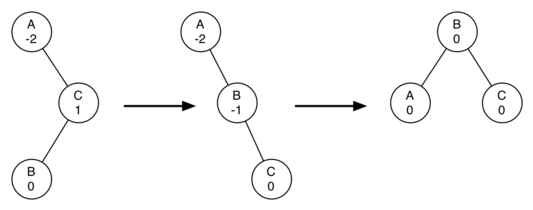

..  Copyright (C)  Brad Miller, David Ranum
    This work is licensed under the Creative Commons Attribution-NonCommercial-ShareAlike 4.0 International License. To view a copy of this license, visit http://creativecommons.org/licenses/by-nc-sa/4.0/.

Implementación de un árbol AVL
~~~~~~~~~~~~~~~~~~~~~~~~~~~~~~

Ahora que hemos demostrado que mantener un árbol AVL en equilibrio va a ser una gran mejora de desempeño, veremos cómo vamos a aumentar el procedimiento para insertar una clave nueva en el árbol. Dado que todas las claves nuevas se insertan en el árbol como nodos hoja y que sabemos que el factor de equilibrio para una hoja nueva es cero, no hay nuevos requisitos para el nodo que se acaba de insertar. Pero una vez que se agrega la hoja nueva, debemos actualizar el factor de equilibrio de su padre. La forma en que esta hoja nueva afecta al factor de equilibrio del padre depende de si el nodo hoja es un hijo izquierdo o un hijo derecho. Si el nuevo nodo es un hijo derecho, el factor de equilibrio del padre se reducirá en uno. Si el nuevo nodo es un hijo izquierdo, entonces el factor de equilibrio del padre se incrementará en uno. Esta relación puede aplicarse recursivamente al abuelo del nuevo nodo, y posiblemente a cada antepasado hasta la raíz del árbol. Dado que se trata de un procedimiento recursivo, examinemos los dos casos base para actualizar los factores de equilibrio:

.. Now that we have demonstrated that keeping an AVL tree in balance is going to be a big performance improvement, let us look at how we will augment the procedure to insert a new key into the tree. Since all new keys are inserted into the tree as leaf nodes and we know that the balance factor for a new leaf is zero, there are no new requirements for the node that was just inserted. But once the new leaf is added we must update the balance factor of its parent. How this new leaf affects the parent’s balance factor depends on whether the leaf node is a left child or a right child. If the new node is a right child the balance factor of the parent will be reduced by one. If the new node is a left child then the balance factor of the parent will be increased by one. This relation can be applied recursively to the grandparent of the new node, and possibly to every ancestor all the way up to the root of the tree. Since this is a recursive procedure let us examine the two base cases for updating balance factors:

-  La llamada recursiva ha llegado a la raíz del árbol.

-  El factor de equilibrio del padre ha sido ajustado a cero. Usted debe convencerse de que una vez que un subárbol tiene un factor de equilibrio cero, entonces el equilibrio de sus nodos ancestrales no cambia.

Implementaremos el árbol AVL como una subclase de ``ArbolBinarioBusqueda``. Para empezar, reescribiremos el método ``_agregar`` y escribiremos un nuevo método auxiliar ``actualizarEquilibrio``. Estos métodos se muestran en el :ref:`Programa 1 <lst_updbal>`. Usted notará que la definición de ``_agregar`` es exactamente la misma que en los árboles binarios de búsqueda simples, excepto porque se han incluido llamadas a ``actualizarEquilibrio`` en las líneas 7 y 13.

.. We will implement the AVL tree as a subclass of ``ArbolBinarioBusqueda``. To begin, we will override the ``_agregar`` method and write a new ``actualizarEquilibrio`` helper method. These methods are shown in :ref:`Listing 1 <lst_updbal>`. You will notice that the definition for ``_agregar`` is exactly the same as in simple binary search trees except for the additions of the calls to ``actualizarEquilibrio`` on lines 7 and 13.

**Programa 1**

.. _lst_updbal:

.. code-block:: python
    
    def _agregar(self,clave,valor,nodoActual):
    	if clave < nodoActual.clave:
    	    if nodoActual.tieneHijoIzquierdo():
    		    self._agregar(clave,valor,nodoActual.hijoIzquierdo)
    	    else:
    		    nodoActual.hijoIzquierdo = NodoArbol(clave,valor,padre=nodoActual)
    		    self.actualizarEquilibrio(nodoActual.hijoIzquierdo)
    	else:
    	    if nodoActual.tieneHijoDerecho():
    		    self._agregar(clave,valor,nodoActual.hijoDerecho)
    	    else:
    		    nodoActual.hijoDerecho = NodoArbol(clave,valor,padre=nodoActual)
    		    self.actualizarEquilibrio(nodoActual.hijoDerecho)		

    def actualizarEquilibrio(self,nodo):
    	if nodo.factorEquilibrio > 1 or nodo.factorEquilibrio < -1:
    	    self.reequilibrar(nodo)    
    	    return
    	if nodo.padre != None:
    	    if nodo.esHijoIzquierdo():
    		    nodo.padre.factorEquilibrio += 1
    	    elif nodo.esHijoDerecho():
    		    nodo.padre.factorEquilibrio -= 1

    	    if nodo.padre.factorEquilibrio != 0:
    		    self.actualizarEquilibrio(nodo.padre)
    		    

El nuevo método ``actualizarEquilibrio`` es donde se realiza la mayor parte del trabajo. Éste implementa el procedimiento recursivo que acabamos de describir. El método ``actualizarEquilibrio`` comprueba primero si el nodo actual está lo suficientemente desequilibrado como para requerir el reequilibrio (línea 16). Si ése es el caso, entonces se realiza el reequilibrio y no se requiere hacer ninguna nueva actualización a los padres. Si el nodo actual no requiere reequilibrio entonces se ajusta el factor de equilibrio del padre. Si el factor de equilibrio del padre no es cero, entonces el algoritmo continúa ascendiendo en el árbol, hacia la raíz, llamando recursivamente a ``actualizarEquilibrio`` con el padre como parámetro. 		    

.. The new ``actualizarEquilibrio`` method is where most of the work is done. This implements the recursive procedure we just described. The ``actualizarEquilibrio`` method first checks to see if the current node is out of balance enough to require rebalancing (line 16). If that is the case then the rebalancing is done and no further updating to parents is required. If the current node does not require rebalancing then the balance factor of the parent is adjusted. If the balance factor of the parent is non-zero then the algorithm continues to work its way up the tree toward the root by recursively calling ``actualizarEquilibrio`` on the parent.

Cuando es necesario reequilibrar el árbol, ¿cómo lo hacemos? El reequilibrio eficiente es la clave para que el árbol AVL funcione bien sin sacrificar el desempeño. Con el fin de reequilibrar un árbol AVL vamos a realizar una o más **rotaciones** en el árbol.

.. When a rebalancing of the tree is necessary, how do we do it? Efficient rebalancing is the key to making the AVL Tree work well without sacrificing performance. In order to bring an AVL Tree back into balance we will perform one or more **rotations** on the tree.

Para entender lo que es una rotación, veamos un ejemplo muy simple. Considere el árbol mostrado en la mitad izquierda de la :ref:`Figura 3 <fig_unbalsimple>`. Este árbol está desequilibrado con un factor de equilibrio de -2. Para equilibrar este árbol usaremos una rotación a la izquierda alrededor del subárbol con raíz en el nodo A.

.. To understand what a rotation is let us look at a very simple example. Consider the tree in the left half of :ref:`Figure 3 <fig_unbalsimple>`. This tree is out of balance with a balance factor of -2. To bring this tree into balance we will use a left rotation around the subtree rooted at node A.

.. _fig_unbalsimple:

.. figure:: Figures/simpleunbalanced.png
   :align: center

   Figura 3: Transformación de un árbol desequilibrado usando una rotación a la izquierda

   Figura 3: Transformación de un árbol desequilibrado usando una rotación a la izquierda

   
Para realizar una rotación a la izquierda, hacemos esencialmente lo siguiente:

.. To perform a left rotation we essentially do the following:

-  Promover el hijo derecho (B) para que sea la raíz del subárbol.

-  Mover la raíz antigua (A) para que sea el hijo izquierdo de la nueva raíz.

-  Si la nueva raíz (B) ya tenía un hijo izquierdo, entonces lo convertimos en el hijo derecho del nuevo hijo izquierdo (A). Nota: Dado que la nueva raíz (B) era el hijo derecho de A, está garantizado que el hijo derecho de A está vacío en este punto. Esto nos permite agregar un nuevo nodo como hijo derecho sin consideraciones adicionales.

A pesar que este procedimiento es conceptualmente bastante sencillo, los detalles del código son un poco complicados ya que tenemos que mover cosas justo en el orden correcto para que todas las propiedades de un Árbol Binario de Búsqueda se conserven. Además debemos asegurarnos de actualizar apropiadamente todos los punteros de los padres.

.. While this procedure is fairly easy in concept, the details of the code are a bit tricky since we need to move things around in just the right order so that all properties of a Binary Search Tree are preserved. Furthermore we need to make sure to update all of the parent pointers appropriately.

Veamos un árbol un poco más complicado para ilustrar la rotación a la derecha. El lado izquierdo de la :ref:`Figura 4 <fig_rightrot1>` muestra un árbol que es pesado a la izquierda y con un factor de equilibrio de 2 en la raíz. Para realizar una rotación a la derecha, hacemos esencialmente lo siguiente:

.. Let's look at a slightly more complicated tree to illustrate the right rotation. The left side of :ref:`Figure 4 <fig_rightrot1>` shows a tree that is left-heavy and with a balance factor of 2 at the root. To perform a right rotation we essentially do the following:

-  Promover el hijo izquierdo (C) para que sea la raíz del subárbol.

-  Mover la raíz antigua (E) para que sea el hijo drecho de la nueva raíz.

-  Si la nueva raíz (C) ya tenía un hijo derecho (D), entonces lo convertimos en el hijo izquierdo del nuevo hijo derecho (E). Nota: Como la nueva raíz (C) era el hijo izquierdo de E, está garantizado que el hijo izquierdo de E está vacío en este punto. Esto nos permite agregar un nuevo nodo como hijo izquierdo sin consideraciones adicionales.

.. _fig_rightrot1:

.. figure:: Figures/rightrotate1.png
  :align: center

  Figura 4: Transformación de un árbol desequilibrado usando una rotación a la derecha

  Figura 4: Transformación de un árbol desequilibrado usando una rotación a la derecha

Veamos el código ahora que usted ha visto las rotaciones y tiene la idea básica de cómo funciona una rotación. El :ref:`Programa 2 <lst_bothrotations>` muestra el código para las rotaciones a la derecha y a la izquierda. En la línea 2 creamos una variable temporal para realizar un seguimiento de la nueva raíz del subárbol. Como dijimos antes, la nueva raíz es el hijo derecho de la raíz anterior. Ahora que se ha almacenado una referencia al hijo derecho en esta variable temporal, reemplazamos el hijo derecho de la raíz antigua con el hijo izquierdo de la nueva.

.. Now that you have seen the rotations and have the basic idea of how a rotation works let us look at the code. :ref:`Listing 2 <lst_bothrotations>` shows the code for both the right and the left rotations. In line 2 we create a temporary variable to keep track of the new root of the subtree. As we said before the new root is the right child of the previous root. Now that a reference to the right child has been stored in this temporary variable we replace the right child of the old root with the left child of the new.

El siguiente paso es ajustar los punteros a los padres de los dos nodos. Si ``nuevaRaiz`` tiene un hijo izquierdo entonces el nuevo padre del hijo izquierdo se convierte en la raíz antigua. Al padre de la nueva raíz se le asigna el padre de la raíz antigua. Si la raíz antigua era la raíz de todo el árbol, debemos asignar la raíz del árbol para que apunte a esta nueva raíz. De lo contrario, si la raíz antigua es un hijo izquierdo, entonces cambiamos al padre del hijo izquierdo para que apunte a la nueva raíz; de lo contrario cambiamos al padre del hijo derecho para que apunte a la nueva raíz. (Líneas 10-13). Finalmente asignamos la nueva raíz como padre de la raíz antigua. Esto es un montón de contabilidad complicada, por lo que lo animamos a rastrear el funcionamiento de esta función mientras mira la :ref:`Figura 3 <fig_unbalsimple>`. El método ``rotarDerecha`` es simétrico a ``rotarIzquierda``, por lo que dejaremos que usted estudie por sí mismo el código de ``rotarDerecha``.

.. The next step is to adjust the parent pointers of the two nodes. If ``nuevaRaiz`` has a left child then the new parent of the left child becomes the old root. The parent of the new root is set to the parent of the old root. If the old root was the root of the entire tree then we must set the root of the tree to point to this new root. Otherwise, if the old root is a left child then we change the parent of the left child to point to the new root; otherwise we change the parent of the right child to point to the new root. (lines 10-13). Finally we set the parent of the old root to be the new root. This is a lot of complicated bookkeeping, so we encourage you to trace through this function while looking at :ref:`Figure 3 <fig_unbalsimple>`. The ``rotarDerecha`` method is symmetrical to ``rotarIzquierda`` so we will leave it to you to study the code for ``rotarDerecha``.

.. _lst_bothrotations:

**Programa 2**

.. code-block:: python

    def rotarIzquierda(self,rotRaiz):
    	nuevaRaiz = rotRaiz.hijoDerecho
    	rotRaiz.hijoDerecho = nuevaRaiz.hijoIzquierdo
    	if nuevaRaiz.hijoIzquierdo != None:
    	    nuevaRaiz.hijoIzquierdo.padre = rotRaiz
    	nuevaRaiz.padre = rotRaiz.padre
    	if rotRaiz.esRaiz():
    	    self.raiz = nuevaRaiz
    	else:
    	    if rotRaiz.esHijoIzquierdo():
    		    rotRaiz.padre.hijoIzquierdo = nuevaRaiz
    	    else:
    	    	rotRaiz.padre.hijoDerecho = nuevaRaiz
    	nuevaRaiz.hijoIzquierdo = rotRaiz
    	rotRaiz.padre = nuevaRaiz
    	rotRaiz.factorEquilibrio = rotRaiz.factorEquilibrio + 1 - min(nuevaRaiz.factorEquilibrio, 0)
    	nuevaRaiz.factorEquilibrio = nuevaRaiz.factorEquilibrio + 1 + max(rotRaiz.factorEquilibrio, 0)
			      
			      
.. highlight:: python
  :linenothreshold: 500

Finalmente, las líneas 16-17 requieren cierta explicación. En estas dos líneas actualizamos los factores de equilibrio de las raíces vieja y nueva. Puesto que todos los otros movimientos están cambiando de lugar subárboles completos, los factores de equilibrio de todos los otros nodos no son afectados por la rotación. Pero, ¿cómo podemos actualizar los factores de equilibrio sin recalcular completamente las alturas de los nuevos subárboles? La siguiente derivación debería convencerlo a usted de que estas líneas son correctas.

.. Finally, lines 16-17 require some explanation. In these two lines we update the balance factors of the old and the new root. Since all the other moves are moving entire subtrees around the balance factors of all other nodes are unaffected by the rotation. But how can we update the balance factors without completely recalculating the heights of the new subtrees? The following derivation should convince you that these lines are correct.

.. _fig_bfderive:

.. figure:: Figures/bfderive.png
   :align: center

   Figura 5: Una rotación a la izquierda

   Figura 5: Una rotación a la izquierda

La :ref:`Figura 5 <fig_bfderive>` muestra una rotación a la izquierda. B y D son los nodos pivotales y A, C, E son sus subárboles. Sea :math:`h_x` la altura de un subárbol particular con raíz en el nodo :math:`x`. Por definición sabemos lo siguiente:

.. :ref:`Figure 5 <fig_bfderive>` shows a left rotation. B and D are the pivotal nodes and A, C, E are their subtrees. Let :math:`h_x` denote the height of a particular subtree rooted at node :math:`x`. By definition we know the following:

.. math::

  nuevoEquilibrio(B) = h_A - h_C \\
  viejoEquilibrio(B) = h_A - h_D

Pero sabemos que la altura antigua de D también puede estar dada por :math:`1 + max (h_C, h_E)`, es decir, la altura de D es uno más la altura máxima entre aquéllas de sus dos hijos. Recuerde que :math:`h_C` y :math:`h_E` no han cambiado. Por lo tanto, sustituyamos esto en la segunda ecuación, lo que nos da

.. But we know that the old height of D can also be given by :math:`1 + max(h_C,h_E)`, that is, the height of D is one more than the maximum height of its two children. Remember that :math:`h_c` and :math:`h_E` hav not changed. So, let us substitute that in to the second equation, which gives us 

:math:`viejoEquilibrio(B) = h_A - (1 + max(h_C,h_E))` 

y luego restamos las dos ecuaciones. Los siguientes pasos hacen la resta y usan ciertas operaciones algebraicas para simplificar la ecuación de :math:`nuevoEquilibrio(B)`.

.. and then subtract the two equations. The following steps do the subtraction and use some algebra to simplify the equation for :math:`nuevoEquilibrio(B)`.

.. math::

   nuevoEquilibrio(B) - viejoEquilibrio(B) = h_A - h_C - (h_A - (1 + max(h_C,h_E))) \\
   nuevoEquilibrio(B) - viejoEquilibrio(B) = h_A - h_C - h_A + (1 + max(h_C,h_E)) \\
   nuevoEquilibrio(B) - viejoEquilibrio(B) = h_A  - h_A + 1 + max(h_C,h_E) - h_C  \\
   nuevoEquilibrio(B) - viejoEquilibrio(B) =  1 + max(h_C,h_E) - h_C 

A continuación vamos a mover :math:`viejoEquilibrio(B)` al lado derecho de la ecuación y haremos uso del hecho de que :math:`max(a,b) -c = max(a-c, b-c)`.

.. Next we will move :math:`viejoEquilibrio(B)` to the right hand side of the equation and make use of the fact that :math:`max(a,b)-c = max(a-c, b-c)`.

.. math::

   nuevoEquilibrio(B) = viejoEquilibrio(B) + 1 + max(h_C - h_C ,h_E - h_C) \\

Pero, :math:`h_E - h_C` es lo mismo que :math:`-viejoEquilibrio(D)`. Así que podemos usar otra identidad que dice que :math:`max(-a,-b) = -min(a,b)`. Así entonces, podemos terminar nuestra derivación de :math:`nuevoEquilibrio(B)` con los siguientes pasos:

.. But, :math:`h_E - h_C` is the same as :math:`-viejoEquilibrio(D)`. So we can use another identity that says :math:`max(-a,-b) = -min(a,b)`. So we can finish our derivation of :math:`nuevoEquilibrio(B)` with the following steps:

.. math::

   nuevoEquilibrio(B) = viejoEquilibrio(B) + 1 + max(0, -viejoEquilibrio(D)) \\
   nuevoEquilibrio(B) = viejoEquilibrio(B) + 1 - min(0, viejoEquilibrio(D)) \\

Ahora tenemos todas las partes en términos que reconocemos fácilmente. Si recordamos que B es ``rotRaiz`` y D es ``nuevaRaiz`` entonces podemos ver que la ecuación anterior corresponde exactamente a la instrucción en la línea 16, o:

.. Now we have all of the parts in terms that we readily know. If we remember that B is ``rotRaiz`` and D is ``nuevaRaiz`` then we can see this corresponds exactly to the statement on line 16, or:

::

    rotRaiz.factorEquilibrio = rotRaiz.factorEquilibrio + 1 - min(0,nuevaRaiz.factorEquilibrio)

Una derivación similar nos da la ecuación para el nodo actualizado D, así como los factores de equilibrio después de una rotación a la derecha. Los dejamos como ejercicios para usted.

.. A similar derivation gives us the equation for the updated node D, as well as the balance factors after a right rotation. We leave these as exercises for you.

Ahora usted podría pensar que hemos terminado. Sabemos cómo hacer nuestras rotaciones a izquierda y derecha, y sabemos cuándo debemos hacer una rotación a la izquierda o a la derecha, pero eche un vistazo a la :ref:`Figura 6 <fig_hardrotate>`. Dado que el nodo A tiene un factor de equilibrio de -2, deberíamos hacer una rotación a la izquierda. Pero, ¿qué sucede cuando hacemos la rotación a la izquierda alrededor de A?

.. Now you might think that we are done. We know how to do our left and right rotations, and we know when we should do a left or right rotation, but take a look at :ref:`Figure 6 <fig_hardrotate>`. Since node A has a balance factor of -2 we should do a left rotation. But, what happens when we do the left rotation around A?

.. _fig_hardrotate:

.. figure:: Figures/hardunbalanced.png
   :align: center

   Figura 6: Un árbol desequilibrado que es más difícil de equilibrar

   Figura 6: Un árbol desequilibrado que es más difícil de equilibrar

La :ref:`Figura 7 <fig_badrotate>` nos muestra que, después de la rotación a la izquierda, estamos ahora desequilibrados en la otra dirección. Si hacemos una rotación a la derecha para corregir la situación, estamos de regreso en la situación con que empezamos.

.. :ref:`Figure 7 <fig_badrotate>` shows us that after the left rotation we are now out of balance the other way. If we do a right rotation to correct the situation we are right back where we started.

.. _fig_badrotate:

.. figure:: Figures/badrotate.png
   :align: center

   Figura 7: Después de una rotación a la izquierda el árbol está desequilibrado en la otra dirección

   Figura 7: Después de una rotación a la izquierda el árbol está desequilibrado en la otra dirección

Para corregir este problema debemos utilizar el siguiente conjunto de reglas:

.. To correct this problem we must use the following set of rules:

-  Si un subárbol necesita una rotación a la izquierda para equilibrarlo, compruebe primero el factor de equilibrio del hijo derecho. Si el hijo derecho es pesado a la izquierda entonces aplique una rotación a la derecha al hijo derecho, seguida por la rotación a la izquierda original.

-  Si un subárbol necesita una rotación a la derecha para equilibrarlo, compruebe primero el factor de equilibrio del hijo izquierdo. Si el hijo izquierdo es pesado a la derecha, aplique una rotación a la izquierda al hijo izquierdo, seguida por la rotación a la derecha original.

La :ref:`Figura 8 <fig_rotatelr>` muestra cómo estas reglas resuelven el dilema que encontramos en la :ref:`Figura 6 <fig_hardrotate>` y en la :ref:`Figura 7 <fig_badrotate>`. Comenzar con una rotación a la derecha alrededor del nodo C pone el árbol en una posición en la que la rotación a la izquierda alrededor de A reequilibrará el subárbol completo.

.. :ref:`Figure 8 <fig_rotatelr>` shows how these rules solve the dilemma we encountered in :ref:`Figure 6 <fig_hardrotate>` and :ref:`Figure 7 <fig_badrotate>`. Starting with a right rotation around node C puts the tree in a position where the left rotation around A brings the entire subtree back into balance.

.. _fig_rotatelr:

   Figura 8: Una rotación a la derecha seguida de una rotación a la izquierda

   Figura 8: Una rotación a la derecha seguida de una rotación a la izquierda

El código que implementa estas reglas se puede encontrar en nuestro método ``reequilibrar``, que se muestra en el :ref:`Programa 3 <lst_rebalance>`. La regla número 1 desde arriba es implementada por la instrucción ``if`` empezando en la línea 2. La regla número 2 es implementada por la instrucción ``elif`` empezando en la línea 8.

.. The code that implements these rules can be found in our ``rebalance`` method, which is shown in :ref:`Listing 3 <lst_rebalance>`. Rule number 1 from above is implemented by the ``if`` statement starting on line 2. Rule number 2 is implemented by the ``elif`` statement starting on line 8.

.. _lst_rebalance:

**Programa 3**

.. highlight:: python
  :linenothreshold: 5

::

    def reequilibrar(self,nodo):
      if nodo.factorEquilibrio < 0:
	     if nodo.hijoDerecho.factorEquilibrio > 0:
	        self.rotarDerecha(nodo.hijoDerecho)
	        self.rotarIzquierda(nodo)
	     else:
	        self.rotarIzquierda(nodo)
      elif nodo.factorEquilibrio > 0:
	     if nodo.hijoIzquierdo.factorEquilibrio < 0:
	        self.rotarIzquierda(nodo.hijoIzquierdo)
	        self.rotarDerecha(nodo)
	     else:
	        self.rotarDerecha(nodo)

.. highlight:: python
   :linenothreshold: 500

Las :ref:`preguntas de discusión <tree_discuss>` le dan a usted la oportunidad de reequilibrar un árbol que requiere una rotación a la izquierda seguida de una rotación a la derecha. Además, las preguntas de discusión le brindan la oportunidad de reequilibrar algunos árboles que son un poco más complejos que el árbol de la :ref:`Figura 8 <fig_rotatelr>`.

.. The :ref:`discussion questions <tree_discuss>` provide you the opportunity to rebalance a tree that requires a left rotation followed by a right. In addition the discussion questions provide you with the opportunity to rebalance some trees that are a little more complex than the tree in :ref:`Figure 8 <fig_rotatelr>`.

Manteniendo el árbol equilibrado en todo momento, podemos asegurar que el método ``obtener`` se ejecutará en un tiempo del orden de :math:`O(log_2(n))`. Pero la pregunta es ¿a qué costo para nuestro método ``agregar``? Descompongamos esto en las operaciones realizadas por ``agregar``. Puesto que un nuevo nodo se inserta como una hoja, la actualización de los factores de equilibrio de todos los padres requerirá un máximo de :math:`log_2(n)` operaciones, una por cada nivel del árbol. Si un subárbol está desequilibrado, se requiere un máximo de dos rotaciones para reequilibrarlo el árbol. No obstante, cada una de las rotaciones funciona en tiempo :math:`O(1)`, así que incluso nuestra operación ``agregar`` seguirá siendo :math:`O(log_2(n))`.

.. By keeping the tree in balance at all times, we can ensure that the ``get`` method will run in order :math:`O(log_2(n))` time. But the question is at what cost to our ``put`` method? Let us break this down into the operations performed by ``put``. Since a new node is inserted as a leaf, updating the balance factors of all the parents will require a maximum of :math:`log_2(n)` operations, one for each level of the tree. If a subtree is found to be out of balance a maximum of two rotations are required to bring the tree back into balance. But, each of the rotations works in :math:`O(1)` time, so even our ``put`` operation remains :math:`O(log_2(n))`.

En este punto hemos implementado un árbol AVL funcional, a menos que usted necesite la capacidad de eliminar un nodo. Dejamos la eliminación del nodo y su posterior actualización y reequilibrio como ejercicio para usted.

.. At this point we have implemented a functional AVL-Tree, unless you need the ability to delete a node. We leave the deletion of the node and subsequent updating and rebalancing as an exercise for you.
