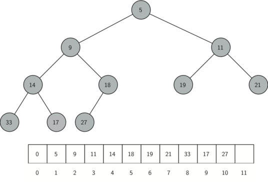
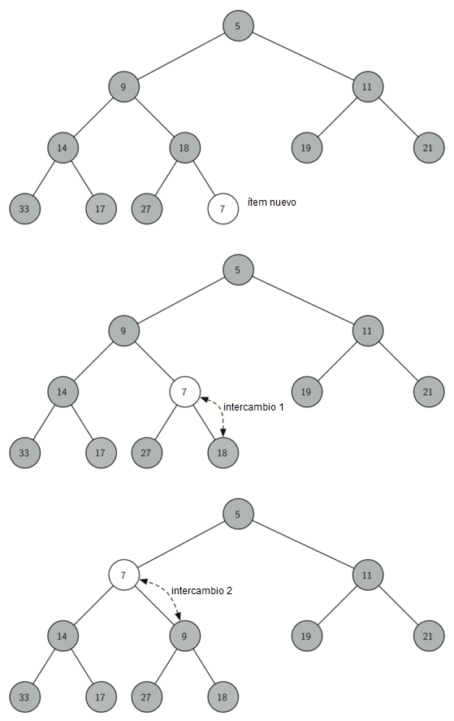
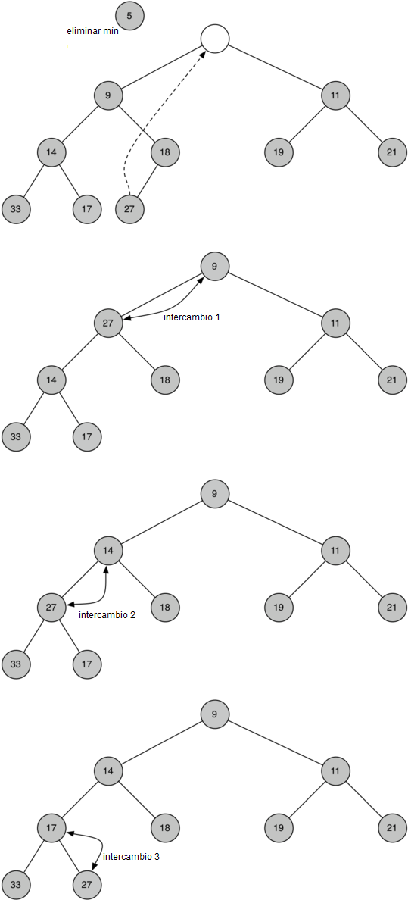
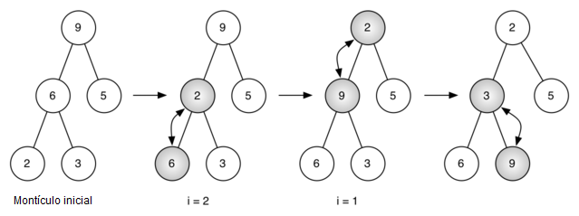

..  Copyright (C)  Brad Miller, David Ranum
    This work is licensed under the Creative Commons Attribution-NonCommercial-ShareAlike 4.0 International License. To view a copy of this license, visit http://creativecommons.org/licenses/by-nc-sa/4.0/.

Implementación de un montículo binario
~~~~~~~~~~~~~~~~~~~~~~~~~~~~~~~~~~~~~~

La propiedad de estructura
^^^^^^^^^^^^^^^^^^^^^^^^^^

Para lograr que nuestro montículo funcione eficientemente, aprovecharemos la naturaleza logarítmica del árbol binario para representar nuestro montículo. Para garantizar un rendimiento logarítmico, debemos mantener a nuestro árbol equilibrado. Un árbol binario equilibrado tiene aproximadamente el mismo número de nodos en los subárboles izquierdo y derecho de la raíz. En nuestra implementación del montículo mantenemos al árbol equilibrado creando un **árbol binario completo**. Un árbol binario completo es un árbol en el que cada nivel tiene todos sus nodos. La excepción a esta regla es el nivel inferior del árbol, el cual llenamos de izquierda a derecha. La :ref:`Figura 1 <fig_comptree>` muestra un ejemplo de un árbol binario completo.

.. In order to make our heap work efficiently, we will take advantage of the logarithmic nature of the binary tree to represent our heap. In order to guarantee logarithmic performance, we must keep our tree balanced. A balanced binary tree has roughly the same number of nodes in the left and right subtrees of the root. In our heap implementation we keep the tree balanced by creating a **complete binary tree**. A complete binary tree is a tree in which each level has all of its nodes. The exception to this is the bottom level of the tree, which we fill in from left to right. :ref:`Figure 1 <fig_comptree>` shows an example of a complete binary tree.

.. _fig_comptree:

.. figure:: Figures/compTree.png
   :align: center
   :alt: image

   Figura 1: Un árbol binario completo

   Figura 1: Un árbol binario completo

Otra propiedad interesante de un árbol completo es que podemos representarlo usando una sola lista. No necesitamos usar nodos y referencias ni incluso listas de listas. Debido a que el árbol está completo, el hijo izquierdo de un padre (en la posición :math:`p`) es el nodo que se encuentra en la posición :math:`2p` en la lista. Del mismo modo, el hijo derecho del padre está en la posición :math:`2p + 1` en la lista. Para encontrar el padre de cualquier nodo en el árbol, podemos simplemente usar la división entera de Python. Dado que un nodo esté en la posición :math:`n` en la lista, el padre está en la posición :math:`n/2`. La :ref:`Figura 2 <fig_heapOrder>` muestra un árbol binario completo junto con la representación de lista para el árbol. Note la relación :math:`2p` y :math:`2p+1` entre el padre y los hijos. La representación de lista para el árbol, junto con la propiedad de estructura completa, nos permite recorrer eficientemente un árbol binario completo usando sólo unas cuantas operaciones matemáticas simples. Veremos que esto también conduce a una implementación eficiente de nuestro montículo binario.

.. Another interesting property of a complete tree is that we can represent it using a single list. We do not need to use nodes and references or even lists of lists. Because the tree is complete, the left child of a parent (at position :math:`p`) is the node that is found in position :math:`2p` in the list. Similarly, the right child of the parent is at position :math:`2p + 1` in the list. To find the parent of any node in the tree, we can simply use Python’s integer division. Given that a node is at position :math:`n` in the list, the parent is at position :math:`n/2`. :ref:`Figure 2 <fig_heapOrder>` shows a complete binary tree and also gives the list representation of the tree.  Note the :math:`2p` and :math:`2p+1` relationship between parent and children. The list representation of the tree, along with the full structure property, allows us to efficiently traverse a complete binary tree using only a few simple mathematical operations. We will see that this also leads to an efficient implementation of our binary heap.

La propiedad de orden del montículo
^^^^^^^^^^^^^^^^^^^^^^^^^^^^^^^^^^^

El método que usaremos para almacenar ítems en un montículo depende de mantener la propiedad de orden del montículo. La **propiedad de orden del montículo** es la siguiente: En un montículo, para cada nodo :math:`x` con padre :math:`p`, la clave en :math:`p` es menor o igual a la clave en :math:`x`. La :ref:`Figura 2 <fig_heapOrder>` también ilustra un árbol binario completo que posee la propiedad de orden del montículo.

.. The method that we will use to store items in a heap relies on maintaining the heap order property. The **heap order property** is as follows: In a heap, for every node :math:`x` with parent :math:`p`, the key in :math:`p` is smaller than or equal to the key in :math:`x`. :ref:`Figure 2 <fig_heapOrder>` also illustrates a complete binary tree that has the heap order property.

.. _fig_heapOrder:

   Figura 2: Un árbol binario completo, junto con su representación de lista

   Figura 2: Un árbol binario completo, junto con su representación de lista

Operaciones con montículos
^^^^^^^^^^^^^^^^^^^^^^^^^^

Comenzaremos nuestra implementación de un montículo binario con el constructor. Puesto que todo el montículo binario puede ser representado por una sola lista, todo lo que el constructor hará es inicializar la lista y un atributo ``tamanoActual`` para realizar un seguimiento del tamaño actual del montículo. El :ref:`Programa 1 <lst_heap1a>` muestra el código en Python para el constructor. Usted notará que un montículo binario vacío tiene un cero solo como primer elemento de ``listaMonticulo`` y que este cero no se usa, pero está ahí para que la división entera simple pueda usarse en métodos posteriores.

.. We will begin our implementation of a binary heap with the constructor. Since the entire binary heap can be represented by a single list, all the constructor will do is initialize the list and an attribute ``tamanoActual`` to keep track of the current size of the heap. :ref:`Listing 1 <lst_heap1a>` shows the Python code for the constructor. You will notice that an empty binary heap has a single zero as the first element of ``listaMonticulo`` and that this zero is not used, but is there so that simple integer division can be used in later methods.

.. _lst_heap1a:

**Programa 1**

::
    
    class MonticuloBinario:
        def __init__(self):
            self.listaMonticulo = [0]
            self.tamanoActual = 0

El siguiente método que implementaremos es ``insertar``. La manera más fácil y eficiente de agregar un ítem a una lista es simplemente añadir el elemento al final de la lista. La buena noticia respecto a la inserción al final de la lista es que garantiza que mantendremos la propiedad de estructura completa del árbol. La malas noticia sobre ella es que muy probablemente violaremos la propiedad de estructura del montículo. Sin embargo, es posible escribir un método que nos permitirá recuperar la propiedad de estructura del montículo comparando el ítem recién agregado con su padre. Si el ítem recién agregado es menor que su padre, entonces podemos intercambiar el ítem con su padre. La :ref:`Figura 2 <fig_percUp>` muestra la serie de intercambios necesarios para infiltrar hacia arriba el ítem recién agregado hasta su posición correcta en el árbol.

.. The next method we will implement is ``insert``. The easiest, and most efficient, way to add an item to a list is to simply append the item to the end of the list. The good news about appending is that it guarantees that we will maintain the complete tree property. The bad news about appending is that we will very likely violate the heap structure property. However, it is possible to write a method that will allow us to regain the heap structure property by comparing the newly added item with its parent. If the newly added item is less than its parent, then we can swap the item with its parent. :ref:`Figure 2 <fig_percUp>` shows the series of swaps needed to percolate the newly added item up to its proper position in the tree.

.. _fig_percUp:

   Figura 2: Infiltración del nuevo nodo hasta su posición correcta

   Figura 2: Infiltración del nuevo nodo hasta su posición correcta

Tenga en cuenta que cuando infiltramos un ítem hacia arriba, estamos restaurando la propiedad de montículo entre el ítem recién agregado y el padre. También estamos preservando la propiedad de montículo para cualesquiera hermanos. Por supuesto, si el ítem recién agregado es muy pequeño, es posible que tengamos que cambiarlo a otro nivel superior. De hecho, es posible que tengamos que seguir haciendo intercambios hasta llegar a la parte superior del árbol. El :ref:`Programa 2 <lst_heap2>` muestra el método ``infiltArriba``, el cual infiltra un nuevo ítem hacia arriba en el árbol hasta donde sea necesario para mantener la propiedad de montículo. Es aquí donde nuestro elemento desperdiciado en ``listaMonticulo`` resulta importante. Observe que podemos calcular el padre de cualquier nodo utilizando la división entera simple. El padre del nodo actual se puede calcular dividiendo el índice del nodo actual por 2.

.. Notice that when we percolate an item up, we are restoring the heap property between the newly added item and the parent. We are also preserving the heap property for any siblings. Of course, if the newly added item is very small, we may still need to swap it up another level. In fact, we may need to keep swapping until we get to the top of the tree. :ref:`Listing 2 <lst_heap2>` shows the ``infiltArriba`` method, which percolates a new item as far up in the tree as it needs to go to maintain the heap property. Here is where our wasted element in ``listaMonticulo`` is important. Notice that we can compute the parent of any node by using simple integer division. The parent of the current node can be computed by dividing the index of the current node by 2.

Ahora estamos listos para escribir el método ``insertar`` (ver el :ref:`Programa 3 <lst_heap3>`). La mayor parte del trabajo en el método ``insertar`` es hecho realmente por ``infiltArriba``. Una vez que se añade un nuevo ítem al árbol (al final de su lista), ``infiltArriba`` se hace cargo y posiciona el nuevo ítem apropiadamente.

.. We are now ready to write the ``insert`` method (see :ref:`Listing 3 <lst_heap3>`). Most of the work in the ``insert`` method is really done by ``infiltArriba``. Once a new item is appended to the tree, ``infiltArriba`` takes over and positions the new item properly.

.. _lst_heap2:

**Programa 2**

::

    def infiltArriba(self,i):
        while i // 2 > 0:
          if self.listaMonticulo[i] < self.listaMonticulo[i // 2]:
             tmp = self.listaMonticulo[i // 2]
             self.listaMonticulo[i // 2] = self.listaMonticulo[i]
             self.listaMonticulo[i] = tmp
          i = i // 2

.. _lst_heap3:

**Programa 3**

::

    def insertar(self,k):
        self.listaMonticulo.append(k)
        self.tamanoActual = self.tamanoActual + 1
        self.infiltArriba(self.tamanoActual)
        
Con el método ``insertar`` correctamente definido, ahora podemos examinar el método ``eliminarMin``. La propiedad de montículo requiere que la raíz del árbol sea el ítem más pequeño del árbol, encontrar el ítem mínimo es fácil. La parte difícil de ``eliminarMin`` es restaurar el cumplimiento total de la estructura de montículo y las propiedades de orden del montículo después de que se haya eliminado la raíz. Podemos restaurar nuestro montículo en dos pasos. Primero, restauraremos el ítem raíz tomando el último ítem de la lista y moviéndolo a la posición de la raíz. Mover el último ítem preserva nuestra propiedad de estructura de montículo. Sin embargo, probablemente hemos destruido la propiedad de orden de montículo de nuestro montículo binario. En segundo lugar, restauraremos la propiedad de orden de montículo empujando el nuevo nodo raíz hacia abajo del árbol hasta su posición correcta. La :ref:`Figura 3 <fig_percDown>` muestra la serie de intercambios necesarios para mover el nuevo nodo raíz a su posición correcta en el montículo.     

.. With the ``insert`` method properly defined, we can now look at the ``eliminarMin`` method. Since the heap property requires that the root of the tree be the smallest item in the tree, finding the minimum item is easy. The hard part of ``eliminarMin`` is restoring full compliance with the heap structure and heap order properties after the root has been removed. We can restore our heap in two steps. First, we will restore the root item by taking the last item in the list and moving it to the root position. Moving the last item maintains our heap structure property. However, we have probably destroyed the heap order property of our binary heap. Second, we will restore the heap order property by pushing the new root node down the tree to its proper position. :ref:`Figure 3 <fig_percDown>` shows the series of swaps needed to move the new root node to its proper position in the heap.

.. _fig_percdown:

   Figura 3: Infiltración del nodo raíz hacia abajo en el árbol

   Figura 3: Infiltración del nodo raíz hacia abajo en el árbol

Para mantener la propiedad de orden del montículo, todo lo que necesitamos hacer es intercambiar la raíz con su hijo que sea menor que la raíz. Después del intercambio inicial, podemos repetir el proceso de intercambio con un nodo y sus hijos hasta que el nodo sea intercambiado a una posición en el árbol donde ya sea menor que ambos. El código para infiltrar un nodo hacia abajo en el árbol se encuentra en los métodos ``infiltAbajo`` e ``hijoMin`` en el :ref:`Programa 4 <lst_heap4>`.

.. In order to maintain the heap order property, all we need to do is swap the root with its smallest child less than the root. After the initial swap, we may repeat the swapping process with a node and its children until the node is swapped into a position on the tree where it is already less than both children. The code for percolating a node down the tree is found in the ``infiltAbajo`` and ``hijoMin`` methods in :ref:`Listing 4 <lst_heap4>`.

.. _lst_heap4:

**Programa 4**

::

    def infiltAbajo(self,i):
        while (i * 2) <= self.tamanoActual:
            hm = self.hijoMin(i)
            if self.listaMonticulo[i] > self.listaMonticulo[hm]:
                tmp = self.listaMonticulo[i]
                self.listaMonticulo[i] = self.listaMonticulo[hm]
                self.listaMonticulo[hm] = tmp
            i = hm

    def hijoMin(self,i):
        if i * 2 + 1 > self.tamanoActual:
            return i * 2
        else:
            if self.listaMonticulo[i*2] < self.listaMonticulo[i*2+1]:
                return i * 2
            else:
                return i * 2 + 1

El código para la operación ``eliminarMin`` está en el :ref:`Programa 5 <lst_heap5>`. Tenga en cuenta que una vez más el trabajo duro es manejado por una función de ayuda, en este caso ``infiltAbajo``.

.. The code for the ``eliminarMin`` operation is in :ref:`Listing 5 <lst_heap5>`. Note that once again the hard work is handled by a helper function, in this case ``infiltAbajo``.

.. _lst_heap5:

**Programa 5**

::

    def eliminarMin(self):
        valorSacado = self.listaMonticulo[1]
        self.listaMonticulo[1] = self.listaMonticulo[self.tamanoActual]
        self.tamanoActual = self.tamanoActual - 1
        self.listaMonticulo.pop()
        self.infiltAbajo(1)
        return valorSacado

Para terminar nuestra discusión sobre montículos binarios, vamos a mirar un método para construir un montículo completo a partir de una lista de claves. El primer método en el que usted podría pensar puede ser como el siguiente. Dada una lista de claves, usted podría crear un montículo fácilmente insertando cada clave una a la vez. Puesto que usted está comenzando con una lista de un ítem, la lista está ordenada y podría usar la búsqueda binaria para encontrar la posición correcta para insertar la clave siguiente a un costo de aproximadamente :math:`O(\log{n})`. Sin embargo, recuerde que la inserción de un elemento en el centro de la lista puede requerir :math:`O(n)` operaciones para desplazar el resto de la lista con el fin de dar cabida a la nueva clave. Por lo tanto, insertar :math:`n` claves en el montículo requeriría un total de :math:`O(n\log{n})` operaciones. No obstante, si empezamos con una lista completa, entonces podemos construir todo el montículo en :math:`O(n)` operaciones. El :ref:`Programa 6 <lst_heap6>` muestra el código para construir todo el montículo.

.. To finish our discussion of binary heaps, we will look at a method to build an entire heap from a list of keys. The first method you might think of may be like the following. Given a list of keys, you could easily build a heap by inserting each key one at a time. Since you are starting with a list of one item, the list is sorted and you could use binary search to find the right position to insert the next key at a cost of approximately :math:`O(\log{n})` operations. However, remember that inserting an item in the middle of the list may require :math:`O(n)` operations to shift the rest of the list over to make room for the new key. Therefore, to insert :math:`n` keys into the heap would require a total of :math:`O(n \log{n})` operations. However, if we start with an entire list then we can build the whole heap in :math:`O(n)` operations. :ref:`Listing 6 <lst_heap6>` shows the code to build the entire heap.

.. _lst_heap6:

**Programa 6**

::

    def construirMonticulo(self,unaLista):
        i = len(unaLista) // 2
        self.tamanoActual = len(unaLista)
        self.listaMonticulo = [0] + unaLista[:]
        while (i > 0):
            self.infiltAbajo(i)
            i = i - 1

.. _fig_buildheap:

   Figura 4: Construcción de un montículo a partir de la lista [9, 6, 5, 2, 3]

   Figura 4: Construcción de un montículo a partir de la lista [9, 6, 5, 2, 3]

La :ref:`Figura 4 <fig_buildheap>` muestra los intercambios que el método ``construirMonticulo`` hace a medida que mueve los nodos en un árbol inicial de [9, 6, 5, 2, 3] a sus posiciones correctas. Aunque comenzamos en la mitad del árbol y nos devolvemos hacia la raíz, el método ``infiltAbajo`` asegura que el hijo más grande siempre es desplazado hacia abajo en el árbol. Debido a que el montículo es un árbol binario completo, cualesquiera nodos más allá del punto medio será hojas y por lo tanto no tienen hijos. Observe que cuando ``i = 1``, ​​estamos infiltrando hacia abajo desde la raíz del árbol, por lo que esto puede requerir múltiples intercambios. Como se puede ver en los árboles de más a la derecha en la :ref:`Figura 4 <fig_buildheap>`, primero es retirado el 9 de la posición raíz, pero después que el 9 se mueve un nivel hacia abajo en el árbol, ``infiltAbajo`` asegura que revisemos el siguiente conjunto de hijos más abajo en el árbol para asegurarnos de que el 9 se empuje tan abajo como pueda ir. En este caso resulta un segundo intercambio con 3. Ahora que el 9 se ha movido al nivel más bajo del árbol, no se pueden hacer más intercambios. Es útil comparar la representación de lista de esta serie de intercambios como se muestra en la :ref:`Figura 4 <fig_buildheap>` con la representación de árbol.

.. :ref:`Figure 4 <fig_buildheap>` shows the swaps that the ``construirMonticulo`` method makes as it moves the nodes in an initial tree of [9, 6, 5, 2, 3] into their proper positions. Although we start out in the middle of the tree and work our way back toward the root, the ``infiltAbajo`` method ensures that the largest child is always moved down the tree. Because the heap is a complete binary tree, any nodes past the halfway point will be leaves and therefore have no children. Notice that when ``i=1``, we are percolating down from the root of the tree, so this may require multiple swaps. As you can see in the rightmost two trees of :ref:`Figure 4 <fig_buildheap>`, first the 9 is moved out of the root position, but after 9 is moved down one level in the tree, ``infiltAbajo`` ensures that we check the next set of children farther down in the tree to ensure that it is pushed as low as it can go. In this case it results in a second swap with 3. Now that 9 has been moved to the lowest level of the tree, no further swapping can be done. It is useful to compare the list representation of this series of swaps as shown in :ref:`Figure 4 <fig_buildheap>` with the tree representation.

::

          i = 2  [0, 9, 5, 6, 2, 3]
          i = 1  [0, 9, 2, 6, 5, 3]
          i = 0  [0, 2, 3, 6, 5, 9]
          

La implementacón completa del montículo binario se puede ver en el ActiveCode 1.

.. The complete binary heap implementation can be seen in ActiveCode 1.

.. activecode:: completeheap
   :caption: El ejemplo completo de un montículo binario
   :hidecode:
   
   class MonticuloBinario:
       def __init__(self):
           self.listaMonticulo = [0]
           self.tamanoActual = 0

       def infiltArriba(self,i):
           while i // 2 > 0:
             if self.listaMonticulo[i] < self.listaMonticulo[i // 2]:
                tmp = self.listaMonticulo[i // 2]
                self.listaMonticulo[i // 2] = self.listaMonticulo[i]
                self.listaMonticulo[i] = tmp
             i = i // 2

       def insertar(self,k):
         self.listaMonticulo.append(k)
         self.tamanoActual = self.tamanoActual + 1
         self.infiltArriba(self.tamanoActual)

       def infiltAbajo(self,i):
         while (i * 2) <= self.tamanoActual:
             hm = self.hijoMin(i)
             if self.listaMonticulo[i] > self.listaMonticulo[hm]:
                 tmp = self.listaMonticulo[i]
                 self.listaMonticulo[i] = self.listaMonticulo[hm]
                 self.listaMonticulo[hm] = tmp
             i = hm

       def hijoMin(self,i):
         if i * 2 + 1 > self.tamanoActual:
             return i * 2
         else:
             if self.listaMonticulo[i*2] < self.listaMonticulo[i*2+1]:
                 return i * 2
             else:
                 return i * 2 + 1

       def eliminarMin(self):
         valorSacado = self.listaMonticulo[1]
         self.listaMonticulo[1] = self.listaMonticulo[self.tamanoActual]
         self.tamanoActual = self.tamanoActual - 1
         self.listaMonticulo.pop()
         self.infiltAbajo(1)
         return valorSacado

       def construirMonticulo(self,unaLista):
         i = len(unaLista) // 2
         self.tamanoActual = len(unaLista)
         self.listaMonticulo = [0] + unaLista[:]
         while (i > 0):
             self.infiltAbajo(i)
             i = i - 1

   miMonticulo = MonticuloBinario()
   miMonticulo.construirMonticulo([9,5,6,2,3])

   print(miMonticulo.eliminarMin())
   print(miMonticulo.eliminarMin())
   print(miMonticulo.eliminarMin())
   print(miMonticulo.eliminarMin())
   print(miMonticulo.eliminarMin())
   
   
   
La afirmación de que podemos construir el montículo en :math:`O(n)` puede parecer un poco misteriosa al principio, y una prueba está más allá del alcance de este libro. Sin embargo, la clave para entender que usted puede construir el montículo en :math:`O(n)` es recordar que el factor :math:`\log{n}` se deriva de la altura del árbol. Para la mayor parte del trabajo en ``construirMonticulo``, el árbol es más bajo que :math:`\log{n}`.

.. The assertion that we can build the heap in :math:`O(n)` may seem a bit mysterious at first, and a proof is beyond the scope of this book. However, the key to understanding that you can build the heap in :math:`O(n)` is to remember that the :math:`\log{n}` factor is derived from the height of the tree. For most of the work in ``construirMonticulo``, the tree is shorter than :math:`\log{n}`.

Usando el hecho de que usted puede construir un montículo a partir de una lista en tiempo :math:`O(n)`, usted construirá, como ejercicio al final de este capítulo, un algoritmo de ordenamiento que use un montículo y ordene una lista en :math:`O(n\log{n}))`.

.. Using the fact that you can build a heap from a list in :math:`O(n)` time, you will construct a sorting algorithm that uses a heap and sorts a list in :math:`O(n\log{n}))` as an exercise at the end of this chapter.
