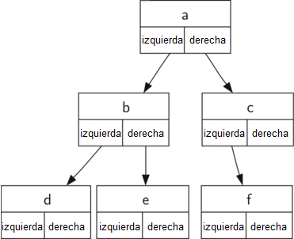

..  Copyright (C)  Brad Miller, David Ranum
    This work is licensed under the Creative Commons Attribution-NonCommercial-ShareAlike 4.0 International License. To view a copy of this license, visit http://creativecommons.org/licenses/by-nc-sa/4.0/.

Nodos y referencias
~~~~~~~~~~~~~~~~~~~

Nuestro segundo método para representar un árbol utiliza nodos y referencias. En este caso definiremos una clase que tiene atributos para el valor raíz, así como para los subárboles izquierdo y derecho. Dado que esta representación sigue más de cerca el paradigma de programación orientado a objetos, continuaremos usando esta representación para el resto del capítulo.

.. Our second method to represent a tree uses nodes and references. In this case we will define a class that has attributes for the root value, as well as the left and right subtrees. Since this representation more closely follows the object-oriented programming paradigm, we will continue to use this representation for the remainder of the chapter.

Usando nodos y referencias, podríamos pensar que el árbol está estructurado como el que se muestra en la :ref:`Figura 2 <fig_treerec>`.

.. Using nodes and references, we might think of the tree as being structured like the one shown in :ref:`Figure 2 <fig_treerec>`.

.. _fig_treerec:

   Figura 2: Un árbol sencillo que utiliza un enfoque de nodos y referencias

   Figura 2: Un árbol sencillo que utiliza un enfoque de nodos y referencias

Comenzaremos con una definición de clase muy simple para el enfoque de nodos y referencias como se muestra en el :ref:`Programa 4 <lst_nar>`. Lo importante a recordar sobre esta representación es que los atributos ``izquierdo`` y ``derecho`` se convertirán en referencias a otras instancias de la clase ``ArbolBinario``. Por ejemplo, cuando insertamos un nuevo hijo izquierdo en el árbol, creamos otra instancia de ``ArbolBinario`` y modificamos ``self.hijoIzquierdo`` en la raíz para hacer referencia al nuevo árbol.

.. We will start out with a simple class definition for the nodes and references approach as shown in :ref:`Listing 4 <lst_nar>`. The important thing to remember about this representation is that the attributes ``izquierdo`` and ``right`` will become references to other instances of the ``ArbolBinario`` class. For example, when we insert a new left child into the tree we create another instance of ``ArbolBinario`` and modify ``self.hijoIzquierdo`` in the root to reference the new tree.

.. _lst_nar:

**Programa 4**

::

    class ArbolBinario:
        def __init__(self,objetoRaiz):
            self.clave = objetoRaiz
            self.hijoIzquierdo = None
            self.hijoDerecho = None
        

Observe que en el :ref:`Programa 4 <lst_nar>`, el método constructor espera obtener algún tipo de objeto para almacenar en la raíz. Al igual que usted puede almacenar cualquier objeto que desee en una lista, el objeto raíz de un árbol puede ser una referencia a cualquier objeto. Para nuestros primeros ejemplos, almacenaremos el nombre del nodo como valor raíz. Usando nodos y referencias para representar el árbol de la :ref:`Figura 2 <fig_treerec>`, crearíamos seis instancias de la clase ArbolBinario.

.. Notice that in :ref:`Listing 4 <lst_nar>`, the constructor function expects to get some kind of object to store in the root. Just like you can store any object you like in a list, the root object of a tree can be a reference to any object. For our early examples, we will store the name of the node as the root value. Using nodes and references to represent the tree in :ref:`Figure 2 <fig_treerec>`, we would create six instances of the ArbolBinario class.

A continuación, echemos un vistazo a las funciones que necesitamos para construir el árbol más allá del nodo raíz. Para añadir un hijo izquierdo al árbol, crearemos un nuevo objeto árbol binario y fijaremos el atributo ``izquierdo`` de la raíz para referirnos a este nuevo objeto. El código para ``insertarIzquierdo`` se muestra en el :ref:`Programa 5 <lst_insl>`.

.. Next let’s look at the functions we need to build the tree beyond the root node. To add a left child to the tree, we will create a new binary tree object and set the ``izquierdo`` attribute of the root to refer to this new object. The code for ``insertarIzquierdo`` is shown in :ref:`Listing 5 <lst_insl>`.

.. _lst_insl:

**Programa 5**

.. highlight:: python
    :linenothreshold: 5

::

    def insertarIzquierdo(self,nuevoNodo):
        if self.hijoIzquierdo == None:
            self.hijoIzquierdo = ArbolBinario(nuevoNodo)
        else:  
            t = ArbolBinario(nuevoNodo)
            t.hijoIzquierdo = self.hijoIzquierdo
            self.hijoIzquierdo = t
            
.. highlight:: python
    :linenothreshold: 500

Debemos considerar dos casos para la inserción. El primer caso se caracteriza por un nodo sin hijo izquierdo. Cuando no hay un hijo izquierdo, simplemente se agrega un nodo al árbol. El segundo caso se caracteriza por un nodo con un hijo izquierdo ya existente. En el segundo caso, insertamos un nodo y empujamos al hijo ya existente un nivel hacia abajo en el árbol. El segundo caso es manejado por la instrucción ``else`` en la línea 4 del :ref:`Programa 5 <lst_insl>`.

.. We must consider two cases for insertion. The first case is characterized by a node with no existing left child. When there is no left child, simply add a node to the tree. The second case is characterized by a node with an existing left child. In the second case, we insert a node and push the existing child down one level in the tree. The second case is handled by the ``else`` statement on line 4 of :ref:`Listing 5 <lst_insl>`.

El código de ``insertarDerecho`` debe considerar un conjunto simétrico de casos. O no habrá ningún hijo derecho, o tendremos que insertar el nodo entre la raíz y un hijo derecho ya existente. El código de inserción se muestra en el :ref:`Programa 6 <lst_insr>`.

.. The code for ``insertarDerecho`` must consider a symmetric set of cases. There will either be no right child, or we must insert the node between the root and an existing right child. The insertion code is shown in :ref:`Listing 6 <lst_insr>`.

.. _lst_insr:

**Programa 6**

::

    def insertarDerecho(self,nuevoNodo):
        if self.hijoDerecho == None:
            self.hijoDerecho = ArbolBinario(nuevoNodo)
        else:
            t = ArbolBinario(nuevoNodo)
            t.hijoDerecho = self.hijoDerecho
            self.hijoDerecho = t

Para redondear la definición de una estructura de datos simple de árbol binario, escribiremos métodos de acceso (ver el :ref:`Programa 7 <lst_naracc>`) para los hijos izquierdo y derecho, así como para los valores raíz.

.. To round out the definition for a simple binary tree data structure, we will write accessor methods (see :ref:`Listing 7 <lst_naracc>`) for the left and right children, as well as the root values.

.. _lst_naracc:

**Programa 7**

::

    def obtenerHijoDerecho(self):
        return self.hijoDerecho

    def obtenerHijoIzquierdo(self):
        return self.hijoIzquierdo

    def asignarValorRaiz(self,obj):
        self.clave = obj

    def obtenerValorRaiz(self):
        return self.clave
        
Ahora que tenemos todas las piezas para crear y manipular un árbol binario, vamos a usarlas para comprobar un poco más la estructura. Hagamos un árbol simple con el nodo ``a`` como raíz, y añadamos los nodos ``b`` y ``c`` como hijos. El :ref:`ActiveCode 1 <lst_comptest>` crea el árbol y mira algunos de los valores almacenados en ``clave``, ``izquierdo`` y ``derecho``. Observe que tanto el hijo izquierdo de la raíz como el hijo derecho son instancias distintas de la clase ``ArbolBinario``. Como dijimos en nuestra definición recursiva original para un árbol, esto nos permite tratar a cualquier hijo de un árbol binario como un árbol binario en sí mismo.

.. Now that we have all the pieces to create and manipulate a binary tree, let’s use them to check on the structure a bit more. Let’s make a simple tree with node a as the root, and add nodes b and c as children. :ref:`ActiveCode 1 <lst_comptest>` creates the tree and looks at the some of the values stored in ``key``, ``izquierdo``, and ``right``. Notice that both the left and right children of the root are themselves distinct instances of the ``ArbolBinario`` class. As we said in our original recursive definition for a tree, this allows us to treat any child of a binary tree as a binary tree itself.

.. _lst_comptest:

.. activecode:: bintree
    :caption: Prueba de la implementación de nodos y referencias

    class ArbolBinario:
        def __init__(self,objetoRaiz):
            self.clave = objetoRaiz
            self.hijoIzquierdo = None
            self.hijoDerecho = None

        def insertarIzquierdo(self,nuevoNodo):
            if self.hijoIzquierdo == None:
                self.hijoIzquierdo = ArbolBinario(nuevoNodo)
            else:  
                t = ArbolBinario(nuevoNodo)
                t.hijoIzquierdo = self.hijoIzquierdo
                self.hijoIzquierdo = t

        def insertarDerecho(self,nuevoNodo):
            if self.hijoDerecho == None:
                self.hijoDerecho = ArbolBinario(nuevoNodo)
            else:
                t = ArbolBinario(nuevoNodo)
                t.hijoDerecho = self.hijoDerecho
                self.hijoDerecho = t

        def obtenerHijoDerecho(self):
            return self.hijoDerecho

        def obtenerHijoIzquierdo(self):
            return self.hijoIzquierdo

        def asignarValorRaiz(self,obj):
            self.clave = obj

        def obtenerValorRaiz(self):
            return self.clave                

    r = ArbolBinario('a')
    print(r.obtenerValorRaiz())
    print(r.obtenerHijoIzquierdo())
    r.insertarIzquierdo('b')
    print(r.obtenerHijoIzquierdo())
    print(r.obtenerHijoIzquierdo().obtenerValorRaiz())
    r.insertarDerecho('c')
    print(r.obtenerHijoDerecho())
    print(r.obtenerHijoDerecho().obtenerValorRaiz())
    r.obtenerHijoDerecho().asignarValorRaiz('hola')
    print(r.obtenerHijoDerecho().obtenerValorRaiz())

.. admonition:: Autoevaluación

   Escriba una función ``crearArbol`` que devuelva un árbol usando la implementación de nodos y referencias y que corresponda al siguiente árbol:

   .. image:: Figures/tree_ex.png

   .. actex:: mctree_3

      from test import testEqual
      
      def crearArbol():
          #Escriba su código aquí

      arbolDePrueba = crearArbol()

      testEqual(arbolDePrueba.obtenerHijoDerecho().obtenerValorRaiz(),'c')
      testEqual(arbolDePrueba.obtenerHijoIzquierdo().obtenerHijoDerecho().obtenerValorRaiz(),'d')
      testEqual(arbolDePrueba.obtenerHijoDerecho().obtenerHijoIzquierdo().obtenerValorRaiz(),'e')
