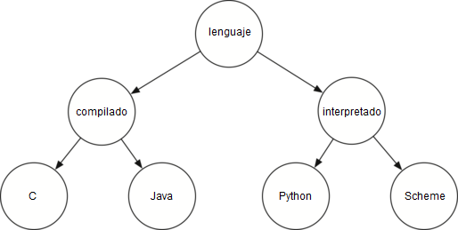

..  Copyright (C)  Brad Miller, David Ranum
    This work is licensed under the Creative Commons Attribution-NonCommercial-ShareAlike 4.0 International License. To view a copy of this license, visit http://creativecommons.org/licenses/by-nc-sa/4.0/.

Preguntas de discusión
----------------------
.. _tree_discuss:

#. Dibuje la estructura del árbol resultante del siguiente conjunto de llamadas de las funciones de árbol:

   ::

       >>> r = ArbolBinario(3)
       >>> insertarIzquierdo(r,4)
       [3, [4, [], []], []]
       >>> insertarIzquierdo(r,5)
       [3, [5, [4, [], []], []], []]
       >>> insertarDerecho(r,6)
       [3, [5, [4, [], []], []], [6, [], []]]
       >>> insertarDerecho(r,7)
       [3, [5, [4, [], []], []], [7, [], [6, [], []]]]
       >>> asignarValorRaiz(r,9)
       >>> insertarIzquierdo(r,11)
       [9, [11, [5, [4, [], []], []], []], [7, [], [6, [], []]]]
	      

#. Rastree el algoritmo para crear un árbol para la expresión :math:`(4 * 8) / 6 - 3`.

#. Considere la siguiente lista de enteros: [1,2,3,4,5,6,7,8,9,10]. Muestre el árbol binario de búsqueda resultante de la inserción de los enteros de dicha lista.

#. Considere la siguiente lista de enteros: [10,9,8,7,6,5,4,3,2,1]. Muestre el árbol binario de búsqueda resultante de la inserción de los enteros de dicha lista.

#. Genere una lista aleatoria de números enteros. Muestre el árbol de montículo binario resultante de la inserción de los enteros de la lista, uno a la vez.

#. Utilizando la lista de la pregunta anterior, muestre el árbol de montículo binario resultante de usar la lista como parámetro del método ``construirMonticulo``. Muestra tanto el árbol como la representación en forma de lista.

#. Dibuje el árbol binario de búsqueda que resulta de insertar las siguientes claves en el orden dado: 68,88,61,89,94,50,4,76,66 y 82.

#. Genere una lista aleatoria de números enteros. Dibuja el árbol binario de búsqueda resultante de insertar los enteros de la lista.

#. Considere la siguiente lista de enteros: [1,2,3,4,5,6,7,8,9,10]. Muestre el montículo binario resultante de insertar los enteros, uno a la vez.

#. Considere la siguiente lista de enteros: [10,9,8,7,6,5,4,3,2,1]. Muestre el montículo binario resultante de insertar los enteros, uno a la vez.

#. Considere las dos técnicas diferentes que usamos para implementar recorridos de un árbol binario. ¿Por qué debemos hacer una verificación antes de la llamada a ``preorden`` cuando éste se implementa como un método, y en cambio podríamos hacer la verificación dentro de la llamada cuando lo implementamos como una función?

12. Muestra las llamadas de funciones necesarias para construir el siguiente árbol binario.

13. Dado el siguiente árbol, realice las rotaciones apropiadas para volver a equilibrarlo.
  
   
.. figure:: Figures/rotexer1.png
         :align: center

14. Utilizando lo siguiente como punto de partida, obtenga la ecuación que proporciona el factor de equilibrio actualizado para el nodo D.
   
.. figure:: Figures/bfderive.png
         :align: center

