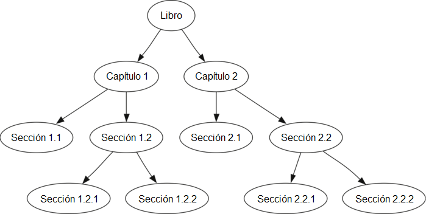

..  Copyright (C)  Brad Miller, David Ranum
    This work is licensed under the Creative Commons Attribution-NonCommercial-ShareAlike 4.0 International License. To view a copy of this license, visit http://creativecommons.org/licenses/by-nc-sa/4.0/.

Recorridos de árboles
~~~~~~~~~~~~~~~~~~~~~

Ahora que hemos examinado la funcionalidad básica de nuestra estructura de datos árbol, es hora de mirar algunos patrones de uso adicionales para los árboles. Estos patrones de uso se pueden dividir en las tres maneras en que tenemos acceso a los nodos del árbol. Hay tres patrones de uso común para visitar todos los nodos de un árbol. La diferencia entre estos patrones es el orden en que es visitado cada nodo. Llamamos a estas visitas de los nodos un “recorrido”. Los tres recorridos que vamos a ver se llaman **preorden**, **inorden** y **postorden**. Comencemos definiendo estos tres recorridos con más cuidado, para luego mirar algunos ejemplos donde estos patrones son útiles.

.. Now that we have examined the basic functionality of our tree data structure, it is time to look at some additional usage patterns for trees. These usage patterns can be divided into the three ways that we access the nodes of the tree. There are three commonly used patterns to visit all the nodes in a tree. The difference between these patterns is the order in which each node is visited. We call this visitation of the nodes a “traversal.” The three traversals we will look at are called **preorder**, **inorder**, and **postorder**. Let’s start out by defining these three traversals more carefully, then look at some examples where these patterns are useful.

preorden
    En un recorrido en preorden, visitamos primero el nodo raíz, luego recursivamente realizamos un recorrido en preorden del subárbol izquierdo, seguido de un recorrido recursivo en preorden del subárbol derecho.

inorden
    En un recorrido en inorden, realizamos recursivamente un recorrido en inorden en el subárbol izquierdo, visitamos el nodo raíz, y finalmente hacemos un recorrido recursivo en inorden del subárbol derecho.

postorden
    En un recorrido en postorden, realizamos recursivamente recorridos en postorden del subárbol izquierdo y del subárbol derecho seguidos de una visita al nodo raíz.

Veamos algunos ejemplos que ilustran cada uno de estos tres tipos de recorridos. Primero veamos el recorrido en preorden. Como ejemplo de un árbol a recorrer, representaremos este libro como un árbol. El libro es la raíz del árbol, y cada capítulo es un hijo de la raíz. Cada sección dentro de un capítulo es un hijo del capítulo, y cada subsección es un hijo de su sección, y así sucesivamente. La :ref:`Figura 5 <fig_booktree>` muestra una versión limitada de un libro con sólo dos capítulos. Tenga en cuenta que el algoritmo de recorrido funciona para árboles con cualquier número de hijos, pero nos limitaremos a los árboles binarios por ahora.

.. Let’s look at some examples that illustrate each of these three kinds of traversals. First let’s look at the preorder traversal. As an example of a tree to traverse, we will represent this book as a tree. The book is the root of the tree, and each chapter is a child of the root. Each section within a chapter is a child of the chapter, and each subsection is a child of its section, and so on. :ref:`Figure 5 <fig_booktree>` shows a limited version of a book with only two chapters. Note that the traversal algorithm works for trees with any number of children, but we will stick with binary trees for now.

.. _fig_booktree:

   Figura 5: Representación de un libro como un árbol

   Figura 5: Representación de un libro como un árbol

Supongamos que usted quería leer este libro de adelante hacia atrás. El recorrido en preorden le da a usted exactamente ese orden. A partir de la raíz del árbol (el nodo Libro) seguiremos las instrucciones del recorrido en preorden. Recursivamente llamamos a ``preorden`` sobre el hijo izquierdo, en este caso Capítulo 1. De nuevo recursivamente llamamos a ``preorden`` sobre el hijo izquierdo para llegar a Sección 1.1. Como Sección 1.1 no tiene hijos, no realizamos llamadas recursivas adicionales. Cuando terminemos con Sección 1.1, subiremos por el árbol hasta Capítulo 1. En este punto todavía necesitamos visitar el subárbol derecho de Capítulo 1, que es Sección 1.2. Visitamos como antes el subárbol izquierdo, lo cual nos lleva a Sección 1.2.1, luego visitamos el nodo para Sección 1.2.2. Habiendo terminado con Sección 1.2, regresamos a Capítulo 1. Luego regresamos al nodo Libro y seguimos el mismo procedimiento para Capítulo 2.

.. Suppose that you wanted to read this book from front to back. The preorder traversal gives you exactly that ordering. Starting at the root of the tree (the Book node) we will follow the preorder traversal instructions. We recursively call ``preorder`` on the left child, in this case Chapter1. We again recursively call ``preorder`` on the left child to get to Section 1.1. Since Section 1.1 has no children, we do not make any additional recursive calls. When we are finished with Section 1.1, we move up the tree to Chapter 1. At this point we still need to visit the right subtree of Chapter 1, which is Section 1.2. As before we visit the left subtree, which brings us to Section 1.2.1, then we visit the node for Section 1.2.2. With Section 1.2 finished, we return to Chapter 1. Then we return to the Book node and follow the same procedure for Chapter 2.

El código para escribir los recorridos de árboles es sorprendentemente elegante, en gran medida porque los recorridos se escriben recursivamente. El :Ref:`Programa 2 <lst_preorder1>` muestra el código en Python para un recorrido en preorden de un árbol binario.

.. The code for writing tree traversals is surprisingly elegant, largely because the traversals are written recursively. :ref:`Listing 2 <lst_preorder1>` shows the Python code for a preorder traversal of a binary tree.

Usted podría preguntarse, ¿cuál es la mejor manera de escribir un algoritmo como el del recorrido en preorden? ¿Debería ser una función que simplemente usa un árbol como estructura de datos, o debería ser un método de la propia estructura de datos árbol? El :ref:`Programa 2 <lst_preorder1>` muestra una versión del recorrido en preorden escrito como una función externa que recibe un árbol binario como parámetro. La función externa es particularmente elegante porque nuestro caso base es simplemente comprobar si el árbol existe. Si el parámetro ``arbol`` es ``None``, entonces la función retorna sin tomar ninguna acción.

.. You may wonder, what is the best way to write an algorithm like preorder traversal? Should it be a function that simply uses a tree as a data structure, or should it be a method of the tree data structure itself? :ref:`Listing 2 <lst_preorder1>` shows a version of the preorder traversal written as an external function that takes a binary tree as a parameter. The external function is particularly elegant because our base case is simply to check if the tree exists. If the tree parameter is ``None``, then the function returns without taking any action.

.. _lst_preorder1:

**Programa 2**

::

    def preorden(arbol):
        if arbol:
            print(arbol.obtenerValorRaiz())
            preorden(arbol.obtenerHijoIzquierdo())
            preorden(arbol.obtenerHijoDerecho())  

También podemos implementar ``preorden`` como un método de la clase ``ArbolBinario``. El código para implementar ``preorden`` como método interno se muestra en el :ref:`Programa 3 <lst_preorder2>`. Observe lo que ocurre cuando cambiamos el código de interno a externo. En general, solo reemplazamos ``arbol`` con ``self``. Sin embargo, también necesitamos modificar el caso base. El método interno debe comprobar la existencia de los hijos izquierdo y derecho *antes de* hacer la llamada recursiva a ``preorden``.

.. We can also implement ``preorden`` as a method of the ``ArbolBinario`` class. The code for implementing ``preorden`` as an internal method is shown in :ref:`Listing 3 <lst_preorder2>`. Notice what happens when we move the code from internal to external. In general, we just replace ``tree`` with ``self``. However, we also need to modify the base case. The internal method must check for the existence of the left and the right children *before* making the recursive call to ``preorden``.

.. _lst_preorder2:

**Programa 3**

::

    def preorden(self):
        print(self.clave)
        if self.hijoIzquierdo:
            self.hijoIzquierdo.preorden()
        if self.hijoDerecho:
            self.hijoDerecho.preorden()

¿Cuál de estas dos formas de implementar a ``preorden`` es mejor? La respuesta es que la implementación de ``preorden`` como una función externa es probablemente mejor en este caso. La razón es que usted muy rara vez sólo querrá recorrer el árbol. En la mayoría de los casos usted va a querer lograr algo más mientras usa uno de los patrones básicos de recorrido. De hecho, veremos en el siguiente ejemplo que el patrón de recorrido en ``postorden`` sigue muy de cerca el código que escribimos anteriormente para evaluar un árbol de análisis. Por lo tanto, escribiremos el resto de los recorridos como funciones externas.

.. Which of these two ways to implement ``preorden`` is best? The answer is that implementing ``preorden`` as an external function is probably better in this case. The reason is that you very rarely want to just traverse the tree. In most cases you are going to want to accomplish something else while using one of the basic traversal patterns. In fact, we will see in the next example that the ``postorder`` traversal pattern follows very closely with the code we wrote earlier to evaluate a parse tree. Therefore we will write the rest of the traversals as external functions.

El algoritmo para el recorrido en ``postorden``, que se muestra en el :ref:`Programa 4 <lst_postorder1>`, es casi idéntico al de ``preorden``, excepto que trasladamos la llamada a ``print`` al final de la función.

.. The algorithm for the ``postorder`` traversal, shown in :ref:`Listing 4 <lst_postorder1>`, is nearly identical to ``preorden`` except that we move the call to print to the end of the function.

.. _lst_postorder1:

**Programa 4**

::

    def postorden(arbol):
        if arbol != None:
            postorden(arbol.obtenerHijoIzquierdo())
            postorden(arbol.obtenerHijoDerecho())
            print(arbol.obtenerValorRaiz())

Ya hemos visto un uso común para el recorrido en postorden, a saber, la evaluación de un árbol de análisis. Vuelva a mirar el :ref:`Programa 1 <lst_eval>`. Lo que estamos haciendo es evaluar el subárbol izquierdo, evaluar el subárbol derecho, y combinarlos en la raíz a través de la llamada de función a un operador. Supongamos que nuestro árbol binario sólo va a almacenar datos de árboles de expresiones. Vamos a reescribir la función de evaluación, pero modelándola aún más parecida al código ``postorden`` del :ref:`Programa 4 <lst_postorder1>` (ver el :ref:`Programa 5 <lst_postordereval>`).

.. We have already seen a common use for the postorder traversal, namely evaluating a parse tree. Look back at :ref:`Listing 1 <lst_eval>` again. What we are doing is evaluating the left subtree, evaluating the right subtree, and combining them in the root through the function call to an operator. Assume that our binary tree is going to store only expression tree data. Let’s rewrite the evaluation function, but model it even more closely on the ``postorder`` code in :ref:`Listing 4 <lst_postorder1>` (see :ref:`Listing 5 <lst_postordereval>`).

.. _lst_postordereval:

**Programa 5**

::

    def evalPostorden(arbol):
        operadores = {'+':operator.add, '-':operator.sub, '*':operator.mul, '/':operator.truediv}
        res1 = None
        res2 = None
        if arbol:
            res1 = evalPostorden(arbol.obtenerHijoIzquierdo())
            res2 = evalPostorden(arbol.obtenerHijoDerecho())
            if res1 and res2:
                return operadores[arbol.obtenerValorRaiz()](res1,res2)
            else:
                return arbol.obtenerValorRaiz()
                

.. highlight:: python
    :linenothreshold: 500

Note que la forma del :ref:`Programa 4 <lst_postorder1>` es la misma forma del :ref:`Programa 5 <lst_postordereval>`, excepto que en lugar de imprimir la clave al final de la función, la devolvemos. Esto nos permite guardar los valores devueltos de las llamadas recursivas en las líneas 6 y 7. A continuación, usamos estos valores guardados junto con el operador en la línea 9.

.. Notice that the form in :ref:`Listing 4 <lst_postorder1>` is the same as the form in :ref:`Listing 5 <lst_postordereval>`, except that instead of printing the key at the end of the function, we return it. This allows us to save the values returned from the recursive calls in lines 6 and 7. We then use these saved values along with the operator on line 9.

El recorrido final que veremos en esta sección es el recorrido en inorden. En el recorrido en inorden visitamos el subárbol izquierdo, seguido por la raíz, y finalmente el subárbol derecho. El :ref:`Programa 6 <lst_inorder1>` muestra nuestro código para el recorrido en inorden. Observe que en las tres funciones de recorridos simplemente estamos cambiando la posición de la instrucción ``print`` con respecto a las dos llamadas de función recursivas.

.. The final traversal we will look at in this section is the inorder traversal. In the inorder traversal we visit the left subtree, followed by the root, and finally the right subtree. :ref:`Listing 6 <lst_inorder1>` shows our code for the inorder traversal. Notice that in all three of the traversal functions we are simply changing the position of the ``print`` statement with respect to the two recursive function calls.

.. _lst_inorder1:

**Programa 6**

::

    def inorden(arbol):
      if arbol != None:
          inorden(arbol.obtenerHijoIzquierdo())
          print(arbol.obtenerValorRaiz())
          inorden(arbol.obtenerHijoDerecho())

Si realizamos un simple recorrido en inorden de un árbol de análisis, recuperamos nuestra expresión original, sin paréntesis. Vamos a modificar el algoritmo básico de inorden para permitirnos recuperar la versión completamente agrupada de la expresión. Las únicas modificaciones que haremos en la plantilla básica son las siguientes: imprimir un paréntesis izquierdo *antes* la llamada recursiva al subárbol izquierdo, e imprimir un paréntesis derecho *después* de la llamada recursiva al subárbol derecho. El código modificado se muestra en el :ref:`Programa 7 <lst_printexp>`.

.. If we perform a simple inorder traversal of a parse tree we get our original expression back, without any parentheses. Let’s modify the basic inorder algorithm to allow us to recover the fully parenthesized version of the expression. The only modifications we will make to the basic template are as follows: print a left parenthesis *before* the recursive call to the left subtree, and print a right parenthesis *after* the recursive call to the right subtree. The modified code is shown in :ref:`Listing 7 <lst_printexp>`.

.. _lst_printexp:

**Programa 7**

::

    def imprimirExpresion(arbol):
      valorCadena = ""
      if arbol:
          valorCadena = '(' + imprimirExpresion(arbol.obtenerHijoIzquierdo())
          valorCadena = valorCadena + str(arbol.obtenerValorRaiz())
          valorCadena = valorCadena + imprimirExpresion(arbol.obtenerHijoDerecho())+')'
      return valorCadena

Note que la función ``imprimirExpresion``, tal como la hemos implementado, pone paréntesis alrededor de cada número. Aunque no es incorrecto, los paréntesis claramente no son necesarios. En los ejercicios al final de este capítulo se le pedirá a usted que modifique la función ``imprimirExpresion`` para eliminar dicho conjunto de paréntesis.

.. Notice that the ``imprimirExpresion`` function as we have implemented it puts parentheses around each number. While not incorrect, the parentheses are clearly not needed. In the exercises at the end of this chapter you are asked to modify the ``imprimirExpresion`` function to remove this set of parentheses.
