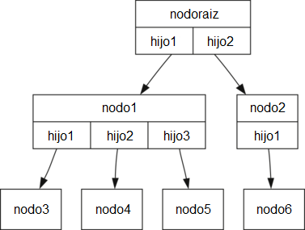
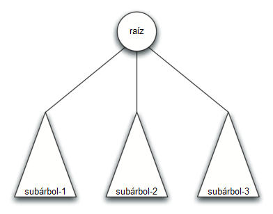

..  Copyright (C)  Brad Miller, David Ranum
    This work is licensed under the Creative Commons Attribution-NonCommercial-ShareAlike 4.0 International License. To view a copy of this license, visit http://creativecommons.org/licenses/by-nc-sa/4.0/.

Vocabulario y definiciones
--------------------------

Ahora que ya hemos visto ejemplos de árboles, definiremos formalmente un árbol y sus componentes.

.. Now that we have looked at examples of trees, we will formally define a tree and its components.

Nodo
    Un nodo es una parte fundamental de un árbol. Puede tener un nombre, que llamamos la “clave”. Un nodo también puede tener información adicional. Llamamos a esta información adicional la “carga útil”. Aunque la información de carga útil no es central para muchos algoritmos de árboles, a menudo es crítica en aplicaciones que usan árboles.

Arista
    Una arista es otra parte fundamental de un árbol. Una arista conecta dos nodos para mostrar que hay una relación entre ellos. Cada nodo (excepto la raíz) está conectado por exactamente una arista entrante desde otro nodo. Cada nodo puede tener varias aristas salientes.

Raíz
    La raíz del árbol es el único nodo en el árbol que no tiene aristas entrantes. En la :ref:`Figura 2 <fig_filetree>`, / es la raíz del árbol.

Ruta
    Una ruta es una lista ordenada de nodos que están conectados por aristas. Por ejemplo, Mamíferos :math:`\rightarrow` Carnívoros :math:`\rightarrow` Félidos :math:`\rightarrow` Felis :math:`\rightarrow` Domestica es una ruta.

Hijos
    El conjunto de :math:`c` nodos que tienen aristas entrantes desde el mismo nodo se dice que son hijos de ese nodo. En la figura :ref:`Figura 2 <fig_filetree>`, los nodos log/, spool/ y yp/ son hijos del nodo var/.

Padre
    Un nodo es el padre de todos los nodos con los que se conecta mediante aristas salientes. En la :ref:`Figura 2 <fig_filetree>` el nodo var/ es el padre de los nodos log/, spool/ y yp/.

Hijos
    Se dice que los nodos del árbol que son hijos del mismo padre son hermanos. Los nodos etc/ y usr/ son hermanos en el árbol del sistema de archivos.

Subárbol
    Un subárbol es un conjunto de nodos y aristas compuesto por un padre y todos los descendientes de ese padre.

Nodo hoja
    Un nodo hoja es un nodo que no tiene hijos. Por ejemplo, Humano y Chimpancé son nodos hoja en la :ref:`Figura 1 <fig_biotree>`.

Nivel
    El nivel de un nodo :math:`n` es el número de aristas en la ruta desde el nodo raíz hasta :math:`n`. Por ejemplo, el nivel del nodo Felis en la :ref:`Figura 1 <fig_biotree>` es cinco. Por definición, el nivel del nodo raíz es cero.

Altura
    La altura de un árbol es igual al máximo nivel de cualquier nodo en el árbol. La altura del árbol en la :ref:`Figura 2 <fig_filetree>` es dos.

Con el vocabulario básico ahora definido, podemos pasar a una definición formal de un árbol. De hecho, proporcionaremos dos definiciones de un árbol. La primera definición involucra nodos y aristas. La segunda definición, que resultará muy útil, es una definición recursiva.

.. With the basic vocabulary now defined, we can move on to a formal definition of a tree. In fact, we will provide two definitions of a tree. One definition involves nodes and edges. The second definition, which will prove to be very useful, is a recursive definition.

*Definición uno:* Un árbol consiste en un conjunto de nodos y un conjunto de aristas que conectan parejas de nodos. Un árbol tiene las siguientes propiedades:

.. *Definition One:* A tree consists of a set of nodes and a set of edges that connect pairs of nodes. A tree has the following properties:

-  Un nodo del árbol se designa como el nodo raíz.

-  Cada nodo :math:`n`, excepto el nodo raíz, está conectado por una arista que proviene exactamente de otro nodo :math:`p`, donde :math:`p` es el padre de :math:`n`.

-  Se recorre una ruta única desde la raíz hasta cada nodo.

-  Si cada nodo en el árbol tiene un máximo de dos hijos, decimos que el árbol es un **árbol binario**.

La :ref:`Figura 3 <fig_nodeedgetree>` ilustra un árbol que se ajusta a la definición uno. Las puntas de flecha en las aristas indican la dirección de la conexión.

.. :ref:`Figure 3 <fig_nodeedgetree>` illustrates a tree that fits definition one. The arrowheads on the edges indicate the direction of the connection.

.. _fig_nodeedgetree:

   Figura 3: Un árbol que consta de un conjunto de nodos y aristas

   Figura 3: Un árbol que consta de un conjunto de nodos y aristas

*Definición dos:* Un árbol o está vacío o consta de una raíz y cero o más subárboles, cada uno de los cuales es también un árbol. La raíz de cada subárbol está conectada a la raíz del árbol padre mediante una arista. La :ref:`Figura 4 <fig_recursivetree>` ilustra esta definición recursiva de un árbol. Usando la definición recursiva de un árbol, sabemos que el árbol en la :ref:`Figura 4 <fig_recursivetree>` tiene al menos cuatro nodos, ya que cada uno de los triángulos que representan un subárbol debe tener una raíz. Puede que tenga muchos más nodos que esa cantidad, pero no lo sabemos a menos que miremos más profundamente en el árbol.

.. *Definition Two:* A tree is either empty or consists of a root and zero or more subtrees, each of which is also a tree. The root of each subtree is connected to the root of the parent tree by an edge. :ref:`Figure 4 <fig_recursivetree>` illustrates this recursive definition of a tree. Using the recursive definition of a tree, we know that the tree in :ref:`Figure 4 <fig_recursivetree>` has at least four nodes, since each of the triangles representing a subtree must have a root. It may have many more nodes than that, but we do not know unless we look deeper into the tree.

.. _fig_recursivetree:

   Figura 4: Una definición recursiva de un árbol

   Figura 4: Una definición recursiva de un árbol
